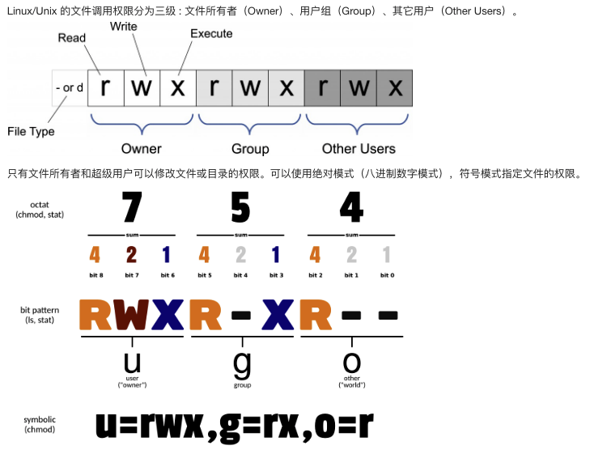

`引言`

命令格式 ：命令 [-选项] [参数] 

例 ： ls -la /etc 

说明：1）个别命令使用不遵循此格式

   	 2）当有多个选项时，可以写在一起
   	
   	 3）简化选项与完整选项-a 等于 --all


## 帮助命令

* man -k content

	搜索命令通过内容，并不局限与命令本身可以是命令介绍等

* whatis common

	显示命令的简要说明

* info common

	显示命令的详细信息

* Man common

	显示命令的详细信息，info用的较少，一般就whatis和man

* which common

	查看命令的位置

* Whereis common

	查看程序的搜索路径，当安装了一个软件的不同版本，这个命令就能排上作用


## print和printf

和c中的print、printf大致相同

`语法`

```bash
printf  format-string  [arguments...]
```

- **format-string:** 为格式控制字符串
- **arguments:** 为参数列表。

`案例`

```bash
printf "%-10s %-8s %-4s\n" 姓名 性别 体重kg  
printf "%-10s %-8s %-4.2f\n" 郭靖 男 66.1234
printf "%-10s %-8s %-4.2f\n" 杨过 男 48.6543
printf "%-10s %-8s %-4.2f\n" 郭芙 女 47.9876

姓名     性别   体重kg
郭靖     男      66.12
杨过     男      48.65
郭芙     女      47.99
```

> * **%s %c %d %f** 都是格式替代符，**％s** 输出一个字符串，**％d** 整型输出，**％c** 输出一个字符，**％f** 输出实数，以小数形式输出。
> * **%-10s** 指一个宽度为 10 个字符（**-** 表示左对齐，没有则表示右对齐），任何字符都会被显示在 10 个字符宽的字符内，如果不足则自动以空格填充，超过也会将内容全部显示出来。
> * **%-4.2f** 指格式化为小数，其中 **.2** 指保留2位小数。


## 目录内容显示ls

命令英文原意：list 

命令所在路径：/bin/ls 

执行权限：所有用户

功能描述：显示目录文件

语法：ls  选项[-ald]  [文件或目录] 

​			-a    显示所有文件，包括隐藏文件

​			-l     详细信息显示

​		   -d    查看目录属性，而不看目录下文件信息

​			-h    人性化显示文件容量

​			-i     显示文件索引


## 目录处理

### mkdir

命令英文原意：make directories 

命令所在路径：/bin/mkdir 

执行权限：所有用户

语法：mkdir -p  [目录名] 

功能描述：创建新目录-p  递归创建

范例： $ mkdir -p /tmp/Japan/boduo 

 	  $ mkdir /tmp/Japan/longze /tmp/Japan/cangjing


### cd

命令英文原意：change directory 

命令所在路径：shell内置

命令执行权限：所有用户

语法：cd [目录] 

功能描述：切换目录

范例： $ cd  /tmp/Japan/boduo     切换到指定目录

 	  $ cd  ..        回到上一级目录


### pwd 

命令英文原意： print working directory 

命令所在路径：/bin/pwd 

执行权限：所有用户

语法：pwd 

功能描述：显示当前目录

范例：$ pwd 

  /tmp/Japan


### rmdir

命令英文原意：remove empty directories 

命令所在路径：/bin/rmdir 

执行权限：所有用户

语法：rmdir [目录名] 

功能描述： 删除空目录

范例： $ rmdir /tmp/Japan/boduo


### cp

命令英文原意：copy 

命令所在路径：/bin/cp 

执行权限：所有用户

语法：cp  -rp  [原文件或目录] [目标目录] 

-r  复制目录

-p  保留文件属性，即当cp文件时，相当于新建了一个文件，其日期将会改变，如果想保留之前文件得时间，则使用这个属性

功能描述：复制文件或目录

范例：$ cp  -r /tmp/Japan/cangjing  /root 

将目录/tmp/Japan/cangjing复制到目录/root下

`复制多个文件或目录`

$ cp  -rp /tmp/Japan/boduo /tmp/Japan/longze /root 

将/tmp/Japan目录下的boduo和longze目录复制到/root下，保持目录属性

`复制目录并修改名称`

$ cp  -r /tmp/Japan/boduo /root/update

将  /tmp/Japan/boduo 目录复制到root目录下并修改名为update


### mv

命令英文原意：move 

命令所在路径：/bin/mv 

执行权限：所有用户

语法：mv  [原文件或目录]   [目标目录] 

功能描述：剪切文件、改名


### rm

命令英文原意：remove 

命令所在路径：/bin/rm 

执行权限：所有用户

语法：rm  -rf   [文件或目录] 

-r  删除目录

-f  强制执行

功能描述：删除文件

范例：$ rm  /tmp/yum.log 

删除文件/tmp/yum.log 

`删除目录及其下面所有的子目录和文件`

$ rm -rf  /tmp/Japan/longze 


## 文本文件处理命令

### touch

命令所在路径：/bin/touch 

执行权限：所有用户 

语法：touch  [文件名]                 

功能描述：创建空文件 

范例： $ touch Japanlovestory.list

`创建多个文件`

  $ touch Japanlovestory.list   a.txt    b.txt

### cat

命令所在路径：/bin/cat 

执行权限：所有用户 

语法：cat [文件名] 

功能描述：显示文件内容            

   -n  显示行号 

范例： $ cat  /etc/issue              $ cat  -n /etc/services

> 不太适合浏览内容很长的文件，

### more

命令所在路径：/bin/more 

执行权限：所有用户 

语法：more  [文件名]                  

   (空格) 或f       翻页               

   (Enter)             换行                 

  q或Q              退出 

功能描述：分页显示文件内容 

范例：   $ more  /etc/services

> 空格  ： 一页一页翻     回车 ：一行一行    q ： 退出
>
> 不能向上翻页

### less

命令所在路径：/usr/bin/less 

执行权限：所有用户 

语法：less  [文件名] 

功能描述：分页显示文件内容（可向上翻页） 

范例：   $  less  /etc/services

**tips: 按下 / 后可以搜索 会反显高亮    按n向下查找按q退出（more也可以）**

> 空格  ： 一页一页下翻                      回车 ：一行一行                   q ： 退出                       page up 一页一页上翻                 up键：一行一行上翻

### head

 	命令所在路径：/usr/bin/head 

执行权限：所有用户 

语法：head  [文件名] 

功能描述：显示文件前面几行    

-n 指定行数 

范例：   $ head -n 20 /etc/services


### tail

命令所在路径：/usr/bin/tail 

执行权限：所有用户 

语法：tail  [文件名] 

功能描述：动态显示文件内容  

​    -n 输出最后N行,而非默认的最后10行   

   -f  动态显示文件末尾内容 

范例：   $ tail -n 18 /etc/services

> 并不会返回到命令行，例如我查看日志文件，而这个日志文件实时更新的，那么就可以使用这个命令进行监控


### grep

文本搜索

`常用参数`

- -o 只输出匹配的文本行 **VS** -v 只输出没有匹配的文本行

- - -c 统计文件中包含文本的次数

		grep -c “text” filename

- -n 打印匹配的行号

- -i 搜索时忽略大小写

- -l 只打印文件名


### xargs

xargs 能够将输入数据转化为特定格式的命令行参数

`常用参数`

- -d 定义定界符 （默认为空格 多行的定界符为 n）
- -n 输出为多行，每行字数，按照定界符分割
- -I {} 指定替换字符串，这个字符串在xargs扩展时会被替换掉,用于待执行的命令需要多个参数时
- -0：指定0为输入定界符

`案例`

```bash
# 默认按空格无格式化输出
cat file.txt | xargs
```


```bash
# 指定每行字数多行输出，字符串算作一个单词
cat if.sh | xargs -n 3
```


### sort

排序

`常用参数`

- -n 按数字进行排序 VS -d 按字典序进行排序
- -r 逆序排序
- -k N 指定按第N列排序

`案例`

```bash
# 默认每行首字母按照字段排序
sort sort.txt
```


```bash
# 按照最后一列字典排序
sort -dk 5 sort.txt
```


### uniq

消除重复行

`常用参数`

* -c 统计各行出现的次数

* -d 显示重复行

* -i 忽略大小写

* -u 显示无重复的行

	

### tr

转换或删除文件中的字符。

`格式`

```basha
tr [-cdst][--help][--version][第一字符集][第二字符集]  
```


`常用参数`

* -c 反选设定字符。也就是符合 SET1 的部份不做处理，不符合的剩余部份才进行转换
* -d 删除文件指定内容
* -s 压缩文件中出现的重复字符，常用于压缩多余的空格

`字符集范围`

```bash
\NNN 八进制值的字符 NNN (1 to 3 为八进制值的字符)
\\ 反斜杠
\a Ctrl-G 铃声
\b Ctrl-H 退格符
\f Ctrl-L 走行换页
\n Ctrl-J 新行
\r Ctrl-M 回车
\t Ctrl-I tab键
\v Ctrl-X 水平制表符
CHAR1-CHAR2 ：字符范围从 CHAR1 到 CHAR2 的指定，范围的指定以 ASCII 码的次序为基础，只能由小到大，不能由大到小。
[CHAR*] ：这是 SET2 专用的设定，功能是重复指定的字符到与 SET1 相同长度为止
[CHAR*REPEAT] ：这也是 SET2 专用的设定，功能是重复指定的字符到设定的 REPEAT 次数为止(REPEAT 的数字采 8 进位制计算，以 0 为开始)
[:alnum:] ：所有字母字符与数字
[:alpha:] ：所有字母字符
[:blank:] ：所有水平空格
[:cntrl:] ：所有控制字符
[:digit:] ：所有数字
[:graph:] ：所有可打印的字符(不包含空格符)
[:lower:] ：所有小写字母
[:print:] ：所有可打印的字符(包含空格符)
[:punct:] ：所有标点字符
[:space:] ：所有水平与垂直空格符
[:upper:] ：所有大写字母
[:xdigit:] ：所有 16 进位制的数字
[=CHAR=] ：所有符合指定的字符(等号里的 CHAR，代表你可自订的字符)
```


`案例`

```bash
# 文件中内容全部转为小写并输出
cat testfile | tr a-z A-Z  或
cat testfile |tr [:lower:] [:upper:] 
```


### cut 

按列截取文本

`常用参数`

* -f 使用分隔符截取指定长度
* -d 指定分隔符
* -c 截取指定长度字符不使用分隔符


`案例`

```bash
#指定分隔符切割第2到4列数据
 cut sort.txt -d ';' -f 2,4
```


### paste

按列拼接文本

* -b 定界符

`案例`

```bash
 paste aaa.txt bbb.txt 
```


### wc

统计行和字符的工具

```bash
wc -l file // 统计行数
wc -w file // 统计单词数
wc -c file // 统计字符数
```


### <font color=ff00aa>sed</font>

更适合处理文本内容，对文本进行复杂处理，和grep、awk并称三剑客ß

`语法`

```bash
sed  [-参数]  '命令'  文本
```

`两大原则`

* sed命令总是以单个字符开头

	```bash
	#把hello用HELLO替换
	echo "hello123" | sed 's/hello/HELLO/' 
	```

	> s 为替换命令    s后面的为分隔符/ 。分隔符什么都行 ，上面命令等同于echo "hello123" | sed 's\*hello*HELLO/' 

* sed命令允许在前面加个地址，该地址用于指定输入流的哪一行被编辑，如果省略，则是对所有行进行操作

	

	> 默认处理所有行。

	

	> 指定处理第二行

`sed基本编辑命令`

| 命令                 | 功能简称 | 功能描述                                                     |
| -------------------- | -------- | ------------------------------------------------------------ |
| i                    | 前插     | 在当前行的前面插入                                           |
| a                    | 后插     | 在当前行的后面插入                                           |
| d                    | 删       | 删除指定行                                                   |
| p                    | 查       | 打印指定行。默认是把所有的行都打印出来，并把符合条件的行也打印出来。要是屏蔽默认，加参数-n |
| s/regex/replacement/ | 替换     | 把regex用replacement替换                                     |
| y/set1/set2          | 替换     | 把set1中的字符用对应的set2中的字符替换（必须保证两个集合的字符个数相等） |
| =                    |          | 输出当前行的行号                                             |
| q                    |          | 处理完当前行后退出sed                                        |
| Q                    |          | 直接退出sed                                                  |

`1. 插入`

```bash
# 第二行前面插入数据
[root@localhost shell]# cat aaa.txt | sed '2i 测试sed-i指令'
hello1
测试sed-i指令
hello2
hello3

# 第二行后面插入数据
[root@localhost shell]# cat aaa.txt | sed '2a 测试sed-a指令'
hello1
hello2
测试sed-a指令
hello3

#多行插入数据
[root@localhost shell]# cat aaa.txt | sed '2,3a 测试sed-a指令'
hello1
hello2
测试sed-a指令
hello3
测试sed-a指令
```

`2. 删除`

```bash
# 删除第二行,并不会改变源文件内容
sed '2d' aaa.txt
# 删除最后一行
cat aaa.txt | sed '$d'
# 删除指定区间行
sed '2,3d' aaa.txt
```

`3. 查`

```bash
#查看第2行，没有-n参数，原来的数据也会输出
sed '2p' aaa.txt
#查看第二行，屏蔽掉原来的数据
sed -n '2p' aaa.txt
#查看第二行到最后一行
sed -n '2,$p' aaa.txt
```

`4. 替换`

```bash
#指定行中替换（一行只替换一次）
[root@localhost shell]# sed '1,3s/hello/world/' aaa.txt
world1
world2
world3

#指定行中替换（类似于replaceAll）
sed '1,2s/hello/NO/g' aaa.txt 

#指定行覆盖,一二行数据覆盖为NO
[root@localhost shell]# sed '1,2c NO' aaa.txt 
NO
hello3 

 #把所有行的“hello”替换成“HELLO”,等价与sed '1,$s/hello/HELLO/' aaa.txt 
sed 's/hello/HELLO/' aaa.txt  
```

`5. 其他`

```bash
# 输出当前行号
[root@localhost shell]# sed '=' aaa.txt 
1
hello1
2
hello2
3
hello3
```


`sed常用参数`

| 参数 | 参数含义                                                     |
| ---- | ------------------------------------------------------------ |
| -n   | 安静模式，不加-n会把输入流都输出到终端，加上后只输出符合条件的 |
| -e   | 多命令处理,流式处理，类始于shell中的；并行执行               |
| -f   | -f filename 执行filename文件里的sed命令                      |
| -i   | 直接修改读取的文件内容（慎重），sed本身不会修改文件内容，-i后会修改文件 |

`-e`

```bash
sed -n -e '1p' -e '2p' -e '3p' aaa.txt 
hello1
hello2
hello3
```

`-i`

```bash
[root@localhost shell]# sed -i '2d' aaa.txt 
[root@localhost shell]# cat aaa.txt 
hello1
hello3
```


### <font color=ff00aa>awk</font>

相较于 `sed` 常常作用于一整个行的处理， `awk` 则比较倾向于一行当中分成数个『字段』来处理。

`格式`

```bash
awk options pattern {action} file
#		可选参数   模式			动作		文件/数据
```

`awk的处理流程`

1. 读入第一行，并将第一行的资料填入 $0, $1, $2…. 等变数当中；
2. 依据 "条件类型" 的限制，判断是否需要进行后面的 "动作"；
3. 做完所有的动作与条件类型；
4. 若还有后续的『行』的数据，则重复上面 1~3 的步骤，直到所有的数据都读完为止。

`awk内置变量`

`$n` 指定分隔符后，当前记录的第n个字段

`$0` 当前整行

`NF` 每一行 ( `$0` ) 拥有的字段总数

`NR` 目前 awk 所处理的是『第几行』数据

`FNR` 各文件分别记录的行号，当awk处理多个文件时，每个文件对应的行号不一样。

`FILENAME` 当前文件名

`ARGC` 命令行参数的个数

`ARGV` 数组，保存的是命令行所给定的各参数

`FS` 输入分隔符，默认为空格

`OFS` 输出分隔字符，预设是空格键，即输出内容按照此分隔符进行格式化

`RS` 输入换行符，默认回车符，理解同上

`ORS` 输出换行符，默认回车符，理解同上

> 注意：
>
> 1. 每一行的每个字段的变量名称就是 `$1`, `$2` … 等。还有个例外,**那就是 `$0` 代表一整行的意思**
> 2.  `awk` 后续的所有动作以 ' 括住， 所以，内容如果想要以 `print` 打印时，记得，非变量的文字部分， `printf` 提到的格式中，都需要使用双引号。
> 3.  `awk` 中内置变量的引用不需要加 $  直接引用即可
> 4. ==输入分隔符、换行符，指的是针对输入内容按照指定分隔符和换行符进行迭代，输出分隔符、换行符指的是数据操作后按照指定分隔符和换行符格式化输出==

`awk参数`

* -F 输入分隔符，即将输入内容或文件按照此分隔符进行分割迭代
* -v 定义或修改一个awk==内置变量==
* -f 从脚本文件中读取awk命令

`awk格式化输出`

* print  换行输出
* printf  不换行输出


`awk两种模式`

BEGIN和END，即操作前后触发事件

```bash
awk options 'BEGIN{common} pattern {action} END{common}' fileName
```

`awk-pattern支持的运算符`


`awk和正则`

```bash
awk 可选参数 '/正则表达式/{action}' fileName
```


`案例`

```bash
# 文件内容如下
Name    1st     2nd     3th

VBird   23000   24000   25000

DMTsai  21000   20000   23000

Bird2   43000   42000   41000
```

```bash
# 输出第一列和第三列
[root@localhost shell]# last | awk '{print $1 "\t" $3}' aaa.txt 
Name    2nd
        
VBird   24000
        
DMTsai  20000
        
Bird2   42000

# 显示文件第三行
[root@localhost shell]# awk 'NR==5 {print $0}' aaa.txt 
DMTsai  21000   20000   23000

# 给每行内容添加行号
[root@localhost shell]# awk '{print NR "\t" $0}' aaa.txt 
1       Name    1st     2nd     3th
2       
3       VBird   23000   24000   25000
4       
5       DMTsai  21000   20000   23000
6       
7       Bird2   43000   42000   41000

# 文件按照;进行分割，并按照---进行输出
[root@localhost shell]#  awk -F ";" -v OFS="----" '{print NR,$1 "\t" $2}' bbb.txt
1----aa bb
2----dd ee
# 如上命令等同于 
awk -v FS=";" -v OFS="----" '{print NR,$1 "\t" $2}' bbb.txt
> 输入内容按照;进行分割处理，《，》指的是空格占位符，输出格式为：【行号+空格+第一列+tab+第二列】。指定OFS输出分隔符为----，因此《，》空格占位符替换为----

# 输出多个文件的行号
[root@localhost shell]# awk '{print NR "\t" $0}' aaa.txt bbb.txt 
1       Name    1st     2nd     3th
2       
3       VBird   23000   24000   25000
4       
5       DMTsai  21000   20000   23000
6       
7       Bird2   43000   42000   41000
8       aa;bb;cc
9       dd;ee;ff
> 当做了一个整体进行输出

[root@localhost shell]# awk '{print FNR "\t" $0}' aaa.txt bbb.txt 
1       Name    1st     2nd     3th
2       
3       VBird   23000   24000   25000
4       
5       DMTsai  21000   20000   23000
6       
7       Bird2   43000   42000   41000
1       aa;bb;cc
2       dd;ee;ff
> 当做单独的文件  FNR

# 给每行添加指定内容 即替换换行符
[root@localhost shell]# awk -v ORS="-你最牛逼- \n" -v OFS="----" 'NR%2==1 {print NR,$0}' aaa.txt 
1----Name    1st     2nd     3th-你最牛逼- 
3----VBird   23000   24000   25000-你最牛逼- 
5----DMTsai  21000   20000   23000-你最牛逼- 
7----Bird2   43000   42000   41000-你最牛逼- 

# 处理文本前后添加内容并输出第二三行内容
awk 'BEGIN{print "开始处理~~~"} {print $0}  END{print "处理结束~~~"}' aaa.txt 
开始处理~~~
Name    1st     2nd     3th

VBird   23000   24000   25000

DMTsai  21000   20000   23000

Bird2   43000   42000   41000
处理结束~~~

# 使用正则表达式获取文件中名称以DMT开头行数据
[root@localhost shell]# awk '/^DMT*/{print $1,$4}' aaa.txt 
DMTsai 23000
```

```bash
# 格式化打印出/etc/passwd文件信息
[root@localhost shell]# awk -F ":" 'BEGIN{printf "%-30s%-30s%-30s%-30s\n","用户名","用户ID","用户家目录","用户解释器"}{printf "%-30s\t%-30s\t%-30s\t%-30s\t\n",$1,$3,$6,$7 }' /etc/passwd 
用户名                           用户ID                          用户家目录                         用户解释器                         
root                            0                               /root                           /bin/bash                       
bin                             1                               /bin                            /sbin/nologin                   
daemon                          2                               /sbin                           /sbin/nologin                   
adm                             3                               /var/adm                        /sbin/nologin                   
lp                              4                               /var/spool/lpd                  /sbin/nologin                   
sync                            5                               /sbin                           /bin/sync                       
shutdown                        6                               /sbin                           /sbin/shutdown                  
halt                            7                               /sbin                           /sbin/halt 
```


### 迭代文件中的行、单词、字符

#### 1、 迭代文件中的每一行

- while 循环法

```bash
while read line;
do
echo $line;
done < file.txt

改成子shell:
cat file.txt | (while read line;do echo $line;done)
```

- awk法

```bash
cat file.txt| awk '{print}'
```


#### 2、 迭代每一行中每一个单词

```bash
for word in `cat ./shizhan/nowcoder.txt`;
do
echo $word;
done
```

#### 3、迭代每一个字符

${string:start_pos:num_of_chars}：从字符串中提取一个字符；(bash文本切片）

${#word}:返回变量word的长度

```bash
for((i=0;i<${#word};i++))
do
echo ${word:i:1);
done
```

以ASCII字符显示文件:

```bash
$od -c filename
```


## 链接命令

### ln

命令英文原意：link 

命令所在路径：/bin/ln 

执行权限：所有用户 

语法：ln  -s  [原文件]  [目标文件]                 

 -s  创建软链接 

功能描述：生成链接文件


范例：        

$ ln -s  /etc/issue  /tmp/issue.soft        

 创建文件/etc/issue的软链接/tmp/issue.soft        

$ ln  /etc/issue  /tmp/issue.hard        

 创建文件/etc/issue的硬链接/tmp/issue.hard


### 软链接特征：

类似Windows快捷方式 

1、lrwxrwxrwx    l 软链接 

软链接文件权限都为rwxrwxrwx ，并不能决定源文件的权限，即源文件权限该怎样还怎样

2、文件大小-只是符号链接 

3、/tmp/issue.soft -> /etc/issue 箭头指向原文件

4、源文件删除后 软链接不能使用


### 硬链接特征：

1、拷贝cp -p + 同步更新 ，和源文件一模一样 

echo "this is a test" >> /etc/motd 

2、可通过i节点识别 

3、不能跨分区

4、不能针对目录使用

5、源文件删除后不影响硬链接


## 权限管理命令

### chmod 

命令英文原意：change the permissions mode of a file 

命令所在路径：/bin/chmod 

执行权限：所有用户 

语法：

* chmod  [{ugoa}{+-=}{rwx}] [文件或目录]      

	> u所有者，g用户组，o其他人，a所有人      ==》   +赋予   -删除   =覆写   ，即给什么类型的用户 赋予或是删除 什么样的权限   

	

	> 如果需要批量操作用户类型，则  chmod u-x,o+w,g+x demo.txt

	​               

  [mode=421 ]  [文件或目录]                          

 -R  递归修改 

功能描述：改变文件或目录权限


权限的数字表示      

r  ---- 4      w ---- 2      x  ---- 1





范例：       

 $ chmod  g+w  testfile         

赋予文件testfile所属组写权限      

`递归修改目录下所有文件`

  $ chmod  -R 777  testdir         

修改目录testfile及其目录下文件为所有用户具有全部权限


| 代表字符 | 权限     | 对文件的含义     | 对目录的含义                   |
| -------- | -------- | ---------------- | ------------------------------ |
| r        | 读权限   | 可以查看文件内容 | **可以列出目录中的内容**       |
| w        | 写权限   | 可以修改文件内容 | **可以在目录中创建、删除文件** |
| x        | 执行权限 | 可以执行文件     | **可以进入目录**               |


tips:

**1.rwx作用在文件时**

1> r:read，可以读取，查看

2> w:writte, 可以修改，但是不代表可以删除该文件，删除一个文件的前提是对该文件所在的目录（文件夹）具有写的权限，才能删该文件

3> x:execute，可以被执行

**2.rwx作用在目录时**

1> r，ls查看目录内容

2> w, 可以修改，目录内创建+删除+重命名目录

3> x, 可以进入该目录 


### 命令名称：chown

命令英文原意：change file ownership

命令所在路径：/bin/chown 

执行权限：root 

语法：chown  [用户] [文件或目录]  

功能描述：改变文件或目录的所有者 

范例：$ chown  shenchao fengjie               

 改变文件fengjie的所有者为shenchao


### 命令名称：chgrp

命令英文原意：change file group ownership 

命令所在路径：/bin/chgrp

执行权限：所有用户 

语法：chgrp  [用户组]  [文件或目录]  

功能描述：改变文件或目录的所属组

范例：$ chgrp lampbrother fengjie            

​    改变文件fengjie的所属组为lampbrother


### 命令名称：umask

命令英文原意：the user file-creation mask 

命令所在路径：Shell内置命令 

执行权限：所有用户 

语法：umask [-S]             

-S   以rwx形式显示新建文件缺省权限 

功能描述：显示、设置文件的缺省权限 

范例： $ umask -S

tips: 新建文件是默认没有x权限（比如：防止木马病毒攻击）


## 文件搜索命令

### find 

命令所在路径：/bin/find 

执行权限：所有用户 

语法：find  [搜索范围]  [匹配条件] 

功能描述：文件搜索

参数：

* -type 根据文件类型查找        ===》   f 文件    d 目录    l 软链

* -inum  根据i节点查找   即每个文件都有的索引
* -name  根据文件名
* -size  根据文件大小
* -user  根据所有者查询
* -exec  关联查询

范例：

**根据文件名搜索**

* $ find  /etc  -name  init           

	在目录/etc中查找文件init       

	>  -iname 不区分大小写       

* $ find /etc -name \*init\*

	在目录/etc中查找文件名包含init     

* $ find /etc -name init??？

	在目录/etc中查找文件名init开头并有3个字符的   

*   find /etc -name init*

	在目录/etc中查找文件名init开头的   

> tips:      \* 匹配任意字符，?匹配单个字符*

**根据文件大小搜索**

* $ find  /  -size  +204800           

	在根目录下查找大于100MB的文件        

	>  +n  大于        -n 小于        n 等于        

* $ find  /etc -size  +163840 -a -size  -204800          

	在/etc下查找大于80MB小于100MB的文件          

	> -a 两个条件同时满足         -o 两个条件满足任意一个即可     

**根据所有者搜索**

* $ find  /home  -user  shenchao         

	在根目录下查找所有者为shenchao的文件       

	> -group  根据所属组查找

**根据文件属性查询**

* $ find  /etc  -cmin  -5         

	在/etc下查找5分钟内被修改过属性的文件和目录

​       -amin  访问时间 access   

​       -cmin  文件属性 change     

​		-mmin 文件内容 modify

**根据文件索引查询**


   

**关联搜索**

* $ find /etc -name inittab -exec ls -l {} \;         

	在/etc下查找inittab文件并显示其详细信息          

	> -exec -ok 命令 {} \;  对搜索结果执行操作
	>
	> tips:  -exec直接执行，ok会询问操作


### locate 

命令所在路径：/usr/bin/locate 

执行权限：所有用户 

语法：locate  文件名 

功能描述：在文件资料库中查找文件 ,相比于find 遍历查询，它建立了文件和索引关系，直接查询索引库即可，但是并不能保证文件是最新的

范例：$ locate inittab

`tips:新建文件locate不到，可以updatedb,更新文件资料库后查找[tmp不在文件资料库内],但是/tmp下文件并不会保存在资料库中`

**不区分大小写**

$  locate -i masichun.json           // -i 作用你不区分大小写类似 -iname


### which 

命令所在路径：/usr/bin/which

执行权限：所有用户 

语法：which  命令 

功能描述：搜索命令所在目录及别名信息 

范例：$ which ls


### whereis 

命令所在路径：/usr/bin/whereis 

执行权限：所有用户 

语法：whereis  [命令名称]  

功能描述：搜索命令所在目录及帮助文档路径 

范例：$ whereis ls


#### grep

>   搜索文件中有关键字的行，有就显示出

命令所在路径：/bin/grep 

执行权限：所有用户 

`格式`

```bash
grep [选项] "搜索内容" 文件名
```

`案例`

```bash
grep "root" /etc/passwd
```


`选项：  `

*   -i：  忽略大小写  

*   -n：  输出行号  

*   -v：  反向查找  

*   --color=auto 搜索出的关键字用颜色显示

## 用户管理命令

### useradd

命令所在路径：/usr/sbin/useradd 

执行权限：root 

语法：useradd 用户名 

功能描述：添加新用户 

范例： $ useradd yangmi


### 命令名称：passwd

命令所在路径：/usr/bin/passwd 

执行权限：所有用户 

语法：passwd 用户名 

功能描述：设置用户

范例： $ passwd yangmi

普通用户只能更改自己密码，root用户可以更改所有人密码


### 命令名称：who 

命令所在路径：/usr/bin/who 

执行权限：所有用户 

语法：who 

功能描述：查看登录用户信息 

范例： $ who

​                         

参数分别为：

用户名  登录终端[tty本地终端/pts远程终端]  登录时间 IP地址[没有表示本地登录]


### 命令名称：w

命令所在路径：/usr/bin/w 

执行权限：所有用户 

语法：w 

功能描述：查看登录用户详细信息 

范例： $ w


* up 9:18  连续登陆时间
* 4 users    四个用户
* load average :xxx   服务器负载情况  超过1.0  则服务器负载严重
* 四个用户详细信息


## 压缩解压命令

### 命令名称：gzip

命令英文原意：GNU zip 

命令所在路径：/bin/gzip 

执行权限：所有用户 

语法：gzip [文件]  

功能描述：**压缩文件 ，不能压缩目录，并且压缩后源文件删除**

压缩后文件格式：.gz


### 命令名称：gunzip  [= gzip -d]

命令英文原意：GNU unzip 

命令所在路径：/bin/gunzip 

执行权限：所有用户 

语法：gunzip [压缩文件] 

功能描述：**解压缩.gz的压缩文件** 

范例： $ gunzip boduo.gz

tips:只能压缩文件不能压缩目录


### 命令名称：tar

命令所在路径：/bin/tar 

执行权限：所有用户 

语法：tar  选项[-zcf] [压缩后文件名] [目录]                                   

-c    打包                 

-v    显示详细信息                 

-f     指定文件名            

-z     打包同时压缩 

功能描述：打包目录 压缩后文件格式：.tar.gz

范例：

**打包并压缩**

$ tar  -zcf   Japan.tar.gz  Japan        

将目录Japan打包并压缩为.tar.gz文件


**tar命令解压缩语法：**           

-x     解包           

-v    显示详细信息           

-f     指定解压文件           

-z     解压缩 

范例：$ tar  -zxvf  Japan.tar.gz


### 命令名称：zip

命令所在路径：/usr/bin/zip 

执行权限：所有用户 

语法：     

zip  选项[-r]  [压缩后文件名]  [文件或目录]            

-r    压缩目录 

功能描述：压缩文件或目录 

压缩后文件格式：.zip

范例：          

$ zip  buduo.zip  boduo             

压缩文件          

$ zip  -r  Japan.zip  Japan             

压缩目录

tips：会保留原文件

**命令名称：****unzip** 

命令所在路径：/usr/bin/unzip 

执行权限：所有用户 

语法：unzip  [压缩文件] 

功能描述：解压.zip的压缩文件 

范例：$ unzip test.zip


### 命令名称：bzip2 

命令所在路径：/usr/bin/bzip2 

执行权限：所有用户 

语法： bzip2  选项 [-k] [文件]                        

   -k   产生压缩文件后保留原文件 

功能描述：压缩文件 相较zip命令，压缩比惊人

压缩后文件格式：.bz2 

范例：$ bzip2 -k boduo               

 $ tar -cjf  Japan.tar.bz2 Japan


### 命令名称：bunzip2

命令所在路径：/usr/bin/bunzip2 

执行权限：所有用户 

语法： bunzip2  选项 [-k] [压缩文件]                               

-k   解压缩后保留原文件 

功能描述：解压缩 

范例：$ bunzip2  -k boduo.bz2           

   $ tar -xjf  Japan.tar.bz2


## 网络命令

### 指令名称：write

指令所在路径：/usr/bin/write 

执行权限：所有用户 

语法：write  <用户名>    

功能描述：给用户发信息，以Ctrl+D保存结束 

范例：   # write linzhiling

**tips:输入错误，control+delete 删除**


### 指令名称：wall 

命令英文原意：write all 

指令所在路径：/usr/bin/wall 

执行权限：所有用户 

语法：wall  [message]   

功能描述：发广播信息 

范例：   # wall  ShenChao is a honest man!


### 命令名称：ping 

命令所在路径：/bin/ping 

执行权限：所有用户 

语法：ping  选项  IP地址                      

 -c  指定发送次数 

功能描述：测试网络连通性 

范例：  #  ping 192.168.1.156


### 命令名称：ifconfig

命令英文原意：inter

ce configure 

命令所在路径：/sbin/ifconfig 

执行权限：root 

语法：ifconfig  网卡名称  IP地址 

功能描述：查看和设置网卡信息 

范例：# ifconfig  eth0 192.168.8.250


### 命令名称：mail

命令所在路径：/bin/mail 

执行权限：所有用户 

语法：mail [用户名] 

功能描述：查看发送电子邮件 

范例：# mail root


### 命令名称：last

命令所在路径：/usr/bin/last 

执行权限：所有用户 

语法：last 

功能描述：列出目前与过去登入系统的用户信息 

范例：# last


### 命令名称：lastlog

命令所在路径：/usr/bin/lastlog 

执行权限：所有用户 

语法：lastlog 

功能描述：检查某特定用户上次登录的时间 

范例：# lastlog             

\# lastlog -u 502


### 命令名称：traceroute 

命令所在路径：/bin/traceroute 

执行权限：所有用户 

语法：traceroute 

功能描述：显示数据包到主机间的路径 

范例：# traceroute www.lampbrother.net


### 命令名称：netstat 

命令所在路径：/bin/netstat 

执行权限：所有用户 

语法：netstat  [选项] 

功能描述：显示网络相关信息

选项： 

​    -t  ： TCP协议  

   -u ： UDP协议  

   -l ： 监听  

   -r ： 路由  

  -n ： 显示IP地址和端口号 

范例：  

\#  netstat -tlun  查看本机启用的端口 

\#  netstat -an  查看本机所有的网络连接  

\#  netstat -rn  查看本机路由表


查看某一端口是否被占用：netstat -tunlp |grep 2181


### 命令名称：setup

命令所在路径：/usr/bin/setup 

执行权限：root 

语法：setup 

功能描述：配置网络 ，永久生效

范例：# setup


### 命令名称：mount

命令位置：/bin/mount 

执行权限：所有用户 

命令语法：mount [-t 文件系统] 设备文件名 挂载点 

范例：# mount -t iso9660 /dev/sr0 /mnt/cdrom


## 挂机重启命令

### shutdown命令

shutdown [选项] 时间  

选项：  -c：取消前一个关机命令               -h：关机                -r： 重启              -n：马上关机

> 挂机重启时会保存服务状态

### 其他关机命令

[root@localhost ~]# halt 

[root@localhost ~]# poweroff 

[root@localhost ~]# init 0


### 其他重启命令

[root@localhost ~]# reboot  

[root@localhost ~]# init 6


## 系统运行级别

0   关机 

1  单用户 

2  不完全多用户，不含NFS服务 

3  完全多用户

4  未分配 

5  图形界面

6  重启


[root@localhost ~]# cat /etc/inittab  

\#修改系统默认运行级别 

id:3:initdefault: 

[root@localhost ~]# runlevel 

\#查询系统运行级别