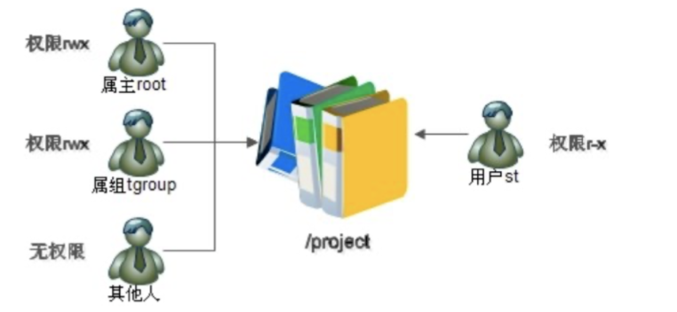
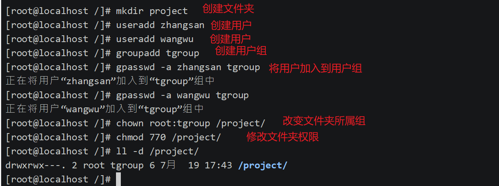
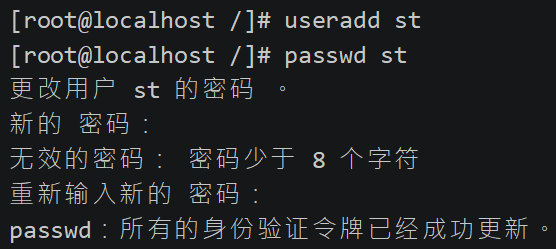
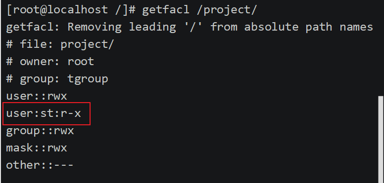
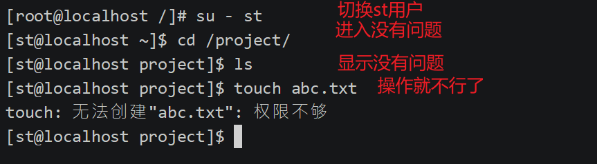
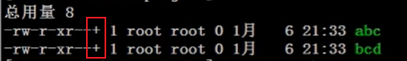

## ACL权限

### 介绍

**ACL 是 Access Control List 的缩写，主要的目的是在提供传统的 owner,group,others 的 read,write,execute 权限之外的细部权限设定。ACL 可以针对单一使用者，单一文件或目录来进行 r,w,x 的权限规范，对于需要特殊权限的使用状况非常有帮助。**




   

>   /project 文件夹权限设置为 770 ，即root(讲师)和所属组(班级同学)，
>
>   传统 所有者、所属组、其他人权限分类针对上面情况有什么问题呢？如果进来一个试听的用户，你如何处理？
>
>   1.   将试听用户设置为其他人，其他人权限为0，进入不了，如果/project设置为775，那么其他班级和其他网络的人都可以进入到此目录，不合逻辑
>   2.  将试听用户设置为所属组里面，相当于把试听用户赋予了班级同学一样的权限 7 即可以进入又可以修改，不安全也不符合金钱规则
>   3.  将试听用户设置为root，也不合逻辑
>   4.  新增所属组设置，将试听用户加入到新增所属组中，但是文件只能属于一个所属组，所以没有办法了？因此引出ACL权限

### 查看分区ACL权限是否开启

>   ACL权限针对分区而言，如果一个分区不支持ACL权限，那么就不可以使用此功能

`命令`

```bash
dumpe2fs -h 分区 
#dumpe2fs命令是查询指定分区详细文件系统信息的命令 
```

`选项：`  

*   -h 仅显示超级块中信息，而不显示磁盘块组的详细信息

`例如`

```bash
dumpe2fs -h /dev/sda3 
```


>   默认分区都支持


### 临时开启分区ACL权限 

`命令`

```bash
mount -o remount,acl / 
#重新挂载根分区，并挂载加入acl权限  
```


### 永久开启分区ACL权限

`命令`

```bash
vi /etc/fstab 
UUID=c2ca6f57-b15c-43ea-bca0-f239083d8bd2  /   ext4    defaults,acl        1  1
#加入acl  

mount -o remount / 
#重新挂载文件系统或重启动系统，使修改生效
```


### 查看与设定ACL权限

*   查看ACL命令 

    `命令`

    ```bash
    getfacl 文件名 
    ```

    

*   设定ACL权限的命令

    `命令`

    ```bash
     setfacl 选项 文件名 
    ```

    `选项：`

    *   -m  设定ACL权限  
    *   -x  删除指定的ACL权限  
    *   -b  删除所有的ACL权限  
    *   -d  设定默认ACL权限。 
    *   -k  删除默认ACL权限  
    *   -R  递归设定ACL权限。

*   l流程

    1.  环境搭建

        

        >   仿照上图
        >
        >   1.  创建/project
        >   2.  创建root 、tgroup、other和st
        >   3.  分配ACL权限给st用户

    

    2.  新增试听用户

    

    3.  为试听用户设置ACL权限

        ```bash
        setfacl -m u:st:rx /project/
        #给用户st赋予r-x权限，使用“u:用户名:权限”格式
        ```

    

    

​                         

###  默认ACL权限和递归ACL权限

**递归ACL权限 **

-   递归是父目录在设定ACL权限时，所有的子文件和子目录也会拥有相同的ACL权限。 

`命令`

```bash
setfacl -m u:用户名:权限 -R 文件名   
```

>   tips:只对当前现有目录有作用 ，例如新touch的文件没有设定的权限。

**所有文件不论是否新建都有递归ACL**

>   如果给父目录设定了默认ACL权限，那么父目录中所有新建的子文件(目录)都会继承父目录的ACL权限。 

`命令`

```bash
setfacl -m d:u:用户名:权限 -R 目录名
```



