## 服务分类

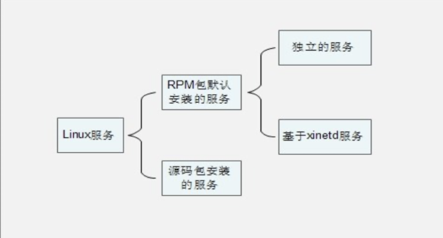

> 这一章主要讲得就是  独立服务、基于xinetd服务、源码包安装的服务   的启动和自启动	


### 启动与自启动

- 服务启动：就是在当前系统中让服务运行，并提供功能。 

- 服务自启动：自启动是指让服务在系统开机或重启动之后，随着系统的启动而自动启动服务。

### 查询已安装的服务

-   RPM包安装的服务 

	-   chkconfig  --list 

	

	> 0~6 对应着Linux默认的7个运行级别，其中2，3，4，5都是开启，则为自启服务，但是并不是正在运行的服务，如果查看哪些服务正在运行，则使用ps

### 查看服务自启动状态，可以看到所有RPM包安装的服务  

-   源码包安装的服务 

-   查看服务安装位置，一般是/usr/local/下,如果有对应的文件夹，则就已安装


### 服务安装的位置

- RPM安装服务和源码包安装服务的区别就是安装位置的不同

- - 源码包安装在指定位置，一般是/usr/local/ 
	- RPM包安装在默认位置中 /etc/init.d/：启动脚本位置

- /etc/sysconfig/：初始化环境配置文件位置 

- /etc/：配置文件位置 

- /etc/xinetd.conf：xinetd配置文件 

- /etc/xinetd.d/：基于xinetd服务的启动脚本

- /var/lib/：服务产生的数据放在这里 

- /var/log/：日志

### 独立的服务管理

#### 独立服务的启动

> Linux下所有的独立的服务启动脚本都是放在 /etc/init.d/ 目录下

* /etc/init.d/独立服务名  start|stop|status|restart|    
* service  独立服务名  start|stop|restart||status 


#### 独立服务的自启动

- chkconfig [--level 运行级别] [独立服务名] [on|off]   

	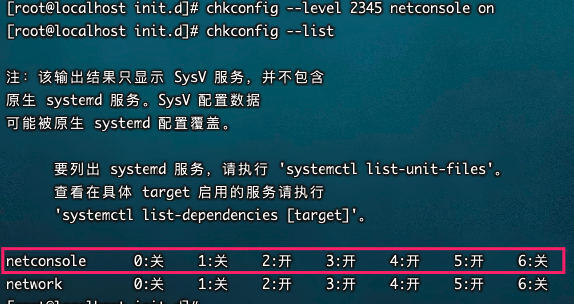

- 修改/etc/rc.d/rc.local文件 

	>  这个文件，在用户输入用户名密码前会执行该文件中内容，如果文件中放入启动命令，则会启动相关服务。和win下启动文件夹类似 

- 使用ntsysv命令管理自启动

	使用空格控制是否勾选

#### 基于xinetd服务的启动和自启动

> 基于xinetd服务安装的服务很少了，比如不太安全的telnet是基于xinetd服务安装

1. 安装xinetd

	```shell
	yum -y install xinetd
	```

	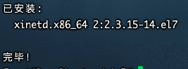

2. 安装 telnet-server 进行演示

	```shell
	yum -y install telnet-server
	```

	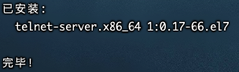

3. 查看服务是否安装

	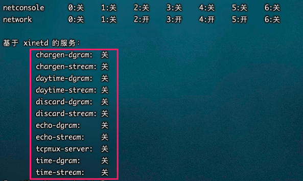

	> 并没有telnet，暂不深究，可能和centos版本有关

4. 配置telnet

	```shell
	vi /etc/xinetd.d/telnet 
	service telnet  <- 服务的名称为telnet
	 {         
	flags           = REUSE  <- 标志为REUSE，设定TCP/IP socket可重用
	socket_type     = stream  <-使用TCP协议数据包         
	wait            = no  <-允许多个连接同时连接         
	user            = root  <- 启动服务的用户为root         
	server          = /usr/sbin/in.telnetd  <- 服务的启动程序         
	log_on_failure  += USERID  <- 登陆失败后，记录用户的ID         
	disable         = no   <- 服务启动
	}
	```

5. 重启 xinetd即可启动下面的telnet

	```bash
	service xinetd restart
	```

6. telnet自启动

	```bash
	 chkconfig telnet on 
	```


#### 源码包安装服务的启动

> 查看源码包的使用说明

##Linux的七个默认运行级别

\# 0 - 停机 ，机器关闭。

\# 1 - 单用户模式 。就像Win9x下的安全模式类似

\# 2 - 多用户，但是没有NFS 进入无网络服务的多用户模式

\# 3 - 完全多用户模式 ，是标准的运行级。

\# 4 - 没有用到 ，一般不用，在一些特殊情况下可以用它来做一些事情。例如在笔记本 电脑的电池用尽时，可以切换到这个模式来

\# 5 - X11  ，进到X Window系统了。 

\# 6 - 重新启动 ，运行init 6机器就会重启


## 查看Linux中正在运行的服务

> ps aux + grep


## 进程管理

> 所有的程序最好会产生一个进程。例如ls、pwd等命令使用时也会产生一个进程去执行


### 进程管理的作用

* 判断服务器健康状态
* 查看系统中所有进程
* 杀死进程

### 查看Linux下所有进程

```shell
ps aux    #使用bsd操作系统格式
或者
ps -ls    #使用Linux标准命令格式。
或者
pstree -p   # 以树状显示进程信息
或者
pstree -p | grep xxx #搜索
```

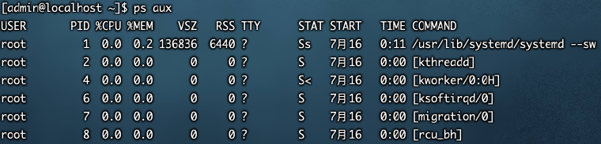

- USER：该进程是由哪个用户产生的； 

- PID：进程的ID号； 

- %CPU：该进程占用CPU资源的百分比，占用越高，进程越耗费资源；

- %MEN：该进程占用物理内存的百分比，占用越高，进程越耗费资源； 

- VSZ: 该进程占用虚拟内存的大小，单位KB；

- RSS：该进程占用实际物理内存的大小，单位KB； 

- TTY：该进程是在哪个终端中运行的。其中tty1-tty7代表本地控制台终端，tty1-tty6是本地的字符界面终端，tty7 是图形终端。pts/0-255代表虚拟终端。

- STAT：进程状态。常见的状态有：

- - R：运行
	- S：睡眠
	- T：停止状态
	- s：包含子进程
	- +：位于后台 

- START：该进程的启动时间 

- TIME：该进程占用CPU的运算时间，注意不是系统时间 

- COMMAND：产生此进程的命令名 


### 查看系统健康状态

`格式`

```bash
top [ 选项]
```

`选项`

* \- d  秒数： 指定top命令每隔几秒更新。默认是3秒 在top命令的交互模式当中可以执行的命令：  
* ？或h：  显示交互模式的帮助  


* P：以CPU使用率排序，默认就是此项  
* M：以内存的使用率排序  
* N：以PID排序  
* q：退出top

> 以上四个命令是在top命令交互模式下(即进入了top后，恩键进行交互,而不是选项)

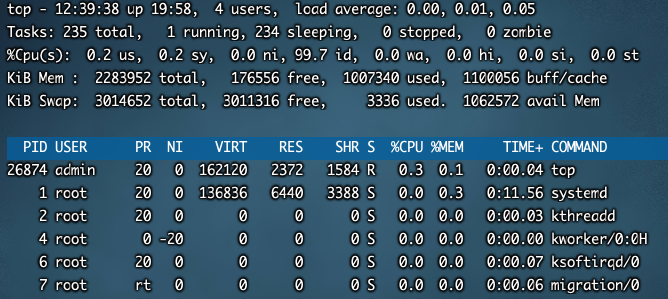

> top -d 3   #每3秒打印

**第一行信息为任务队列信息 [**重点关注load average]

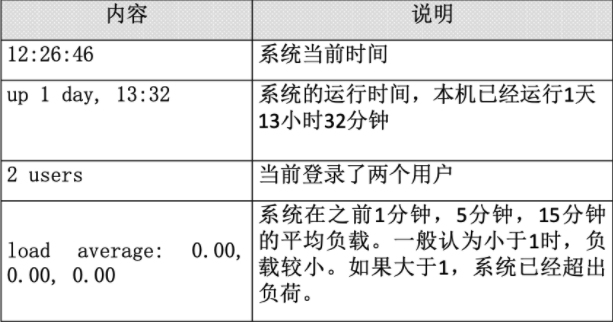

**进程信息**

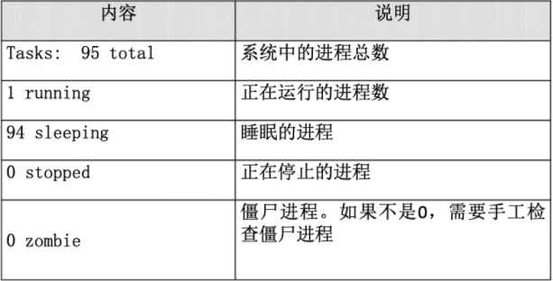

**CPU信息**

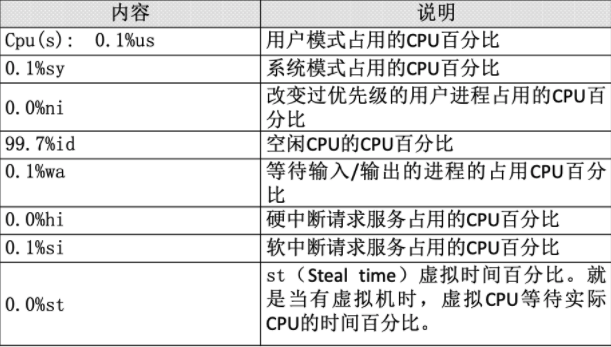

**物理内存信息**

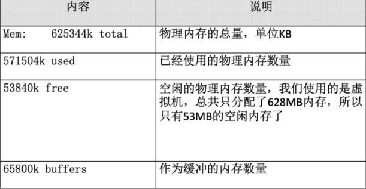

**交换分区信息**

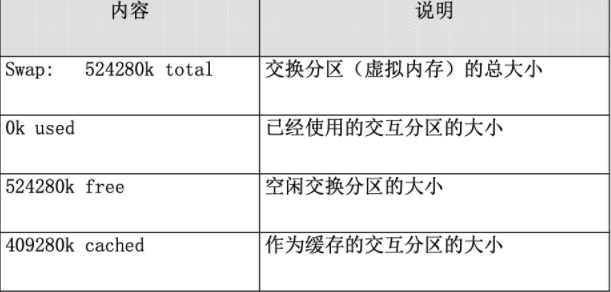


### 终止进程（正常stop服务手段以失效下使用）

* 查看可用的进程信号

	```bash
	kill -l
	```

	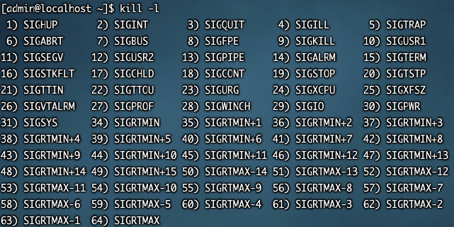

	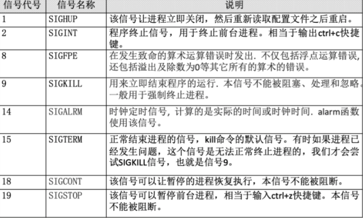

	> 最常用的就是 1 、 9 、15

* 终止进程 kill

	```shell
	kill -9 进程号   #强制杀死
	kill -1 进程号   #重启
	```

* 终止所有进程 killall

	```bash
	killall [ 选项][信号] 进程名 
	#按照进程名杀死进程 
	```

	`选项：`  

	* \- i ： 交互式，询问是否要杀死某个进程  

	* \- I ： 忽略进程名的大小写  

* 终止进程 pkill

	```bash
	pkill  [ 选项] [信号] 进程名 
	#按照进程名终止进程
	```

	 `选项：`  
	- t  终端号： 按照终端号踢出用户

	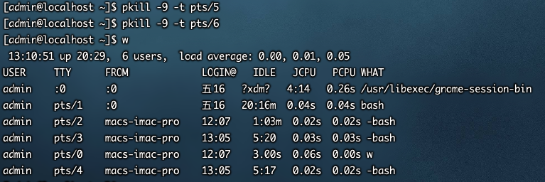

	


## ActiveMQ控制台

类似于Tomcat的启动控制界面，都是Apache旗下产品。

* 地址

	http://127.0.0.1:8161/admin    #控制台默认端口为9161   服务默认端口81616

* 用户名密码

	admin/admin

	

