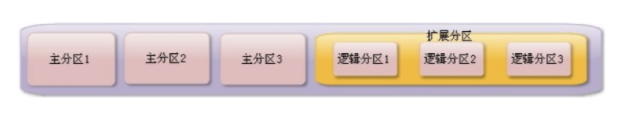
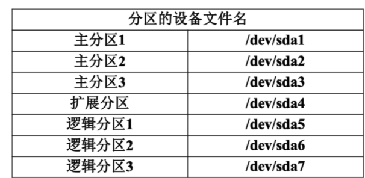
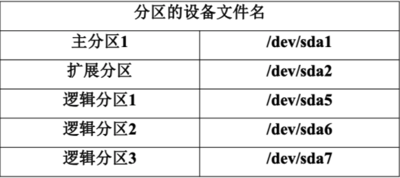
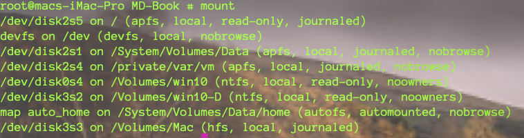
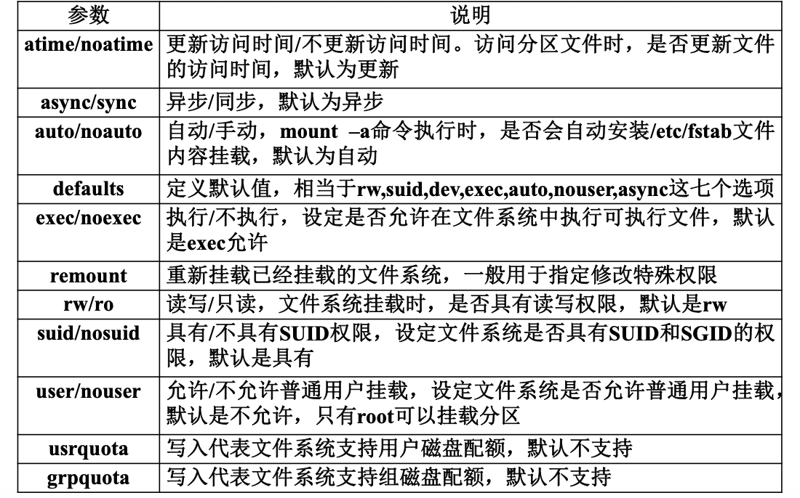
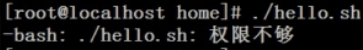

## 分区类型

- 主分区：总共最多只能分四个 
- 扩展分区：只能有一个，也算作主分区的一种，也就是说主分区加扩展分区最多有四个。但是扩展分区不能存储数据和格式化，必须再划分成逻辑分区才能使用。 

- 逻辑分区：逻辑分区是在扩展分区中划分的，如果是IDE硬盘，Linux最多支持59个逻辑分区，如果是SCSI硬盘Linux最多支持11个逻辑分区






如果主分区只有一个，如何划分呢？



> 即sda1~sda4只能是主分区和扩展分区，如果主分区空缺则不能前移


## 文件系统

- ext2：是ext文件系统的升级版本，Red Hat Linux7.2版本以前的系统默认都是ext2 文件系统。1993年发布，==最大支持16TB 的分区和最大2TB的文件==（1TB=1024GB=1024*1024KB）
- ext3： ext3文件系统是ext2文件系统的升级版本，==最大的区别就是带日志功能，以在系统突然停止时提高文件系统的可靠性==。支持最大16TB的分区和最大2TB的文件
- ext4：它是ext3文件系统的升级版。ext4 在性能、伸缩性和可靠性方面进行了大量改进。EXT4 的变化可以说是翻天覆地的，比如向下兼容EXT3、最大1EB文件系统和16TB文件、无限数量子目录、Extents连续数据块概念、多块分配、延迟分配、持久预分配、快速FSCK、日志校验、无日志模式、在线碎片整理、inode增强、默认启用barrier等。是CentOS 6.3的默认文件系统      （1EB=1024PB=1024*1024TB）


## 文件系统命令

### 基本命令

#### 1、文件系统查看命令df

`命令格式`

```bash
df  [选项] [挂载点] 
```


`选项：  `

* -a 显示所有的文件系统信息，包括特殊文件系统，如 /proc、/sysfs  

* -h 使用习惯单位显示容量，如KB，MB或GB等  

* -T 显示文件系统类型  

* -m 以MB为单位显示容量  

* -k 以KB为单位显示容量。默认就是以KB为单位


#### 2、统计目录或文件大小

`命令格式`

```bash
du [选项] [目录或文件名] 
```


`选项：  `

* -a 显示每个子文件的磁盘占用量。默认只统计 子目录的磁盘占用量  
* -h 使用习惯单位显示磁盘占用量，如KB，MB  或GB等  
* -s 统计总占用量，而不列出子目录和子文件的 占用量


#### 3、**du命令和df命令的区别**

- df命令是从文件系统考虑的，不光要考虑文件占用的空间，还要统计被命令或程序占用的空间（最常见的就是文件已经删除，但是程序并没有释放空间） 
- du命令是面向文件的，只会计算文件或目录占用的空间 


#### 4、文件系统修复命令（<font color=ff00aa>别用</font>）

`命令格式`

```bash
fsck [选项] 分区设备文件名
```


`选项：  `

*  -a： 不用显示用户提示，自动修复文件系统  
* -y： 自动修复。和-a作用一致，不过有些文件系统只支 持-y


#### 5、显示磁盘状态命令

`命令格式`

```bash
dumpe2fs 分区设备文件名
```


### 挂载命令


#### 1、查询与自动挂载

`命令格式`

```bash
mount [-l] 
#查询系统中已经挂载的设备，-l会显示卷标名称  
```

```bash
mount –a 
#依据配置文件/etc/fstab的内容，自动挂载  
```




`挂载命令格式 `

```bash
 mount [-t 文件系统] [-L 卷标名]  [-o 特殊选项]   设备文件名 挂载点 
```

`选项：` 

* -t 文件系统：加入文件系统类型来指定挂载的类型，可以ext3、ext4、iso9660等文件系统   

* -L 卷标名： 挂载指定卷标的分区，而不是安装设备文件名挂载  

* -o 特殊选项：可以指定挂载的额外选项

​                         

> home下使用noexec权限那么即使是root用户也无法执行

`如下:`

1. 挂载

	```bash
	mount -o remount,noexec /home 
	#重新挂载/boot分区，并使用noexec权限
	```

2. 拷贝可执行文件到/home目录下

	```bash
	cd /home 
	vi hello.sh ##写入 echo “hello world！！！” 
	```

3. 修改权限并执行

	```bash
	chmod 755 hello.sh  
	./hello.sh 
	```

	

4. 改回可执行

	```bash
	mount -o remount,exec /home 
	```


## 案例：挂载光盘和U盘

### 挂载光盘

0. 在虚拟机设置中将光盘放入到虚拟机中

1. 建立挂载点 

	```bash
	mkdir /mnt/cdrom/ 
	#建立挂载点 
	```

2. 挂载光盘 

	```bash
	mount -t iso9660 /dev/cdrom /mnt/cdrom/ 
	或
	mount /dev/sr0 /mnt/cdrom/  #文件系统可用默认
	# 将虚拟机设置中的光盘挂载到 新建的挂载点/mnt/cdrom/ 
	```

## 卸载U盘

1. 卸载命令 

```bash
umount 设备文件名或挂载点 
```

>  umount /mnt/cdrom


### 挂载U盘

1. 插入u盘后，系统自动识别，我们只需要查询即可

	```bash
	fdisk –l 
	#查看U盘设备文件名 
	```

2. 挂载

	```bash
	 mount -t vfat /dev/sdb1 /mnt/usb/ 
	```

	> 注意：Linux默认是不支持NTFS文件系统的 


## 支持NTFS文件系统

> Linux默认是不支持NTFS文件系统

* 重新编译内核，Linux内核裁剪
* 下载第三方插件 NTFS-3G 


## fdisk分区


##  分区自动挂载与fstab文件修复