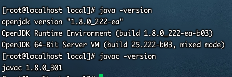

`引言`

在Linux下搭建JavaEE环境


## 安装jdk

1. 下载tar.gz 压缩包

2. mv 到 /usr/local

	```bash
	mv jdk-8u301-linux-i586.tar.gz /usr/local/
	```

3. 解压缩

	```bash
	tar -zxvf jdk-8u301-linux-i586.tar.gz
	```

4. 编辑环境变量

	```bash
	vim /etc/profile   #所有用户都生效
	```

	```bash
	export JAVA_HOME=/usr/local/jdk1.8.0_301
	export CLASSPATH=.:$JAVA_HOME/jre/lib/rt.jar:$JAVA_HOME/lib/dt.jar:$JAVA_HOME/lib/tools.jar
	export PATH=$PATH:$JAVA_HOME/bin
	```

5. 刷新配置文件

	```bash
	source /etc/profile
	```

6. 校验

	