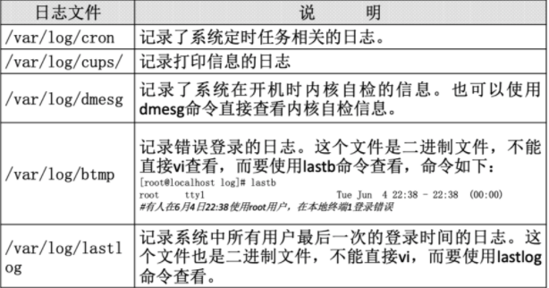
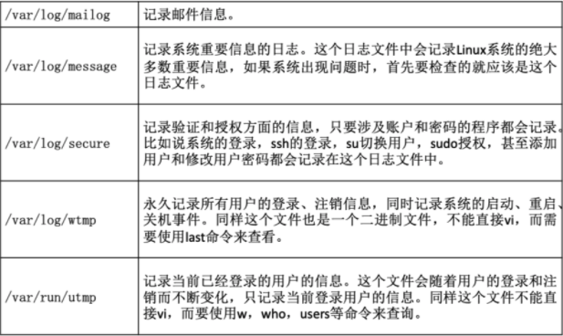
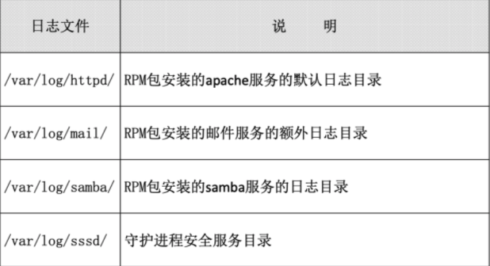
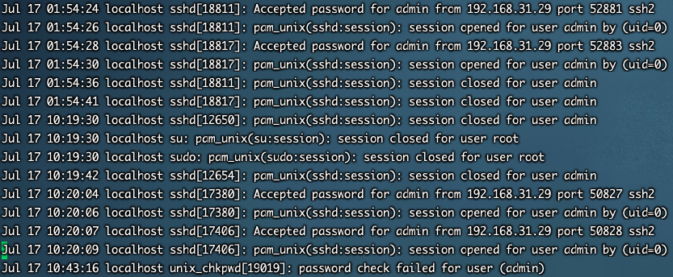

## 简介

> 在CentOS 6.x中日志服务已经由rsyslogd取代了原先的syslogd服务。rsyslogd日志服务更加先进，功能更多。但是不论该服务的使用，还是日志文件的格式其实都是和syslogd服务相兼容的，所以学习起来基本和syslogd服务一致。 

`rsyslogd的新特点：` 

* 基于TCP网络协议传输日志信息； 
* 更安全的网络传输方式；
* 有日志消息的及时分析框架； 
* 后台数据库； 
* 配置文件中可以写简单的逻辑判断； 
* 与syslog配置文件相兼容。


## 服务查询

* 查看服务是否启动 

	```bash
	ps aux | grep rsyslogd
	```

* 查看服务是否自启动

	```bash
	chkconfig --list | grep rsyslog 
	systemctl list-unit-files | grep rsyslog
	```


## 常见日志





> 除了系统默认的日志之外，采用RPM方式安装的系统服务也会默认把日志记录在/var/log/目录中（源码包安装的服务日志是在源码包指定目录中）。不过这些日志不是由rsyslogd服务来记录和管理的，而是各个服务使用自己的日志管理文档来记录自身日志。




## rsyslogd日志服务

### 日志文件格式 



- - 事件产生的时间； 
	- 发生事件的服务器的主机名；
	- 产生事件的服务名或程序名；
	- 事件的具体信息