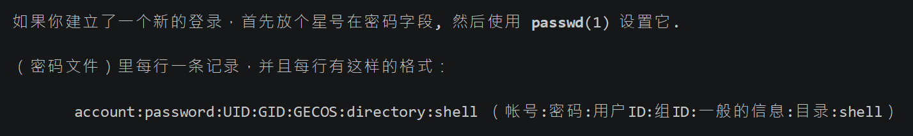
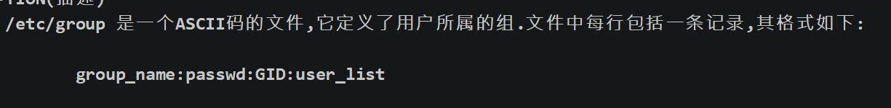

## 简介

-   越是对服务器安全性要求高的服务器，越需要建立合理的用户权限等级制度和服务器操作规范。 

-   在Linux中主要是通过用户配置文件来查看和修改用户信息


## 用户密码配置文件信息

1.  查看用户密码配置文件

    ```bash
    man 5 passwd    ## 文件在/etc/passwd
    ```

    

2.  格式介绍

    -   第1字段：用户名称

    -   第2字段：密码标志 

    -   第3字段：UID（用户ID） 

    -   -   0：   超级用户 
        -   1-499：  系统用户（伪用户）
        -   500-65535： 普通用户(centos7 从1000开始计算)

    -   第4字段：GID（用户初始组ID）[不推荐修改初始组]

    -   第5字段：用户说明 

    -   第6字段：家目录 

    -   -   普通用户：/home/用户名/ 
        -   超级用户：/root/ 

    -   第7字段：登录之后的Shell

## 组信息和组密码

>   每一个新建的用户都会默认新建一个和用户一样的组，然后将该用户放到用户组中

### 组信息文件/etc/group



-   第一字段：组名 
-   第二字段：组密码标志 
-   第三字段：GID 
-   第四字段：组中附加用户


### 组密码文件/etc/gshadow

-   第一字段：组名 
-   第二字段：组密码 (不推荐使用，可以理解为给组设置个小组长)
-   第三字段：组管理员用户名 
-   第四字段：组中附加用户


## 用户管理相关文件

`用户的家目录` 

-   普通用户：/home/用户名/，所有者和所属组都是此用户，权限是700 
-   超级用户：/root/，所有者和所属组都是root用户，权限是550 

`用户的邮箱` 

-   /var/spool/mail/用户名/ 

`用户模板目录` 

-   /etc/skel/


## 用户管理命令

### 1、添加用户

`命令格式 `

```bash
useradd [选项] 用户名 
```

`选项：  `

*   -u UID： 手工指定用户的UID号  
*   -d 家目录： 手工指定用户的家目录  
*   -c 用户说明： 手工指定用户的说明  
*   -g 组名： 手工指定用户的初始组  
*   -G 组名： 指定用户的附加组  
*   -s shell： 手工指定用户的登录shell。默认是/bin/bash  

>   没有选项则为默认用户 


`用户默认值文件 /etc/default/useradd ` 

-   -   GROUP=100  #用户默认组 
    -   HOME=/home #用户家目录 
    -   INACTIVE=-1 #密码过期宽限天数（7）
    -   EXPIRE=  #密码失效时间（8） 
    -   SHELL=/bin/bash #默认shell 
    -   SKEL=/etc/skel #模板目录 
    -   CREATE_MAIL_SPOOL=yes #是否建立邮箱 

​                         

-   /etc/login.defs  

-   PASS_MAX_DAYS 99999 #密码有效期（5） 
-   PASS_MIN_DAYS 0 #密码修改间隔（4）
-   PASS_MIN_LEN 5 #密码最小5位（PAM）
-   PASS_WARN_AGE 7 #密码到期警告（6）
-   UID_MIN  500 #最小和最大UID范围 
-   GID_MAX  60000 
-   ENCRYPT_METHOD SHA512 #加密模式

​                         

>   查看当前用户是谁   ： whoami


### 2、修改用户密码

`命令格式 `

```bash
passwd [选项] 用户名 
```

`选项：`

*   -S  查询用户密码的密码状态。仅root用户可用。 
*   -l  暂时锁定用户。仅root用户可用  
*   -u  解锁用户。仅root用户可用  
*   --stdin 可以通过管道符输出的数据作为用户的密码。 

`查看密码状态 `

```bash
passwd -S 用户名
```

```bash
lamp PS 2013-01-06 0 99999 7 -1  
用户名 密码设定时间（2013-01-06） 密码修改间隔时间（0） #密码有效期（99999 ） 警告时间（7） 密码不失效（-1）
```

`锁定用户和解锁用户 `

```bash
passwd -l 用户名 
passwd -u 用户名   
```

 `使用字符串作为用户的密码 `

```bash
passwd --stdin 用户名（shell脚本可能会用到）
```


### 3、修改用户信息**usermod**和修改用户密码状态**chage**

#### **usermod**

`命令格式`

```bash
usermod [选项] 用户名
```

`选项：`

*   -u UID：		修改用户的UID号
*   -c 用户说明：	修改用户的说明信息
*   -G 组名：		修改用户的附加组
*   -L：		临时锁定用户（Lock）
*   -U：		解锁用户锁定（Unlock）

`修改用户的说明`

```bash
 usermod -c "test user" 用户名
```

`把lamp用户加入root组`

```bash
usermod -G root 用户名
```

`锁定用户`

```bash
usermod -L 用户名
```

`解锁用户`

```bash
 usermod -U 用户名
```


#### chage

`格式`

```bash
chage [选项] 用户名
```

`选项：`

*   -l：		列出用户的详细密码状态
*   -d 日期：	修改密码最后一次更改日期（shadow3字段）
*    -m 天数：  两次密码修改间隔（4字段）
*   -M 天数：	密码有效期（5字段）
*   -W 天数：	密码过期前警告天数（6字段）
*   -I 天数：	密码过后宽限天数（7字段）
*   -E 日期：	账号失效时间（8字段）


`案例`

```bash
chage -d 0 lamp  
#这个命令其实是把密码修改日期归0了（shadow第3字段）#这样用户一登陆就要修改密码
```


### 4、删除用户和切换用户

#### **userdel**

`格式`

```bash
userdel [-r] 用户名 
```

`选项：`

*   -r 删除用户的同时删除用户家目录  

`手工删除用户    看看就好`

-   [root@localhost ~]# vi /etc/passwd 

-   [root@localhost ~]# vi /etc/shadow 
-   [root@localhost ~]# vi /etc/group 
-   [root@localhost ~]# vi /etc/gshadow 
-   [root@localhost ~]# rm -rf /var/spool/mail/lamp 
-   [root@localhost ~]# rm -rf /home/lamp/

`查看用户ID`

```bash
id 用户名
```

#### **su**

`格式`

```bash
su [选项] 用户名
```

`选项：`

*   \-     选项只使用“-”代表连带用户的环境变量一起切换  (env命令查看当前环境变量)
*   -c   仅执行一次命令，而不切换用户身份  

`案例 `

```bash
 su  –  root 
```

>   建议使用  su  时使用 -  ，否则环境变量不切换那么会导致一些隐性报错


## 用户组管理命令

### 1、添加用户组

`格式`

```bash
groupadd [选项] 组名 
```

`选项：`

*   -g GID 	指定组ID

>   不使用 -g参数  ，则默认是从GID 500开始累加

### 2、修改用户组

`格式`

```bash
groupmod [选项] 组名 
```

`选项：`

*   -g GID 	修改组ID
*   -n 新组名	修改组名

`案例`

```bash
groupmod -n yxlm lol
#把组名lol修改为yxlm
```


### 3、删除用户组

>   tips:删除组的时候，组内不允许有初始用户存在。

`格式`

```bash
 groupdel [选项] 组名 
```

`选项：`

*   -a 用户名： 把用户加入组
*   -d 用户名： 把用户从组中删除