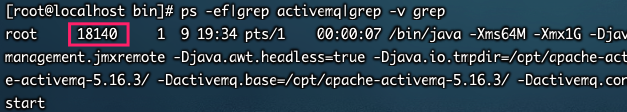
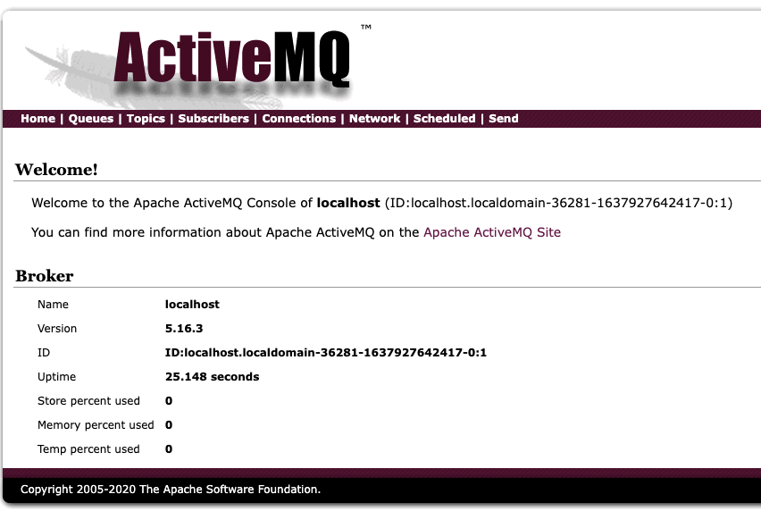

## 引入MQ背景

1. 系统之间耦合严重。
2. 高并发下系统容易被冲垮。上游系统发起下单购买操作，就是下单一个操作，很快就完成。然而，下游系统要完成秒杀业务后面的所有逻辑（读取订单，库存检查，库存冻结，余额检查，余额冻结，订单生产，余额扣减，库存减少，生成流水，余额解冻，库存解冻）
3. 同步性能影响。RPC接口上基本都是同步调用，整体的服务性能遵循“木桶理论”，即整体系统的耗时取决于链路中最慢的那个接口。比如A调用B/C/D都是50ms，但此时B又调用了B1，花费2000ms，那么直接就拖累了整个服务性能。


## MQ主要作用

* 异步。调用者无需等待。
* 解耦。解决了系统之间耦合调用的问题。
* 消峰。抵御洪峰流量，保护了主业务。


## MQ定义

面向消息的中间件（message-oriented middleware）MOM能够很好的解决以上问题。是指利用高效可靠的消息传递机制与平台无关的数据交流，并基于数据通信来进行分布式系统的集成。通过提供消息传递和消息排队模型在分布式环境下提供应用解耦，弹性伸缩，冗余存储、流量削峰，异步通信，数据同步等功能。

大致的过程是这样的：发送者把消息发送给消息服务器，消息服务器将消息存放在若干队列/主题topic中，在合适的时候，消息服务器回将消息转发给接受者。在这个过程中，发送和接收是异步的，也就是发送无需等待，而且发送者和接受者的生命周期也没有必然的关系；尤其在发布pub/订阅sub模式下，也可以完成一对多的通信，即让一个消息有多个接受者


## ActiveMQ安装以及启动

1. 官网下载tar包
2. 丢到linux服务器解压缩
3. bin目录下执行启动命令

```bash
#启动
./activemq start
#带日志启动
./activemq start < ../log/active.log
#查看是否启动
 ps -ef|grep activemq|grep -v grep
#重启
./activemq restart
#关闭
./activemq stop
```




## ActiveMQ控制台

* 地址

	http://192.168.31.99:8161/admin

* 用户名密码

	admin/admin

* 登录后界面如下



> 如果无法访问控制台，可能由于默认情况下ActiveMQ只允许本地访问，修改config/jetty.yml文件中如下内容

