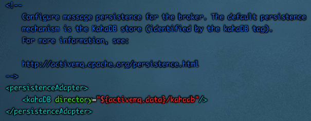
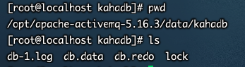
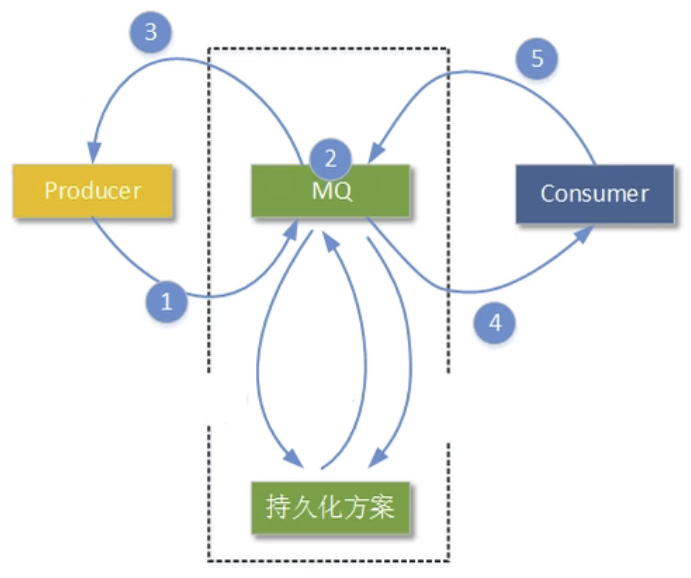

## 概念捋清

> 本章讲到的持久化和第三章中的解决消息可靠性措施中【持久、事务、签收】持久不是一个东西。【持久、事务、签收】是ActiveMQ自身携带的特性，而ActiveMQ支持持久化机制，是物理层面的高可用，准备一个单独的服务器去做持久化


## 是什么

* 为了避免意外宕机以后丢失信息，需要做到重启后可以恢复消息队列，消息系统一般都会采用持久化机制。

* ActiveMQ的消息持久化机制主要有**JDBC，AMQ，KahaDB和LevelDB**，无论使用哪种持久化方式，消息的存储逻辑都是一致的。

* **就是在发送者将消息发送出去后，消息中心首先将消息存储到本地数据文件、内存数据库或者远程数据库等。再试图将消息发给接收者，成功则将消息从存储中删除，失败则继续尝试尝试发送。消息中心启动以后，要先检查指定的存储位置是否有未成功发送的消息，如果有，则会先把存储位置中的消息发出去。**
* 类似于Redis的RDB和AOF

 

## 持久化方式

1. AMQ Mesage Store(了解）

	基于文件的存储方式，是以前的默认消息存储，现在不用了

2. **KahaDB消息存储(默认)**

	基于日志文件，从ActiveMQ5.4开始默认的持久化插件，类似于Redis中的AOF日志存储方式

	

	

	> KahaDB中有如下四类文件，作用如下：

	* db-number.log

		KahaDB存储消息到预定大小的数据纪录文件中，文件名为db-number.log。当数据文件已满时，一个新的文件会随之创建，number数值也会随之递增，它随着消息数量的增多，每32M一个文件，文件名按照数字进行编号，如db-1.log，db-2.log······。当不再有引用到数据文件中的任何消息时，文件会被删除或者归档。

	* db.data

		该文件包含了持久化的BTree索引，索引了消息数据记录中的消息，它是消息的索引文件，本质上是B-Tree（B树），使用B-Tree作为索引指向db-number。log里面存储消息。

	* db.free

		当问当前db.data文件里面哪些页面是空闲的，文件具体内容是所有空闲页的ID

	* db.redo

		用来进行消息恢复，如果KahaDB消息存储再强制退出后启动，用于恢复BTree索引。

	* lock

		文件锁，表示当前kahadb独写权限的broker。

3. **JDBC**

	消息基于JDBC存储的，但是因为需要和数据库进行交互，因此会慢一点。

4. LevelDB消息存储(了解)

	这种文件系统是从ActiveMQ5.8之后引进的，它和KahaDB非常相似，也是基于文件的本地数据库存储形式，但是它提供比KahaDB更快的持久性。但它不使用自定义B-Tree实现来索引独写日志，而是使用基于LevelDB的索引

5. **JDBC Message Store with ActiveMQ Journal （JDBC 加强版）**


### 1、JDBC持久化存储



1. 将MySQL驱动包放入到ActiveMQ/lib目录下

2. 修改持久化机制为JDBC 并且数据库连接配置   config/activemq.xml

	```xml
	<!-- <persistenceAdapter>
	            <kahaDB directory="${activemq.data}/kahadb"/>
	     </persistenceAdapter>-->
	<persistenceAdapter>
	  <jdbcPersistenceAdapter dataSource="#mysql-ds" createTablesOnStartup="true"/>
	</persistenceAdapter>
	<bean id="mysql-ds" class="org.apache.commons.dbcp2.BasicDataSource" destroy-method="close">
	  <property name="driverClassName" value="com.mysql.jdbc.Driver"/>   
	  <property name="url" value="jdbc:mysql://192.168.31.98/activemq?relaxAutoCommit=true"/>   
	  <property name="username" value="root"/>       
	  <property name="password" value="root"/>  
	  <property name="poolPreparedStatements" value="true"/>
	</bean>
	```

	> 因为jdbc驱动中包含了dbcp连接池，如果要换成其他连接池则需要在第一步中添加对应的连接池
	>
	> **createTablesOnStartup默认为true，即启动activemq的时候会去数据库中新建表，用来存储activemq持久化数据。（第一次改为true，之后改为false）**

3. ActiveMQ的持久化存储需要三张表，如下

	* ACTIVEMQ_MSGS

		> activemq_msgs用于存储消息，Queue和Topic都存储在这个表中：

		ID：自增的数据库主键

		CONTAINER：消息的Destination

		MSGID_PROD：消息发送者客户端的主键

		MSG_SEQ：是发送消息的顺序，MSGID_PROD+MSG_SEQ可以组成JMS的MessageID

		EXPIRATION：消息的过期时间，存储的是从1970-01-01到现在的毫秒数

		MSG：消息本体的Java序列化对象的二进制数据

		PRIORITY：优先级，从0-9，数值越大优先级越高

	* ACTIVEMQ_ACKS

		> activemq_acks用于存储订阅关系。如果是持久化Topic，订阅者和服务器的订阅关系在这个表保存：

		CONTAINER：消息的Destination

		SUB_DEST：如果是使用Static集群，这个字段会有集群其他系统的信息

		CLIENT_ID：每个订阅者都必须有一个唯一的客户端ID用以区分

		SUB_NAME：订阅者名称

		SELECTOR：选择器，可以选择只消费满足条件的消息。条件可以用自定义属性实现，可支持多属性AND和OR操作

		LAST_ACKED_ID：记录消费过的消息的ID。

	* ACTIVEMQ_LOCK

		> 表activemq_lock在集群环境中才有用，只有一个Broker可以获得消息，称为Master Broker，

4. 代码开启持久特性

	```java
	messageProducer.setDeliveryMode(DeliveryMode.NON_PERSISTENT)
	```

> 消息一旦被消费，不论是否开启持久化都不会保存，例如没开启持久话则删除内存中的已消费数据，如果开启持久话则删除数据库中已消费的数据

### 2、JDBC Message Store with ActiveMQ Journal （JDBC 加强版）

这种方式克服了JDBC Store的不足，JDBC每次消息过来，都需要去写库读库。ActiveMQ Journal，使用高速缓存写入技术，大大提高了性能。

当消费者的速度能够及时跟上生产者消息的生产速度时，journal文件能够大大减少需要写入到DB中的消息。举个例子：

生产者生产了1000条消息，这1000条消息会保存到journal文件，如果消费者的消费速度很快的情况下，在journal文件还没有同步到DB之前，消费者已经消费了90%的以上消息，那么这个时候只需要同步剩余的10%的消息到DB。如果消费者的速度很慢，这个时候journal文件可以使消息以批量方式写到DB。


1. 修改activemq.xml文件

	```bash
	<persistenceAdapter>
	  <journalPersistenceAdapterFactory 
	  journalLogFiles="5" 
	  journalLogFileSize="32768" 
	  useJournal="true" 
	  useQuickJournal="true" 
	  dataSource="#mysql-ds" 
	  dataDirectory="../activemq-data" /> 
	</persistenceAdapter>
	<bean id="mysql-ds" class="org.apache.commons.dbcp2.BasicDataSource" destroy-method="close">
	  <property name="driverClassName" value="com.mysql.jdbc.Driver"/>   
	  <property name="url" value="jdbc:mysql://192.168.31.98/activemq?relaxAutoCommit=true"/>   
	  <property name="username" value="root"/>       
	  <property name="password" value="root"/>  
	  <property name="poolPreparedStatements" value="true"/>
	</bean>
	```

2. 重启