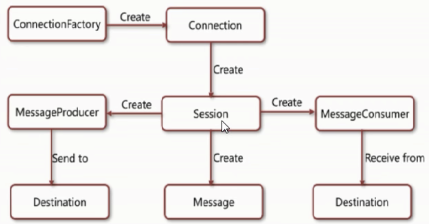
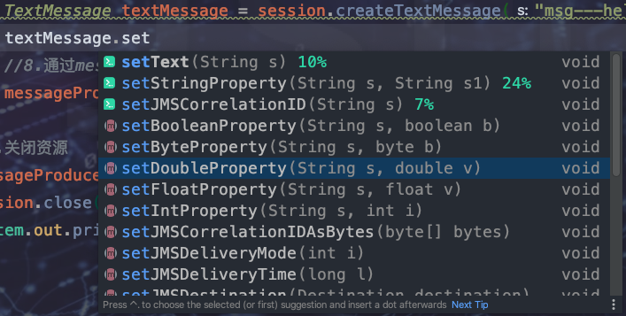
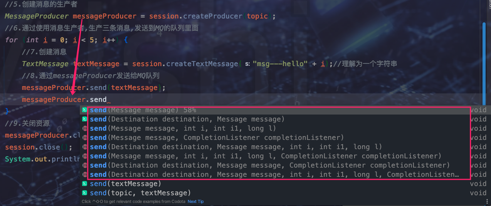
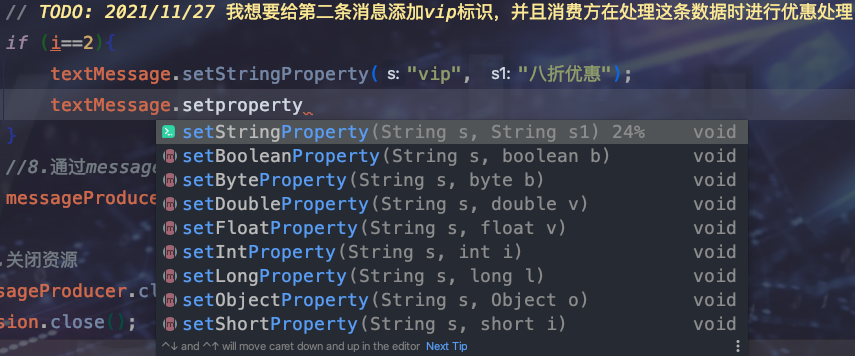
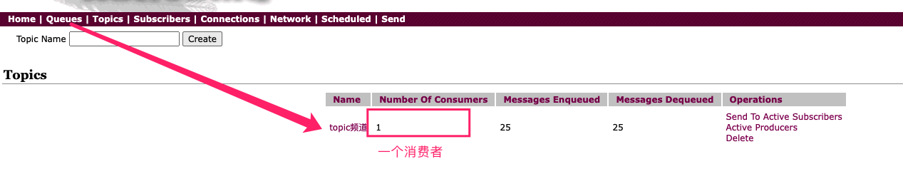
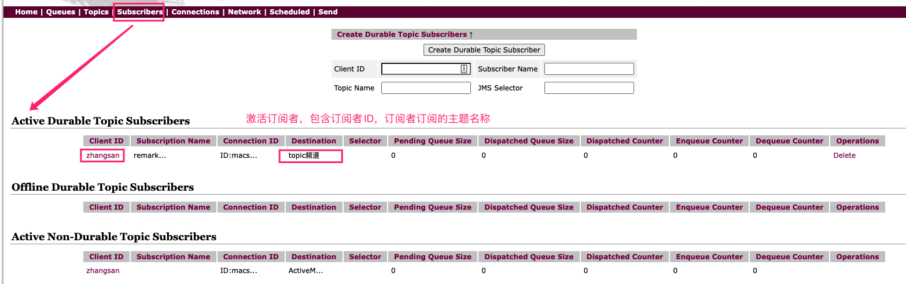
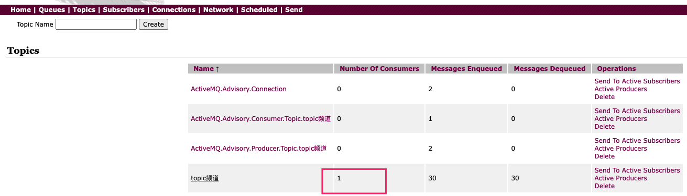
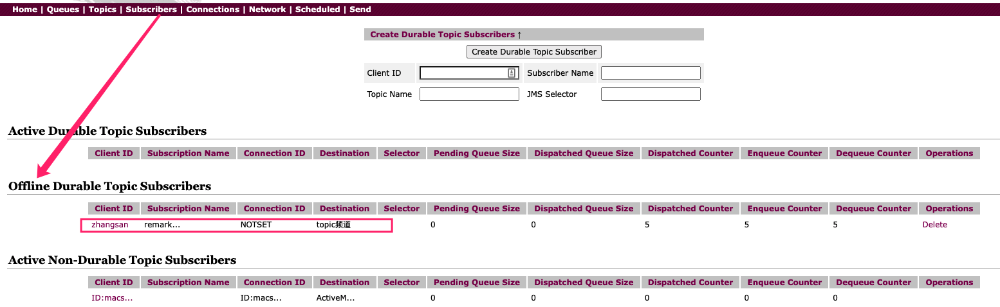

## 是什么

JMS是JavaEE体系中一套消息服务规范，**指的是两个应用程序之间进行异步通信的API，它为标准协议和消息服务提供了一组通用接口，包括创建、发送、读取消息等，用于支持Java应用程序开发**。在JavaEE中，当两个应用程序使用JMS进行通信时，它们之间不是直接相连的，而是通过一个共同的消息收发服务组件关联起来以达到解耦/异步削峰的效果。JavaEE旗下包含13个核心的规范构成了JavaEE企业级开发标准、

1. JDBC（Java Databease）数据库连接

2. JNDI（Java Naming and Directory Interfaces）Java的命令和目录接口

3. EJB（Enterprise JavaBean）

4. RMI（Remote Method Invoke）远程方法调用

5. Java IDL（Interface Description Language）/CORBA（Common Object Broker Architecture）接口定义语言/共用对象请求代理程序体系结构

6. JSP（Java Server Page）

7. Servlet

8. XML（Extensible Markup Language）可标记白标记语言

9. JMS（Java Message Service）Java消息服务

10. JTA（Java Transaction API）Java事务API

11. JTS（Java Transaction Service）Java事务服务

12. JavaMail

13. JAF（JavaBean Activation Framework）

## 组成元素



* JMS Provider ： 实现JMS接口和规范的消息中间件，也就是我们说的MQ服务器

* JMS Producer ：消息生产者，创建和发送JMS消息的客户端应用

* JMS Consumer ： 消息消费者，接收和处理JMS消息的客户端应用

* JSM Message ： 

	* <font color=ff00aa>消息头</font>

		* **消息发送目的地**，一般指topic和queue 。JMSDestination

		* <font color=ff00aa>消息持久和非持久模式</font>。JMSDeliveryMode

			* 持久模式 ：一条持久性的消息，会进行持久化，如果JMS提供者出现故障，该消息并不会丢失，它会在服务器恢复之后再次传递。
			* 非持久模式 ：最多会传递一次，这意味着服务器出现故障，该消息将会永远丢失。

		* 消息过期时间 JMSExpiration

			* **默认消息永不过期**
			* 消息过期时间，等于Destination的send方法中的timeToLive值加上发送时刻的GMT时间值。
			* 如果timeToLive值等于0，则JMSExpiration被设为0，表示该消息永不过期。
			* 如果发送后，在消息过期时间之后还没有被发送到目的地，则该消息被清除。

		* **消息优先级**  JMSPriority

			* 消息优先级，从0-9十个级别，0-4是普通消息5-9是加急消息。
			* JMS不要求MQ严格按照这十个优先级发送消息但必须保证加急消息要先于普通消息到达。默认是4级。

		* 消息唯一ID  JMSMessageID

			**唯一标识每个消息的标识由MQ产生，可以用来判断是否重复消费**

			。。。

		> 消息头的属性设置可以通过消息对象进行属性设置。也可以通过生产者对象send时选择不同的构造方法进行设置

		

	* <font color=ff00aa>消息体格式</font>

		* **TxtMessage**  ：普通字符串消息，包含一个String
		* **MapMessage**  ：一个Map类型的消息，key为Strng类型，而值为Java基本类型
		* ObjectMessage  ：对象消息，包含一个可序列化的Java对象
		* BytesMessage  ： 二进制数组消息，包含一个byte[]
		* StreamMessage  ：Java数据流消息，用标准流操作来顺序填充和读取

		> 发送的消息格式和接受的消息格式必须保持一致

	* <font color=ff00aa>消息属性</font>

		消息头从功能性方面给我们提供了操作，但是如果我想在处理消息时进行一些标注、识别、去重等逻辑处理，方便消费方针对性处理，那么就是用消息属性堆消息进行添加属性

		```java
		# 生产方
		  // TODO: 2021/11/27 我想要给第二条消息添加vip标识，并且消费方在处理这条数据时进行优惠处理
		  if (i==2){
		    textMessage.setStringProperty("vip", "八折优惠");
		  }
		
		# 消费方
		  TextMessage textMessage = (TextMessage) message;
		String vip = textMessage.getStringProperty("vip");
		try {
		  if (null != vip){
		    System.out.println("****(此消息为VIP) 进行降价处理:  " + textMessage.getText());
		  }else{
		    System.out.println("****消费者接收到的消息:  " + textMessage.getText());
		  }
		} catch (JMSException e) {
		  e.printStackTrace();
		}  
		```

		当然，消息属性支持多重类型的方法，如下：

		


## 消息可靠性

> <font color =ff00aa size=4>注意：本篇讲到的持久 和 可持久话不是一个概念，我们正常理解的持久化是要在数据库进行存储或者是落到磁盘上</font>，这里讲的持久是ActiveMQ本身的一个特性。如果需要ActiveMQ支持持久化，需要第三方插件

### 1、持久性 -- 保证消息确被消费

* 队列模式

	**队列默认持久**

	* 设置持久

		```java
		messageProducer.setDeliveryMode(DeliveryMode.NON_PERSISTENT)
		```

		当服务器宕机重启后，未消费的消息不会丢失，依旧存在

	* 设置不持久

		```java
		messageProducer.setDeliveryMode(DeliveryMode.PERSISTENT)
		```

		当服务器宕机重启后，未消费的消息不存在。

		> 代码在第二章 《topic模式》 代码基础上修改即可

* topic模式

	* 非持久订阅

		```java
		//代码在第二章 《topic模式》
		```

		**topic模式默认是非持久化订阅**,当消费者不在激活状态，发送消息后，该消息永远收不到

	* 持久订阅

		<font color=ff00aa>当生产者发送消息时消费者不在激活状态，消息不会被接受，但是当消费者处于激活状态后，消息被消费</font>

		```java
		public class Produce {
		    private static final String ACTIVEMQ_URL = "tcp://192.168.31.99:61616";
		    private static final String TOPIC_NAME = "topic频道";
		
		    // TODO: 2021/11/27 topic持久化代码，和默认代码不一样
		    public static void main(String[] args) throws Exception {
		        //1.创建连接工厂，按照给定的URL，采用默认的用户名密码
		        ActiveMQConnectionFactory activeMQConnectionFactory = new ActiveMQConnectionFactory(ACTIVEMQ_URL);
		        //2.通过连接工厂,获得connection并启动访问
		        Connection connection = activeMQConnectionFactory.createConnection();
		        //3.创建会话session
		        //两个参数transacted=事务,acknowledgeMode=确认模式(签收)
		        Session session = connection.createSession(false, Session.AUTO_ACKNOWLEDGE);
		        //4.创建目的地(具体是队列queue还是主题topic)
		        Topic topic = session.createTopic(TOPIC_NAME);
		        //5.创建消息的生产者
		        MessageProducer messageProducer = session.createProducer(topic);
		        // TODO: 2021/11/27  生产者设置持久化消息头
		        messageProducer.setDeliveryMode(DeliveryMode.PERSISTENT);
		        // TODO: 2021/11/27 设置持久化消息头后进行启动 
		        connection.start();
		        //6.通过使用消息生产者,生产三条消息,发送到MQ的队列里面
		        for (int i = 0; i < 5; i++) {
		            //7.创建消息
		            TextMessage textMessage = session.createTextMessage("msg---hello" + i);//理解为一个字符串
		            //8.通过messageProducer发送给MQ队列
		            messageProducer.send(textMessage);
		        }
		        //9.关闭资源
		        messageProducer.close();
		        session.close();
		        System.out.println("****消息发布到MQ主题完成");
		    }
		}
		```

		```java
		public class Consume {
		    private static final String ACTIVEMQ_URL = "tcp://192.168.31.99:61616";
		    private static final String TOPIC_NAME = "topic频道";
		
		    // TODO: 2021/11/27 topic持久化代码，和默认代码不一样
		    public static void main(String[] args) throws JMSException, IOException {
		        //1.创建连接工厂，按照给定的URL，采用默认的用户名密码
		        ActiveMQConnectionFactory activeMQConnectionFactory = new ActiveMQConnectionFactory(ACTIVEMQ_URL);
		        //2.通过连接工厂,获得connection并启动访问
		        Connection connection = activeMQConnectionFactory.createConnection();
		        // TODO: 2021/11/27 设置客户端ID
		        connection.setClientID("zhangsan");
		        //3.创建会话session
		        //两个参数transacted=事务,acknowledgeMode=确认模式(签收)
		        Session session = connection.createSession(false, Session.AUTO_ACKNOWLEDGE);
		        //4.创建目的地(具体是队列queue还是主题topic)
		        Topic topic = session.createTopic(TOPIC_NAME);
		        //5. TODO: 2021/11/27 创建持久化订阅的订阅者
		        TopicSubscriber durableSubscriber = session.createDurableSubscriber(topic, "remark...");
		        //6. 启动
		        connection.start();
		        //7. 阻塞监听消息
		        Message message = durableSubscriber.receive();
		        while (null!=message){
		            TextMessage textMessage = (TextMessage) message;
		            System.out.println("收到持久化订阅消息  "+textMessage.getText());
		          //设置超时5s，如果5s后没有获取到数据则为null跳出while循环，系统结束
		            message = durableSubscriber.receive(5000L);
		        }
		        session.close();
		        connection.close();
		    }
		}
		```

		> 先启动消费方即订阅者，可以在主题界面中看到有一个消费者，在订阅者界面中可以看到有一个激活的订阅者

		

		

		> 5s超时后订阅者系统结束，看topic和订阅者界面信息

		​	

		​	 

​								

### 2、事务 -- 解决重复消费以及消息添加失败回滚

批量添加消息具有原子性，要不都添加消息成功，要不就都失败。<font color=ff00aa>事务偏生产者</font>，如果开启事务后，生产者签收参数就没作用

#### 生产者 

```java
public static void main(String[] args) throws Exception {
  //1.创建连接工厂，按照给定的URL，采用默认的用户名密码
  ActiveMQConnectionFactory activeMQConnectionFactory = new ActiveMQConnectionFactory(ACTIVEMQ_URL);
  //2.通过连接工厂,获得connection并启动访问
  Connection connection = activeMQConnectionFactory.createConnection();
  //3.创建会话session
  //两个参数transacted=事务,acknowledgeMode=确认模式(签收)
  // TODO: 2021/11/27 生产者开启事务，签收默认自动签收 
  Session session = connection.createSession(true, Session.AUTO_ACKNOWLEDGE);
  //4.创建目的地(具体是队列queue还是主题topic)
  Topic topic = session.createTopic(TOPIC_NAME);
  //5.创建消息的生产者
  MessageProducer messageProducer = session.createProducer(topic);
  // TODO: 2021/11/27  生产者设置持久化消息头
  messageProducer.setDeliveryMode(DeliveryMode.PERSISTENT);
  // TODO: 2021/11/27 设置持久化消息头后进行启动
  connection.start();
  //6.通过使用消息生产者,生产三条消息,发送到MQ的队列里面
  try {
    for (int i = 0; i < 5; i++) {
      //7.创建消息
      TextMessage textMessage = session.createTextMessage("msg---hello" + i);//理解为一个字符串
      //8.通过messageProducer发送给MQ队列
      messageProducer.send(textMessage);
    }
     // TODO: 2021/11/27 事务提交 
      session.commit();
  }catch (Exception e){
    // TODO: 2021/11/27 发生异常进行回滚 
    session.rollback();
  }finally {
    // TODO: 2021/11/27 关闭 
    if (null!=session){
      session.close();
    }
  }
  //9.关闭资源
  messageProducer.close();
  System.out.println("****消息发布到MQ主题完成");
}
```

#### 消费者

```java
public static void main(String[] args) throws JMSException, IOException {
  //1.创建连接工厂，按照给定的URL，采用默认的用户名密码
  ActiveMQConnectionFactory activeMQConnectionFactory = new ActiveMQConnectionFactory(ACTIVEMQ_URL);
  //2.通过连接工厂,获得connection并启动访问
  Connection connection = activeMQConnectionFactory.createConnection();
  // TODO: 2021/11/27 设置客户端ID
  connection.setClientID("zhangsan");
  //3.创建会话session
  //两个参数transacted=事务,acknowledgeMode=确认模式(签收)
  // TODO: 2021/11/27 消费者开启事务 
  Session session = connection.createSession(true, Session.AUTO_ACKNOWLEDGE);
  //4.创建目的地(具体是队列queue还是主题topic)
  Topic topic = session.createTopic(TOPIC_NAME);
  //5. TODO: 2021/11/27 创建持久化订阅的订阅者
  TopicSubscriber durableSubscriber = session.createDurableSubscriber(topic, "remark...");
  //6. 启动
  connection.start();
  //7.
  Message message = durableSubscriber.receive();
  while (null!=message){
    TextMessage textMessage = (TextMessage) message;
    System.out.println("收到持久化订阅消息  "+textMessage.getText());
    //设置超时5s，如果5s后没有获取到数据则为null跳出while循环，系统结束
    message = durableSubscriber.receive(5000L);
  }
  // TODO: 2021/11/27 开启事务后无论是提供者还是消费者都需要commit ,否则会发生重复消费的问题
  session.commit();
  session.close();
  connection.close();
}
```

### 3、签收

<font color=ff00aa>签收偏消费者</font>，默认自动签收

#### 生产者

```java
// TODO: 2021/11/27 默认自动签收，修改为手动签收
Session session = connection.createSession(false, Session.CLIENT_ACKNOWLEDGE);
```

#### 消费者

```java
// TODO: 2021/11/27 关闭事务，自动签收
Session session = connection.createSession(false, Session.CLIENT_ACKNOWLEDGE);

// TODO: 2021/11/27 消息处理后，消费端必须手动发送ack表明签收成功，如果没有手动签收则会重复消费
textMessage.acknowledge();
```


#### 案例

* 开启事务，设置自动签收

	必须设置session.commit();否则重复消费，并且如果发生事务回滚，消息可以重新添加并消费

* 开启事务，设置手动签收

	必须设置session.commit();否则重复消费，事务的优先级大于签收，即开启事务默认就是自动签收，即使设置为手动签收并没有在消费方textMessage.acknowledge();也是没有重复消费问题的。

* 关闭事务，设置自动签收

	不会重复消费

* 关闭事务，设置手动签收

	消费方消息处理完毕后必须自动签收textMessage.acknowledge();，否则重复消费

> 生产者和消费者一般设置同步，比如开启事务都开启，开启手动签收则都手动签收