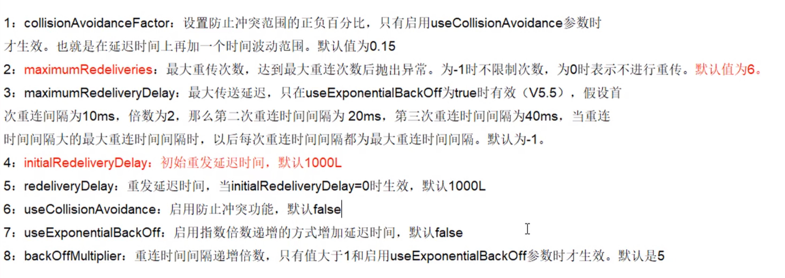

## 引入消息队列之后该如何保证其高可用性

* 持久性
* 签收
* 事务
* 集群


## 异步投递Async Sends  --  针对生产端

> 这里的异步投递指的是 生产者产生的消息以何种方式发送到 MQ服务器中.

### 同步发送

* **ActiveMQ官方说异步发送是很多模式下默认的传输方式**，<font color=ff00aa size=4>除非**明确指定使用同步发送的方式**或者在**未使用事务的前提下发送持久化的消息**，这两种情况都是同步发送的。</font>同步发送时，Producer.send() 方法会被阻塞，直到 broker 发送一个确认消息给生产者，这个确认消息暗示生产者 broker 已经成功地将它发送的消息路由到目标目的并把消息保存到二级存储中。

* 同步发送持久消息能够提供更好的可靠性，但这潜在地**影响了程序的响应速度**，因为在接受到 broker 的确认消息之前应用程序或线程会被阻塞。如果应用程序能够容忍一些消息的丢失，那么可以使用异步发送。异步发送不会在受到 broker 的确认之前一直阻塞 Producer.send 方法。
	

### 异步发送

* 使用不同的模式对send 方法的反应时间有巨大的影响，反映时间是衡量ActiveMQ 吞吐量的重要因素，使用异步发送可以提高系统的性能。
* 在默认大多数情况下，AcitveMQ 是以异步模式发送消息。例外的情况：在没有使用事务的情况下，生产者以PERSISTENT 传送模式发送消息。在这种情况下，send 方法都是同步的，并且一直阻塞直到ActiveMQ 发回确认消息：消息已经存储在持久性数据存储中。这种确认机制保证消息不会丢失，但会造成生产者阻塞从而影响反应时间。
* 高性能的程序一般都能容忍在故障情况下丢失少量数据。如果编写这样的程序，可以通过使用异步发送来提高吞吐量（甚至在使用PERSISTENT 传送模式的情况下）。

### 设置异步发送

 


### 如果解决异步发送消息丢失问题?

> **使用异步发送+方法回调**
>
> 生产者设置UseAsyncSend=true，使用producer.send(msg)持续发送消息。由于消息不阻塞，生产者会认为所有send的消息均被成功发送至MQ。如果服务端突然宕机，此时生产者端内存中尚未被发送至MQ的消息都会丢失。正确的异步发送方法是需要接收回调的。
>
> producer.send有带上AsyncCallback的方法。该方法中需要重写onSuccess方法和onException方法。onSuccess方法就是表示这条消息成功发送到MQ上，并接收到了MQ持久化后的回调。onException表示MQ返回一个入队异常的回执。在上面的示例中用的是CountDownLatch类在onSuccess中记录。主要是因为onSuccess方法中只能引用final对象。

```java
import org.apache.activemq.ActiveMQConnectionFactory;
import org.apache.activemq.ActiveMQMessageProducer;
import org.apache.activemq.AsyncCallback;
 
import javax.jms.*;
import java.util.UUID;
 
public class JmsProduce_AsyncSend {
 
    private static final String ACTIVEMQ_URL = "tcp://127.0.0.1:61616";
    private static final String QUEUE_NAME = "queue-123";
    
    public static void main(String[] args) throws JMSException {
 
        ActiveMQConnectionFactory activeMQConnectionFactory = new ActiveMQConnectionFactory(ACTIVEMQ_URL);
        Connection connection = activeMQConnectionFactory.createConnection();
        connection.start();
 
        Session session = connection.createSession(false,Session.AUTO_ACKNOWLEDGE);
        Queue queue = session.createQueue(QUEUE_NAME);
        ActiveMQMessageProducer activeMQMessageProducer = (ActiveMQMessageProducer) session.createProducer(queue);
 
        TextMessage textMessage = null;
 
        for (int i = 0; i < 15; i++) {
            textMessage = session.createTextMessage("msg---" + i);
            textMessage.setJMSMessageID(UUID.randomUUID().toString()+"queue");
            String magid = textMessage.getJMSMessageID();
            activeMQMessageProducer.send(textMessage, new AsyncCallback() {
                @Override
                public void onSuccess() {
                    System.out.println(magid + "发送成功");
                }
 
                @Override
                public void onException(JMSException exception) {
                    System.out.println(magid + "发送失败");
                }
            });
        }
 
        activeMQMessageProducer.close();
        session.close();
        connection.close();
        System.out.println("发送结束！");      
    }
}
```

- step1：数据落库，这一步是必须的
- step2：把消息落库，且初始化其状态为 0 （发送中）
- step3：把消息投递到 Broker 中
- step4：Broker 发送成功应答（异步回调）
- step5：生产者拿到成功应答，修改消息状态为1:（发送成功） 上面讲述的都是正常的流程，下面讲讲如果出现不正常的解决机制：
- step6：定时检查消息的状态是否为1
- step7：如果 step6 的消息的状态仍然为 0 ，则进入重发，重复上述 step1 - step5
- step8：如果消息重发达到一定的的次数，则人工接入处理，因为此时说明可能是消息

> 上述的方案看似完美无缺，但是细想，如果在 step4 中 Broker 发送应答的过程中，网络出现问题这个消息没有到达生产者会导致整个流程进入补偿的流程当中，此时 Broker 中就有两条消息，也就是发成了重复的投递的问题，所以接下来我们要在消费端来处理这个问题。


## 延时投递和定时投递  --  针对生产端

> 类似于 第五章-SpringBoot整合中 定时发送消息以及手动触发发送消息。默认ActiveMQ中是不开启延时投递和定时投递

### 开启延时投递和定时投递

1. 在activemq.xml中配置schedulerSupport属性为true

	

2. 生产者代码中进行延时投递，和消费者没关

	

	

	> 延时3s进行发送，重复发送5次，每次时间间隔4S

	

## ActiveMQ消息重试机制  --  针对消费端

### 具体哪些情况会引发消息重发

1：Client用了transactions且再session中调用了rollback

2：Client用了transactions且再调用commit之前关闭或者没有commit

3：Client再CLIENT_ACKNOWLEDGE的传递模式下，session中调用了recover

### 消息重发时间间隔和重发次数

间隔：1

次数：6

即第一次发送失败后再发6次，共七次，并且第六次仍然发送失败则该消息会进入死信队列，不会再发送

### 有毒消息Poison ACK

一个消息被redelivedred超过默认的最大重发次数（默认6次）时，消费的回个MQ发一个“poison ack”表示这个消息有毒，告诉broker不要再发了。这个时候broker会把这个消息放到DLQ（死信队列）。


### 触发消息进入死信队列

1. 消费端 使用事务 但是没有进行commit
2. 生产端生产数据后，消费端启动，消费一次，再次启动并消费，循环六次
3. 消费端第七次启动消费时消费并没有被消费，而是进入了死信队列，在web端 可以查看，如下：


### 重新设置重发策略



消费端进行【触发消息进入死信队列】测试


### SpringBoot下修改重发策略


## 死信队列 ：处理失败的消息

> 异常消息规避处理的集合，主要处理失败的消息。


### 死信队列的配置

1. sharedDeadLetterStrateg(默认策略-共享策略)

​		不管是queue还是topic，失败的消息都放到这个队列中。下面修改activemq.xml的配置，可以达到**修改队列的名字**。

​		


2. ndividualDeadLetterStrategy(单独配置策略)

​		可以为queue和topic单独指定两个死信队列。还可以为某个话题，单独指定一个死信队列。

​		


3. 配置案例：配置单独死信队列 > 


### 死信队列数据满了如何处理

1. 自动删除过期消息

	

2. 只存放非持久消息到死信队列中

	


## 如何保证消息不被重复消费，幂等性问题

* 如果消息是做数据库的插入操作，给这个消息做一个唯一的主键，就算出现重复消费，主键冲突，避免数据库出现脏数据
* 使用第三方Redis做消费记录，给消息分配一个分布式全局ID（使用Redis或者第三方库都可），只要消费过该记录则存入Redis，并且在消费者消费消息前先查Redis中是否有该记录