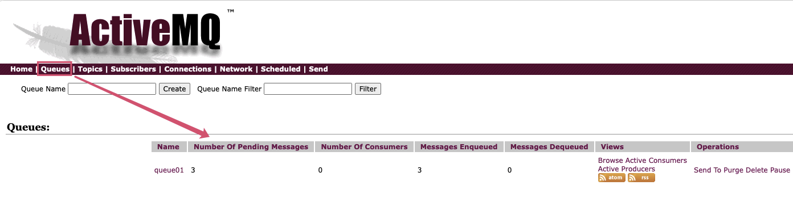
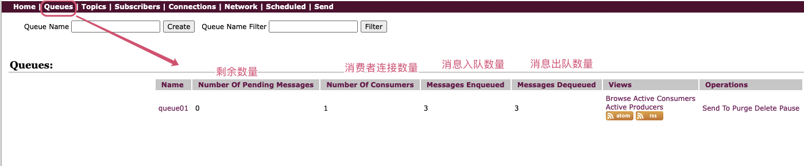
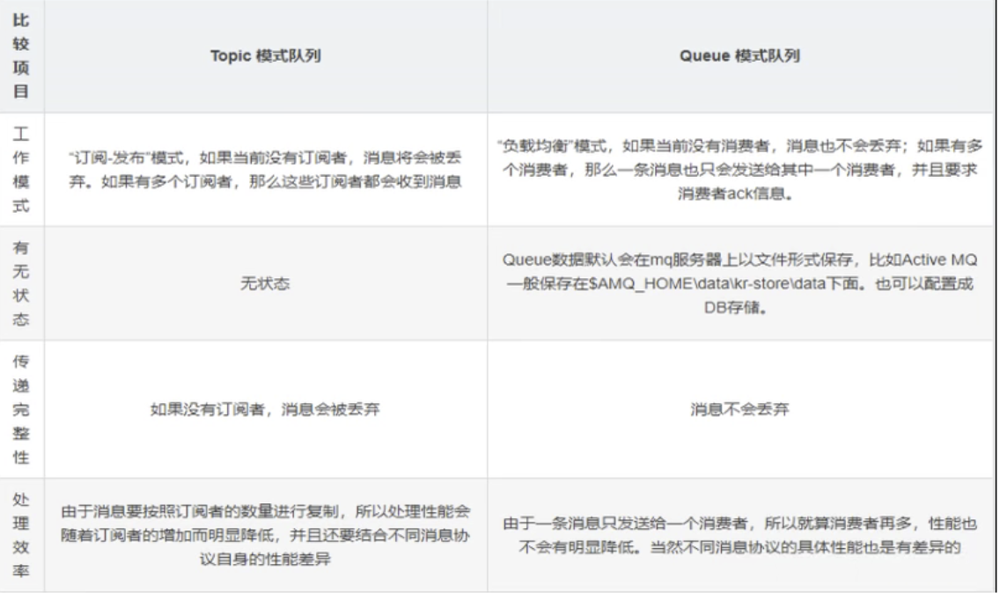

## 通讯方式

* 队列模式

	即点对点进行通讯，消息使用队列进行承载，私聊

* 主题模式

	即发布订阅模式，一对多进行消息传递，群聊


## 队列模式


### 1、生产者

```java
public class Produce {
    private static final String ACTIVEMQ_URL = "tcp://192.168.31.99:61616";
    private static final String QUEUE_NAME = "queue01";

    public static void main(String[] args) throws Exception {
        //1.创建连接工厂，按照给定的URL，采用默认的用户名密码
        ActiveMQConnectionFactory activeMQConnectionFactory = new ActiveMQConnectionFactory(ACTIVEMQ_URL);
        //2.通过连接工厂,获得connection并启动访问
        Connection connection = activeMQConnectionFactory.createConnection();
        connection.start();
        //3.创建会话session
        //两个参数transacted=事务,acknowledgeMode=确认模式(签收)
        Session session = connection.createSession(false, Session.AUTO_ACKNOWLEDGE);
        //4.创建目的地(具体是队列queue还是主题topic)
        Queue queue = session.createQueue(QUEUE_NAME);
        //5.创建消息的生产者
        MessageProducer messageProducer = session.createProducer(queue);
        //6.通过使用消息生产者,生产三条消息,发送到MQ的队列里面
        for (int i = 0; i < 3; i++) {
            //7.创建消息
            TextMessage textMessage = session.createTextMessage("msg---hello" + i);//理解为一个字符串
            //8.通过messageProducer发送给MQ队列
            messageProducer.send(textMessage);
        }
        //9.关闭资源
        messageProducer.close();
        session.close();
        System.out.println("****消息发布到MQ队列完成");
    }
}
```



> 生产者生产了三个消息后，目前队列中3条消息一直没有消费，因为没有消费者。


### 2.1、消费者 - 轮询

```java
public class Consume {
    private static final String ACTIVEMQ_URL = "tcp://192.168.31.99:61616";
    private static final String QUEUE_NAME = "queue01";
    public static void main(String[] args) throws JMSException {
        //1.创建连接工厂，按照给定的URL，采用默认的用户名密码
        ActiveMQConnectionFactory activeMQConnectionFactory = new ActiveMQConnectionFactory(ACTIVEMQ_URL);
        //2.通过连接工厂,获得connection并启动访问
        Connection connection = activeMQConnectionFactory.createConnection();
        connection.start();
        //3.创建会话session
        //两个参数transacted=事务,acknowledgeMode=确认模式(签收)
        Session session = connection.createSession(false, Session.AUTO_ACKNOWLEDGE);
        //4.创建目的地(具体是队列queue还是主题topic)
        Queue queue = session.createQueue(QUEUE_NAME);
        //5.创建消息的消费者,指定消费哪一个队列里面的消息
        MessageConsumer messageConsumer = session.createConsumer(queue);
        //循环获取
        while (true) {
            //6.通过消费者调用方法获取队列里面的消息(发送的消息是什么类型,接收的时候就强转成什么类型)
           //阻塞式等待
            TextMessage textMessage = (TextMessage) messageConsumer.receive();
           //超时等待 - 超时后连接会断开
            TextMessage textMessageTimeout = (TextMessage) messageConsumer.receive(5000L);
            if (textMessage != null) {
                System.out.println("****消费者接收到的消息:  " + textMessage.getText());
            } else {
                break;
            }
        }
        //7.关闭资源
        messageConsumer.close();
        session.close();
        connection.close();
    }
}
```




### 2.2、消费者 - 监听消费

```java
public class Consume {
    private static final String ACTIVEMQ_URL = "tcp://192.168.31.99:61616";
    private static final String QUEUE_NAME = "queue01";
    public static void main(String[] args) throws JMSException {
       //1.创建连接工厂，按照给定的URL，采用默认的用户名密码
        ActiveMQConnectionFactory activeMQConnectionFactory = new ActiveMQConnectionFactory(ACTIVEMQ_URL);
        //2.通过连接工厂,获得connection并启动访问
        Connection connection = activeMQConnectionFactory.createConnection();
        connection.start();
        //3.创建会话session
        //两个参数transacted=事务,acknowledgeMode=确认模式(签收)
        Session session = connection.createSession(false, Session.AUTO_ACKNOWLEDGE);
        //4.创建目的地(具体是队列queue还是主题topic)
        Queue queue = session.createQueue(QUEUE_NAME);
        //5.创建消息的消费者,指定消费哪一个队列里面的消息
        MessageConsumer messageConsumer = session.createConsumer(queue);
        //6.通过监听的方式消费消息
        /*
        异步非阻塞式方式监听器(onMessage)
        订阅者或消费者通过创建的消费者对象,给消费者注册消息监听器setMessageListener,
        当消息有消息的时候,系统会自动调用MessageListener类的onMessage方法
        我们只需要在onMessage方法内判断消息类型即可获取消息
         */
        messageConsumer.setMessageListener(new MessageListener() {
            @Override
            public void onMessage(Message message) {
                if (message != null && message instanceof TextMessage) {
                    //7.把message转换成消息发送前的类型并获取消息内容
                    TextMessage textMessage = (TextMessage) message;
                    try {
                        System.out.println("****消费者接收到的消息:  " + textMessage.getText());
                    } catch (JMSException e) {
                        e.printStackTrace();
                    }
                }
            }
        });
        System.out.println("执行了39行");
        //防止Java程序[web不用考虑]运行后关闭,因为监听器是异步线程，并不是主线程，主线程运行完后会关闭，导致没有消费
        System.in.read();
        //关闭资源
        messageConsumer.close();
        session.close();
        connection.close();
    }
}
```


### 队列模式中 消费三种案例

> 背景：有两个消费者，一个生产者

1. 【生产者】先生产3条数据，再启动【消费者1号】，那么【消费者1号】3条数据全部消费完毕

2. 【生产者】先生产3条数据，再启动【消费者1号】然后启动【消费者2号】，两个消费者消费情况？

	* 1号消费者在2号消费者启动前已经消费完毕

		先到先消费，2号消费者没机会消费

	* 1号消费者在2号消费者启动后仍然没有消费完毕

		先到先消费，全部由1号消费者消费，2号消费者没有机会消费

3. 先启动【两个消费者】，再生产6条数据，消费情况？

	并不是先到先得，而是轮询消费。即先给1再给2然后轮流着投食


## 主题模式

### 1、特点

* 生产者将消息发布到topic中，每个消息可以有多个消费者，属于1：N的关系；
* 生产者和消费者之间有时间上的相关性。<font color=ff00aa>订阅某一个主题的消费者只能消费自它订阅之后发布的消息。</font>
* <font color=ff00aa>生产者生产时，topic不保存消息它是无状态的不落地，假如无人订阅就去生产，那就是一条废消息，所以，一般先启动消费者再启动生产者。</font>
* 允许持久订阅，类似于微信的公众号


### 2、生产者

```java
public class Produce {
    private static final String ACTIVEMQ_URL = "tcp://192.168.31.99:61616";
    private static final String TOPIC_NAME = "topic频道";

    public static void main(String[] args) throws Exception {
        //1.创建连接工厂，按照给定的URL，采用默认的用户名密码
        ActiveMQConnectionFactory activeMQConnectionFactory = new ActiveMQConnectionFactory(ACTIVEMQ_URL);
        //2.通过连接工厂,获得connection并启动访问
        Connection connection = activeMQConnectionFactory.createConnection();
        connection.start();
        //3.创建会话session
        //两个参数transacted=事务,acknowledgeMode=确认模式(签收)
        Session session = connection.createSession(false, Session.AUTO_ACKNOWLEDGE);
        //4.创建目的地(具体是队列queue还是主题topic)
        Topic topic = session.createTopic(TOPIC_NAME);
        //5.创建消息的生产者
        MessageProducer messageProducer = session.createProducer(topic);
        //6.通过使用消息生产者,生产三条消息,发送到MQ的队列里面
        for (int i = 0; i < 5; i++) {
            //7.创建消息
            TextMessage textMessage = session.createTextMessage("msg---hello" + i);//理解为一个字符串
            //8.通过messageProducer发送给MQ队列
            messageProducer.send(textMessage);
        }
        //9.关闭资源
        messageProducer.close();
        session.close();
        System.out.println("****消息发布到MQ主题完成");
    }
}
```


### 3、消费者

```java
public class Consume {
    private static final String ACTIVEMQ_URL = "tcp://192.168.31.99:61616";
    private static final String TOPIC_NAME = "topic频道";


    // TODO: 2021/11/26 消费者第二种方式 - 消费方监听
    public static void main(String[] args) throws JMSException, IOException {
        //1.创建连接工厂，按照给定的URL，采用默认的用户名密码
        ActiveMQConnectionFactory activeMQConnectionFactory = new ActiveMQConnectionFactory(ACTIVEMQ_URL);
        //2.通过连接工厂,获得connection并启动访问
        Connection connection = activeMQConnectionFactory.createConnection();
        connection.start();
        //3.创建会话session
        //两个参数transacted=事务,acknowledgeMode=确认模式(签收)
        Session session = connection.createSession(false, Session.AUTO_ACKNOWLEDGE);
        //4.创建目的地(具体是队列queue还是主题topic)
        Topic topic = session.createTopic(TOPIC_NAME);
        //5.创建消息的消费者,指定消费哪一个队列里面的消息
        MessageConsumer messageConsumer = session.createConsumer(topic);
        //6.通过监听的方式消费消息
        /*
        异步非阻塞式方式监听器(onMessage)
        订阅者或消费者通过创建的消费者对象,给消费者注册消息监听器setMessageListener,
        当消息有消息的时候,系统会自动调用MessageListener类的onMessage方法
        我们只需要在onMessage方法内判断消息类型即可获取消息
         */
        messageConsumer.setMessageListener(new MessageListener() {
            @SneakyThrows
            @Override
            public void onMessage(Message message) {
                if (message != null && message instanceof TextMessage) {
                    //7.把message转换成消息发送前的类型并获取消息内容
                    TextMessage textMessage = (TextMessage) message;
                    try {
                        System.out.println("****消费者接收到的消息:  " + textMessage.getText());
                    } catch (JMSException e) {
                        e.printStackTrace();
                    }
                    System.out.println("消费者1号消费---");
                }
            }
        });
        //防止Java程序[web不用考虑]运行后关闭,因为监听器是异步线程，并不是主线程，主线程运行完后会关闭，导致没有消费
        System.in.read();
        //关闭资源
        messageConsumer.close();
        session.close();
        connection.close();
    }
}
```


> 1. 先启动消费者再启动生产者，否则会产生废消息
> 2. 谁订阅谁消费，且只能消费订阅后的消息


## Queue模式和Topic模式区别

 