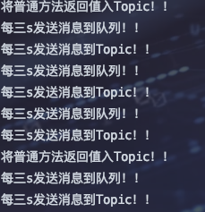

## 整合

> 针对于Queue模式，是可以将生产者和消费者放到一个模块的，但是Topic模式得先启动消费者再启动生产者，因此最好区分生产者和消费者模块
>
> 代码：https://gitee.com/gadeGG/ProjectCode/tree/master/SpringBootLearn/SpringBoot-Activemq-Product

### 1、生产者模块

1. pom.xml

	```xml
	<dependency>
	  <groupId>org.springframework.boot</groupId>
	  <artifactId>spring-boot-starter-activemq</artifactId>
	</dependency>
	```

2. yml

	```yaml
	server:
	  port: 8888
	  servlet:
	    context-path: /activemq
	
	spring:
	  activemq:
	    broker-url: tcp://192.168.31.99:61616
	    user: admin
	    password: admin
	
	  jms:
	    pub-sub-domain: true   #默认false 即队列
	
	queueName: boot-activemq-queue    #自定义队列名称
	topicName: boot-activemq-topic
	
	```

3. config

	```java
	@Configuration
	public class ActiveMQConfig {
	    @Value("${queueName}")
	    private String queueName;
	
	    @Value("${topicName}")
	    private String topicName;
	
	    @Value("${spring.activemq.user}")
	    private String usrName;
	
	    @Value("${spring.activemq.password}")
	    private  String password;
	
	    @Value("${spring.activemq.broker-url}")
	    private  String brokerUrl;
	
	    @Bean
	    public Queue queue(){
	        return new ActiveMQQueue(queueName);
	    }
	
	    @Bean
	    public Topic topic(){
	        return new ActiveMQTopic(topicName);
	    }
	
	    @Bean
	    public ActiveMQConnectionFactory connectionFactory() {
	        return new ActiveMQConnectionFactory(usrName, password, brokerUrl);
	    }
	
	    @Bean
	    public JmsListenerContainerFactory<?> jmsListenerContainerQueue(ActiveMQConnectionFactory connectionFactory){
	        DefaultJmsListenerContainerFactory bean = new DefaultJmsListenerContainerFactory();
	        bean.setConnectionFactory(connectionFactory);
	        return bean;
	    }
	
	    @Bean
	    public JmsListenerContainerFactory<?> jmsListenerContainerTopic(ActiveMQConnectionFactory connectionFactory){
	        DefaultJmsListenerContainerFactory bean = new DefaultJmsListenerContainerFactory();
	        //设置为发布订阅方式, 默认情况下使用的生产消费者方式
	        bean.setPubSubDomain(true);
	        bean.setConnectionFactory(connectionFactory);
	        return bean;
	    }
	}
	```

4. controller

	```java
	@RestController
	public class ProductController {
	    @Autowired
	    private JmsMessagingTemplate jms;
	
	    @Autowired
	    private Queue queue;
	
	    @Autowired
	    private Topic topic;
	
	    // TODO: 2021/11/27 手动触发消息入队
	    @GetMapping("/queue")
	    public String queue(){
	
	        for (int i = 0; i < 10 ; i++){
	            jms.convertAndSend(queue, "queue"+i);
	        }
	
	        return "queue 发送成功";
	    }
	
	    // TODO: 2021/11/27 定时触发消息入队
	    @Scheduled(fixedDelay = 3000)
	    public void productMsgScheduledQueue(){
	        jms.convertAndSend(queue,"Scheduled-Queue: "+ UUID.randomUUID().toString().substring(0,6));
	        System.out.println("每三s发送消息到队列！！");
	    }
	
	    // TODO: 2021/11/27 将普通方法返回值入队|入topic
	    @PostMapping("/sendToQueue")
	    @SendTo("${queueName}")//SendTo 会将此方法返回的数据, 写入到 queue : out.queue 中去.
	    public String sendToQueue(@RequestBody String msg){
	        System.out.println("将普通方法返回值入队！！");
	        return msg;
	    }
	
	    // TODO: 2021/11/27 手动触发入Topic
	    @GetMapping("/topic")
	    public String topic(){
	
	        for (int i = 0; i < 10 ; i++){
	            jms.convertAndSend(topic, "topic"+i);
	        }
	
	        return "topic 发送成功";
	    }
	    // TODO: 2021/11/27 定时触发消息入Topic
	    @Scheduled(fixedDelay = 3000)
	    public void productMsgScheduledTopic(){
	        jms.convertAndSend(topic,"Scheduled-Topic: "+ UUID.randomUUID().toString().substring(0,6));
	        System.out.println("每三s发送消息到Topic！！");
	    }
	
	    // TODO: 2021/11/27 将普通方法返回值入队|入topic
	    @SendTo("${queueName}")//SendTo 会将此方法返回的数据, 写入到 queue : out.queue 中去.
	    @PostMapping("/sendToTopic")
	    public String sendToTopic(@RequestBody String msg){
	        System.out.println("将普通方法返回值入Topic！！");
	        return msg;
	    }
	}
	```

	

5. <font color=ff00aa>新增一个定时发送消息到Queue功能</font>

	```java
	@Scheduled(fixedDelay = 3000)
	public void productMsgScheduled(){
	  jms.convertAndSend(queue,"Scheduled-Queue: "+ UUID.randomUUID().toString().substring(0,6));
	  System.out.println("每三s发送消息到队列！！");
	}
	//主启动类开启定时功能
	@EnableScheduling
	```

6. <font color=ff00aa>新增一个将普通方法的返回值发送到Queue|Topic</font>

	```java
	    // TODO: 2021/11/27 将普通方法返回值入队|入topic
	    @SendTo("${queueName}")//SendTo 会将此方法返回的数据, 写入到 queue : out.queue 中去.
	    @PostMapping("/sendToTopic")
	    public String sendToTopic(@RequestBody String msg){
	        System.out.println("将普通方法返回值入Topic！！");
	        return msg;
	    }
	```

	

> <font color=ff00aa size=5>生产者的应用场景：不外乎手动触发，和自动定时</font>


### 2、消费者模块

> 代码：https://gitee.com/gadeGG/ProjectCode/tree/master/SpringBootLearn/SpringBoot-Activemq-Customer

1. pom.xml

	```xml
	<dependency>
	  <groupId>org.springframework.boot</groupId>
	  <artifactId>spring-boot-starter-activemq</artifactId>
	</dependency>
	```

2. yml

	```yaml
	server:
	  port: 9999
	  servlet:
	    context-path: /activemq
	
	spring:
	  activemq:
	    broker-url: tcp://192.168.31.99:61616
	    user: admin
	    password: admin
	
	  jms:
	    pub-sub-domain: true   #默认false 即队列
	
	queueName: boot-activemq-queue    #自定义队列名称
	topicName: boot-activemq-topic
	
	```

3. config

	如上

4. listener

	```java
	@Component
	public class QueueListener {
	    // TODO: 2021/11/27 有两种方式消费，一种是receive()，一种是监听
	    // TODO: 2021/11/27 监听 ${queueName}
	    @SneakyThrows
	    @JmsListener(destination = "${queueName}", containerFactory = "jmsListenerContainerQueue")
	    @SendTo("out.queue")//SendTo 会将此方法返回的数据, 写入到 queue : out.queue 中去.
	    public String receive(TextMessage text){
	        System.out.println("QueueListener: consumer-a 收到一条信息: " + text.getText());
	        return "consumer-a received : " + text.getText();
	    }
	}
	
	@Component
	public class TopicListener {
	
	    @SneakyThrows
	    @JmsListener(destination = "${topicName}", containerFactory = "jmsListenerContainerTopic")
	    public void receive(TextMessage message){
	        System.out.println("TopicListener: consumer-a 收到一条信息: " + message.getText());
	    }
	}
	```

	


