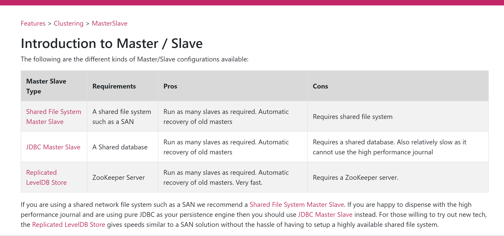

## 集群搭建

基于zookeeper和LevelDB搭建ActiveMQ集群。集群仅提供主备方式的高可用集群功能，避免单点故障。


## 搭建方式

* 基于shareFileSystem共享文件系统（KahaDB）
* 基于JDBC
* 基于可复制的LevelDB



>LevelDB，5.6版本之后推出了LevelDB的持久化引擎，它使用了自定义的索引代替常用的BTree索引，其持久化性能高于KahaDB，虽然默认的持久化方式还是KahaDB，但是LevelDB可能会是趋势。
>
>在5.9版本还提供了基于LevelDB和Zookeeper的数据复制方式，作为Master-Slave方式的首选数据复制方案。


## 实战（LevelDB+Zookeeper）未开工

> 使用Zookeeper集群注册所有的ActiveMQ Broker`但只有其中一个Broker可以提供服务`，它将被视为Master,其他的Broker处于待机状态被视为Slave。
>
> 如果Master因故障而不能提供服务，Zookeeper会从Slave中选举出一个Broker充当Master。Slave连接Master并同步他们的存储状态，Slave不接受客户端连接。所有的存储操作都将被复制到连接至Maste的Slaves。
>
> 如果Master宕机得到了最新更新的Slave会变成Master。故障节点在恢复后会重新加入到集群中并连接Master进入Slave模式。
>
> 所有需要同步的消息操作都将等待存储状态被复制到其他法定节点的操作完成才能完成。
>
> 所以，如给你配置了replicas=3，name法定大小是（3/2）+1 = 2。Master将会存储更新然后等待（2-1）=1个Slave存储和更新完成，才汇报success，至于为什么是2-1，参考哔哩哔哩周阳zookeeper视频。
>
> 有一个ode要作为观察者存在。当一个新的Master被选中，你需要至少保障一个法定mode在线以能够找到拥有最新状态的ode，这个ode才可以成为新的Master。因此，推荐运行至少3个replica nodes以防止一个node失败后服务中断。

1. zookeeper 集群搭建
2. activemq集群搭建


* 查看ActiveMQ 主节点信息

	```bash
	lsof -i 8161 
	```

	