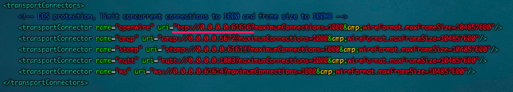
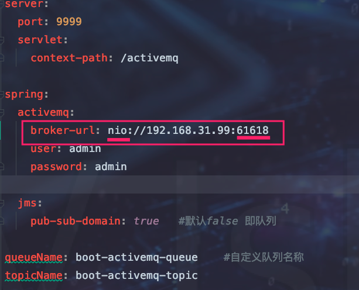
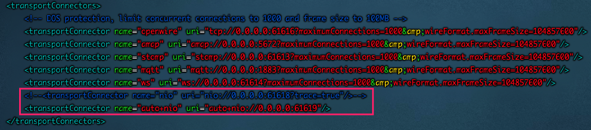
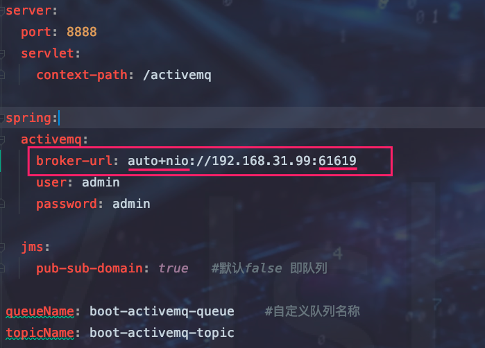

## 传输协议

ActiveMQ出厂带了很多协议，默认为TCP+BIO模式。当然也可以修改为性能更加出众的TCP+NIO模式。

**配置文件 ：** config/activemq.xml

**默认支持协议 ：**



> 一般我们只需要关注 TCP 和 NIO 即可


## 修改为 TCP+NIO模式

1. 在如上配置文件中添加如下代码

	```xml
	<transportConnector name="nio" uri="nio://0.0.0.0:61618?trace=true"/>
	```

2. 修改生产者消费者模块ActiveMQ URL 

	


## NIO 增强

> 上面在TCP+BIO的基础上修改为NIO，性能已经达到了极限，这里的增强指的是使用NIO网路模型且适配不同的协议，即自适应

1. 修改 config/activemq.xml文件

	```xml
	<transportConnector name="auto+nio" uri="auto+nio://localhost:5671"/>
	```

	


2. 修改项目 RUL

	