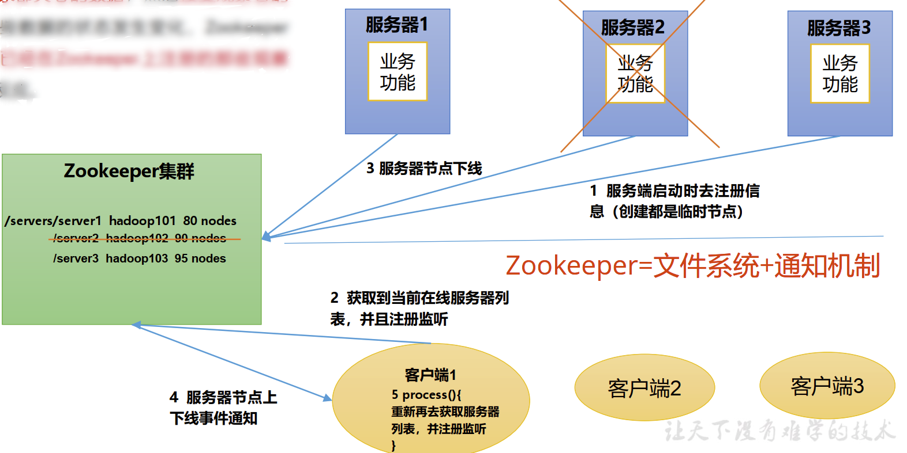

## 概念

Zookeeper从设计模式角度来理解：是一个基于观察者模式设计的分布式服务管理框架， 它负责存储和管理大家都关心的数据， 然后接受观察者的注册， 一旦这些数据的状态发生变化， Zookeeper就将负责通知已经在Zookeeper上注册的那些观察者做出相应的反应。




## 特点


1. Zookeeper：一个领导者（ Leader） ， 多个跟随者（ Follower） 组成的集群。
2. 集群中只要有**半数以上**节点存活， Zookeeper集群就能正常服务。 所以Zookeeper适合安装奇数台服务器。
3. 全局数据一致：每个Server保存一份相同的数据副本， Client无论连接到哪个Server， 数据都是一致的。
4. 更新请求顺序执行， 来自同一个Client的更新请求按其发送顺序依次执行。
5. 数据更新原子性， 一次数据更新要么成功， 要么失败。
6. 实时性， 在一定时间范围内， Client能读到最新数据。


## 数据结构


> zookeeper 数据结构和Unix以及HDFS类似，但是后两者适用于存储大量的数据，而zookeeper适用于存储少量的配置信息

## 应用场景

提供的服务包括：统一命名服务、统一配置管理、统一集群管理、服务器节点动态上下线、软负载均衡等。


### 统一命名服务

在分布式环境下， 经常需要对应用/服务进行统一命名， 便于识别。例如： IP不容易记住， 而域名容易记住。


### 统一配置管理

* 分布式环境下， 配置文件同步非常常见。

	一般要求一个集群中， 所有节点的配置信息是一致的， 比如 Kafka 集群。对配置文件修改后， 希望能够快速同步到各个
	节点上

* 配置管理可交由ZooKeeper实现。

	1. 可将配置信息写入ZooKeeper上的一个Znode

	2. 各个客户端服务器监听这个Znode。
	3. 一旦Znode中的数据被修改， ZooKeeper将通知各个客户端服务器。


### 统一集群管理

* 分布式环境中， 实时掌握每个节点的状态是必要的。
	可根据节点实时状态做出一些调整。
* ZooKeeper可以实现实时监控节点状态变化
	1. 可将节点信息写入ZooKeeper上的一个ZNode。
	2. 监听这个ZNode可获取它的实时状态变化。


### 服务器节点动态上下线


### 软负载均衡

在Zookeeper中记录每台服务器的访问数， 让访问数最少的服务器去处理最新的客户端请求


## 本地安装

1. 准备三台服务器，互通，与物理机通，与外网通
2. 将zookeeper-bin.tar.gz拷贝到三台服务器 /opt目录
3. tar -zxvf xxxxx
4. 创建存放zookeeper 数据的目录，习惯放在根目录/data
5. Conf/zoo_sample.cfg 为zookeeper配置文件，打开并更改其中的dataDir为刚刚创建的data路径,并修改配置文件名称为zoo.cfg，否则启动报错


### 命令

```bash
#服务端
./zkServer.sh start
./zkServer.sh status
./zkServer.sh stop
./zkServer.sh restart
./zkServer.sh start-foreground  # 启动zookeeper时查看日志
#详细日志在zookeeper的安装目录下的bin文件中的zookeeper.out的详细内容
#客户端
bin/zkCli.sh
quit
bin/zkCli.sh stop
```


### 配置文件中五大参数

* tickTime = 2000  通信心跳时间，ZooKeeper服务器和客户端心跳时间，单位毫秒
* initLimit = 10:LF 初始化通信时限，Leader和Follower**初始连接**时能容忍的最多心跳数,即10个心跳数，共10*2000=20s
* syncLimit = 5：LF同步通信时限 ，Leader和Follower通信时间超过5个心跳数则表示通信失败，从服务器列表删除Follower 
* dataDir  保存zookeeper的数据，默认是temp会被系统定期清除
* clientPort = 2181   客户端的连接端口，一般不需要修改
	