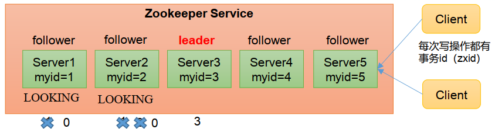
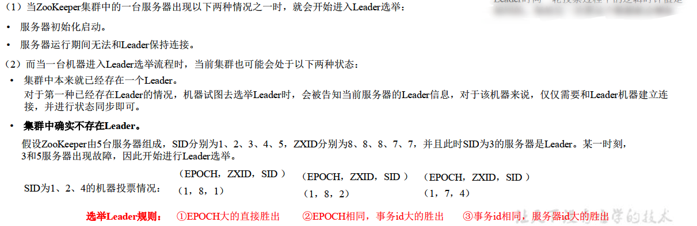
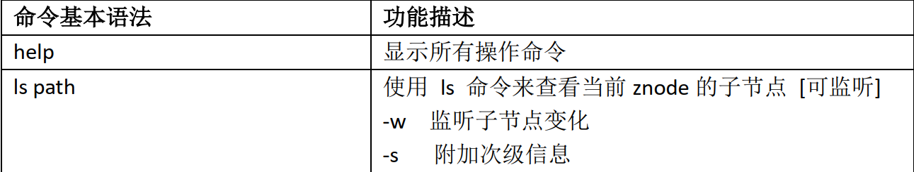
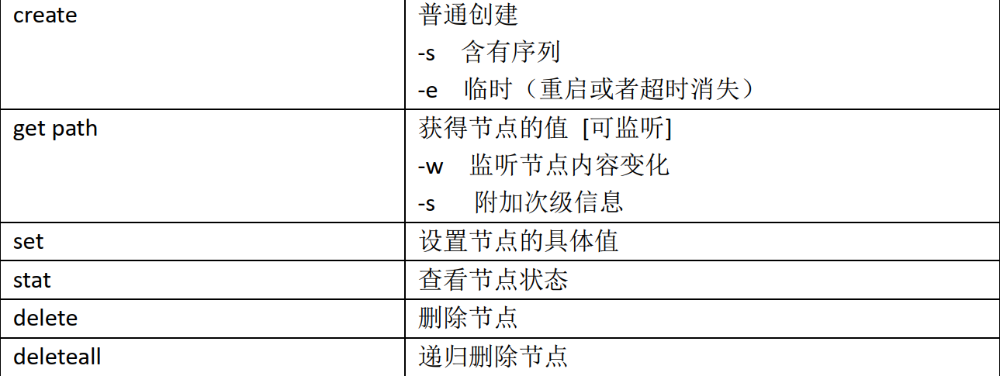

## 集群安装

> 环境 ：由于ZooKeeper最好用奇数服务器进行环境配置，这里使用三台服务器进行演示。

1. 按照前一章进行zookeeper安装

2. 在data目录下创建服务器编号myid文件(三个服务器)

	```bash
	vim myid   #自定义，但是上下左右不要有空行，我这里三台服务器IP依次为192.168.31.99、192.168.31.100、192.168.31.101。因此我这里三个服务器myid内容分别为99，100，101
	```

3. Zoo.cfg文件添加如下内容(三个服务器)

	```bash
	server.99=192.168.31.99:2888:3888
	server.100=192.168.31.100:2888:3888
	server.101=192.168.31.101:2888:3888
	```

	> 格式为 ： server.A=B:C:D
	>
	> A 是一个数字，标识第几号服务器，也就是我们第二步配置的myid文件中数字 ，作用是：**Zookeeper 启动时读取此文件，拿到里面的数据与 zoo.cfg 里面的配置信息比**
	>     **较从而判断到底是哪个 server**
	>
	> B 是这个服务器的地址，域名和iP都可
	>
	> C 是这个服务器 Follower 与集群中的 Leader 服务器交换信息的端口
	>
	> D 是万一集群中的 Leader 服务器挂了，需要一个端口来重新进行选举，选出一个新的Leader，而这个端口就是用来执行选举时服务器相互通信的端口


## 第一次启动 选举机制




**SID：** 服务器ID。 用来唯一标识一台ZooKeeper集群中的机器，每台机器不能重复， 和myid一致。
ZXID：事务ID。 ZXID是一个事务ID，用来标识一次服务器状态的变更。 在某一时刻，集群中的每台机器的ZXID值不一定完全一致，这和ZooKeeper服务器对于客户端“更新请求”的处理			逻辑有关。
**Epoch：** 每个Leader任期的代号。没有Leader时同一轮投票过程中的逻辑时钟值是相同的。每投完一次票这个数据就会增加


### 流程

1. 服务器1启动， 发起一次选举。 服务器1投自己一票。 此时服务器1票数一票， 不够半数以上（ 3票） ， 选举无法完成， 服务器1状态保持为
	LOOKING；
2. 服务器2启动， 再发起一次选举。 服务器1和2分别投自己一票并交换选票信息： **此时服务器1发现服务器2的myid比自己目前投票推举的（服务器1）**
	**大， 更改选票为推举服务器2**。 此时服务器1票数0票， 服务器2票数2票， 没有半数以上结果， 选举无法完成， 服务器1， 2状态保持LOOKING
3. 服务器3启动， 发起一次选举。 此时服务器1和2都会更改选票为服务器3。 此次投票结果：服务器1为0票， 服务器2为0票， 服务器3为3票。 此时服
	务器3的票数已经超过半数， 服务器3当选Leader。 服务器1， 2更改状态为FOLLOWING， 服务器3更改状态为LEADING
4. 服务器4启动， 发起一次选举。 **此时服务器1， 2， 3已经不是LOOKING状态， 不会更改选票信息。** 交换选票信息结果：服务器3为3票， 服务器4为
	1票。 此时服务器4服从多数， 更改选票信息为服务器3， 并更改状态为FOLLOWING；
5.  服务器5启动， 同4一样当小弟。


## 非第一次启动选举机制




## 客户端命令行操作



