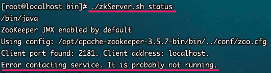
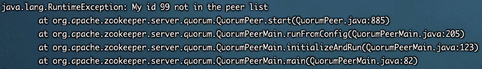

## 启动失败



1. 启动时查看日志

	```bash
	./zkServer.sh start-foreground
	```

	

2. 定位：myid设置时需要从1开始

3. 修改域名，不使用IP直接配置，如下：

	```bash
	server.1=zookeeper1:2888:3888
	server.2=zookeeper2:2888:3888
	server.3=zookeeper3:2888:3888
	```

4. 报错如下：

	```bash
	Cannot open channel to 3 at election address zookeeper3:3888  java.net.UnknownHostException: zookeeper3
	```

	