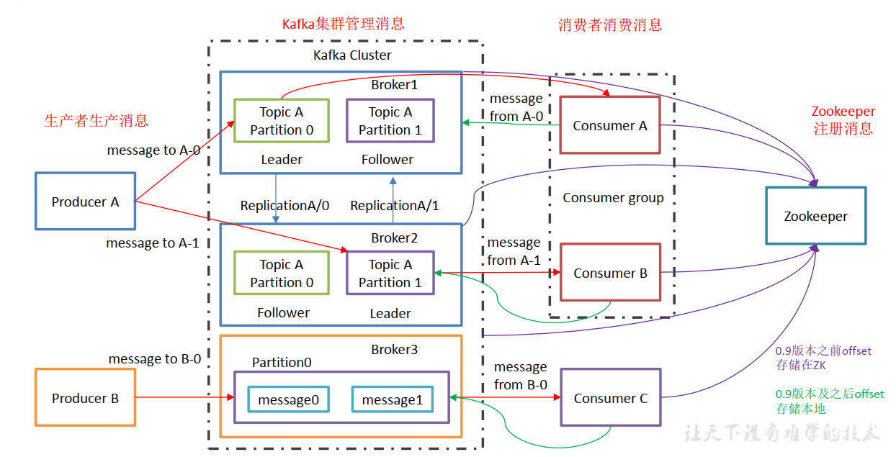
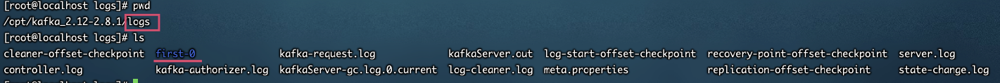

## 是什么

Kafka 是一个**分布式的基于发布/订阅模式**的**消息队列**（Message Queue） ， 主要应用于**大数据实时处理**领域。


## 作用

所有的MQ都类似。

* 解耦
* 肖锋
* 异步处理（缓存）


## 两种模式

* 点对点 （一对一，**消费者主动拉取数据，消息消费后消除**）
	* 消息生产者生产消息发送到Queue中， 然后消息消费者从Queue中取出并且消费消息。
	* 消息被消费以后， queue 中不再有存储，所以消息消费者不可能消费到已经被消费的消息。
	* Queue 支持存在多个消费者，**但是对一个消息而言，只会有一个消费者可以消费**。
* 发布/订阅模式（一对多，**消费者消费数据之后不会清除消息--但是默认磁盘7天**）
	* 消息生产者（发布）将消息发布到 topic 中，同时有多个消息消费者（订阅）消费该消息。和点对点方式不同，**发布到 topic 的消息会被所有订阅者消费**
	* <font color=ff00aa size=4>发布订阅模式中有两种处理方式。1、消费者主动拉取。2、Topic主动推送。而kafka是基于 发布/订阅模式中消费者主动拉取消费</font>


## kafka发布/订阅主动拉取 优缺点

优点：

* 当生产者发送消息和消费者消费消息速率不同步时就会有消息积压，由于kafka是消费者主动拉取的，可以自定义消费速度，一定程度解决了该问题。
* 烦得很


缺点：

* 性能消耗，长时间维护一个轮询


## kafka架构



> kafka集群和zookeeper集群一样，只要一个master节点其余都是follower，并且提供服务的只能是master，follower.
>
> 一个broker就是一个服务器带包一个kafka进程


## 使用

1. 下载tar文件并解压

2. 在kafka根目录下创建logs文件夹【logs并不是我们常理解的日志文件，在kafka中log代表的都是数据，即logs就是存放kafka数据的文件】

3. 修改配置文件/config/server.propereties

	```bash
	#broker 的全局唯一编号，不能重复，安装集群时特别注意，类似于zookeeper的myid
	broker.id=0
	#删除 topic 功能使能,如果不设置为 true则不能删除
	delete.topic.enable=true
	#处理网络请求的线程数量
	num.network.threads=3
	#用来处理磁盘 IO 的现成数量
	num.io.threads=8
	#发送套接字的缓冲区大小
	socket.send.buffer.bytes=102400
	#接收套接字的缓冲区大小
	socket.receive.buffer.bytes=102400
	#请求套接字的缓冲区大小
	socket.request.max.bytes=104857600
	#kafka 运行日志存放的路径
	log.dirs=/opt/module/kafka/logs
	#topic 在当前 broker 上的分区个数
	num.partitions=1
	#用来恢复和清理 data 下数据的线程数量
	num.recovery.threads.per.data.dir=1
	#segment 文件保留的最长时间，超时将被删除
	log.retention.hours=168
	#配置连接 Zookeeper 集群地址
	zookeeper.connect=hadoop102:2181,hadoop103:2181,hadoop104:2181
	```

4. 配置环境变量

	```bash
	sudo vim /etc/profile
	
	#KAFKA_HOME
	export KAFKA_HOME=/opt/kafka_2.12-2.8.1
	export PATH=$PATH:$KAFKA_HOME/bin
	source /etc/profile
	```

	

## 命令

```bash
# 启动（有日志）
kafka-server-start.sh ../config/server.properties 
# 守护进程启动（无日志）
kafka-server-start.sh -daemon ../config/server.properties

# 停止改为stop
```

### 操作topic命令

```bash
# 查看当前服务器中的所有 topic
bin/kafka-topics.sh --zookeeper zookeeper的IP地址:2181 --list
# 创建 topic
bin/kafka-topics.sh --zookeeper zookeeper的IP地址:2181 --create --replication-factor 3 --partitions 1 --topic first
	--topic 定义 topic 名
	--replication-factor 定义副本数 和集群数有关,不能超过集群数
	--partitions 定义分区数
# 删除 topic
bin/kafka-topics.sh --zookeeper zookeeper的IP地址:2181 --delete --topic first
# 发送消息
bin/kafka-console-producer.sh --broker-list kafka的IP地址:9092 --topic first
# 消费消息
bin/kafka-console-consumer.sh --zookeeper zookeeper的IP地址:2181 --topic first
./kafka-console-consumer.sh --bootstrap-server localhost:9092 --topic first (新版本使用这个)
# 查看某个 Topic 的详情
bin/kafka-topics.sh --zookeeper zookeeper的IP地址:2181 --describe --topic first
# 修改分区数
bin/kafka-topics.sh --zookeeper zookeeper的IP地址:2181 --alter --topic first --partitions 6
```


* kafka集群并没有配置集群相关信息，为何能够识别到主从呢？因为kafka使用了zookeeper集群的一套东西，只要zookeeper配置好集群就可以了

* 创建后的主题 是以【主题名-分区号】文件在磁盘进行存储在logs中的	

	

* 删除主题前必须设置server.propereties配置文件

	```bash
	delete.topic.enable=true
	```

* kafka 生产消费 命令行示例

	1. 生产数据

		```bash
		# 给 主题-first 生产消息
		./kafka-console-producer.sh --broker-list localhost:9092 --topic first
		```

		

		> 发送了三条消息，但是此时没有消费者在线，我们连上消费者，看数据是否能够在上线后正常消费

	2. 消费数据

		```bash
		bin/kafka-console-consumer.sh --zookeeper zookeeper的IP地址:2181 --topic first （新版本废弃）
		# 新版本移除了--zookeeper zookeeper的IP地址:2181 需要修改为 --bootstrap-server kafka地址:9092
		./kafka-console-consumer.sh --bootstrap-server localhost:9092 --topic first
		>>>> 这种消费模式 并不会消费启动之前产生的数据，只会消费 消费者启动后生产者生产的数据
		# 从开始的位置消费
		./kafka-console-consumer.sh --bootstrap-server localhost:9092 --from-beginning --topic first
		>>>> 这种消费模式 会消费之前生产者产生的数据
		# 消费的消息结果将打印出消息体的 key 和 value，并不会消费历史数据
		./kafka-console-consumer.sh --bootstrap-server localhost:9092 --property print.key=true --topic first
		```

		


