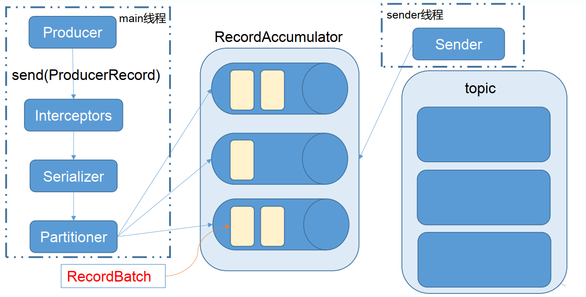

# kafka工作流程


> * **Kafka 中消息是以 topic 进行归类的**， 生产者生产消息，消费者消费消息，都是面向 topic的
>
> * 如上，kafka有三个broker ，表名三个服务器组成kafka集群。
> * kafka集群如何进行数据备份的？三个服务器，每个服务器中都有leader和follower，但是follower并不备份同一个服务器中leader的数据。如果备份了，这台服务器宕机，那么主从数据都丢失了。
> * **topic 是逻辑上的概念，而 partition(分区) 是物理上的概念**，在磁盘中存储格式为topic-分区号，**每个 partition 对应于一个 log 文件**，该 log 文件中存储的就是 producer 生产的数据。 Producer 生产的数据会被不断追加到该log 文件末端，且每条数据都有自己的 offset，**同一主题下的不同分区包含的消息是不同的**。 消费者组中的每个消费者， 都会实时记录自己消费到了哪个 offset，以便出错恢复时，从上次的位置继续消费。offset 是消息在分区中的唯一标识，Kafka 通过它来保证消息在分区内的顺序性，不过 offset 并不跨越分区，也就是说，**Kafka 保证的是分区有序而不是主题有序。**

* topic和分区
	* topic是逻辑上的概念，而 partition(分区) 是物理上的概念，分区是落在磁盘上的一个个log文件
	* 一个topic可以有多个分区，而一个分区只能属于一个主题，并以  主题-分区命名
	* 消息是追加的方法存储在log文件中，offset是消息在该分区的唯一表示，用来进行再次消费时的记录(类似于PC寄存器)，因此kafka只能保证分区中消息的顺序性，不能跨分区保证。
	* 每一条消息发送到broker后，都会根据分区规则进行选择存储到哪个分区，如果分区规则设计合理那么就会均匀分布到各个分区
	* 为何出现分区？如果一个主题只有一个log文件，那么该主题的性能瓶颈就是对应服务器的IO极限。如果有多个分区：一方面方便横向扩展，另一方面相当于分布式布局，提高了访问效率


* kafka对应topic数据存储形式

	

	> 这里只有一个分区，默认分区为0。
	>
	> 创建了三个主题，对应的文件夹就是 topic-分区号。如上。

* 每个topic-分区 对应文件夹有如下内容

	

	> .index 文件 是偏移量，记录了消费者消费数据的偏移量，方便下次继续消费
	>
	> .Log 文件 是存储的数据


# kafka文件存储机制

> 上面我们说到了：
>
> * kafka 在磁盘上以 topic-分区号 进行存储数据的
> * 每个 topic 文件夹中最起码有两类文件.index和.log。其中.index是偏移量文件、.log是存储数据的文件


> 一个topic 可以有多个分区文件或者一个分区文件
>
> 每个分区文件以 topic-分区号命名，旗下有两类文件。
>
> 由于生产者生产的消息是不断追加到log文件末尾，为防止 log 文件过大导致数据定位效率低下， Kafka 采取了**分片和索引**机制，将每个 partition 分为多个 segment。 segment文件默认1G存储容量，每个 segment对应两个文件——“.index”文件和“.log”文件。 这些文件位于一个文件夹下， 该文件夹的命名规则为： topic 名称+分区序号。例如， first 这个 topic 有三个分区，则其对应的文件夹为 first-0,first-1,first-2。


## idnex和log文件详解

> 上面我们得知：Kafka 采取了**分片和索引**机制，每个segment 都有index和log文件。并且每个segment就是采用了分片机制，那索引机制体现在哪里呢？体现在文件命名上，如下：


> 文件命名中第一个segment的index和log是000000000000000.xxx 。 之后index 和 log 文件以当前 segment 的第一条消息的 offset 命名。
>
> 即文件名中的数字就是该文件的起始索引。例如000000000000170410.index，表明该文件中数据起步索引为170410。


> idnex 文件中两列数据，第一列保存的是索引，第二列保存的是索引对应的log文件中的数据偏移量


## 如何查找 偏移量为3的数据？

> 我们习惯性的会以为，它会先扫描所有index文件找到索引对应的数据偏移量，然后去log文件中获取对应的数据。其实不是。
>
> 因为每个index 保存的是简单且固定容量的数据，假如每行设定1k大小，如果要找 索引为3 的数据，根据【文件名记录的起步索引和文件容量/1K】判定index=3的数据在哪个文件，又因为每行容量1K，可以直接定位到index=3对应的行。省去了遍历文件的慢速度。


# 生产者内容


## 分区策略

### 分区原因

1. 方便在集群中扩展，每个 Partition 可以通过调整以适应它所在的机器，而一个 topic又可以有多个 Partition 组成，因此整个集群就可以适应任意大小的数据了；
2. 可以提高并发，一个主题有多个分区，可以以 Partition 为单位读写了。


### 分区规则

我们需要将 producer 发送的数据封装成一个 ProducerRecord 对象，提供了如下构造函数


* 指明 partition 的情况下，直接将指明的值直接作为 partiton 值，将数据存储在该分区。
* 没有指明 partition 值但有 key 的情况下，将 key 的 hash 值与 topic 的 partition数进行取余得到 partition 值；
* 既没有 partition 值又没有 key 值的情况下，第一次调用时随机生成一个整数（后面每次调用在这个整数上自增），将这个值与 topic 可用的 partition 总数取余得到 partition值，也就是常说的 round-robin 算法
* 也可以自定义分区规则


### 数据可靠性保证

> 如何确保生产者生产的数据确保到达topic？ActiveMQ是通过【事务、签收、事务==》统一概述为异步投递+回调  |  同步投递】

kafka为保证 producer 发送的数据，能可靠的发送到指定的 topic， topic 的每个 partition 收到producer 发送的数据后， **都需要向 producer 发送 ack（acknowledgement 确认收到）** ，如果producer 收到 ack， 就会进行下一轮的发送，否则重新发送数据。


> Kafka 选择了第二种方案，原因如下：
> 1.同样为了容忍 n 台节点的故障，第一种方案需要 2n+1 个副本，而第二种方案只需要 n+1个副本，而 Kafka 的每个分区都有大量的数据， 第一种方案会造成大量数据的冗余。
> 2.虽然第二种方案的网络延迟会比较高，但网络延迟对 Kafka 的影响较小。


### 第二种方案引发的问题

发送ack消息得确保所有follower同步完成，但是如果有一台follower因为某种故障导致迟迟不能同步，那么ack就无法回复，导致生产者发送数据到topic阻塞。


### 解决方案:ISR

​		Leader 维护了一个动态的 in-sync replica set (ISR)，意为和 leader 保持同步的 follower 集合。当 ISR 中的 follower 完成数据的同步之后， leader 就会给 follower 发送 ack。如果 follower长 时 间 未 向 leader 同 步 数 据 ， 则 该 follower 将 被 踢 出 ISR ， 该 时 间 阈 值 由replica.lag.time.max.ms 参数设定。 Leader 发生故障之后，就会从 ISR 中选举新的 leader。


### ack应答机制

对于某些不太重要的数据，对数据的可靠性要求不是很高，能够容忍数据的少量丢失，所以没必要等 ISR 中的 follower 全部接收成功。所以 Kafka 为用户提供了三种可靠性级别，用户根据对可靠性和延迟的要求进行权衡，选择以下的配置。

* 0： producer 不等待 broker 的 ack，相当于异步投递。这一操作提供了一个最低的延迟， broker 一接收到还没有写入磁盘就已经返回，当 broker 故障时有可能**丢失数据**；
* 1： producer 等待 broker 的 ack， partition 的 leader 落盘成功后返回 ack，相当于同步投递，如果在 follower同步成功之前 leader 故障，那么将**会丢失数据**；

* -1（all） ： producer 等待 broker 的 ack， partition 的 leader 和 follower 全部落盘成功后才返回 ack。但是如果在 follower 同步完成后， broker 发送 ack 之前， leader 发生故障，那么会造成**数据重复**。


## 数据一致性问题

### 触发原因

当leader挂掉后，重新选举leader，但是所有的follower中数据都少于leader数据，那么就会出现数据不同步情况。

> 虽然kafka选取了【leader和follower全部同步后进行ack应答，但是ack应答机制中如果不设置为-1，还是会出现数据丢失的情况】，从而造成leader和follower数据不同步情况


### 解决办法 HW和LEO


> LEO:leader中数据文件最大索引为19，这个19 就是LEO 即leader的log文件最大偏移量
>
> HW: **ISR 队列**中最小的 LEO最小的LEO，上图中，有两个副本，且LEO分别对应为12和15.其中最小的为HW

* follower 故障
	follower 发生故障后会被临时踢出 ISR，待该 follower 恢复后， follower 会读取本地磁盘记录的上次的 HW，并将 log 文件高于 HW 的部分截取掉，从 HW 开始向 leader 进行同步。等该 follower 的 LEO 大于等于该 Partition 的 HW，即 follower 追上 leader 之后，就可以重新加入 ISR 了。
* leader 故障
	leader 发生故障之后，会从 ISR 中选出一个新的 leader，之后，为保证多个副本之间的数据一致性， 其余的 follower 会先将各自的 log 文件高于 HW 的部分截掉，然后从新的 leader同步数据。

<font color=ff00aa size=4>注意： 这只能保证副本之间的数据一致性，并不能保证数据不丢失或者不重复</font>


## Exactly Once


* At Least Once 至少一次

​		将服务器的 ACK 级别设置为-1，可以保证 Producer 到 Server 之间**不会丢失数据，但是不能保证数据不重复**

* At Most Once 至多一次

	将服务器 ACK 级别设置为 0，可以保证生产者每条消息只会被发送一次，**保证数据不重复，但是不能保证数据不丢失**

> 上面两种办法都无法达到**精准一次** 即一次投递一次消费。kafka如何解决的呢？
>
> 0.11 版本的 Kafka，引入了一项重大特性：幂等性。所谓的幂等性就是指 Producer 不论向 Server 发送多少次重复数据， Server 端都只会持久化一条。幂等性结合 At Least Once 语义，就构成了 Kafka 的 Exactly Once 语义。即：**At Least Once + 幂等性 = Exactly Once**


### 如何开启Exactly Once

要启用幂等性，只需要将 Producer 的参数中 enable.idompotence 设置为 true 即可，设置为true后 ack 默认就是 -1。 Kafka的幂等性实现其实就是将原来下游需要做的去重放在了数据上游。开启幂等性的 Producer 在初始化的时候会被分配一个 PID，发往同一 Partition 的消息会附带 Sequence Number。而Broker 端会对<PID, Partition, SeqNumber>做缓存，当具有相同主键的消息提交时， Broker 只会持久化一条。

> 但是 PID 重启就会变化，同时不同的 Partition 也具有不同主键，所以幂等性无法保证跨分区跨会话的 Exactly Once。 


## 生产者总结

`如何保证数据可靠性？`

1. 提供类似于ActiveMQ的同步投递，等待leader节点将消息持久化后进行ACK应答
2. ACK应答牵扯到什么时候应答？即主从数据**全部同步完**应答还是**同步一半**就应答
3. kafka选用了**全部同步**后进行ACK应答，这样虽然提高了延时但是能够保证数据的可靠性。
4. ACK应答机制中，kafka提供了三种选择：为0->不等主从同步即返回ACK，为1->等leader持久化消息后返回ACK，为-1->等待所有从节点完成后再返回ACK。但是这三种都有问题，第一二种会造成**数据丢失**，第三种造成**数据重复**。如何完美解决呢？
5. 使用**第三种应答机制+幂等性==>Exactly Once**，但是只能保证**同区内数据可靠性**。


# 消费者

## 消费方式

consumer 采用 pull 模式(主动轮询)从 broker 中读取数据。push模式(broker主动推送)很难适应消费速率不同的消费者，因为消息发送速率是由 broker 决定的。它的目标是尽可能以最快速度传递消息，但是这样很容易造成 consumer 来不及处理消息，典型的表现就是**拒绝服务以及网络拥塞。而 pull 模式则可以根据 consumer 的消费能力以适当的速率消费消息。**

pull 模式不足之处是，如果 kafka 没有数据，消费者可能会陷入循环中， 一直返回空数据。 针对这一点， Kafka 的消费者在消费数据时会传入一个时长参数 timeout，如果当前没有数据可供消费， consumer 会等待一段时间之后再返回，这段时长即为 timeout。


## 分区分配策略

一个 consumer group 中有多个 consumer，一个 topic 有多个 partition，所以必然会涉及到 partition 的分配问题，即确定那个 partition 由哪个 consumer 来消费。Kafka 有两种分配策略，一是 RoundRobin，一是 Range(默认采用此种方式，采用主题进行分配)。


## offset 的维护

> 由于 consumer 在消费过程中可能会出现断电宕机等故障， consumer 恢复后，需要从故障前的位置的继续消费，**所以 consumer 需要实时记录自己消费到了哪个 offset，以便故障恢复后继续消费。**


## kafka 消费者组

> 消费者组是为了解决【一些消费者不能共享消费消息，即一个消息只能由一个消费者消费】。例如订单数据只能处理一次，多个应用同时订阅主题就会被消费多次，如果这些应用加入到同一个消费者组，那么一个订单就只会分配给消费者组中的一个。

1. **一个消费者只能属于一个消费者组**
2. **消费者组订阅的topic只能被其中的一个消费者消费**
3. **不同消费者组中的消费者可以消费同一个topic**


### 举例

1. 下面这种情况，消费组中的消费者消费主题中的所有分区。并且没有重复消费的可能


2. 每个消费者分别从两个分区接收消息

​		


3. 每个消费者可以分配到一个分区

​		


4. 如果向消费组中添加更多的消费者，超过主题分区数量，则有一部分消费者就会闲置，不会接收任何消息（**最好不要这样做**）

​		

> 向消费组添加消费者是横向扩展消费能力的主要方式。
> 必要时，需要为主题创建大量分区，在负载增长时可以加入更多的消费者。但是不要让消费者的数量超过主题分区的数量。


## 高效读写数据

* 顺序写磁盘
	Kafka 的 producer 生产

* 数据，要写入到 log 文件中，写的过程是一直追加到文件末端，为顺序写。 官网有数据表明，同样的磁盘，顺序写能到 600M/s，而随机写只有 100K/s。这
	与磁盘的机械机构有关，顺序写之所以快，是因为其省去了大量磁头寻址的时间。

* 零复制技术

	

	> 正常来讲，我们代码都是通过操作系统去进行文件读写，零复制技术就是，代码通过命令直接让操作系统进行文件复制拷贝即可，

​	

## ZooKeeper在kafka中额作用

Kafka 集群中有一个 broker 会被选举为 Controller，负责管理集群 broker 的上下线，所有 topic 的分区副本分配和 leader 选举等工作。Controller 的管理工作都是依赖于 Zookeeper 的。以下为 partition 的 leader 选举过程：


# kafka事务

Kafka 从 0.11 版本开始引入了事务支持。事务可以保证 Kafka 在 Exactly Once 语义的基础上，生产和消费可以跨分区和会话，要么全部成功，要么全部失败。


## Producer 事务

为了实现跨分区跨会话的事务，需要引入一个全局唯一的 Transaction ID，并将 Producer获得的PID 和Transaction ID 绑定。这样当Producer 重启后就可以通过正在进行的 Transaction
ID 获得原来的 PID。为了管理 Transaction， Kafka 引入了一个新的组件 Transaction Coordinator。 Producer 就是通过和 Transaction Coordinator 交互获得 Transaction ID 对应的任务状态。 TransactionCoordinator 还负责将事务所有写入 Kafka 的一个内部 Topic，这样即使整个服务重启，由于事务状态得到保存，进行中的事务状态可以得到恢复，从而继续进行。


## Consumer 事务

上述事务机制主要是从 Producer 方面考虑，对于 Consumer 而言，事务的保证就会相对较弱，尤其时无法保证 Commit 的信息被精确消费。这是由于 Consumer 可以通过 offset 访
问任意信息，而且不同的 Segment File 生命周期不同，同一事务的消息可能会出现重启后被删除的情况。


# API

## Producer API

Kafka 的 Producer 发送消息采用的是**异步发送**的方式。在消息发送的过程中，涉及到了两个线程——**main 线程和 Sender 线程**，以及一个线程共享变量——RecordAccumulator。**main 线程将消息发送给 RecordAccumulator， Sender 线程不断从 RecordAccumulator 中拉取消息发送到 Kafka broker。**

> <font color=ff00aa size=4>前面我们讲到了ACK，并且简单理解为ACK就是当前一个消息发送完并接收到broker返回的ACK才进行下一个消息的发送，并不是这样的，而是异步投递，当A消息发送后并不会阻塞等待ACK返回，而是直接发送下一个消息，如果之前消息的ACK一直没有返回触发重试机制。和ActiveMQ的ACK还是有区别的</font>


### 发送流程



`相关参数：`

* batch.size： 只有数据积累到 batch.size 之后， sender 才会发送数据。
* linger.ms： 如果数据迟迟未达到 batch.size， sender 等待 linger.time 之后就会发送数据。


### 代码案例 -- 异步带回调函数

> 刚开始连接一直是连接的本地kafka，去服务器修改server.properties ,添加如下内容
>
> port=9092
>
> //外网IP
>
> advertised.host.name=192.168.31.98

```java
    public static void main(String[] args) {
        //创建kafka生产者配置信息
        Properties properties = new Properties();
        //连接kafka
        properties.put(ProducerConfig.BOOTSTRAP_SERVERS_CONFIG, "192.168.31.98:9092");
        //ack应答级别
        properties.put(ProducerConfig.ACKS_CONFIG, "all");
        //重试次数
        properties.put(ProducerConfig.RETRIES_CONFIG, 1);
        //批次大小
        properties.put(ProducerConfig.BATCH_SIZE_CONFIG, 16384);
        //等待时间
        properties.put(ProducerConfig.LINGER_MS_CONFIG, 1);
        //RecordAccumulator缓冲区的大小
        properties.put(ProducerConfig.BATCH_SIZE_CONFIG, 33554432);
        //Key,Value的序列化类
        properties.put(ProducerConfig.KEY_SERIALIZER_CLASS_CONFIG, "org.apache.kafka.common.serialization.StringSerializer");
        properties.put(ProducerConfig.VALUE_SERIALIZER_CLASS_CONFIG, "org.apache.kafka.common.serialization.StringSerializer");

        Producer<String, String> producer = new KafkaProducer<>(properties);
        for (int i = 0; i < 10; i++) {
            producer.send(new ProducerRecord<String, String>("first", "key--"+i, "value--"+i), new Callback() {
                @Override
                public void onCompletion(RecordMetadata recordMetadata, Exception e) {
                    //成功返回recordMetadata，失败返回Exception
                    if (e == null) {
                        System.out.println("topic: " + recordMetadata.topic());
                    }
                }
            });
        }
        producer.close();
    }
```

命令启动消费者，收到如下消息：


> 代码如下：https://gitee.com/gadeGG/ProjectCode/tree/master/SpringBootLearn/Kafka-Product


### 代码案例 -- 同步投递（了解）

同步发送的意思就是，一条消息发送之后，会阻塞当前线程， 直至返回 ack。由于 send 方法返回的是一个 Future 对象，根据 Futrue 对象的特点，我们也可以实现同步发送的效果，只需在调用 Future 对象的 get 方发即可。

```java
#上面代码不变，发送数据时修改如下：
  //发送数据
  Producer<String, String> producer = new KafkaProducer<>(properties);

for (int i=0;i<10;i++){
  Future<RecordMetadata> message = producer.send(new ProducerRecord<>("first", "first-value" + i));
  //线程阻塞获取数据，
  message.get();
}
```


## Consumer API

> Consumer 消费数据时的可靠性是很容易保证的，因为数据在 Kafka 中是持久化的，故不用担心数据丢失问题。由于 consumer 在消费过程中可能会出现断电宕机等故障， consumer 恢复后，需要从故障前的位置的继续消费，所以 consumer 需要实时记录自己消费到了哪个 offset，以便故障恢复后继续消费。所以 offset 的维护是 Consumer 消费数据是必须考虑的问题。
>
> 对于消费者而言，offset维护是必须的，因此kafka提供了自动提交offset的参数，如下：
>
> * enable.auto.commit： 是否开启自动提交 offset 功能
> * auto.commit.interval.ms： 自动提交 offset 的时间间隔


### offset重置

offset对于消费者而言，记录了消费数据的顺序，方便消费者宕机或者重启后继续消费。那如果一个消费者宕机时offset记录的为10，过了八年后重启，数据已经删除或者消费者换了消费者组，如何能够消费漏掉的消息呢？使用offset重置可以达到消费历史数据。**但是注意：消费的历史数据只能是没有删除的，默认7天，即可以消费7天前的历史数据**


### 如何消费历史数据

使用offset重置 + 换组


### 代码案例 -- 自动提交offset

```java
public static void main(String[] args) {
        Properties properties = new Properties();

        //连接kafka
        properties.put(ConsumerConfig.BOOTSTRAP_SERVERS_CONFIG, "192.168.31.98:9092");
        //加入到消费者组
        properties.put(ConsumerConfig.GROUP_ID_CONFIG, "group-1");
        //自动提交offset
        properties.put(ConsumerConfig.ENABLE_AUTO_COMMIT_CONFIG, "true");
        //offset提交间隔
        properties.put(ConsumerConfig.AUTO_COMMIT_INTERVAL_MS_CONFIG, "1000");

        //Key,Value的序列化类
        properties.put(ConsumerConfig.KEY_DESERIALIZER_CLASS_CONFIG, StringDeserializer.class.getName());
        properties.put(ConsumerConfig.VALUE_DESERIALIZER_CLASS_CONFIG, StringDeserializer.class.getName());

        //创建消费者
        KafkaConsumer<String, String> consumer = new KafkaConsumer<>(properties);
        //消费者订阅主题
        consumer.subscribe(Arrays.asList("first","second"));
        //拉取主题数据
        while (true) {
            //轮询拉取数据，100ms避免长时间空转
            ConsumerRecords<String, String> records = consumer.poll(1000);
            for (ConsumerRecord<String, String> record : records){
                System.out.printf("offset = %d, key = %s, value = %s%n", record.offset(), record.key(), record.value());
            }
        }

    }
```


> `问题 ：`虽然自动提交帮我们带来了遍历，但是其根据时间进行提交，很难把握提交时间，如果消息正在处理的时候提交offset ，并且此刻消费者发生了服务器宕机，就会导致消息漏消费问题。
>
> `提交offset 本质 ：`消费者启动后，将offset从kafka中加载到内存中，消费后提交offset就会回写到kafka中。下次启动继续从kafka中读取offset继续消费

### 代码案例 -- 手动提交offset(建议使用)

> 手动提交 offset 的方法有两种：分别是 **commitSync（同步提交）** 和 **commitAsync（异步提交）** 。两者的相同点是，都会将本次 poll 的一批数据最高的偏移量提交；不同点是，commitSync 阻塞当前线程，一直到提交成功，并且**会自动失败重试**（由不可控因素导致，也会出现提交失败）；而 commitAsync 则没有失败重试机制，故有可能提交失败。

```java
//手动提交offset
properties.put(ConsumerConfig.ENABLE_AUTO_COMMIT_CONFIG, "false");
```

#### 代码案例 -- 同步提交

```java
public static void main(String[] args) {
  Properties properties = new Properties();

  properties.put(ConsumerConfig.BOOTSTRAP_SERVERS_CONFIG, "192.168.31.98:9092");
  properties.put(ConsumerConfig.GROUP_ID_CONFIG, "group-1");
  // TODO: 2021/12/12  关闭自动提交offset
  properties.put(ConsumerConfig.ENABLE_AUTO_COMMIT_CONFIG, "false");
  properties.put(ConsumerConfig.AUTO_COMMIT_INTERVAL_MS_CONFIG, "1000");

  properties.put(ConsumerConfig.KEY_DESERIALIZER_CLASS_CONFIG, StringDeserializer.class.getName());
  properties.put(ConsumerConfig.VALUE_DESERIALIZER_CLASS_CONFIG, StringDeserializer.class.getName());

  KafkaConsumer<String, String> consumer = new KafkaConsumer<>(properties);
  consumer.subscribe(Arrays.asList("first","second"));
  while (true) {
    ConsumerRecords<String, String> records = consumer.poll(100);
    for (ConsumerRecord<String, String> record : records){
      System.out.printf("offset = %d, key = %s, value = %s%n", record.offset(), record.key(), record.value());
    }
    // TODO: 2021/12/12 同步提交 
    consumer.commitSync();
  }

}
```


#### 代码案例 -- 异步提交

```java
 public static void main(String[] args) {
        Properties properties = new Properties();

        properties.put(ConsumerConfig.BOOTSTRAP_SERVERS_CONFIG, "192.168.31.98:9092");
        properties.put(ConsumerConfig.GROUP_ID_CONFIG, "group-1");
        // TODO: 2021/12/12  关闭自动提交offset
        properties.put(ConsumerConfig.ENABLE_AUTO_COMMIT_CONFIG, "false");
        properties.put(ConsumerConfig.AUTO_COMMIT_INTERVAL_MS_CONFIG, "1000");

        properties.put(ConsumerConfig.KEY_DESERIALIZER_CLASS_CONFIG, StringDeserializer.class.getName());
        properties.put(ConsumerConfig.VALUE_DESERIALIZER_CLASS_CONFIG, StringDeserializer.class.getName());

        KafkaConsumer<String, String> consumer = new KafkaConsumer<>(properties);
        consumer.subscribe(Arrays.asList("first","second"));
        while (true) {
            ConsumerRecords<String, String> records = consumer.poll(100);
            for (ConsumerRecord<String, String> record : records){
                System.out.printf("offset = %d, key = %s, value = %s%n", record.offset(), record.key(), record.value());
            }
            // TODO: 2021/12/12 异步提交
            consumer.commitAsync(new OffsetCommitCallback() {
                @Override
                public void onComplete(Map<TopicPartition, OffsetAndMetadata> map, Exception e) {
                    if ( e!= null) {
                        System.err.println("Commit failed for"+map);
                    }
                }
            });
            consumer.commitSync();
        }

    }
```


> `问题：`无论是同步提交还是异步提交，都是发生在消息消费后进行提交offset，相较自动提交和消息消费同时处理而言，提高了可靠性。但是也不能排除消息消费后在提交的时候发生网络或者服务器故障，导致offset没有刷新到kafka，致使消息重复消费。


### 代码案例 -- 自定义存储offset(高并发下使用)

> 上面我们讲到，无论是自动提交还是手动提交，都有可能发生漏消费消息和消息重复消费问题。因此kafka官网给出自定义存储方案，自定义存储方案可以将消费数据和提交offset同事务，从而解决offset一致性问题。

```java
# baidu
```


## 拦截器（针对生产者）

Producer 拦截器(interceptor)是在 Kafka 0.10 版本被引入的，主要用于实现 clients 端的定制化控制逻辑。对于 producer 而言， interceptor 使得用户在消息发送前以及 producer 回调逻辑前有机会对消息做一些定制化需求，比如修改消息等。同时， **producer 允许用户指定多个 interceptor按序作用于同一条消息从而形成一个拦截链(interceptor chain)**。 Intercetpor 的实现接口是org.apache.kafka.clients.producer.ProducerInterceptor，其定义的方法包括：

* configure(configs )   

	获取配置信息和初始化数据时调用。

* onSend(ProducerRecord)：
	该方法封装进 KafkaProducer.send 方法中，即它运行在用户主线程中。 **Producer 确保在消息被序列化以及计算分区前调用该方法。 用户可以在该方法中对消息做任何操作，但最好保证不要修改消息所属的 topic 和分区， 否则会影响目标分区的计算。**

* onAcknowledgement(RecordMetadata, Exception)

	该方法会在消息从 RecordAccumulator 成功发送到 Kafka Broker 之后，或者在发送过程中失败时调用。 并且通常都是在 producer 回调逻辑触发之前。 onAcknowledgement 运行在producer 的 IO 线程中，因此不要在该方法中放入很重的逻辑，否则会拖慢 producer 的消息发送效率。

* close

	关闭 interceptor，主要用于执行一些资源清理工作，只调用一次。**拦截器中的close方法，是producer.close();的时候才会调用拦截器中的close，因此生产环境中需要注意这一块。**

> * 另外倘若指定了多个 interceptor，则 producer 将按照指定顺序调用它们，并仅仅是捕获每个 interceptor 可能抛出的异常记录到错误日志中而非在向上传递。这在使用过程中要特别留意。
>
> * 拦截器针对于生产者发送消息到Broker时进行拦截处理，如果一次只发送一条消息，那么拦截器就只对这一条数据处理，如果一次发送N个消息，拦截器就对这N个消息进行拦截处理
> * 如上四个拦截器方法依次执行，close只执行一次。


### 拦截器案例

> `需求 ： `增加两个连接器，第一个拦截器负责将发出的消息增加时间戳，第二个拦截器统计生产者发送一批数据成功的数量和失败的数量

1. 增加时间拦截器

	```java
	ProducerRecord
	public class TimeInterceptor implements ProducerInterceptor<String,String> {
	    @Override
	    public void configure(Map<String, ?> map) {
	
	    }
	    @Override
	    public ProducerRecord<String, String> onSend(ProducerRecord<String, String> record) {
	        // 没有给ProducerRecord设值的方法，因此只能创建一个新的 record，把时间戳写入消息体的最前部，
	        return new ProducerRecord(record.topic(), record.partition(), record.timestamp(), record.key(),
	                System.currentTimeMillis() + "," + record.value().toString());
	    }
	
	    @Override
	    public void onAcknowledgement(RecordMetadata recordMetadata, Exception e) {
	
	    }
	
	    @Override
	    public void close() {
	
	    }
	    
	}
	```

2. 增加消息统计拦截器

	```java
	public class CountInterceptor implements ProducerInterceptor<String,String> {
	    private AtomicInteger errorCounter = new AtomicInteger(0);
	    private AtomicInteger successCounter = new AtomicInteger(0);
	
	    @Override
	    public void configure(Map<String, ?> map) {
	        
	    }
	
	    @Override
	    public ProducerRecord<String, String> onSend(ProducerRecord<String, String> producerRecord) {
	        // TODO: 2021/12/12 返回原值，否则就成了过滤器
	        return producerRecord;
	    }
	
	    @Override
	    public void onAcknowledgement(RecordMetadata recordMetadata, Exception e) {
	        // TODO: 2021/12/12  统计成功和失败的次数
	        if (e == null) {
	            successCounter.incrementAndGet();
	        } else {
	            errorCounter.incrementAndGet();
	        }
	    }
	
	    @Override
	    public void close() {
	        // 保存结果
	        System.out.println("Successful sent: " + successCounter.get());
	        System.out.println("Failed sent: " + errorCounter.get());
	    }
	
	}
	```

3. 生产者添加拦截器

	```java
	    @SneakyThrows
	    public static void main(String[] args) {
	        Properties properties = new Properties();
	        properties.put(ProducerConfig.BOOTSTRAP_SERVERS_CONFIG, "192.168.31.98:9092");
	        properties.put(ProducerConfig.ACKS_CONFIG, "all");
	        properties.put(ProducerConfig.RETRIES_CONFIG, 1);
	        properties.put(ProducerConfig.BATCH_SIZE_CONFIG, 16384);
	        properties.put(ProducerConfig.LINGER_MS_CONFIG, 1);
	        properties.put(ProducerConfig.BATCH_SIZE_CONFIG, 33554432);
	        properties.put(ProducerConfig.KEY_SERIALIZER_CLASS_CONFIG, "org.apache.kafka.common.serialization.StringSerializer");
	        properties.put(ProducerConfig.VALUE_SERIALIZER_CLASS_CONFIG, "org.apache.kafka.common.serialization.StringSerializer");
	
	        // TODO: 2021/12/12 设置拦截链
	        properties.put(ProducerConfig.INTERCEPTOR_CLASSES_CONFIG, Arrays.asList(TimeInterceptor.class,CountInterceptor.class));
	        
	        //发送数据
	        Producer<String, String> producer = new KafkaProducer<>(properties);
	
	        for (int i = 0; i < 10; i++) {
	            producer.send(new ProducerRecord<String, String>("first", "key--"+i, "value--"+i), new Callback() {
	                @Override
	                public void onCompletion(RecordMetadata recordMetadata, Exception e) {
	                    //成功返回recordMetadata，失败返回Exception
	                    if (e == null) {
	                        System.out.println("topic: " + recordMetadata.topic());
	                    }
	                }
	            });
	        }
	        // TODO: 2021/12/12 一定要关闭生产者，否则拦截器中close不会执行。如果是while轮询发送消息，则使用try finally 
	        producer.close();
	    }
	```

4. 测试

	* 启动消费者cmd
	* 启动生产者代码

	

	


## kafka监控 -Eagle

> Eagle通过JMX方式拉取kafka数据，因此需要开启JMX

1. 修改 kafka-server-start.sh 命令中

	```bash
	if [ "x$KAFKA_HEAP_OPTS" = "x" ]; then
	export KAFKA_HEAP_OPTS="-Xmx1G -Xms1G"
	fi
	```

	为

	```bash
	if [ "x$KAFKA_HEAP_OPTS" = "x" ]; then
	export KAFKA_HEAP_OPTS="-server -Xms2G -Xmx2G -XX:PermSize=128m
	-XX:+UseG1GC -XX:MaxGCPauseMillis=200 -XX:ParallelGCThreads=8 -
	XX:ConcGCThreads=5 -XX:InitiatingHeapOccupancyPercent=70"
	export JMX_PORT="9999"
	#export KAFKA_HEAP_OPTS="-Xmx1G -Xms1G"
	fi
	```

2. 下载kafka-eagle-bin-1.3.7.tar.gz 并tar -zxvf解压缩

3. 设置eagle环境变量

	```bash
	export KE_HOME=/opt/eagle-2.0.8/
	export PATH=$PATH:$KE_HOME/bin
	```

4. 修改eagle  conf/system-config.properties 

	```bash
	#去掉集群相关配置，cluster2
	efak.zk.cluster.alias=cluster1
	cluster1.zk.list=localhost:2181
	#cluster2.efak.offset.storage=zk
	efak.metrics.charts=true
	
	#信息可以存储在MySQL中，那么下面内容改为MySQL配置信息
	######################################
	# kafka sqlite jdbc driver address
	######################################
	kafka.eagle.driver=org.sqlite.JDBC
	kafka.eagle.url=jdbc:sqlite:/hadoop/kafka-eagle/db/ke.db
	kafka.eagle.username=root
	kafka.eagle.password=www.kafka-eagle.org
	
	# MySQL连接信息
	kafka.eagle.driver=com.mysql.jdbc.Driver
	kafka.eagle.url=jdbc:mysql://hadoop102:3306/eagle?useUnicode=true&characterEncoding=UTF-8&zeroDateTimeBehavior=convertToNull
	kafka.eagle.username=root
	kafka.eagle.password=root
	```

5. 启动相关命令

	```bash
	./ke.sh status   
	./ke.sh start
	./ke.sh stop
	```

6. 访问

	

	
