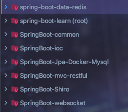
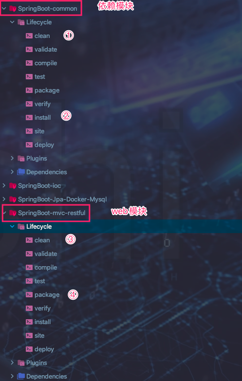
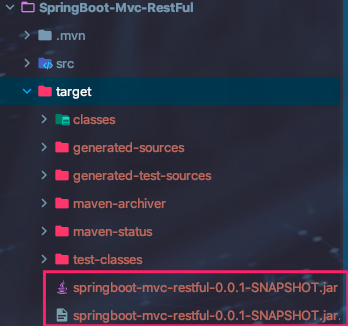
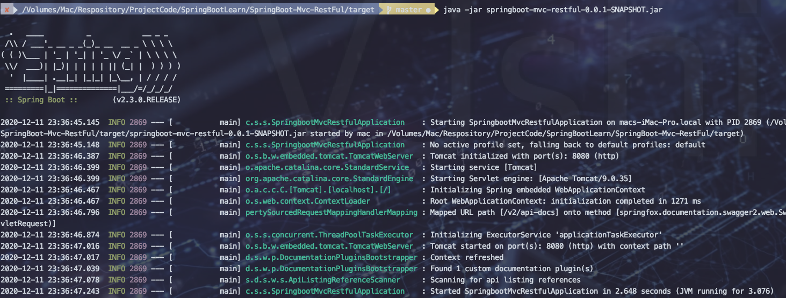
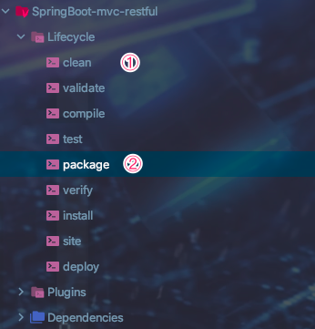
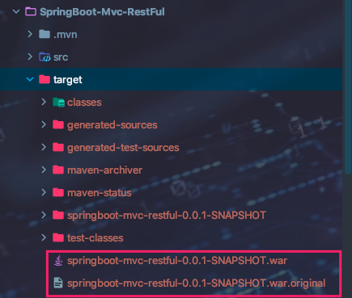

## 多模块项目环境搭建

1. 前五步省略，参考上篇文章前五步

2. 新建任意模块

	* 子模块pom文件添加

		```xml
		<parent>
		    <groupId>com.company</groupId>
		    <artifactId>spring-boot-learn</artifactId>
		    <version>0.0.1-SNAPSHOT</version>
		</parent>
		
		<dependencies>
		   <!--公共模块-->
		   <dependency>
		     <groupId>com.shuai</groupId>
		     <artifactId>springboot-common</artifactId>
		     <version>0.0.1-SNAPSHOT</version>
		   </dependency>
		   <!-- 实现对 Spring MVC 的自动化配置 -->
		   <dependency>
		     <groupId>org.springframework.boot</groupId>
		     <artifactId>spring-boot-starter-web</artifactId>
		   </dependency>
		</dependencies>
		```

	* 父模块pom文件添加

		```xml
		<module>SpringBoot-Mvc-RestFul</module>
		```

## 多模块项目任意模块打包-jar

1. 项目介绍

	

2. 打包==SpringBoot-Common==和==SpringBoot-Mvc-RestFul==模块

3. ==SpringBoot-Common==打包为jar，==SpringBoot-Mvc-RestFul==打包为jar并包含依赖模块==SpringBoot-Common==

4. 父模块pom文件删除掉build配置

	```xml
	<?xml version="1.0" encoding="UTF-8"?>
	<project xmlns="http://maven.apache.org/POM/4.0.0" xmlns:xsi="http://www.w3.org/2001/XMLSchema-instance"
	    xsi:schemaLocation="http://maven.apache.org/POM/4.0.0 https://maven.apache.org/xsd/maven-4.0.0.xsd">
	    <modelVersion>4.0.0</modelVersion>
	    <groupId>com.company</groupId>
	    <artifactId>spring-boot-learn</artifactId>
	    <version>0.0.1-SNAPSHOT</version>
	
	    <packaging>pom</packaging>
	
	    <name>spring-boot-learn</name>
	    <description>Demo project for Spring Boot</description>
	
	    <!--子模块管理-->
	    <modules>
	        <module>SpringBoot-Common</module>
	        <module>SpringBoot-Mvc-RestFul</module>
	        <module>SpringBoot-WebSocket</module>
	        <module>Spring-IOC</module>
	        <module>SpirngBoot-Shiro</module>
	        <module>SpringBoot-Jpa-Docker-Mysql</module>
	        <module>SpringBoot-DataRedis-Docker</module>
	    </modules>
	    <!--版本控制-->
	    <properties>
	        <java.version>1.8</java.version>
	        <project.build.sourceEncoding>UTF-8</project.build.sourceEncoding>
	        <project.reporting.outputEncoding>UTF-8</project.reporting.outputEncoding>
	        <spring-boot.version>2.3.0.RELEASE</spring-boot.version>
	        <lombok.version>1.18.12</lombok.version>
	        <mysql.version>8.0.21</mysql.version>
	        <hutool.version>5.3.10</hutool.version>
	        <swagger2.version>2.9.2</swagger2.version>
	        <knife4j.version>1.9.6</knife4j.version>
	        <fastjson.version>1.2.72</fastjson.version>
	    </properties>
	
	    <dependencyManagement>
	        <dependencies>
	            <!--精髓 ：springboot依赖-->
	            <dependency>
	                <groupId>org.springframework.boot</groupId>
	                <artifactId>spring-boot-dependencies</artifactId>
	                <version>${spring-boot.version}</version>
	                <type>pom</type>
	                <scope>import</scope>
	            </dependency>
	            <!--数据库-->
	            <dependency>
	                <groupId>mysql</groupId>
	                <artifactId>mysql-connector-java</artifactId>
	                <version>${mysql.version}</version>
	            </dependency>
	            <!-- hutool工具类 -->
	            <dependency>
	                <groupId>cn.hutool</groupId>
	                <artifactId>hutool-all</artifactId>
	                <version>${hutool.version}</version>
	            </dependency>
	            <!--lombok工具-->
	            <dependency>
	                <groupId>org.projectlombok</groupId>
	                <artifactId>lombok</artifactId>
	                <version>${lombok.version}</version>
	            </dependency>
	            <dependency>
	                <groupId>com.alibaba</groupId>
	                <artifactId>fastjson</artifactId>
	                <version>${fastjson.version}</version>
	            </dependency>
	            <!-- 引入 Swagger 依赖 -->
	<!--            <dependency>-->
	<!--                <groupId>io.springfox</groupId>-->
	<!--                <artifactId>springfox-swagger2</artifactId>-->
	<!--                <version>${swagger2.version}</version>-->
	<!--            </dependency>-->
	            <!-- 引入 Swagger UI 依赖，以实现 API 接口的 UI 界面 -->
	<!--            <dependency>-->
	<!--                <groupId>io.springfox</groupId>-->
	<!--                <artifactId>springfox-swagger-ui</artifactId>-->
	<!--                <version>${swagger2.version}</version>-->
	<!--            </dependency>-->
	            <!-- 1. swagger-bootstrap-ui 目前改名为 knife4j -->
	            <!-- 2. 实现 swagger-bootstrap-ui 的自动化配置  -->
	            <!-- 3. 因为 knife4j-spring 已经引入 Swagger 依赖，所以无需重复引入 -->
	            <dependency>
	                <groupId>com.github.xiaoymin</groupId>
	                <artifactId>knife4j-spring</artifactId>
	                <version>${knife4j.version}</version>
	            </dependency>
	            <dependency>
	                <groupId>com.github.xiaoymin</groupId>
	                <artifactId>knife4j-spring-ui</artifactId>
	                <version>${knife4j.version}</version>
	            </dependency>
	        </dependencies>
	    </dependencyManagement>
	
	<!--    <build>-->
	<!--        <plugins>-->
	<!--            <plugin>-->
	<!--                <groupId>org.apache.maven.plugins</groupId>-->
	<!--                <artifactId>maven-compiler-plugin</artifactId>-->
	<!--                <version>3.8.1</version>-->
	<!--                <configuration>-->
	<!--                    <source>1.8</source>-->
	<!--                    <target>1.8</target>-->
	<!--                    <encoding>UTF-8</encoding>-->
	<!--                </configuration>-->
	<!--            </plugin>-->
	<!--            <plugin>-->
	<!--                <groupId>org.springframework.boot</groupId>-->
	<!--                <artifactId>spring-boot-maven-plugin</artifactId>-->
	<!--                <version>2.3.0.RELEASE</version>-->
	<!--                <configuration>-->
	<!--                    <mainClass>com.company.springbootlearn.SpringBootLearnApplication</mainClass>-->
	<!--                </configuration>-->
	<!--                <executions>-->
	<!--                    <execution>-->
	<!--                        <id>repackage</id>-->
	<!--                        <goals>-->
	<!--                            <goal>repackage</goal>-->
	<!--                        </goals>-->
	<!--                    </execution>-->
	<!--                </executions>-->
	<!--            </plugin>-->
	<!--        </plugins>-->
	<!--    </build>-->
	
	</project>
	```

5. ==SpringBoot-Common==模块pom文件如下

	```xml
	<?xml version="1.0" encoding="UTF-8"?>
	<project xmlns="http://maven.apache.org/POM/4.0.0" xmlns:xsi="http://www.w3.org/2001/XMLSchema-instance"
	         xsi:schemaLocation="http://maven.apache.org/POM/4.0.0 https://maven.apache.org/xsd/maven-4.0.0.xsd">
	    <modelVersion>4.0.0</modelVersion>
	    <groupId>com.shuai</groupId>
	    <artifactId>springboot-common</artifactId>
	    <version>0.0.1-SNAPSHOT</version>
	    <name>SpringBoot-common</name>
	    <description>Demo project for Spring Boot</description>
	
	    <!--父项目配置-->
	    <parent>
	        <groupId>com.company</groupId>
	        <artifactId>spring-boot-learn</artifactId>
	        <version>0.0.1-SNAPSHOT</version>
	    </parent>
	
	    <properties>
	        <java.version>1.8</java.version>
	        <project.build.sourceEncoding>UTF-8</project.build.sourceEncoding>
	        <project.reporting.outputEncoding>UTF-8</project.reporting.outputEncoding>
	        <spring-boot.version>2.3.0.RELEASE</spring-boot.version>
	    </properties>
	
	    <dependencies>
	        <dependency>
	            <groupId>org.projectlombok</groupId>
	            <artifactId>lombok</artifactId>
	        </dependency>
	        <dependency>
	            <groupId>org.springframework.boot</groupId>
	            <artifactId>spring-boot-starter</artifactId>
	        </dependency>
	        <!--热部署-->
	        <dependency>
	            <groupId>org.springframework.boot</groupId>
	            <artifactId>spring-boot-devtools</artifactId>
	            <optional>true</optional> <!-- 可选 -->
	        </dependency>
	        <dependency>
	            <groupId>com.github.xiaoymin</groupId>
	            <artifactId>knife4j-spring</artifactId>
	        </dependency>
	        <dependency>
	            <groupId>com.github.xiaoymin</groupId>
	            <artifactId>knife4j-spring-ui</artifactId>
	        </dependency>
	        <!--参数校验-->
	        <!-- 保证 Spring AOP 相关的依赖包 -->
	        <dependency>
	            <groupId>org.springframework</groupId>
	            <artifactId>spring-aspects</artifactId>
	        </dependency>
	        <dependency>
	            <groupId>org.springframework.boot</groupId>
	            <artifactId>spring-boot-starter-validation</artifactId>
	        </dependency>
	    </dependencies>
	</project>
	```


6. ==SpringBoot-Mvc-RestFul==pom文件添加build配置

	```xml
	<?xml version="1.0" encoding="UTF-8"?>
	<project xmlns="http://maven.apache.org/POM/4.0.0" xmlns:xsi="http://www.w3.org/2001/XMLSchema-instance"
	    xsi:schemaLocation="http://maven.apache.org/POM/4.0.0 https://maven.apache.org/xsd/maven-4.0.0.xsd">
	    <modelVersion>4.0.0</modelVersion>
	    <groupId>com.shuai</groupId>
	    <artifactId>springboot-mvc-restful</artifactId>
	    <version>0.0.1-SNAPSHOT</version>
	    <name>SpringBoot-mvc-restful</name>
	    <description>Demo project for Spring Boot</description>
	
	    <parent>
	        <groupId>com.company</groupId>
	        <artifactId>spring-boot-learn</artifactId>
	        <version>0.0.1-SNAPSHOT</version>
	    </parent>
	
	    <properties>
	        <java.version>1.8</java.version>
	        <project.build.sourceEncoding>UTF-8</project.build.sourceEncoding>
	        <project.reporting.outputEncoding>UTF-8</project.reporting.outputEncoding>
	        <spring-boot.version>2.3.0.RELEASE</spring-boot.version>
	    </properties>
	
	    <dependencies>
	        <!--公共模块-->
	        <dependency>
	            <groupId>com.shuai</groupId>
	            <artifactId>springboot-common</artifactId>
	            <version>0.0.1-SNAPSHOT</version>
	        </dependency>
	        <!-- 实现对 Spring MVC 的自动化配置 -->
	        <dependency>
	            <groupId>org.springframework.boot</groupId>
	            <artifactId>spring-boot-starter-web</artifactId>
	        </dependency>
	
	        <!-- 方便等会写单元测试 -->
	        <dependency>
	            <groupId>org.springframework.boot</groupId>
	            <artifactId>spring-boot-starter-test</artifactId>
	        </dependency>
	        <!--热部署-->
	        <dependency>
	            <groupId>org.springframework.boot</groupId>
	            <artifactId>spring-boot-devtools</artifactId>
	            <optional>true</optional> <!-- 可选 -->
	        </dependency>
	        <dependency>
	            <groupId>com.github.xiaoymin</groupId>
	            <artifactId>knife4j-spring</artifactId>
	        </dependency>
	        <dependency>
	            <groupId>com.github.xiaoymin</groupId>
	            <artifactId>knife4j-spring-ui</artifactId>
	        </dependency>
	    </dependencies>
	    <build>
	        <plugins>
	            <plugin>
	                <groupId>org.apache.maven.plugins</groupId>
	                <artifactId>maven-compiler-plugin</artifactId>
	                <version>3.8.1</version>
	                <configuration>
	                    <source>1.8</source>
	                    <target>1.8</target>
	                    <encoding>UTF-8</encoding>
	                </configuration>
	            </plugin>
	            <plugin>
	                <groupId>org.springframework.boot</groupId>
	                <artifactId>spring-boot-maven-plugin</artifactId>
	                <version>2.3.0.RELEASE</version>
	                <configuration>
	                    <!-- 入口类 -->
	                    <mainClass>com.shuai.springbootmvcrestful.SpringbootMvcRestfulApplication</mainClass>
	                </configuration>
	                <executions>
	                    <execution>
	                        <id>repackage</id><!-- 将依赖包打入到该包中 -->
	                        <goals>
	                            <goal>repackage</goal>
	                        </goals>
	                    </execution>
	                </executions>
	            </plugin>
	        </plugins>
	    </build>
	
	</project>
	```


7. Maven打包

	

	

	

	


## 多模块项目任意模块打包-war

> 在原先jar包基础上进行修改

1. ==SpringBoot-Mvc-RestFul==pom文件添加如下内容

	```xml
	<!--因配置外部TOMCAT 而配置  打war包 配置一 -->
	<dependency>
	    <groupId>org.springframework.boot</groupId>
	    <artifactId>spring-boot-starter-tomcat</artifactId>
	    <scope>provided</scope>
	</dependency>
	
	<!-- 打war包 配置二  -->
	<packaging>war</packaging>
	```

2. 添加启动类

	> 之前默认启动类适合打jar包，如果打war则必须修改启动类。这里选择新增war包启动类，而不是修改原先启动类。方便jar包和war包切换

	```java
	import org.springframework.boot.SpringApplication;
	import org.springframework.boot.autoconfigure.SpringBootApplication;
	import org.springframework.boot.builder.SpringApplicationBuilder;
	import org.springframework.boot.web.servlet.support.SpringBootServletInitializer;
	/**
	 * TODO:<p> 打war包 配置三 修改启动类 <p/>
	 * @package: com.shuai.springbootmvcrestful
	 * @Author mac
	 * @Date 2020/12/11 11:50 下午
	 * @Version V1.0
	 **/
	@SpringBootApplication
	public class WarApplication extends SpringBootServletInitializer {
	    @Override
	    protected SpringApplicationBuilder configure(SpringApplicationBuilder builder) {
	        return builder.sources(WarApplication.class);
	    }
	
	
	    public static void main(String[] args) {
	        SpringApplication.run(WarApplication.class, args);
	    }
	}
	```

3. ==SpringBoot-Mvc-RestFul==pom文件将jar包启动类修改为新添加war包启动类

	```pon
	<configuration>
	    <!-- jar包 入口类 -->
	    <!--<mainClass>com.shuai.springbootmvcrestful.SpringbootMvcRestfulApplication</mainClass>-->
	    <!--  war包 配置四  -->
	    <!-- war包 入口类 -->
	    <mainClass>com.shuai.springbootmvcrestful.WarApplication</mainClass>
	</configuration>
	```

4. ==SpringBoot-Mvc-RestFul==pom文件添加war打包类

	```pom
	<!-- war包 配置五  -->
	<plugin>
	    <groupId>org.apache.maven.plugins</groupId>
	    <artifactId>maven-war-plugin</artifactId>
	    <version>2.6</version>
	    <configuration>
	        <failOnMissingWebXml>false</failOnMissingWebXml>
	    </configuration>
	</plugin>
	```

5. 打包

	> 之前打jar包已经将Common模块打包好了，因此这里不再重新打

	

	


## 打jar包和打war包切换

* jar包切换war包

	> 参考  `多模块项目任意模块打包-war`

* war包切换jar包

	> 全局搜索`配置一~五` 删除 `配置一~三和`和`配置五`相关内容、将`配置四`中war包启动类修改为jar包启动类


## 源代码

> 需要spring-boot-data-redis模块源码的可以到我的gitee上下载
>
> 目录：https://gitee.com/gadeGG/ProjectCode.git
>
> 具体项目：ProjectCode/SpringBootLearn/