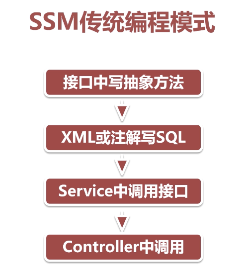

## 是什么？

[MyBatis-Plus](https://github.com/baomidou/mybatis-plus)（简称 MP）是一个 [MyBatis](http://www.mybatis.org/mybatis-3/) 的增强工具，在 MyBatis 的基础上只做增强不做改变，为简化开发、提高效率而生。


## 特性

- **无侵入**：只做增强不做改变，引入它不会对现有工程产生影响，如丝般顺滑
- **损耗小**：启动即会自动注入基本 CURD，性能基本无损耗，直接面向对象操作
- **强大的 CRUD 操作**：内置通用 Mapper、通用 Service，仅仅通过少量配置即可实现单表大部分 CRUD 操作，更有强大的条件构造器，满足各类使用需求
- **<font color=ff00aa>支持 Lambda 形式调用</font>**：通过 Lambda 表达式，方便的编写各类查询条件，无需再担心字段写错
- **支持主键自动生成**：支持多达 4 种主键策略（内含分布式唯一 ID 生成器 - Sequence），可自由配置，完美解决主键问题
- **<font color=ff00aa>支持 ActiveRecord 模式</font>**：支持 ActiveRecord 形式调用，实体类只需继承 Model 类即可进行强大的 CRUD 操作
- **支持自定义全局通用操作**：支持全局通用方法注入（ Write once, use anywhere ）
- **<font color=ff00aa>内置代码生成器</font>**：采用代码或者 Maven 插件可快速生成 Mapper 、 Model 、 Service 、 Controller 层代码，支持模板引擎，更有超多自定义配置等您来使用
- **<font color=ff00aa>内置分页插件</font>**：基于 MyBatis 物理分页，开发者无需关心具体操作，配置好插件之后，写分页等同于普通 List 查询
- **分页插件支持多种数据库**：支持 MySQL、MariaDB、Oracle、DB2、H2、HSQL、SQLite、Postgre、SQLServer 等多种数据库
- **<font color=ff00aa>内置性能分析插件</font>**：可输出 Sql 语句以及其执行时间，建议开发测试时启用该功能，能快速揪出慢查询
- **<font color=ff00aa>内置全局拦截插件</font>**：提供全表 delete 、 update 操作智能分析阻断，也可自定义拦截规则，预防误操作

## 能干什么？


## 对比

JPA 一个开发标准

实现的有hibernate、spring data jpa

JPA优势：

1. JPA移植性比较好 JPQL
2. 提供了很多crud方法、开发效率高
3. 对象化程度更高

Mybatis 优势：

1. SQL语句可以自由控制、更灵活、性能较高
2. SQL与代码分离、易于阅读和维护
3. 提供xml标签、支持编写动态SQL语句

Mybatis劣势：

1. 简单CRUD操作还得写SQL语句
2. xml中有大量的SQL要维护
3. Mybatis自身功能很有限、分页都没有。但是支持Plugin


### 对比Mybatis-Plus 和Mybatis开发流程



在Mybatis-Plus中只需要继承基础的BaseMapper即可。BaseMapper中实现了很多基础的CRUD操作。

```java
public interface BlogArticleMapper extends BaseMapper<BlogArticle> {

}
```

```java
@Test
    //查询所有数据
    public void selectAll(){
        List<BlogArticle> blogArticles = blogArticleMapper.selectList(null);
        System.out.println(blogArticles.size());
    }
```

