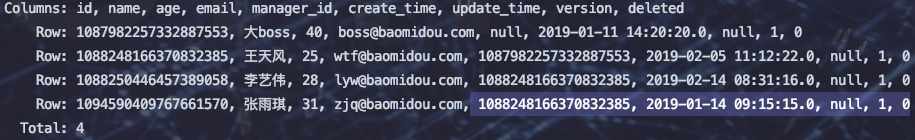
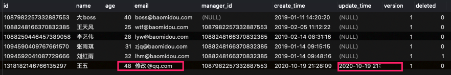

# 逻辑删除

> 使用jeecg-cloud平台，因此配置都已有了，不需要进行配置。其他情况请参考官网：https://baomidou.com/guide/logic-delete.html#%E4%BD%BF%E7%94%A8%E6%96%B9%E6%B3%95%EF%BC%9A

1. 使用字段来标识删除没删除。例如使用 表字段 show_status 值1和0来表示逻辑删除

2. 在配置文件中 mybatis-plus中配置

  ```yaml
  mybatis-plus:
    global-config:
      db-config:
        logic-delete-field: flag  # 全局逻辑删除的实体字段名(since 3.3.0,配置后可以忽略不配置步骤2)
        logic-delete-value: 1 # 逻辑已删除值(默认为 1)
        logic-not-delete-value: 0 # 逻辑未删除值(默认为 0)
  ```

3. 实体类添加注解

  ```java
  /**
   * 是否显示[0-不显示，1显示]  如果某张表与全局配显示逻辑不一样则可以使用
   * value delval 来进行单独配置
   */
  @TableLogic(value = "1",delval = "0")
  private Integer showStatus;
  ```

  

4. 测试

  

  

  


# 自动填充

我们新增数据时，有一些字段并不想手动录入，比如创建时间、更新时间

1. 实体字段添加注解

	

2. 添加配置文件

	```java
	@Component
	public class MetaObjectHandler implements com.baomidou.mybatisplus.core.handlers.MetaObjectHandler
	{
	    @Override
	    public void insertFill(MetaObject metaObject) {
	        //判断实体是否有这个属性
	        boolean hasSetter = metaObject.hasSetter("createTime");
	        //判断实体这个属性是否赋值
	        Object createTime = getFieldValByName("createTime", metaObject);
	        //针对有这个属性值并且这个属性并没有赋值的实体类进行填充
	        if (hasSetter && null!=createTime){
	            setInsertFieldValByName("createTime", LocalDateTime.now(),metaObject);
	        }
	
	    }
	
	    @Override
	    public void updateFill(MetaObject metaObject) {
	        //判断实体是否有这个属性
	        boolean hasSetter = metaObject.hasSetter("updateTime");
	        //判断实体这个属性是否赋值
	        Object updateTime = getFieldValByName("updateTime", metaObject);
	        //针对有这个属性值并且这个属性并没有赋值的实体类进行填充
	        if (hasSetter && null!=updateTime) setUpdateFieldValByName("updateTime", LocalDateTime.now(), metaObject);
	    }
	}
	```

3. 测试

	```java
	//自动填充新增
	User user=new User();
	user.setName("王五");
	user.setVersion(1);
	user.setManagerId("1087982257332887553");
	user.setEmail("hel@qq.com");
	user.setAge(48);
	userMapper.insert(user);
	```

	

	

	```java
	//自动填充更新
	 User user=new User();
	 user.setId("1318182146766135297");
	 user.setEmail("修改@qq.com");
	 userMapper.updateById(user);
	```

	

	

# 乐观锁插件

悲观锁与乐观锁

* 悲观锁：利用数据库机制实现，适用于多写的情况
* 乐观锁：适用于写比较少的情况

==作用：==防止冲突

==实现方式：==

1. 取出记录是获取当前version   
2. 更新时带上这个version    
3. 执行更新时set version = new Version wehre version = oldVersion  
4. 如果version不对，就更新失败


1. 修改实体类字段

	```java
	//版本  用于乐观锁
	@Version
	private Integer version;
	```

2. 添加配置文件

	```java
	@Configuration
	public class MybatisPlusConfiguration {
	    //    mybatis-plus乐观锁配置
	    @Bean
	    public OptimisticLockerInterceptor optimisticLockerInterceptor() {
	        return new OptimisticLockerInterceptor();
	    }
	}
	```

3. 测试

	```java
	//乐观锁
	//必须要先执行查询，否则锁不生效
	userMapper.selectList(null);
	int version=1;
	User user=new User();
	user.setId("1318182146766135297");
	user.setEmail("乐观锁测试@qq.com");
	user.setVersion(version);
	userMapper.updateById(user);
	```

	* 将更新的 version+1  <font color=ff00aa>小于等于</font> 数据库中的version  ==》 失败

		

	* 将更新的 version+1  <font color=ff00aa>大于</font> 数据库中的version  ==》 成功

		

> 特别说明:
>
> - **支持的数据类型只有:int,Integer,long,Long,Date,Timestamp,LocalDateTime**
> - 整数类型下 `newVersion = oldVersion + 1`
> - `newVersion` 会回写到 `entity` 中
> - 仅支持 `updateById(id)` 与 `update(entity, wrapper)` 方法
> - **在 `update(entity, wrapper)` 方法下, `wrapper` 不能复用（即在同一个方法中更新两次并且这两次都调用了同一个wrapper）!!!**


# 性能分析插件

输出每条SQL语句执行时间 : mybatis-plus 3.2 前使用


1. 指定 生产环境 启动项目

	

2. ```java
	@Configuration
	public class MybatisPlusConfiguration {
	//    mybatis-plus乐观锁配置
	    @Bean
	    public OptimisticLockerInterceptor optimisticLockerInterceptor() {
	        return new OptimisticLockerInterceptor();
	    }
	//    性能分析配置
	    @Bean
	    @Profile({"dev","test"})//开发环境和测试环境开启
	    public PerformanceInterceptor performanceInterceptor() {
	        PerformanceInterceptor performanceInterceptor=new PerformanceInterceptor();
	        //格式化
	        performanceInterceptor.setFormat(true);
	        //超时：超过5毫秒，则
	//        performanceInterceptor.setMaxTime(5L);
	        return performanceInterceptor;
	    }
	}
	```

3. 测试

	

> <font color=ff00aa>注意：</font> 生产环境别用，否则有性能损耗
>
> 执行SQL分析打印  类似于SQL性能分析  官网：https://baomidou.com/guide/p6spy.html


# 多租户SQL解析器

一般面向企业，多个企业共用一套系统。

有三种实现方式

1. 多个数据库

2. 一个数据库多个schema
3. 一个数据库使用企业ID来标识


# 动态表名SQL解析器


# SQL注入器


# 控制台打印SQL语句

配置文件填入如下信息

```yaml
mybatis-plus:
  mapper-locations: classpath:/mapper/**/*.xml   #mapper映射文件
  configuration:
    log-impl: org.apache.ibatis.logging.stdout.StdOutImpl    # 固定实现类    
```


# SQL性能分析打印

>   mybatis-plus 3.2 后使用

1.  导入依赖

    ```xml
    <dependency>
      <groupId>p6spy</groupId>
      <artifactId>p6spy</artifactId>
      <version>最新版本</version>
    </dependency>
    ```

2.  application.yml 中加入

    ```yml
    spring:
      datasource:
        driver-class-name: com.p6spy.engine.spy.P6SpyDriver
        username: root
        password: 132
        url: jdbc:p6spy:mysql://127.0.0.1:3306/test?characterEncoding=utf-8&useSSL=false
    ```

3.  resource下新建 spy.properties

    ```properties
    #3.2.1以上使用
    modulelist=com.baomidou.mybatisplus.extension.p6spy.MybatisPlusLogFactory,com.p6spy.engine.outage.P6OutageFactory
    #3.2.1以下使用或者不配置
    #modulelist=com.p6spy.engine.logging.P6LogFactory,com.p6spy.engine.outage.P6OutageFactory
    # 自定义日志打印
    logMessageFormat=com.baomidou.mybatisplus.extension.p6spy.P6SpyLogger
    #日志输出到控制台
    appender=com.baomidou.mybatisplus.extension.p6spy.StdoutLogger
    # 使用日志系统记录 sql
    #appender=com.p6spy.engine.spy.appender.Slf4JLogger
    # 设置 p6spy driver 代理
    deregisterdrivers=true
    # 取消JDBC URL前缀
    useprefix=true
    # 配置记录 Log 例外,可去掉的结果集有error,info,batch,debug,statement,commit,rollback,result,resultset.
    excludecategories=info,debug,result,commit,resultset
    # 日期格式
    dateformat=yyyy-MM-dd HH:mm:ss
    # 实际驱动可多个
    #driverlist=org.h2.Driver
    # 是否开启慢SQL记录
    outagedetection=true
    # 慢SQL记录标准 2 秒
    outagedetectioninterval=2
    ```

## SpringBoot + Durid + p6spy 报错 ： dbType not support p6spy

### 背景介绍

>   使用 renren 开源 SpringBoot项目  整合 p6spy时一直报错，并无 SQL执行分析 打印

*   spring-boot版本 ：2.2.4.RELEASE
*   MyBatis-Plus版本：3.3.1
*   mysql-connect-java : 8.0.17
*   Druid 版本 ：1.1.13
*   p6spy 版本 ：3.9.1

### 原因剖析

1.  报错类 为 WallFilter   抛出异常方法为init

    ```java
    if (!"mysql".equals(this.dbType) && !"mariadb".equals(this.dbType) && !"h2".equals(this.dbType) && !"presto".equals(this.dbType)) {
    			if (!"db2".equals(this.dbType)) {
    				throw new IllegalStateException("dbType not support : " + this.dbType + ", url " + dataSource.getUrl());
    			}
    
    			if (this.config == null) {
    				this.config = new WallConfig("META-INF/druid/wall/db2");
    			}
    		} else {
    			if (this.config == null) {
    				this.config = new WallConfig("META-INF/druid/wall/mysql");
    			}
    
    			this.provider = new MySqlWallProvider(this.config);
    		}
    ```

2.  其中 this.dbType = JdbcUtils.getDbType()

    ```java
    public static String getDbType(String rawUrl, String driverClassName) {
    		if (rawUrl == null) {
    			return null;
    		} else if (!rawUrl.startsWith("jdbc:derby:") && !rawUrl.startsWith("jdbc:log4jdbc:derby:")) {
    			if (!rawUrl.startsWith("jdbc:mysql:") && !rawUrl.startsWith("jdbc:cobar:") && !rawUrl.startsWith("jdbc:log4jdbc:mysql:")) {
    				
    			} else {
    				return "mysql";
    			}
    		} else {
    			return "derby";
    		}
    	}
    ```

3.  根据 url 头 来处理，我们rul走了 p6spy代理并没有匹配到jdbc:p6spy 因此报错

    ```java
    url: jdbc:p6spy:mysql://127.0.0.1:3306/cnc?useUnicode=true&characterEncoding=UTF-8&serverTimezone=Asia/Shanghai&useSSL=false
    ```

    


### 问题解决

```yaml
spring:
    datasource:
        type: com.alibaba.druid.pool.DruidDataSource
        druid:
            #driver-class-name: com.mysql.cj.jdbc.Driver
            #url: jdbc:mysql://localhost:3306/cnc?useUnicode=true&characterEncoding=UTF-8&serverTimezone=Asia/Shanghai
            #username: root
            #password: root
            #****************使用p6spy代理********************
            driver-class-name: com.p6spy.engine.spy.P6SpyDriver
            username: root
            password: root
            url: jdbc:p6spy:mysql://127.0.0.1:3306/cnc?useUnicode=true&characterEncoding=UTF-8&serverTimezone=Asia/Shanghai&useSSL=false
            initial-size: 10
            max-active: 100
            min-idle: 10
            max-wait: 60000
            pool-prepared-statements: true
            max-pool-prepared-statement-per-connection-size: 20
            time-between-eviction-runs-millis: 60000
            min-evictable-idle-time-millis: 300000
            #Oracle需要打开注释
            #validation-query: SELECT 1 FROM DUAL
            test-while-idle: true
            test-on-borrow: false
            test-on-return: false
            stat-view-servlet:
                enabled: true
                url-pattern: /druid/*
                #login-username: admin
                #login-password: admin
            filter:
                stat:
                    log-slow-sql: true
                    slow-sql-millis: 1000
                    merge-sql: false
                wall:
                    config:
                        multi-statement-allow: true
            #****************配置监控统计拦截的filters，去掉后监控界面sql无法统计，'wall'用于防火墙:适配 p6spy 性能分析插件********************
            filters: stat,slf4j

    cache:
        type: redis
```

