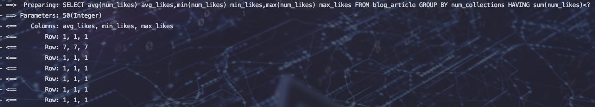

# 通用Mapper


## 条件构造器

### 查询所有数据

```java
@RunWith(SpringRunner.class)
@SpringBootTest(webEnvironment = SpringBootTest.WebEnvironment.RANDOM_PORT)
public class MPTest {
    @Autowired
    BlogArticleMapper blogArticleMapper;

    @Test
    //查询所有数据
    public void selectAll(){
        List<BlogArticle> blogArticles = blogArticleMapper.selectList(null);
        System.out.println(blogArticles.size());
    }

}
```

### 查询多个id结果集

```java
@Test
//查询多id结果集
public void select(){
    List<String> list=new ArrayList<String>(){{
        this.add("13152561823739893768");
        this.add("13152521823739893768");
        this.add("13152721523739893768");
    }};
    List<BlogArticle> blogArticles = blogArticleMapper.selectBatchIds(list);
    blogArticles.forEach(x -> {
        System.out.println(x.getTitle());
    });
}
```

### 根据表字段值查询数据

```java
@Test
//根据表字段查询数据
public void seleceByMap(){
    Map<String, Object> map=new HashMap<>();
    map.put("visits","1");
    map.put("num_likes","1");
    List<BlogArticle> blogArticles = blogArticleMapper.selectByMap(map);
    blogArticles.forEach(System.out::println);
}
```

### 根据条件构造器查询数据

```java
@Test
//根据条件构造器查询数据(字段都为表字段而不是实体)
public void selectList(){
    QueryWrapper<BlogArticle> queryWrapper=new QueryWrapper<>();
    QueryWrapper<BlogArticle> wrapper = queryWrapper.like("title", "异星突变").lt("num_likes", "2");
    List<BlogArticle> blogArticles = blogArticleMapper.selectList(wrapper);
    blogArticles.forEach(System.out::println);
}
```

更多参考：https://baomidou.com/guide/wrapper.html#in

### 条件构造器查询部分列其他的列不设置

```java
@Test
//条件构造器查询部分列其他的列不设置
public void selectByWrapperSupper(){
    QueryWrapper<BlogArticle> queryWrapper=new QueryWrapper<>();
    QueryWrapper<BlogArticle> wrapper = queryWrapper.select("id","title","user_id").like("title", "异星突变").lt("num_likes", "2");
    List<BlogArticle> blogArticles = blogArticleMapper.selectList(wrapper);
    blogArticles.forEach(System.out::println);
}
```


### 实体作为条件构造器查询参数

```java
 @Test
    //实体作为条件构造器查询参数：将实体中不为空的字段作为查询条件
    public void selectByWrapperEntity(){
        BlogArticle blogArticle=new BlogArticle();
        blogArticle.setNumCollections("1");
        blogArticle.setNumLikes("78");
        QueryWrapper<BlogArticle> queryWrapper=new QueryWrapper<>(blogArticle);
//        QueryWrapper<BlogArticle> wrapper = queryWrapper.select("id","title","user_id").like("title", "异星突变").lt("num_likes", "2");
        List<Map<String, Object>> maps = blogArticleMapper.selectMaps(queryWrapper);
        maps.forEach(System.out::println);
    }
```


### 查询不是表中字段的数据

```java
@Test
//查询不是表中字段的数据：平均数、最大数等。返回map  而不必在构造一个实体
public void selectByWrapperother(){
    QueryWrapper<BlogArticle> queryWrapper=new QueryWrapper<>();
    QueryWrapper<BlogArticle> wrapper = queryWrapper.select("avg(num_likes) avg_likes","min(num_likes) min_likes","max(num_likes) max_likes")
            .groupBy("num_collections").having("sum(num_likes)<{0}",50);
    List<Map<String, Object>> maps = blogArticleMapper.selectMaps(queryWrapper);
    maps.forEach(System.out::println);
}
```




## Lambda条件构造器

```java
    @Test
    //lambda条件构造器查询
    public void selectByLambdaWrapper(){
        LambdaQueryWrapper<BlogArticle> lambdaQueryWrapper=new QueryWrapper<BlogArticle>().lambda();
//        LambdaQueryWrapper<BlogArticle> lambdaQueryWrapper1=new LambdaQueryWrapper<>();
//        LambdaQueryWrapper<BlogArticle> lambdaQueryWrapper2= Wrappers.<BlogArticle>lambdaQuery();
        //where title like %星%
        lambdaQueryWrapper.like(BlogArticle::getTitle,"星").lt(BlogArticle::getNumCollections,40);
        List<BlogArticle> blogArticles = blogArticleMapper.selectList(lambdaQueryWrapper);
        blogArticles.forEach(System.out::println);
    }
```


## 分页查询

```java
@Test
//依靠插件进行物理分页查询，并不是逻辑分页：所有数据读到内存然后分别读取
public void selectByPage(){
    QueryWrapper<BlogArticle> queryWrapper = new QueryWrapper<>();
    queryWrapper.ge("num_collections", "78");
    Page<BlogArticle> page = new Page<BlogArticle>(2, 5);

    IPage<BlogArticle> iPage =blogArticleMapper.selectPage(page,queryWrapper)
    System.out.println("总页数："+iPage.getPages());
    System.out.println("总记录数："+iPage.getTotal());
    List<BlogArticle> pageList = iPage.getRecords();
    pageList.forEach(System.out::println);
    
}
```


## 小技巧

1. 如果表和实体名称对应不起来可以使用@TableName("user")指定表名

2. Mybatis-Plus表中非主键字段下划线  对应    实体类驼峰格式。

	> 例如：实体字段为realName 而表字段为那么  则可以使用@TableField(“name”)来关联

3. Mybatis-Plus默认识别表主键字段为id  并且插入数据时不需要标明id值。 如果插入数据表主键字段不为id并且没有申明主键则插入失败。

	> 例如：实体类中主键字段为userId  表主键字段为id   则可以使用@TableId来申明该字段为表主键

4. 排除非表字段的三种方式

	有些时候，实体中某些字段并不想要对应到表中字段，只起辅助作用。如何做呢？

	1. 不参与序列化

		```java
		//备注
		private transient String remark;
		```

	2. 静态变量

		```java
		//备注
		private static String remark;
		```

	3. Mybatis-plus注解

		```java
		//备注
		@TableField(exist=false)
		private String remark;
		```

		

