## 为什么会出现索引

* MySQL数据持久化磁盘上的
* 并且一张表中数据不一定会内存连续
* 如果去查找时，就会进行IO读取并且遍历查询加对比

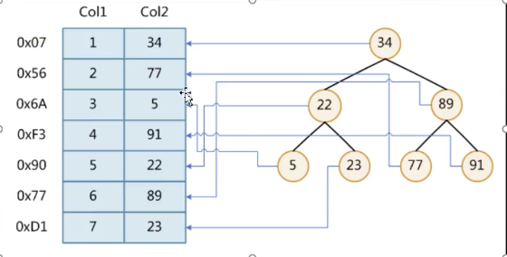

> 如果查找7这个行数据，那么就会进行IO读取并遍历7次。当数据量特变大是无法想象

## 什么是索引

* 索引就是一个key-value键值对
* key存储了索引值，value存储了索引所在行的磁盘地址

## 索引为什么不使用二叉树作为数据结构

> 二叉树特点是比较存放，如果目标值大于节点值则放在右侧，如果小于则存放在左侧

`二叉树问题`

* 如果我有一个树结构值，是有顺序的，在二叉树中是如何体现的？ 那么它就是一条链，查询速度非常慢，跟全盘扫描就一样了

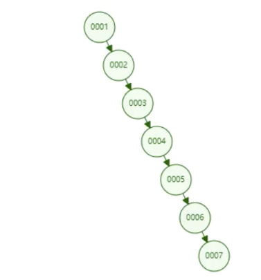

## 索引为什么不用红黑树作为数据结构

> 红黑树本质也是一个二叉树，只不过在二叉树单侧节点过多是会进行自动旋转平衡，因此也叫二叉平衡树

1. 当单侧出现过多节点时

	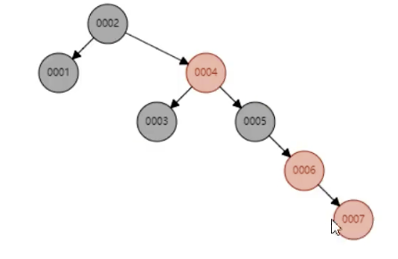

2. 自动旋转

	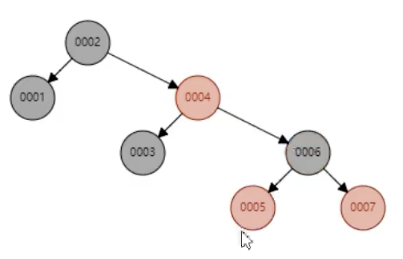

 `红黑树问题`

* 依然是数据量过大时，树高会特别大。

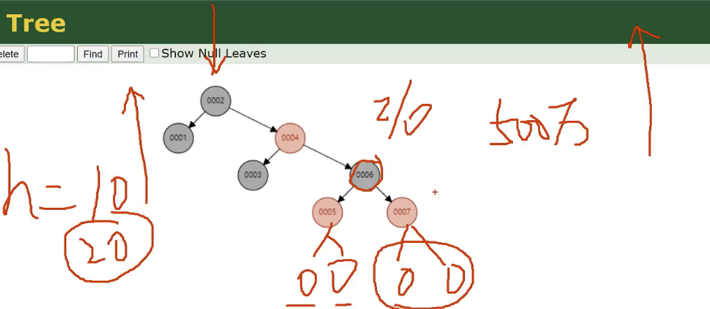

> 假如数据量有500万，树高肯定有10了，那么当查找最底层叶子节点时进行10次IO交互，因此依然会很慢。即高度相当于查找次数

> 现在的问题是，如何能够保证无论数据量多大，我就保证层高为4

`解决思路`

* 问题一 ：

	我每个节点(key-value)类似于单向链表，内存并不规整

* 问题二 ：

	相同数据量的前提下，数据量=树高*横向节点数量，我如果横向节点数量足够多，是不是树高就小了

## B树(B-Tree)的由来(MySQL使用的是B树基础上优化版 B+tree)

> 如上所示，在红黑树的前提下进行横向扩展

`原理:`

* 将红黑树横向扩展，如何横向扩展？

	1. 我不是一个一个内存块，或者说一个个节点Node，而是数组
	2. 每个数据存放足够多的节点Node(key-value) ,就可以保持树高
	3. 然后每个数组都有连接链到其他数组,如下图

	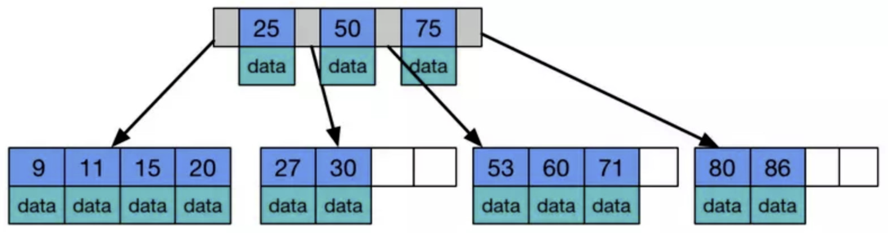

> 数据怎么查找呢?
>
> 1. 文件中存储二叉树结构，即key-value
> 2. 全文件查找到匹配的数组，然后放入内存进行查找。
> 3. 相当于io的交互次数也就是查找内存块的次数

## MySQL怎么优化B树

> 我们都知道，B树中每个数组中存放的都是一个个node节点，而node节点中又是key-value，即索引-文件偏移量

`特点`

* 非叶子数组中节点不存储data数组即文件偏移量，只存储索引用以冗余（方便查找）
* 叶子数组中节点之间都会包含一个空白块，即下一个文件数组的内存地址
* 叶子数组中节点包含所有索引字段，并且默认每个叶子节点大小为16k
* 叶子数组之间用指针连接
* 无论是叶子数组还是非叶子数组其中的节点索引都是从左往右递增的
* 非叶子数组中节点占8b，而中间空白块占6个b，因为每个数组容量为16kb。则内个数组最多存放1000多个node节点

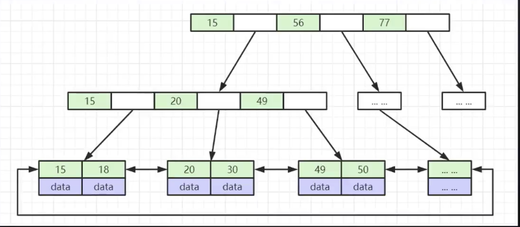

`查找流程`

> 比如说，我要查找30？
>
> 1. 加载跟数组到内存判断key=30的区间，发现在15-26之间
> 2. 加载15-26之间存放的文件偏移量即第二层最左面数组【15，20，49】发现30在20-49之间
> 3. 则加载20-49之间的文件偏移量即第三层中第二个，因为是叶子节点，加载进内存后，直接获取到索引对应的文件地址就可以

`性能`

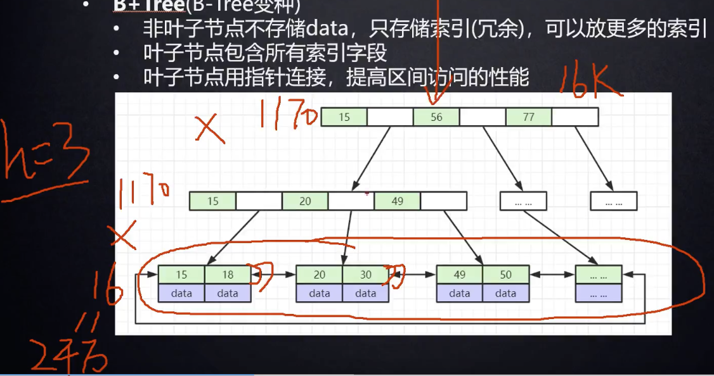

> 当树高达到3的时候，其存放的索引数据就能达到2千万数据
>
> 还有一个重要的点，因为前面的非叶子数组都是索引冗余数据，并且使用的是折半查找，但是有点小问题就是索引冗余数据也是存放在文件中，涉及到io，但是但是在数据库高版本中这一块已优化，将索引冗余数据直接放在内存中不涉及io。相当于一次io就能找到关键数据

## MySQL-MyISAM存储结构和存储引擎查找流程

* 非聚集索引

	索引和数据没有存放在一个文件，像MyISAM

* 聚集索引

	索引和数据存放在一个文件,像INNODB

	> 聚集索引比非聚集索引快，因为聚集索引只有一次io，而非聚集索引最少两次io。

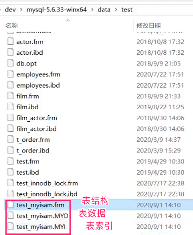

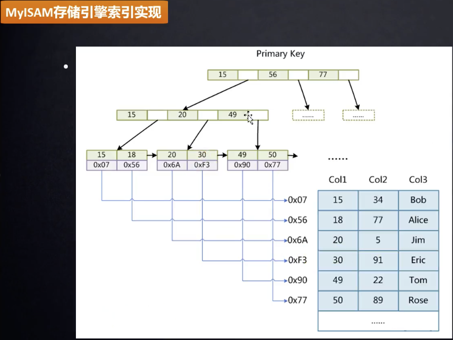

> 假定：where col1=30

1. 索引冗余文件，即MYI文件是存储在磁盘中的，但是高版本MySQL是直接存入内容
2. 二分查找，定位到 col1=30的索引数据是OxF3
3. 在MYD中直接定位到表数据然后获取数据

## MySQL--innodb存储结构和执行流程

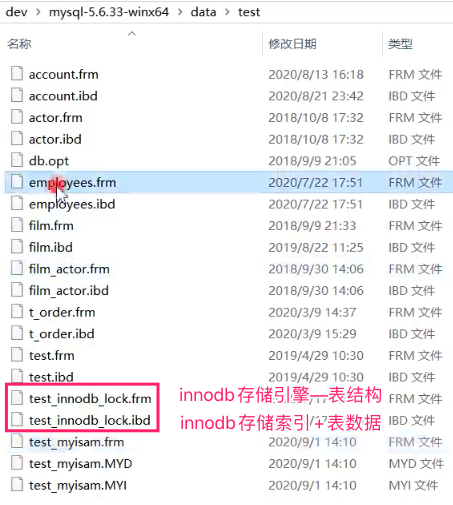

### 主键字段索引

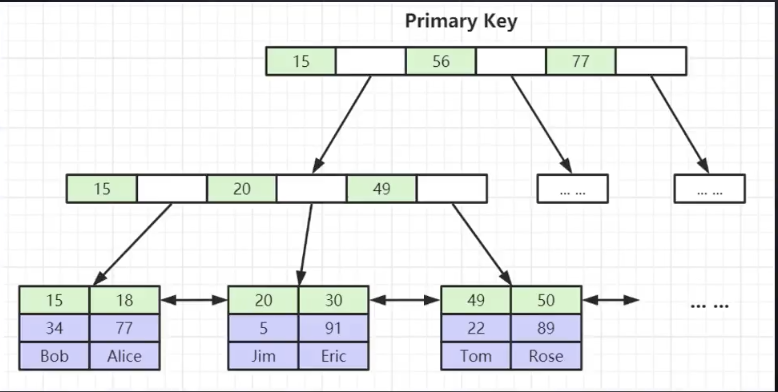

> 和MyISAM存储引擎的区别在于 innodb存储引擎是将索引+表数据存放在一个文件中，因此其叶子节点中存储的是索引+完整表数据

### 非主键字段索引

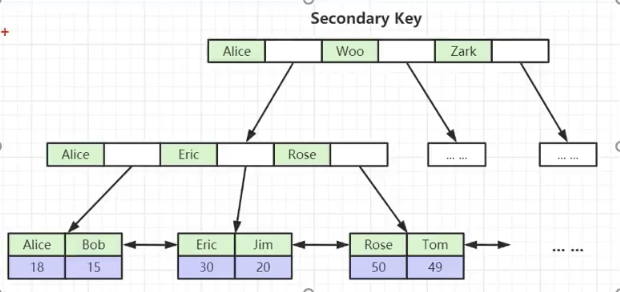

> 叶子节点都是双向指向，为的就是范围查询。比如说我要查找18-50之间的id值，那么先定位到20 因为从左往右一次递增，因此只需要依次比较即可。

## B-Tree和B+Tree区别

* B+Tree叶子节点维护了双向指针，更好地支持到范围查询，而B-Tree则不太行
* B+Tree维护了冗余索引,可以放到内存中只需要一次io则可以定位到索引,而B-Tree需要3-4次io交互

## 索引优化

1. 必须要为每张表建一个主键

	> 如果一张表中没有主键，那么MySQL为了优化，则会隐藏式的建一个自增索引，如下图

	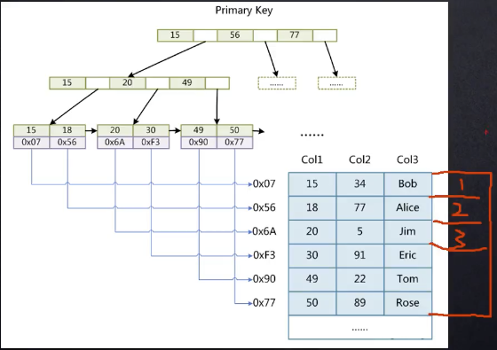

2. 主键最好是整形自增

	> 1. 因为MySQL数据是存储在企业级固态硬盘中，你用uuid和整形数字对比来说，肯定整形uuid占得存储空间小
	> 2. 我们知道，冗余索引存储在内存中，进行二分查找，uuid和整形数字来说，肯定整形数字对比起来快
	> 3. 还有就是如果不是自增的话，因为叶子节点数组中node都是从左到右依次递增，如果不是自增那么还得进行插入操作，牵扯到树平衡，而如果是自增的话直接在最右边插入即可

3. 一张表不要维护太多索引

	> 因为一个索引就需要维护一个数据结构，太多的话性能不太好，太多的话可以使用联合索引

## 单值索引和联合索引

* 单值索引就类似于我们上面讲到的主键索引一样，只有一个索引，维护一个数据结构

* 联合索引即一个表多个索引，那多个索引又是长啥样的呢？

	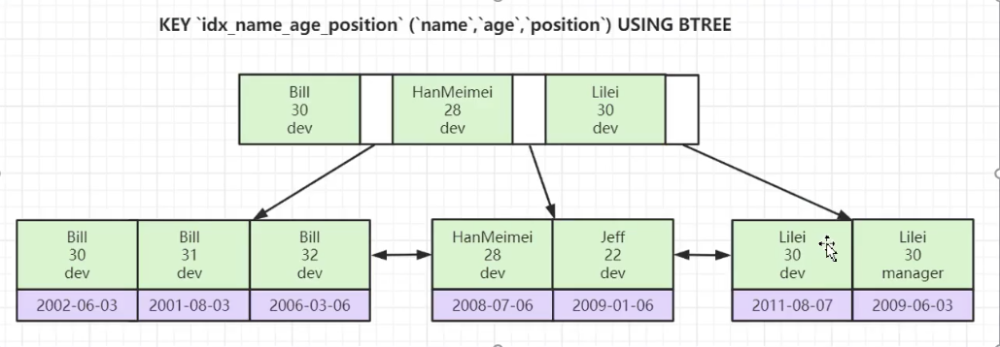

	> 单值索引讲的时候提到从左到右依次排序，
	>
	> 联合索引也是一样的需要排序，怎么排序呢？依次排序，比如我先按照名称排序，如果名称一样则按照age排序，如果age一样则按照班级排序，如果都不一样那就按照非主键索引排序

	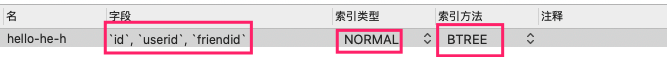

	> 索引方法最好选择BREE，其实还是B+TREE，如果选择了hash 不好做范围查询

`联合索引如果查询条件只是用到了其中几个如何处理？`

  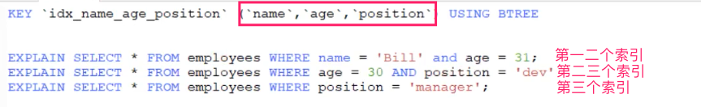

> 如果我有三个索引【name,age,position】我查询时条件有如下四种情况
>
> 1. 查询条件中有 第一二个索引     走了第一二个索引
> 2. 查询条件中有 第二三个索引     没有走索引
> 3. 查询条件中有 第三个索引         没有走索引
> 4. 查询条件中有 第一三个索引      走了第一个索引

==为什么是这样？  要符合最左规避原则，即==

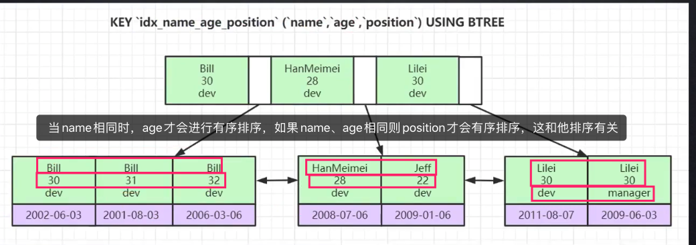

> 啥意思呢？人话就是，因为组合索引进行索引存储时，要按照从左到右依次增到的原则进行存放，但是多个索引如何从左到右依次增大？那就依次按照每个索引的hashcode值进行比较
>
> 如果我查询时跳过第一个索引name  直接使用第二三个，因为你跳过了第一个索引，并不能保证第一个索引存放的数据是一样的，如果不一样的话那么肯定得按照第一个索引顺序依次增大。
>
> 因此联合索引是必须按照最左原则，即一定要进行第一个第二个依次索引查询 