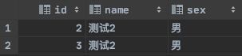

## 变量

### 系统变量

* 全局变量
* 会话变量

```sql
#查看所有系统|会话变量
show global [session] variables;
#过滤变量
show global [session] variables like '%char%'
```


### 自定义变量

* 全局变量

* 局部变量

	针对当前会话有效，即当前客户端连接


### 自定义全局变量使用

> 变量名类型是弱类型，不需要声明类型，类似于js，**其所用于为任何地方**

1. 声明并初始化 

	```sql
	set|select @用户变量名 := 值
	```

2. 赋值

	```sql
	set|select @用户变量名 := 值
	# 将表中数据赋值给用户变量
	select 表字段 info @用户变量名 from 表
	```

3. 使用(比较、查看、运算等)

	```sql
	#查看
	select @用户变量名
	#比较
	
	#运算
	```

#### 案例

```sql
set @i := 1;
set @y := 2;
set @sum = @i+@y;
select @sum;
```


### 自定义局部变量使用

> **必须申明类型，并且其作用域为定义它的begin end中有效，且只能是begin end中的第一句话**

1. 声明

	```sql
	DECLARE 局部变量名 类型
	DECLARE 局部变量名 类型 default 值
	```

2. 赋值

	```sql
	set 局部变量名 := 值
	select @局部变量名 := 值 #此种方式得有@
	# 将表中数据赋值给用户变量
	select 表字段 into 局部用户变量名 from 表
	```

3. 使用

	```sql
	select 局部变量名
	```


#### 案例

> 之后<存储过程中> <IN模式参数列表>使用


## 流程控制结构

### 分支结构

#### 1、if三目运算

```sql
IF(表达式1，表达式2，表达式3)
#如果表达式1成立，则if结构返回表达式2，否则返回表达式3
```

> 可以作为表达式，直接嵌套在SQL中使用

#### 2、case

> 类比 switch语句

```sql
case 变量|表达式|字段
when 判断值 then 返回值或语句
when 判断值 then 返回值或语句
。。。
else 返回最终值或语句
end case;
```

```sql
case
when 判断值 then 返回值或语句
when 判断值 then 返回值或语句
。。。
else 返回最终值或语句
end case;
```

> 可以作为表达式，直接嵌套在SQL中直接执行，也可以作为独立的语句执行，但是得放到case end之间。
>
> 如果没有else 且没有匹配到值，则返回null


##### 案例

> 需求 ： 创建函数，根据传入的成绩，返回等级。例如90-100 ：A 。80-90 ：B 。60-80 ： C 。其余都是D

```sql
delimiter $
create function func_case(score int) returns varchar(1)
begin
    declare grade varchar(1) default 'D';
    case
        when score>=90 and score<=100 then set grade:='A';
        when score<=90 and score>=80 then set grade:='B';
        when score<=80 and score>=60 then set grade:='C';
        else set grade:='D';
    end case;
    return grade;
end $

select func_case(68);
```

#### 3、if结构

```sql
if 条件1 then 语句1;
elseif 条件2 then 语句2;
else 语句3；
end if;
```

> 只能放在 begin end中

##### 案例

> 需求 ： 创建函数，根据传入的成绩，返回等级。例如90-100 ：A 。80-90 ：B 。60-80 ： C 。其余都是D

```sql
delimiter $
create function func_if(score int) returns varchar(1)
begin
    case
        when score>=90 and score<=100 then return 'A';
        when score<=90 and score>=80 then return 'B';
        when score<=80 and score>=60 then return 'C';
        else return 'D';
    end case;
end $

select func_if(91)
```


### 循环结构

> * iterate 类似于 continue ，结束本次循环，继续下一次
> * leave 类似于 break 结束当前所在的循环体

#### 1、while

```sql
while 循环条件 do
	循环体
end while [标签]	
# 等同于
while(循环条件){
	循环体;
} 
```


#### 2、loop

```sql
loop
	循环体
end loop	
```


#### 3、repeat

```sql
repeat
	循环体
until 结束循环的条件
end repeat;
```


### 4、案例

> 需求 ： 批量插入 指定数量 数据

```sql
delimiter $
create procedure pro_account6(in num int)
begin
    declare i int default 15;
    while i<=num do
        insert into account(name, sex) values (concat('测试',i),if(i%2=0,'男','女'));
        set i:=i+1;
    end while;
end ;

call pro_account6(115);
```


## 存储过程

> 类似于Java当中的方法。它和`视图`有着本质区别，视图只是一组SQL的集合，一般只用来查看基础表数据。而存储过程则是程序化的SQL，即拥有了代码逻辑的SQL，视图是不能够的


### 是什么

事先经过编译并存储在数据库中的一段sql语句的集合。


### 优势

* 提高SQL的重用性
* 简化操作
* 减少编译次数，一次编译永久执行
* 减少了数据库服务器的连接次数，提高了效率


### 创建存储过程

```sql
DELIMITER $
create procedure 存储过程名 (参数列表)
BEGIN
	存储过程体(一组合法的SQL语句)
END $
```

#### 参数列表

> 参数列表包含如下三个部分

* 参数模式
	* IN : 该参数可以作为输入，也就是**该参数必须调用方进行传入值**
	* OUT ： 该参数可以作为输出即作为返回值
	* INOUT ：该参数既可以作为输入也可以作为输出 **该参数必须调用方进行传入值**
* 参数名
* 参数类型


#### 注意事项

* 如果存储过程体只有一句话，那么begin end 可以省略
* 因为合法的SQL是需要加分号的，但是`存储过程体`中可能有多个SQL，如果第一个SQL加了分号则程序会认为整个存储过程已经结束。因此需要使用《DELIMITER  自定义结束标记》来进行重新设置


### 调用存储过程

```sql
CALL 存储过程名(实参列表)
```


### 删除存储过程

```sql
drop procedure pro_account1;
```


### 查看存储过程结构

```sql
show create procedure 存储过程名称
```


### 修改存储过程

> 没有。


### 存储过程案例

#### 1、空参列表 -- 参数列表无参

> 需求 ： 批量插入N条记录

```sql
delimiter $
create procedure pro_account()
begin
    insert into account values (5,'测试5','男'),(6,'测试','男'),(7,'测试7','男'),(8,'测试8','男');
end $

call pro_account();
```


#### 2、IN模式参数列表

> 需求 ： 根据传入参数 查询 对应数据数，并根据数据数进行自定义返回信息 

```sql
delimiter $
create procedure pro_account1(in name varchar(20),in sex varchar(2))
begin
    select * from account where account.name = name and account.sex = sex;
end $

call pro_account1('测试2','男');
```




```sql
# 存储过程 + 局部变量
delimiter $
create procedure pro_account1(in name varchar(20), in sex varchar(2))
begin
    declare num int default 0;
    select count(1) into num from account where account.name = name and account.sex = sex;
    select if(num>0 ,'有值','没值');
end $

call pro_account1('测试2','男');
```

> 根据参数 进行表插入

```sql
delimiter $
create procedure pro_account3(in names varchar(255),in sexs varchar(2))
begin
    insert into account(name, sex) values (names,sexs);
end $

call pro_account3('测试9','女')
```


#### 3、OUT模式参数列表

> 需求：根据in参数，返回out参数

```sql
delimiter $
create procedure pro_account1(in name varchar(20), out sexPar varchar(2))
begin
    select sex into sexPar from account where account.name = name;
end $

# 定义全局变量  用以接收存储过程返回值,并且只能接收单个值
set @sexPre := '无';
call pro_account1('测试7',@sexPre);
select @sexPre;
```


#### 4、INOUT模式参数列表

> 需求 ： 将两个变量进行翻倍

```sql
delimiter $
create procedure pro_account2(inout a int,inout b int)
begin
    set a := a *2;
    set b := b *2;
end $

set @x := 5;
set @y := 10;
call pro_account2(@x,@y);

select @x , @y;
```


## 函数


### 是什么

和存储过程一样。


### 和存储过程区别

* <font color=ffaa00>存储过程 可以有多个返回值，函数只能返回一个结果</font>
* <font color=ffaa00>存储过程适合 批量插入、更新。函数适合处理数据后返回一个结果</font>


### 创建函数

```sql
create function 函数名(参数列表) returns 返回类型
begin
    。。。函数体
    return 返回值;
end
```


#### 注意事项

和存储过程一毛一样


### 调用函数

```sql
select 函数名(参数列表)
```


### 删除函数

```sql
drop function 函数名;
```


### 函数案例

#### 1、无参 有返回

> 需求 ： 统计数量并返回

```sql
delimiter $
create function func_account() returns int
begin
    declare nums int default 0;
    select count(1) into nums from account where sex='男';
    return nums;
end $

select func_account();
```


#### 2、有参 并返回

> 需求 ： 根据传入 部门名称，查询部门下面员工总数

```sql
delimiter $
create function func_account(departName varchar(255)) returns int
begin
    declare nums int default 0;
    select count(1) into nums
    from departments
             inner join employees e on departments.department_id = e.department_id
    where department_name = departName;
    return nums;
end $

select func_account('IT');
```

