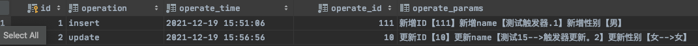
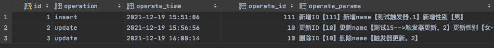

# 触发器

## 什么是触发器

触发器是与表有关的数据库对象，指在 insert/update/delete 之前或之后，触发并执行触发器中定义的SQL语句集合。触发器的这种特性可以协助应用在数据库端确保数据的完整性 , 日志记录 , 数据校验等操作 。

> 现在触发器还只支持行级触发，不支持语句级触发，行触发器表示只能针对插入、更新、删除的行数据进行操作

## 触发器中关键字 new old

**使用别名 OLD 和 NEW 来引用触发器中发生变化的记录内容**，这与其他的数据库是相似的。**现在触发器还只支持行级触发，不支持语句级触发。**即new 和 old 只能获取到行数据

new old 类似于Java方法中的this，旨在帮我们在触发器SQL中获取旧数据以及新数据，方便数据处理

| 触发器类型      | NEW 和 OLD的使用                                        |
| --------------- | ------------------------------------------------------- |
| INSERT 型触发器 | NEW 表示将要或者已经新增的数据                          |
| UPDATE 型触发器 | OLD 表示修改之前的数据 , NEW 表示将要或已经修改后的数据 |
| DELETE 型触发器 | OLD 表示将要或者已经删除的数据                          |


## 创建触发器

```sql
create trigger trigger_name 

before/after insert/update/delete #表示在目标表 insert/update/delete 操作前还是后  插入触发器

on tbl_name  #目标表

[ for each row ]  -- 表示行级触发器

begin

	trigger_stmt ; #操作逻辑

end;
```


### 案例

> 需求 ： 通过触发器 记录 account 表变更日志，包含增加、修改、删除。

1. 创建日志表结构

	```sql
	create table emp_logs(
	  id int(11) not null auto_increment,
	  operation varchar(20) not null comment '操作类型, insert/update/delete',
	  operate_time datetime not null comment '操作时间',
	  operate_id int(11) not null comment '操作表的ID',
	  operate_params varchar(500) comment '操作参数',
	  primary key(`id`)
	)engine=innodb default charset=utf8;
	```

2. 创建 insert 触发器

	```sql
	DELIMITER $
	create trigger trigger_account_insert
	    after insert
	    on account
	    for each row
	    begin
	        insert into account_logs(id, operation, operate_time, operate_id, operate_params) VALUES (null,'insert'
	        ,now(),NEW.id,concat('新增ID【',NEW.id,'】新增name【',NEW.name,'】新增性别【',NEW.sex,'】'));
	    end $
	
	insert into account (name, sex)
	values ('测试触发器.1','男');
	
	select * from account_logs;
	```

	


3. 创建 update 触发器

	```sql
	DELIMITER $
	create trigger trigger_account_update
	    after update
	    on account
	    for each row
	    begin
	        insert into account_logs(id, operation, operate_time, operate_id, operate_params) VALUES (null,'update'
	        ,now(),NEW.id,concat('更新ID【',NEW.id,'】更新name【',OLD.name,'-->',NEW.name,'】更新性别【',OLD.sex,'-->',NEW.sex,'】'));
	    end $
	
	update account set name='触发器更新。2' where id = 10;
	
	select *
	from account_logs;
	```

	

4. 创建删除触发器

	```sql
	DELIMITER $
	create trigger trigger_account_delete
	    after delete
	    on account
	    for each row
	    begin
	        insert into account_logs(id, operation, operate_time, operate_id, operate_params) VALUES (null,'update'
	        ,now(),OLD.id,concat('删除ID【',OLD.id,'】删除name【',OLD.name,'】'));
	    end $
	
	delete from account where id=10;
	
	select *
	from account_logs;
	```

	


## 查看触发器

```sql
show triggers ;
```


## 删除触发器

```sql
drop trigger trigger_name;
```

