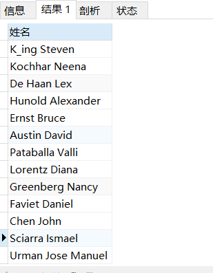
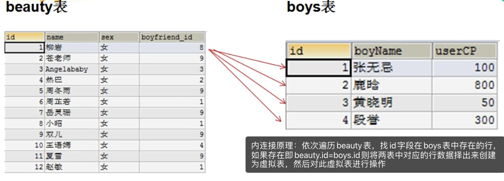
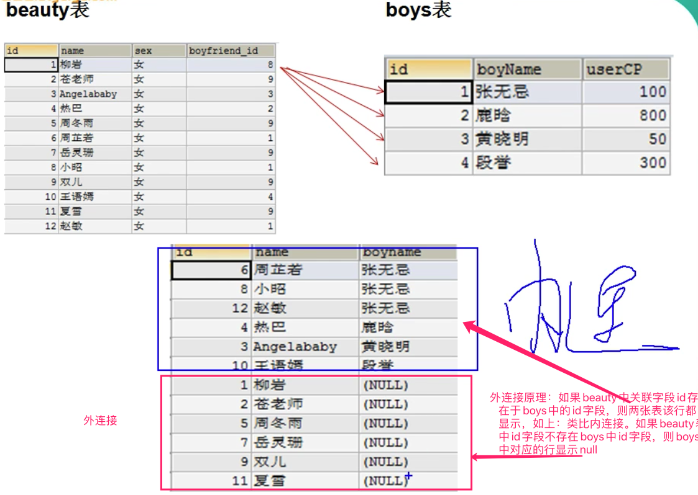
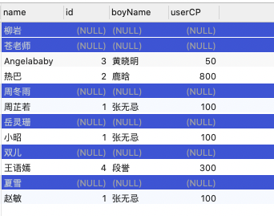
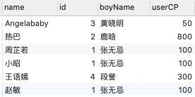
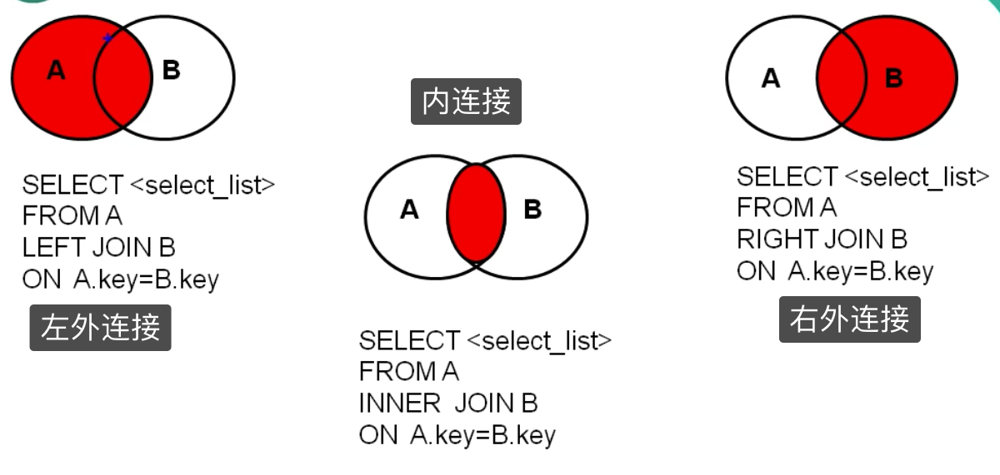
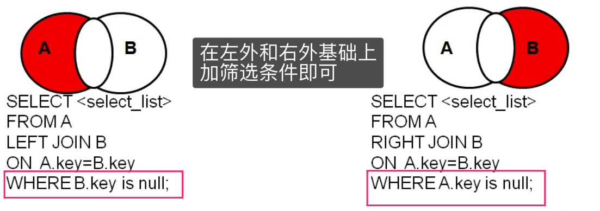
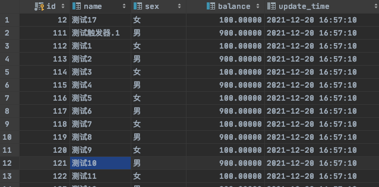
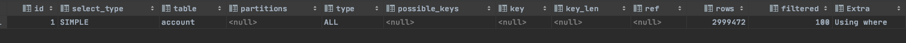

## DQL（Data Query Language）语言

>   主要负责 数据 select 

**如果使用中碰到包含空格的字符串，可以使用单引号和双引号阔起来，类似于Linux中echo的用法**

### 1、基础查询

`语法：`

```mysql
 select 查询列表 from 表名;
```

`用法`

*   查询表中的单个字段

	```mysql
	SELECT last_name FROM employees;
	```

*   查询表中的多个字段

	```mysql
	SELECT last_name,salary,email FROM employees;
	```

*   查询表中的所有字段

	```mysql
	SELECT 
	    `employee_id`,
	    `first_name`,
	    `last_name`,
	    `phone_number`,
	    `last_name`,
	    `job_id`,
	    `phone_number`,
	    `job_id`,
	    `salary`,
	    `commission_pct`,
	    `manager_id`,
	    `department_id`,
	    `hiredate` 
	FROM
	    employees ;
	    
	或者
	 SELECT * FROM employees;
	```

*   `查询函数 `

	```mysql
	SELECT VERSION();
	```

*   起别名

	>   如果要查询的字段有重名的情况，可以使用别名区分

	```mysql
	 #方式一：使用as
	SELECT 100%98 AS 结果;
	SELECT last_name AS 姓,first_name AS 名 FROM employees;
	
	#方式二：使用空格
	SELECT last_name 姓,first_name 名 FROM employees;
	
	#案例：查询salary，显示结果为 out put
	SELECT salary AS "out put" FROM employees;
	```

*   `去重`

	```mysql
	#案例：查询员工表中涉及到的所有的部门编号
	SELECT DISTINCT department_id FROM employees;
	```

*   `+号的作用 和concat函数`

	>   MySQL中 + 只起运算符作用

	*   select 100+90; 两个操作数都为数值型，则做加法运算
	*   select '123'+90;只要其中一方为字符型，试图将字符型数值转换成数值型如果转换成功，则继续做加法运算
	*   select 'john'+90;	如果转换失败，则将字符型数值转换成0
	*   select null+10; 只要其中一方为null，则结果肯定为null

	```mysql
	SELECT CONCAT('a','b','c') AS 结果;
	#案例：查询员工名和姓连接成一个字段,并且中间使用空格隔开，并显示为 姓名
	SELECT CONCAT(last_name,' ',first_name) AS 姓名 FROM employees;
	```

	


### 2、条件查询

`语法`

```mysql
select 
		查询列表
	from
		表名
	where
		筛选条件;
```

`分类：`

*   按条件表达式筛选

	```bash
	简单条件运算符：> < = != <> >= <=
	```

*   按逻辑表达式筛选

	```bash
	逻辑运算符：
	作用：用于连接条件表达式
		&& || !
		and or not
		
	&&和and：两个条件都为true，结果为true，反之为false
	||或or： 只要有一个条件为true，结果为true，反之为false
	!或not： 如果连接的条件本身为false，结果为true，反之为false
	```

*   模糊查询 配合通配符使用

	```mysql
	like     # 支持通配符
	between and    # 包含临界值	
	in     #in列表的值类型必须一致或兼容。in列表中不支持通配符
	is [not] null   #=或<>不能用于判断null值。is null或is not null 可以判断null值
	<=>   #安全等于 不仅可以用于判断普通数值也可以判断null，可读性查
	```

	==通配符==

	*   % 匹配任意多个字符，包括0个

	*   _ 匹配一个字符

		  

`案例`

*   查询工资z在10000到20000之间的员工名、工资以及奖金

	```mysql
	SELECT last_name, salary, commission_pct FROM employees WHERE salary>=10000 AND salary<=20000;
	```

*   查询部门编号不是在90到110之间，或者工资高于15000的员工信息

	```mysql
	SELECT * FROM employees WHERE NOT(department_id>=90 AND  department_id<=110) OR salary>15000;
	```

*   查询员工编号在100到120之间的员工信息

	```mysql
	SELECT
		*
	FROM
		employees
	WHERE
		employee_id BETWEEN 120 AND 100;
	```

### 3、排序查询

`语法`

```mysql
select 查询列表
from 表名
[where  筛选条件]
order by 排序的字段或表达式;
```

`特点`

* asc代表的是升序，可以省略(ascend)desc代表的是降序(descend)
* order by子句可以支持 **单个字段、别名、表达式、函数、多个字段**
* order by子句在**查询语句的最后面，除了limit子句**

`案例`

*   查询部门编号>=90的员工信息，并按员工编号降序

	```mysql
	#按单个字段排序 . 添加筛选条件再排序
	SELECT * FROM employees WHERE department_id>=90 ORDER BY employee_id DESC; 
	```

*   查询员工信息，要求先按工资降序，再按employee_id升序

	```mysql
	#按多个字段排序
	SELECT *
	FROM employees
	ORDER BY salary DESC,employee_id ASC;
	```

*   查询员工信息 按年薪降序

	```mysql
	#3、按表达式排序
	SELECT *,salary*12*(1+IFNULL(commission_pct,0))
	FROM employees
	ORDER BY salary*12*(1+IFNULL(commission_pct,0)) DESC;
	```

*   查询员工名，并且按名字的长度降序

	```mysql
	#5、按函数排序
	SELECT LENGTH(last_name),last_name 
	FROM employees
	ORDER BY LENGTH(last_name) DESC;
	```

	

### 4、常见函数

#### 单行函数

>   传入一个值，返回一个值。例如concat、length、ifnull等


`分类`

*   字符函数

	*   length

		```mysql
		#获取字节个数(utf-8一个汉字代表3个字节,gbk为2个字节)
		SELECT LENGTH('张三丰hahaha');
		```

	*   concat 

		```mysql
		#拼接字符串
		SELECT CONCAT(last_name,'_',first_name) 姓名 FROM employees;
		```

	*   substr 

		```mysql
		#截取从指定索引处后面所有字符
		SELECT SUBSTR('李莫愁爱上了陆展元',7)  out_put;
		
		#截取从指定索引处指定字符长度的字符
		SELECT SUBSTR('李莫愁爱上了陆展元',1,3) out_put;
		```

	*   instr 

		```mysql
		#返回子串第一次出现的索引，如果找不到返回0
		SELECT INSTR('杨不殷六侠悔爱上了殷六侠','殷八侠') AS out_put;
		```

	*   trim 

		```mysql
		#去掉空格
		SELECT LENGTH(TRIM('    张翠山    ')) AS out_put;
		```

	*   upper 

		```mysql
		#变大写
		#示例：将姓变大写，名变小写，然后拼接
		SELECT CONCAT(UPPER(last_name),LOWER(first_name))  姓名 FROM employees;
		```

		

	*   lower 

		```mysql
		#变小写
		#示例：将姓变大写，名变小写，然后拼接
		SELECT CONCAT(UPPER(last_name),LOWER(first_name))  姓名 FROM employees;
		```

		

	*   lpad 

		```mysql
		#用指定的字符实现左填充指定长度
		SELECT LPAD('殷素素',2,'*') AS out_put;
		```

	*   rpad 

		```mysql
		#用指定的字符实现右填充指定长度
		SELECT RPAD('殷素素',12,'ab') AS out_put;
		```

		

	*   replace

		```mysql
		#replace 替换
		SELECT REPLACE('周芷若周芷若周芷若周芷若张无忌爱上了周芷若','周芷若','赵敏') AS out_put;
		```

		

*   数学函数

	*   round

		```mysql
		SELECT ROUND(-1.55);
		SELECT ROUND(1.567,2); # 四舍五入并保留两位
		```

	*   ceil

		```mysql
		SELECT CEIL(-1.02);#向上取整
		```

	*   floor

		```mysql
		SELECT FLOOR(-9.99);#向下取整
		```

	*   truncate

		```mysql
		SELECT TRUNCATE(1.69999,1);#截断
		```

	*   mod

		```mysql
		/*
		mod(a,b) ：  a-a/b*b
		
		mod(-10,-3):-10- (-10)/(-3)*（-3）=-1
		*/
		SELECT MOD(10,-3); #取余
		SELECT 10%3;
		```

*   日期函数

	*   NOW

		```mysql
		#now 返回当前系统日期+时间
		SELECT NOW();
		#可以获取指定的部分，年、月、日、小时、分钟、秒
		SELECT YEAR(NOW()) 年;
		SELECT YEAR('1998-1-1') 年;
		#从字段中获取年
		SELECT  YEAR(hiredate) 年 FROM employees;
		```

	*   CUREATE

		```mysql
		#curdate 返回当前系统日期，不包含时间
		```

	*   CURTIME

		```mysql
		#curtime 返回当前时间，不包含日期
		```

	*   STR_TO_DATE

		```mysql
		#str_to_date 将字符通过指定的格式转换成日期
		
		SELECT STR_TO_DATE('1998-3-2','%Y-%c-%d') AS out_put;
		
		#查询入职日期为1992--4-3的员工信息
		SELECT * FROM employees WHERE hiredate = '1992-4-3';
		
		SELECT * FROM employees WHERE hiredate = STR_TO_DATE('4-3 1992','%c-%d %Y');
		```

	*   DATE_FORMAT

		```mysql
		#查询有奖金的员工名和入职日期(xx月/xx日 xx年)
		SELECT last_name,DATE_FORMAT(hiredate,'%m月/%d日 %y年') 入职日期
		FROM employees
		WHERE commission_pct IS NOT NULL;
		```

*   其他函数

	*   VERSION
	*   DATABASE
	*   USER
	*   DATEDIFF : 计算两个日职差值几天

*   流程控制函数

	*   if函数

		```mysql
		#三目元算符效果
		SELECT IF(10<5,'大','小');
		
		SELECT last_name,commission_pct,IF(commission_pct IS NULL,'没奖金，呵呵','有奖金，嘻嘻') 备注
		FROM employees;
		```

	*   case函数

		*   格式一

			```bash
			#switch case 的效果
			case 要判断的字段或表达式
			when 常量1 then 要显示的值1或语句1;
			when 常量2 then 要显示的值2或语句2;
			...
			else 要显示的值n或语句n;
			end
			```

			```mysql
			SELECT salary 原始工资,department_id,
			CASE department_id
			WHEN 30 THEN salary*1.1
			WHEN 40 THEN salary*1.2
			WHEN 50 THEN salary*1.3
			ELSE salary
			END AS 新工资
			FROM employees;
			```

		*   格式二

			```bash
			#类似于 多重if 效果
			case 
			when 条件1 then 要显示的值1或语句1
			when 条件2 then 要显示的值2或语句2
			。。。
			else 要显示的值n或语句n
			end
			```

			```mysql
			#案例：查询员工的工资的情况
			如果工资>20000,显示A级别
			如果工资>15000,显示B级别
			如果工资>10000，显示C级别
			否则，显示D级别
			```

			

#### 分组函数

>   传入一组值，返回一个值。一般用于统计。又称为统计函数、聚合函数、组函数

`特点`

```bash
1、sum、avg一般用于处理数值型.max、min、count可以处理任何类型
2、以上分组函数都忽略null值
3、可以和distinct搭配实现去重的运算
4、count函数的单独介绍,一般使用count(*)用作统计行数
5、和分组函数一同查询的字段要求是group by后的字段
	比如SELECT AVG(salary),employee_id  FROM employees; 其中employee_id结果有很多行，而分组函数AVG只有一行，表结构不对。 
```


*   sum   求和
*   avg    平均值
*   max    最大值
*   min    最小值
*   count  计算个数 (如果计算某个列，当列中有一个为null则不会统计)


`案例`

```mysql
#简单的使用
SELECT SUM(salary) FROM employees;
SELECT AVG(salary) FROM employees;
SELECT MIN(salary) FROM employees;
SELECT MAX(salary) FROM employees;
SELECT COUNT(salary) FROM employees;

#和distinct搭配   ---> 去重后求和
SELECT SUM(DISTINCT salary),SUM(salary) FROM employees;
SELECT COUNT(DISTINCT salary),COUNT(salary) FROM employees;

#count
SELECT COUNT(salary) FROM employees;   #当列中有一个为null则不会统计
SELECT COUNT(*) FROM employees;   #统计表行数，用的较多
SELECT COUNT(1) FROM employees; #1 可以常量值比如说2、‘hello’等。
#效率：
MYISAM存储引擎下  ，COUNT(*)的效率高
INNODB存储引擎下，COUNT(*)和COUNT(1)的效率差不多，比COUNT(字段)要高一些
```

### 5、分组函数

>   如上

### 6、分组查询

`语法`

```mysql
select 查询列表
from 表
【where 筛选条件】
group by 分组的字段
【order by 排序的字段】;
```

`特点：`

1.  和分组函数一同查询的字段必须包含group by后出现的字段
2.  **分组支持单个字段、多个字段、函数和表达式**
3.  可以搭配着排序、筛选、having使用

`案例`

```mysql
#1.简单的分组(即使用原始表字段分组)

#案例1：查询每个工种的员工平均工资
SELECT AVG(salary),job_id
FROM employees
GROUP BY job_id;

#案例2：查询每个位置的部门个数
SELECT COUNT(*),location_id
FROM departments
GROUP BY location_id;
```

```mysql
#2.筛选条件--where

#案例1：查询邮箱中包含a字符的 每个部门的最高工资，
SELECT MAX(salary),department_id
FROM employees
WHERE email LIKE '%a%'
GROUP BY department_id;
```

```mysql
#3.筛选条件--having

#案例1：查询哪个部门的员工个数>2
①查询每个部门的员工个数
SELECT COUNT(*),department_id
FROM employees
WHERE department_id is not null
GROUP BY department_id;
②根据①的结果进行筛选
SELECT COUNT(*),department_id
FROM employees
WHERE department_id is not null
GROUP BY department_id
HAVING COUNT(*)>2;
```

> 从案例2和案例3，我们发现：
>
> * <font color=ff00aa>having和where作用都是筛选</font>
> * <font color=ff00aa>having和where位置不一样，having在group by后面，where在group by前面</font>
> * <font color=ff00aa>having是group by固定搭配，不能出现在没有group by语句中，而where则是万金油</font>
> * <font color=ff00aa>having可以处理虚拟表字段，而where只能处理原始表中字段</font>   
> * <font color=ff00aa>where性能高于having</font>
>
> > **原始表**即真实的表，**虚拟表**即由原始表处理之后的表，例如count(*)为虚拟字段，而department_id为真实字段

```mysql
#4.添加排序

#案例1：每个工种有奖金的员工的最高工资>6000的工种编号和最高工资,按最高工资升序
①查询每个工种有奖金的员工的最高工资
SELECT MAX(salary),job_id
FROM employees
GROUP BY job_id
②根据①的结果进行筛选,查询出最高工资大于6000并排序
SELECT MAX(salary),job_id
FROM employees
WHERE commission_pct IS NOT NULL
GROUP BY job_id
ORDER BY MAX(salary) ASC;
```

```mysql
#5.多字段分组
#案例：查询每个工种每个部门的最低工资,并按最低工资降序
SELECT MIN(salary),job_id,department_id
FROM employees
GROUP BY job_id,department_id
ORDER BY MIN(salary) DESC;
```

```mysql
#6.函数表达式分组
#案例：按员工姓名的长度分组，查询每一组的员工个数,并筛选员工个数>5
SELECT COUNT(*) as num,LENGTH(CONCAT(first_name,last_name)) AS 长度
FROM employees
GROUP BY LENGTH(CONCAT(first_name,last_name))
HAVING num>5;
```


### 7、连接查询(不推荐，影响性能)

> * 又称多表查询，当查询的字段来自于多个表时，就会用到连接查询
> * <font color=ff00aa>不推荐使用，建议单表查询出后在代码中进行处理</font>

`错误的查询`

```mysql
笛卡尔乘积现象：表1 有m行，表2有n行，结果=m*n行
select * from 表1,表2   结果就是m*n行。
```

`如何避免笛卡尔积现象`

```bash
添加有效的连接条件
```


#### 连接分类

* 内连接  inner(sql 92标准，和sql99标准都有)
	* 等值连接
	* 非等值连接
	* 自连接
* 外连接 (只有sql 99标准有)
	* 左外连接 left [outer]
	* 右外连接  right [outer]
	* 全外连接 full [outer]
* 交叉连接 cross : 笛卡尔积情况

> sql92和sql99内连接本质是一样的，都是两种语法格式，区别在于外语法更加规范直观

> <font color=ff00aa size=4>内连接使用条件是关联条件，即A表中某个字段等于B表中某个字段，然后进行筛选。如果关联条件为“A表中某个字段不存在与B表中某个字段” 则适合外连接</font>。如下图





`sql92和sql99 内连接语法区别`

* sql92内连接

	```mysql
	SELECT XXXX
	FROM 表1 别名，表2 别名
	WHERE 连接条件
	GROUP BY
	HAVING
	ORDER BY
	```

* sql99内连接

	```mysql
	SELECT XXXX
	FROM 表1 别名 [连接类型] join 表2 别名
	on 连接条件
	WHERE
	GROUP BY
	HAVING
	ORDER BY
	```

	

#### 案例

##### 1、sql92 内连接

* 等值连接

	> 连接条件为  = 

	```mysql
	#简单使用
	#案例1：查询员工名和对应的部门名
	SELECT last_name,department_name
	FROM employees,departments
	WHERE employees.`department_id`=departments.`department_id`;
	```

	```mysql
	#添加筛选
	#案例1：查询有奖金的员工名、部门名
	SELECT last_name,department_name
	FROM departments,employees
	WHERE departments.department_id=employees.department_id AND commission_pct IS NOT NULL
	```

	```mysql
	#添加分组
	#案例1：查询每个城市的部门个数
	SELECT COUNT(*) 个数,city
	FROM locations,departments
	WHERE locations.location_id=departments.location_id
	GROUP BY locations.city
	#案例2：查询有奖金的每个部门的部门名和部门的领导编号和该部门的最低工资
	SELECT department_name,d.`manager_id`,MIN(salary)
	FROM departments d,employees e
	WHERE d.`department_id`=e.`department_id`
	AND commission_pct IS NOT NULL
	GROUP BY department_name,d.`manager_id`;
	```

	```mysql
	#添加排序
	#案例1：查询每个工种的工种名和员工的个数，并且按员工个数降序
	SELECT job_title,COUNT(*)
	FROM jobs,employees
	WHERE jobs.job_id=employees.job_id
	GROUP BY jobs.job_title
	ORDER BY COUNT(*) DESC;
	```

* 非等值连接

	> 连接条件不为 = 

	```mysql
	#简单使用
	#案例1：查询员工的工资和工资级别
	SELECT salary,grade_level
	FROM employees e,job_grades g
	WHERE salary BETWEEN g.`lowest_sal` AND g.`highest_sal`
	AND g.`grade_level`='A';
	```

* 自链接

	> 自己和自己表关联，即要查询的信息都在一张表中

	```mysql
	#简单使用
	#案例1：查询 员工名和上级的名称
	SELECT y.employee_id,y.last_name,l.employee_id,l.last_name
	FROM employees y,employees l
	WHERE y.manager_id=l.employee_id
	```

##### 2、sql 99 内连接 + 外连接

* 内连接

  `语法`

  ```mysql
  SELECT XXXX
  FROM 表1 别名 inner join 表2 别名
  on 连接条件
  WHERE
  GROUP BY
  HAVING
  ORDER BY
  ```

  `案例`

  * 等值连接

  	```mysql
  	#简单使用
  	#案例1：查询员工名和对应的部门名
  	SELECT last_name,department_name
  	FROM employees e inner join departments d
  	on e.`department_id`=d.`department_id`
  	
  	#案例2.查询名字中包含e的员工名和工种名（添加筛选）
  	SELECT e.last_name,j.job_title
  	FROM employees e INNER JOIN jobs j
  	on e.job_id = j.job_id
  	WHERE e.last_name LIKE '%e%'
  	```

  	```mysql
  	#多表关联
  	#案例1：查询员工名、部门名、工种名，并按部门名降序（添加三表连接）
  	SELECT last_name,department_name,job_title
  	FROM employees e
  	INNER JOIN departments d ON e.`department_id`=d.`department_id`
  	INNER JOIN jobs j ON e.`job_id` = j.`job_id`
  	ORDER BY department_name DESC;
  	```

  * 非等值连接

  	```mysql
  	#案例1：查询工资级别的个数》2的个数，并按照工资级别降序
  	SELECT COUNT(*),grade_level
  	FROM employees e
  	 JOIN job_grades g
  	 ON e.`salary` BETWEEN g.`lowest_sal` AND g.`highest_sal`
  	 GROUP BY grade_level
  	 HAVING COUNT(*)>20
  	 ORDER BY grade_level DESC;
  	```

  * 子连接

  	```mysql
  	 #查询员工的名字、上级的名字
  	 SELECT e.last_name,m.last_name
  	 FROM employees e
  	 JOIN employees m
  	 ON e.`manager_id`= m.`employee_id`;
  	```

* 外连接

	> 外连接的查询结果为主表中所有的记录
	>
	> ​		如果从表中有和它匹配的，则显示匹配结果
	>
	> ​		如果从表中没有和它匹配的，则显示null
	>
	> ​		外连接查询结果 = 内连接结果 + 主表中有而从表中没有的记录
	>
	> > 左外连接：·left join 左面的是主表
	> >
	> > 右外连接：right join 右面的是主表

	`语法`

	```mysql
	SELECT XXXX
	FROM 表1 别名 [连接类型] outer join 表2 别名
	on 连接条件
	WHERE
	GROUP BY
	HAVING
	ORDER BY
	```

	

	`案例`

	* 左外连接

		```mysql
		# 引入案例
		# 案例1：查询男朋友 不在男神表的的女神名
		#①我们要查询女神名，因此包含女神名字段的表为主表
		SELECT beauty.name,boys.*
		FROM beauty LEFT OUTER JOIN boys
		ON beauty.boyfriend_id=boys.id;
		```

		

		```mysql
		# 上图中查询出了所有结果集，包含内连接外连接的，然后进行筛选出外连接，即只要boys表中为null的行
		SELECT beauty.name,boys.*
		FROM beauty LEFT OUTER JOIN boys
		ON beauty.boyfriend_id=boys.id
		WHERE boys.id IS NOT NULL
		```

		

		```mysql
		#案例2：查询哪个部门没有员工
		#1. 要查询部门字段，因此部门字段所在的表为主表
		SELECT d.*,e.employee_id
		FROM departments d 
		LEFT OUTER JOIN employees e
		ON e.department_id=d.manager_id
		WHERE employee_id is not null
		```

		

	* 右外连接

		```mysql
		# 案例1：查询男朋友 不在男神表的的女神名
		#①和左外连接主表相反即可
		SELECT beauty.name,boys.*
		FROM boys RIGHT OUTER JOIN beauty
		ON beauty.boyfriend_id=boys.id;
		```

		```mysql
		#案例2：查询哪个部门没有员工
		#1. 要查询部门字段，因此部门字段所在的表为主表
		SELECT d.*,e.employee_id
		FROM employees e 
		LEFT OUTER JOIN departments d
		ON e.department_id=d.manager_id
		WHERE d.department_id is not null
		```

	

#### `总结`





### 8、子查询

> 出现在其他语句中的select语句，称为子查询或内查询 外部的查询语句，称为主查询或外查询

`分类`
按子查询出现的位置：

* select后面：

	仅仅支持标量子查询

* from后面：
	支持表子查询

* where或having后面：★

	支持标量子查询（单行） √

	支持列子查询  （多行） √
	支持行子查询 （多列多行）

* exists后面（相关子查询）

	支持表子查询

	> 先执行父查询，后对父查询进行过滤


#### where或having 后面

* 支持标量子查询（单行） √
* 支持列子查询  （多行） √
* 支持行子查询 （多列多行）

`特点`

* 子查询放在小括号内 
* 子查询一般放在条件的右侧 
* 标量子查询，一般搭配着单行操作符使用【> < >= <= = <>】
* 列子查询，一般搭配着多行操作符使用【in、any/some、all】
* 子查询的执行优先于主查询执行，主查询的条件用到了子查询的结果

`案例`

* 标量子查询

	```mysql
	#案例1：谁的工资比 Abel 高?  -- where
	#①查询Abel的工资
	SELECT salary
	FROM employees
	WHERE last_name = 'Abel'
	
	#②查询员工的信息，满足 salary>①结果
	SELECT *
	FROM employees
	WHERE salary>(
		SELECT salary
		FROM employees
		WHERE last_name = 'Abel'
	);
	```

	```mysql
	#案例2：返回job_id与141号员工相同，salary比143号员工多的员工 姓名，job_id 和工资  -- where
	
	#①查询141号员工的job_id  
	SELECT job_id
	FROM employees
	WHERE employee_id = 141
	
	#②查询143号员工的salary
	SELECT salary
	FROM employees
	WHERE employee_id = 143
	
	#③查询员工的姓名，job_id 和工资，要求job_id=①并且salary>②
	
	SELECT last_name,job_id,salary
	FROM employees
	WHERE job_id = (
		SELECT job_id
		FROM employees
		WHERE employee_id = 141
	) AND salary>(
		SELECT salary
		FROM employees
		WHERE employee_id = 143
	);
	```

	```mysql
	#案例3：查询最低工资大于50号部门最低工资的部门id和其最低工资   -- having
	
	#①查询50号部门的最低工资
	SELECT  MIN(salary)
	FROM employees
	WHERE department_id = 50
	
	#②查询每个部门的最低工资
	
	SELECT MIN(salary),department_id
	FROM employees
	GROUP BY department_id
	
	#③ 在②基础上筛选，满足min(salary)>①
	SELECT MIN(salary),department_id
	FROM employees
	GROUP BY department_id
	HAVING MIN(salary)>(
		SELECT  MIN(salary)
		FROM employees
		WHERE department_id = 50
	);
	
	```

	> <font color=ff00aa size=4>子查询结果必须是一行一列</font>

* 多行子查询

	> 返回多行，使用多行比较操作符。

	* IN/NOT IN  :    等于子查询返回值中的任意一个
	* ANY|SOME :    和子查询返回值中任意一个值比较
	* ALL           ：   和子查询返回值所有值比较

	`案例`

	```mysql
	#案例1：返回location_id是1400或1700的部门中的所有员工姓名
	#①查询location_id是1400或1700的部门编号
	#②查询员工姓名，要求部门号是①列表中的某一个
	SELECT last_name
	FROM employees
	WHERE department_id IN(
		SELECT department_id
	  FROM departments
	  WHERE location_id IN(1400,1700)
	)
	
	
	#案例2：返回其它工种中比job_id为‘IT_PROG’工种任一工资低的员工的员工号、姓名、job_id 以及salary
	#①查询job_id为‘IT_PROG’部门任一工资
	#②查询员工号、姓名、job_id 以及salary，salary<(①)的任意一个
	SELECT employee_id,last_name,job_id,salary
	FROM employees
	WHERE salary < ANY(
		SELECT salary
	  FROM employees
	  WHERE job_id='IT_PROG'
	)
	ORDER BY salary ASC
	```

* 行子查询

	> 多行多列或者一行多列

	```mysql
	#案例：查询员工编号最小并且工资最高的员工信息
	#①查询最小的员工编号
	SELECT MIN(employee_id)
	FROM employees
	
	#②查询最高工资
	SELECT MAX(salary)
	FROM employees
	
	#③查询员工信息
	SELECT *
	FROM employees
	WHERE employee_id=(
		SELECT MIN(employee_id)
		FROM employees
	)AND salary=(
		SELECT MAX(salary)
		FROM employees
	);
	#针对上面这种情况可以使用行子查询进行替换，如下
	SELECT * 
	FROM employees
	WHERE (employee_id,salary)=(
		SELECT MIN(employee_id),MAX(salary)
		FROM employees
	);
	```

### 9、分页查询

> 分页提交SQL请求

`语法`

```mysql
select 查询列表
	from 表
	【join type join 表2
	on 连接条件
	where 筛选条件
	group by 分组字段
	having 分组后的筛选
	order by 排序的字段】
	limit 【offset,】size;
	
#offset要显示条目的起始索引（起始索引从0开始）
#size 要显示的条目个数
```

`案例`

```mysql
#案例1：查询前五条员工信息
SELECT * FROM  employees LIMIT 0,5;
SELECT * FROM  employees LIMIT 5; #offset如果为0可省略
```

> Page 分页。  Offset = (page-1)*size   

### 10、union联合查询

`应用场景`

要查询的结果来自多个表，且多个表没有直接的连接关系，但查询的信息一致

`特点`

* 要求多条查询语句的查询列数是一致的！
* 要求多条查询语句的查询的每一列的类型和顺序最好一致
* union关键字默认去重，如果**使用union all 可以包含重复项**

`案例`

```mysql
#引入的案例：查询部门编号>90或邮箱包含a的员工信息
SELECT * FROM employees  WHERE email LIKE '%a%'
UNION
SELECT * FROM employees  WHERE department_id>90;
#案例：查询中国用户中男性的信息以及外国用户中年男性的用户信息
SELECT id,cname FROM t_ca WHERE csex='男'
UNION ALL
SELECT t_id,tname FROM t_ua WHERE tGender='male';
```


## 正则表达式

> MySQL同样只是正则表达式进行查询，之后会给出300w数据正则和like的性能对比。


### 1、语法

| 符号   | 含义                          |
| ------ | ----------------------------- |
| ^      | 在字符串开始处进行匹配        |
| $      | 在字符串末尾处进行匹配        |
| .      | 匹配任意单个字符, 包括换行符  |
| [...]  | 匹配出括号内的任意字符        |
| [^...] | 匹配不出括号内的任意字符      |
| a*     | 匹配零个或者多个a(包括空串)   |
| a+     | 匹配一个或者多个a(不包括空串) |
| a?     | 匹配零个或者一个a             |
| a1\|a2 | 匹配a1或a2                    |
| a(m)   | 匹配m个a                      |
| a(m,)  | 至少匹配m个a                  |
| a(m,n) | 匹配m个a 到 n个a              |
| a(,n)  | 匹配0到n个a                   |
| (...)  | 将模式元素组成单一元素        |


```sql
select * from account where name regexp '^测试';
select * from account where name regexp '[4,5]';
select * from account where name regexp '1(2,5)';
```


### 2、正则和like 性能对比

> 表中有数据300w。name都是以【测试...】开头。并且name_sex_balance 是联合索引



#### 全量查询

```sql
select * from account where name regexp '^测试';
select * from account where name like '测试%';
```

* 正则耗时以及分析计划

	```sql
	myemployees> select * from account where name regexp '^测试'
	[2021-12-25 16:05:35] 3000003 rows retrieved starting from 1 in 34 s 741 ms (execution: 3 ms, fetching: 34 s 738 ms)
	```




* like耗时以及分析计划

	```sql
	myemployees> select * from account where name like '测试%'
	[2021-12-25 16:07:43] 3000003 rows retrieved starting from 1 in 29 s 678 ms (execution: 3 ms, fetching: 29 s 675 ms)
	```


#### 部分查询


* 正则耗时以及分析计划

	```sql
	myemployees> select * from account where name regexp '9+'
	[2021-12-25 16:11:49] 1405677 rows retrieved starting from 1 in 14 s 302 ms (execution: 4 ms, fetching: 14 s 298 ms)
	```


* like耗时以及分析计划

	```sql
	myemployees> select * from account where name like '%9%'
	[2021-12-25 16:13:57] 1405677 rows retrieved starting from 1 in 14 s 300 ms (execution: 3 ms, fetching: 14 s 297 ms)
	```

	
