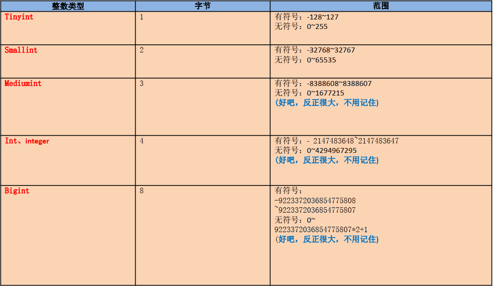
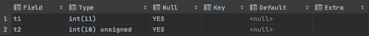
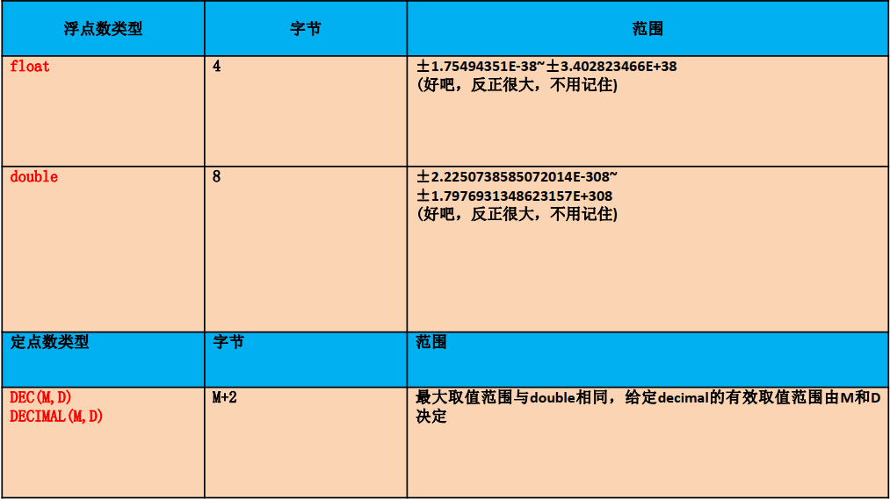
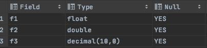
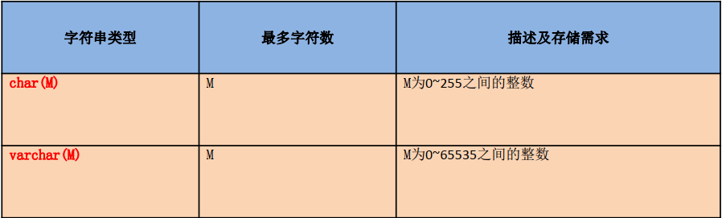
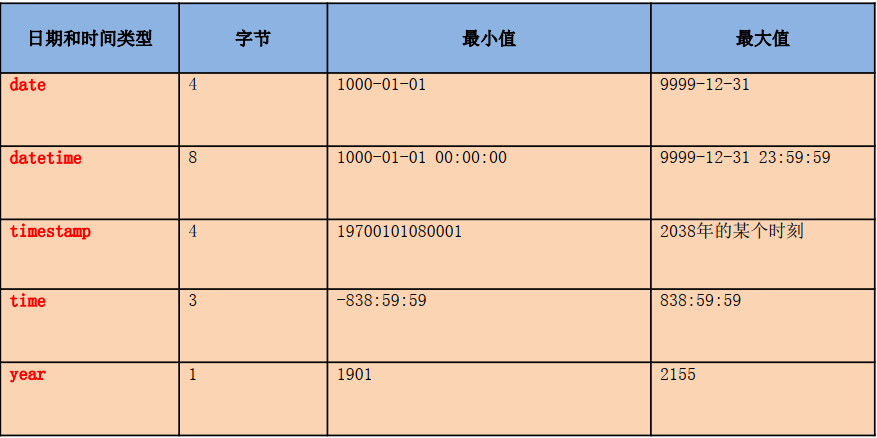
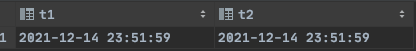
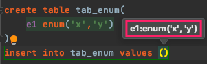
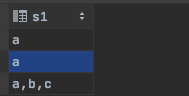
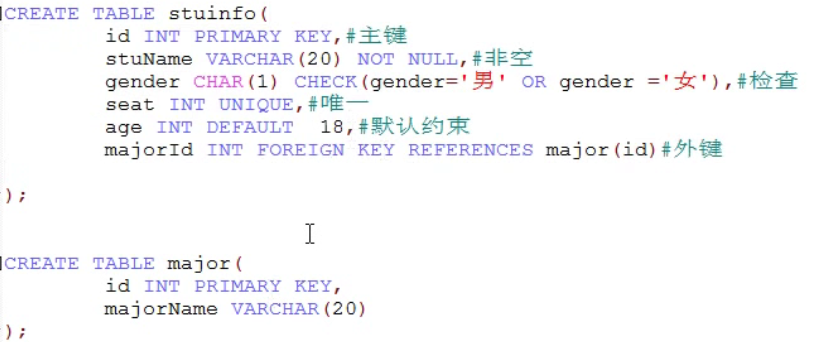

## 数据类型

### 数值类型

#### 整型



* 无符号和有符号

	```sql
	create table tab_int
	(
	    t1 int, #默认有符号，默认长度为11
	    t2 int unsigned #设置无符号，默认长度为10，存入负数会有警告，获取负数值时返回0，因为底线值为0
	);
	desc tab_int
	```

	

* 如果插入的数值超过了整型的范围，会报异常，并且插入的是临界值


#### 小数

* **定点数：更加精确**
* 浮点数: 相对精度还行



> 定点数意思就是在浮点数基础上通过给定【整数长度+小数长度=M，小数长度=D】的方式来精确数字

```sql
create table tab_float(
    f1 float,
    f2 double,
    f3 decimal #默认M=10,D=0
);
DESC tab_float
```




### 字符类型

* 较短的文本
	* char 定长，效率高，适用于类型固定的数据，比如性别
	* varchar 可变长度，效率相对低，适用于数据不固定的数据，比如地址信息
* 较长的文本
	* text
	* blob(二进制)




### 日期类型 : 推荐 timestamp



> * Timestamp支持的时间范围较小，取值范围：19700101080001——2038年的某个时间。Datetime的取值范围： 1000-1-1 ——9999—12-31
> * <font color=ff00aa size=4>timestamp和实际时区有关，更能反映实际的日期，而datetime则只能反映出插入时的当地时区</font>，**例如服务器更改了时区，datetime时间不会随着改变，而timestamp会随着时区的改变而调整。**
> * timestamp的属性受Mysql版本和SQLMode的影响很大

```sql
create table tab_time(
    t1 datetime,
    t2 timestamp
);
insert into tab_time (t1, t2) values (now(),now());
select * from tab_time;
```




### 二进制

* binary
* varbinary

> 类似于char和varchar，不同的是它们包含二进制字符串而不包含非二进制字符串


### 枚举

> 又称为枚举类型哦，要求插入的值必须属于字段给定列表值之一。

```sql
create table tab_enum(
    e1 enum('x','y')
);
insert into tab_enum values ('x')
```




### Set类型

> 和Enum类型类似，**里面可以保存0~64个成员**。和Enum类型最大的区别是： **SET类型一次可以选取多个成员，而Enum只能选一个**

```sql
create table tab_set(
    s1 set('a','b','c','d')
);

insert into tab_set (s1) values ('a');
insert into tab_set (s1) values ('a,B,c'); # 不区分大小写

select * from tab_set
```




## 约束

### 什么是约束

> 为了保证数据的一致性和完整性， SQL规范以约束的方式对表数据进行额外的条件限制。


### 常见约束

* – NOT NULL 非空约束，规定某个字段不能为空。【空字符串""和0不是null】
* – UNIQUE 唯一约束，规定某个字段在整个表中是唯一的，可以为空，就是可以不写，写了就不能重复
* – PRIMARY KEY 主键约束(非空且唯一)
* – FOREIGN KEY 外键约束
* – CHECK 检查约束
* – DEFAULT 默认值，保证该字段有默认值


### 约束添加时机

* 创建表时
* **数据插入前**修改表时


### 约束分类

* 表级约束

	处了非空、默认。其他都支持

* 列级约束

	六大约束都支持，但是外键约束没有效果


### 案例

 