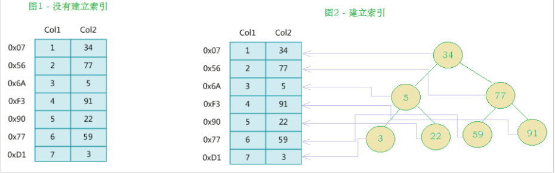
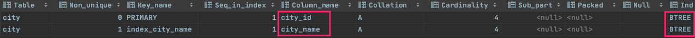
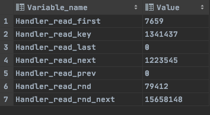

# 索引

## 什么是索引

索引（index）是帮助MySQL高效获取数据的数据结构（有序）。在数据之外，数据库系统还维护者满足特定查找算法的数据结构，这些数据结构以某种方式引用（指向）数据， 这样就可以在这些数据结构上实现高级查找算法，这种数据结构就是索引。



> 左边是数据表，一共有两列七条记录，最左边的是数据记录的物理地址（注意逻辑上相邻的记录在磁盘上也并不是一定物理相邻的）。为了加快Col2的查找，可以维护一个右边所示的二叉查找树，每个节点分别包含索引键值和一个指向对应数据记录物理地址的指针，这样就可以运用二叉查找快速获取到相应数据。
>
> * 一般来说索引本身也很大，不可能全部存储在内存中，因此索引往往以索引文件的形式存储在磁盘上。索引是数据库中用来提高性能的最常用的工具。
>
> * 索引就是一个key-value键值对key存储了索引值，value存储了索引所在行的磁盘地址


## 索引优势和劣势

### 优势

* 类似于书籍的目录索引，提高数据检索的效率，降低数据库的IO成本。

* 通过索引列对数据进行排序，降低数据排序的成本，降低CPU的消耗。

### 劣势

* 实际上索引也是一张表，该表中保存了主键与索引字段，并指向实体类的记录，所以索引列也是要占用空间的。

* 虽然索引大大提高了查询效率，同时却也降低更新表的速度，如对表进行INSERT、UPDATE、DELETE。因为更新表时，MySQL 不仅要保存数据，还要保存一下索引文件每次更新添加了索引列的字段，都会调整因为更新所带来的键值变化后的索引信息。


## 索引类型

> 前面我们讲到，索引就是提高查询效率的一种 数据结构，其本身占据一定的磁盘容量，空间换时间。既然是数据结构就不至一种。


* BTREE 索引 ： 最常见的索引类型，大部分索引都支持 B 树索引。
* HASH 索引：只有Memory引擎支持 ， 使用场景简单 。
* R-tree 索引（空间索引）：空间索引是MyISAM引擎的一个特殊索引类型，主要用于地理空间数据类型，通常使用较少，不做特别介绍。
* Full-text （全文索引） ：全文索引也是MyISAM的一个特殊索引类型，主要用于全文索引，InnoDB从Mysql5.6版本开始支持全文索引。

**MyISAM、InnoDB、Memory三种存储引擎对各种索引类型的支持**

| 索引        | InnoDB引擎      | MyISAM引擎 | Memory引擎 |
| ----------- | --------------- | ---------- | ---------- |
| BTREE索引   | 支持            | 支持       | 支持       |
| HASH 索引   | 不支持          | 不支持     | 支持       |
| R-tree 索引 | 不支持          | 支持       | 不支持     |
| Full-text   | 5.6版本之后支持 | 支持       | 不支持     |


## 索引分类

* 单值索引 ：即一个索引只包含单个列，**但是一个表可以有多个单列索引**

	简单来讲就是 一张表比如IP，很频繁的使用IP进行检索表数据，那么就可以给这个IP列设置索引，提高IP检索效率。

* 唯一索引 ：索引列的值必须唯一，但允许有空值

	简单来讲就是 IP列允许空值，但是须保证其唯一性。

* 复合索引 ：即一个索引包含多个列

	类似于符合主键，表中常用IP和端口进行检索，那么就可以将IP+端口设置为索引。**并且复合索引遵守最左原则**。如下：

	```sql
	CREATE INDEX idx_name_email_status ON tb_seller(NAME,email,status);
	```
	
	> 创建复合索引,就相当于
	> <font color=ff00aa size=4>对name 创建索引 ;</font>
	>
	> <font color=ff00aa size=4>对name , email 创建了索引 ;</font>
	>
	> <font color=ff00aa size=4>对name , email, status 创建了索引 ;</font>
	>
	> <font color=ff00aa size=4>并没有单独堆email 和status创建索引</font>


## 索引语法

### 1、创建索引

```mysql
CREATE 	[UNIQUE|FULLTEXT|SPATIAL]  INDEX index_name 
[USING  index_type]
ON tbl_name(index_col_name,...)
# [UNIQUE|FULLTEXT|SPATIAL] 为索引类型 (唯一、全文索引)
# USING  index_type 索引数据结构(b+tree还是其他)
index_col_name : column_name[(length)][ASC | DESC]
```

> MySQL中主键默认有索引，即主键索引

```sql
create index index_city_name on city(city_name);
```


### 2、查看索引

```sql
show index from city;
```




### 3、删除索引

```sql
DROP  INDEX  index_name  ON  table_name;
```


### 4、alter添加索引

```sql
1). alter  table  tb_name  add  primary  key(column_list); 

	该语句添加一个主键，这意味着索引值必须是唯一的，且不能为NULL,即主键索引
	
2). alter  table  tb_name  add  unique index_name(column_list);
	
	这条语句创建索引的值必须是唯一的（除了NULL外，NULL可能会出现多次）
	
	例如：alter table city add unique index_cityname(city_name);
	
3). alter  table  tb_name  add  index index_name(column_list);

	添加普通索引， 索引值可以出现多次。
	
	例如：alter table city add index index_xxxx(xxxx);
	
4). alter  table  tb_name  add  fulltext  index_name(column_list);
	
	该语句指定了索引为FULLTEXT， 用于全文索引
```


## 索引设计原则

索引的设计可以遵循一些已有的原则，创建索引的时候请尽量考虑符合这些原则，便于提升索引的使用效率，更高效的使用索引。

- 对查询频次较高，且数据量比较大的表建立索引。
- 索引字段的选择，最佳候选列应当从where子句的条件中提取，如果where子句中的组合比较多，那么应当挑选最常用、过滤效果最好的列的组合。
- **使用唯一索引，区分度越高，使用索引的效率越高**。
- **索引可以有效的提升查询数据的效率，但索引数量不是多多益善，索引越多，维护索引的代价自然也就水涨船高**。对于插入、更新、删除等DML操作比较频繁的表来说，索引过多，会引入相当高的维护代价，降低DML操作的效率，增加相应操作的时间消耗。另外索引过多的话，MySQL也会犯选择困难病，虽然最终仍然会找到一个可用的索引，但无疑提高了选择的代价。
- 使用短索引，索引创建之后也是使用硬盘来存储的，因此提升索引访问的I/O效率，也可以提升总体的访问效率。假如构成索引的字段总长度比较短，那么在给定大小的存储块内可以存储更多的索引值，相应的可以有效的提升MySQL访问索引的I/O效率。
- 利用最左前缀，N个列组合而成的组合索引，那么相当于是创建了N个索引，如果查询时where子句中使用了组成该索引的前几个字段，那么这条查询SQL可以利用组合索引来提升查询效率。


## 索引失效

> 并不是添加了索引就能够提交效率，而是正确使用了索引才能提交效率，见《第十一章-SQL优化》中索引解决方案


## 单列索引和复合索引

> 尽量使用复合索引，而少使用单列索引 。

```mysql
创建复合索引
create index idx_name_sta_address on tb_seller(name, status, address);

就相当于创建了三个索引 ： 
	name
	name + status
	name + status + address
```


```mysql
创建单列索引
create index idx_seller_name on tb_seller(name);
create index idx_seller_status on tb_seller(status);
create index idx_seller_address on tb_seller(address);
```

数据库会选择一个最优的索引（辨识度最高索引）来使用，并不会使用全部索引 。


## 查看索引使用情况

```sql
show status like 'Handler_read%';	 -- session

show global status like 'Handler_read%';  -- 全局
```



> Handler_read_first：索引中第一条被读的次数。如果较高，表示服务器正执行大量全索引扫描（这个值越低越好）。
>
> Handler_read_key：如果索引正在工作，这个值代表一个行被索引值读的次数，如果值越低，表示索引得到的性能改善不高，因为索引不经常使用（这个值越高越好）。
>
> Handler_read_next ：按照键顺序读下一行的请求数。如果你用范围约束或如果执行索引扫描来查询索引列，该值增加。
>
> Handler_read_prev：按照键顺序读前一行的请求数。该读方法主要用于优化ORDER BY ... DESC。
>
> Handler_read_rnd ：根据固定位置读一行的请求数。如果你正执行大量查询并需要对结果进行排序该值较高。你可能使用了大量需要MySQL扫描整个表的查询或你的连接没有正确使用键。这个值较高，意味着运行效率低，应该建立索引来补救。
>
> Handler_read_rnd_next：在数据文件中读下一行的请求数。如果你正进行大量的表扫描，该值较高。通常说明你的表索引不正确或写入的查询没有利用索引。
