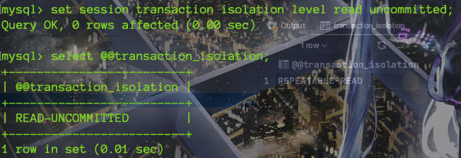

# TCL（Trasaction Controller Language）语言

>   事务、视图、存储过程等相关操作

* 事务

	事务由单独单元的一个或多个SQL语句组成，在这个单元中，每个MySQL语句是相互依赖的。而整个单独单元作为一个不可分割的整体，如果单元中某条SQL语句一旦执行失败或产生错误，整个单元将会回滚。所有受到影响的数据将返回到事物开始以前的状态；如果单元中的所有SQL语句均执行成功，则事物被顺利执行。

* 存储引擎

	在mysql中的数据用各种不同的技术存储在文件（或内存）中。这个技术就是存储引擎。在mysql中用的最多的存储引擎有： innodb，myisam ,memory 等。**其中innodb支持事务**，而
	myisam、 memory等不支持事务

​		`查看MySQL支持的存储引擎` : show engines

​		


## 事务

### 事务四大特性

* 原子性（Atomicity）
	原子性是指事务是一个不可分割的工作单位，事务中的操作要么都发生，要么都不发生。

* 一致性（Consistency）
	事务必须使数据库从一个一致性状态变换到另外一个一致性状态

* 隔离性（Isolation）
	事务的隔离性是指一个事务的执行不能被其他事务干扰，即一个事务内部的操作及使用的数据对并发的其他事务是隔离的，并发执行的各个事务之间不能互相干扰

* 持久性（Durability）
	持久性是指一个事务一旦被提交，它对数据库中数据的改变就是永久性的，接下来的其他操作和数据库故障不应该对其有任何影响


### 事务的类型

* 隐式事务

	事务没有明显的开启和结束标记。比如 **insert、update、delete 语句**

* 显式事务

	事务具有明显的开启和结束标记，<font color=ff00aa>使用前必须禁用隐式事务的自动提交。</font>比如有多条insert语句组成一个执行单元，那么就需要开启显式事务。


### 隐式事务（自动提交）关闭

> `开启和关闭并不是永久有效，而是只针对这次事务提交有效。`

* 关闭事务

	```bash
	set autocommit = 0
	```

* 查看事务状态

	```mysql
	show variables like 'autocommit';
	```

	

### 显式事务使用流程

1. 关闭自动提交(开启事务)

	```sql
	set autocommit = 0;  #必写
	start transaction;  #可选
	```

2. 编写事务内SQL语句(**DQL和DML语言支持，DDL并不支持**)

3. 结束事务、提交事务、回滚事务

	

#### 案例

* 事务提交

	```sql
	set autocommit = 0;
	start transaction;
	insert into account values (null,'测试1','男');
	insert into account values (null,'测试2','男');
	insert into account values (null,'测试2','女');
	commit;
	```

* 事务回滚

	```sql
	set autocommit = 0;
	start transaction;
	update account set name='修改1',sex='女' where id=1;
	update account set name='修改2',sex='女' where id=2;
	update account set name='修改3',sex='女' where id=3;
	rollback ;
	```

	

### 并发事务带来的问题

> 从《数据库大体工作流程》我们知道了，数据库在进行持久化的时候并不是直接进行io操作，而是使用了缓存区提交读写效率。【事务、缓存区、事务日志文件】

* `脏读:` 

	对于两个事务 T1, T2。T1 修改值后(并没有直接进行持久化到磁盘，而是将修改的数据放到了内存中)。 T2 操作值前先去内存中判断是否有值（优先使用内存中数据），如果有则直接读取内存中的值，也就是T1还没有commit的值，如果T1进行回滚，那么T2就出现了脏读。T2读取的内容就是临时且无效的。【事务A读取了事务B已修改但未提交的数据，即事务A读取到了B修改到内存中的数据】

* `不可重复读:` 对于两个事务T1, T2。T1 在事务期间读取了一个数据为A，T2修改这个数据为B并commit，T1再次读取同一个数据发生了变化。【两次读取数据不一致】

* `幻读:` 数据有两条，事务T1 修改表中所有数据，未commit, 此时T1在该表中进行了数据插入或删除并commit，到最后发现T1事务修改了3条或1条数据。

### 事务问题解决 ： 隔离级别


#### 事务隔离级别命令

```bash
# 查看当前连接事务隔离级别
select @@tx_isolation; #老版本5.7是tx_isolation   新版本是transaction_isolation
# 设置当前的连接隔离级别
set session transaction isolation level 隔离级别类型

# 查看全局连接事务隔离级别
select @@global.tx_isolation; #老版本5.7是tx_isolation   新版本是transaction_isolation
# 设置全局隔离级别
set global transaction isolation level 隔离级别类型  #需要退出重新登录
```

#### 事务隔离级别演示

> 开启两个客户端连接。

##### 脏读演示

1. 客户端A B设置隔离级别为 READ UNCOMMITTED

	

2. 客户端B查看此时数据

	

3. 客户端A使用显式事务进行更新，但不commit


4. 客户端B 在A没commit前进行查看


5. 客户端A 进行rollback; 那么B读取到的数据就是临时且无效的。

> 修改事务隔离级别为 READ COMMITTED 即可解决

##### 不可重复读演示

1. 客户端A B设置隔离级别为 READ COMMITTED

	

2. 客户端A B同时开启显式事务

	

3. 客户端A 查看当前数据

	

4. 客户端B 修改表数据，并commit结束事务【如果没有commit并查看客户端A的数据发现数据并没有变化，应为当前隔离级别的原因】

	

5. 客户端A 在事务未结束前再次进行查看

	


##### 幻读演示

1. 修改两个客户端事务隔离级别为 REPEATABLE-READ 【MySQL默认隔离级别】

	

2. 客户端AB开启显式事务，B进行数据插入并不commit。【插入前有三条数据】

	

	

3. 客户端A进行全表更新，发现更新不了，处于阻塞状态【因为REPEATABLE-READ隔离级别，一个事务修改某个字段时，其他事物不得修改】

	

	> 阻塞等待其他事物提交直至超时，可以解决不可重复度问题。我们把B事务的插入操作进行commit；后再试一次。

4. 事务B 插入操作后进行commit操作

	

5. 发现事务B提交事务后，阻塞的事务A得到执行。但是更新了四条数据，这就是幻读

	

	> 修改事务隔离级别为 串行化 即可解决幻读，但不介意。


### 幻读-解决

> 脏读和不可重复读 可以通过MySQL默认的事务隔离级别进行解决，但是幻读如何解决呢？

* 串行化
* 表锁、行锁等
* mvcc


### 数据库事务大体工作流程

`背景`

> 数据库的物理存储会分成许多个页（Page），记录都存储在页中，数据每一次IO，操作的最小单位是一个页。数据库运行时，会在内存中维护一个缓冲区（Buffer Pool）。缓冲区缓存部分的页（因为内存有限，所有不能把所有数据都缓存进来）。


1. 当一个数据库存在两个事务的时候，例:事务A,事务B,data1=10，两个事务共同修改同一个数据。
2. 当事务A修改数据data1的时，<font color=ff00aa>先看pool中是否存在与之对应的页，若不存在，读取磁盘中的页，若存在，则直接使用在pool中的页</font>。
3. 事务A将data1修改成为20后，但并未提交commit（其实即使你提交了也不一定会及时的写回磁盘，它只是将你的sql操作记录写回了磁盘**日志文件**，在最下面来说日志文件的好处）
4. 这时事务B开始读取数据data1，但此时data1所在的页已经存在于数据库缓冲区中，则直接进入pool读取data1，但此时的数据data1属于事务A并未提交的数据，属于无效数据，也就是我们Myspl中常说的的脏数据啦。
	


### 事务日志

事务要保证ACID的完整性必须依靠事务日志做跟踪,每一个操作在真正写入数据数据库之前,先写入到日志文件中如要删除一行数据会先在日志文件中将此行标记为删除,但是数据库中的数据文件并没有发生变化.只有在(包含多个sql语句)整个事务提交后,再把整个事务中的sql语句批量同步到磁盘上的数据库文件

`在事务引擎上的每一次写操作都需要执行两遍:`

1. 先写入日志文件中
	写入日志文件中的仅仅是操作过程,而不是操作数据本身,所以速度比写数据库文件速度要快很多.
2. 然后再写入数据库文件中
	写入数据库文件的操作是重做事务日志中已提交的事务操作的记录.

### 事务日志用途

* 事务日志可以帮助提高事务的效率,使用事务日志,存储引擎在修改表的数据的时候只需要修改其内存拷贝,再把该行为记录到持久在磁盘的事务日志中.而不用每次都将修改的数据本身持久到磁盘.

* 事务日志采用的是追加方式,因此写日志的操作是磁盘上一小块区域的顺序IO,而不像随机IO需要磁盘在多个地方移动.所以采用事务日志的方式相对来说要快的多。事务日志持久后,内存中的修改在后台慢慢的刷回磁盘.**期间如果系统发生崩溃,存储引擎在重启的时候依靠事务日志自动恢复这部分被修改数据**
* 说白了就是省去了磁盘与内存频繁的同步数据的时间，你要知道磁盘寻找随机分布数据的时间是相当慢的，在磁盘寻找数据的时间中，磁道时间耗时最长，约100ms左右；盘片旋转一般为7200转/分，即一圈需要约8ms；数据通过系统总线传输至内存一般为0.02us/B，即20ms/MB，可想而知事务日志在数据库数据的操作中起着至关重要的作用 


## 视图

### 什么是视图

一种**虚拟存在**的表，行和列的**数据来自定义视图的查询中使用的基础表**，即视图的数据是来自于基础表，并且是在**使用视图时动态生成**的， 只**保存了sql逻辑**，不保存查询结果。

说人话就是：定义了一个SQL语句，去查询物理存在的基础表。而这个SQL语句就是视图，类比Java中的接口(功能封装，对外暴露)，我们每次调用视图时，都由定义的SQL去实时动态查询SQL表。


### 使用场景

* 多个地方用到同样的查询结果
* 该查询结果使用的sql语句较复杂
* 或者是对外提供表数据，而不想让对方知道具体表的细节


### 创建视图

```sql
create view view_name
As select_statement
```


#### 案例

> 需求 ：部门表和员工表做内连接，查询部门表信息和员工表信息，以及岗位信息。
>
> 1. 正常来讲我们可以将三个表进行内连接 然后 作为视图。
> 2. 这里为了演示视图就是一个表，操作表的逻辑都可以用到视图上，我们将部门和员工表进行内连接作视图，然后将视图和岗位进行内连接去查询

```sql
create view view_department_employees
as(
    select employees.job_id               jobId,
           employees.employee_id       as employeeId,
           employees.first_name        as employeesName,
           departments.department_name as departmentName
    from employees
             inner join departments on employees.department_id = departments.department_id
    );

select view_ds.employeesName,view_ds.departmentName,jobs.job_title
from view_department_employees as view_ds inner join jobs on job_id = view_ds.jobId;
```


### 修改视图

```sql
#方式一
create [or replace] view view_name #中括号中表示如果有视图则创建，否则进行更新
As select_statement
```

```sql
#方式二
alter view view_name
As select_statement
```


### 删除视图

```sql
drop view [if exists] view_name,view_name …
```


### 查看视图结构

```sql
show create view view_department_employees;

desc view_department_employees
```


### 视图数据的cud （不要用，劝你耗子为之）

> <font color=ff00aa>视图数据是可以进行CUD的，如果执行成功那么是会落实到**基础表**的。但是并不是所有的视图都可以进行数据CUD，如下条件就不可以进行cud视图数据（几乎包含了所有操作）：</font>

* 包含以下关键字的sql语句：分组函数、 distinct、 group by、 having、 union或者union all

* 常量视图 

	```sql
	类似于 create view view_test as select '常量视图' as name
	```

*  Select中包含子查询

* join

* from一个不能更新的视图

* where子句的子查询引用了from子句中的表


### 视图和表区别

1. 表数据和结构占用空间，而视图没有数据只是保存了SQL逻辑