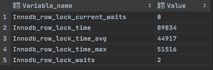

# 锁

## 是什么

在数据库中，除传统的计算资源（如 CPU、RAM、I/O 等）的争用以外，数据也是一种供许多用户共享的资源。如何保证数据并发访问的一致性、有效性是所有数据库必须解决的一个问题，锁冲突也是影响数据库并发访问性能的一个重要因素。从这个角度来说，锁对数据库而言显得尤其重要，也更加复杂。


## 锁分类

### 从对数据操作的粒度分

* 表锁：操作时，会锁定整个表。
* 行锁：操作时，会锁定当前操作行。


### 从对数据操作的类型分

* 读锁（**共享锁**）：针对同一份数据，多个读操作可以同时进行而不会互相影响。
* 写锁（**排它锁**）：当前操作没有完成之前，它会阻断其他写锁和读锁。


## 不同存储引擎堆锁的支持

| 存储引擎 | 表级锁 | 行级锁 | 页级锁 | 事务   |
| -------- | ------ | ------ | ------ | ------ |
| MyISAM   | 支持   | 不支持 | 不支持 | 不支持 |
| InnoDB   | 支持   | 支持   | 不支持 | 支持   |
| MEMORY   | 支持   | 不支持 | 不支持 |        |
| BDB      | 支持   | 不支持 | 支持   |        |

| 表级锁 | 偏向MyISAM 存储引擎，开销小，加锁快；不会出现死锁；锁定粒度大，发生锁冲突的概率最高,并发度最低。 |
| ------ | ------------------------------------------------------------ |
| 行级锁 | 偏向InnoDB 存储引擎，开销大，加锁慢；会出现死锁；锁定粒度最小，发生锁冲突的概率最低,并发度也最高。 |
| 页面锁 | 开销和加锁时间界于表锁和行锁之间；会出现死锁；锁定粒度界于表锁和行锁之间，并发度一般。 |

> InnoDB 与 MyISAM 的最大不同有两点：一是支持事务；二是 采用了行级锁。


## 事务及其ACID

> 事务是由一组SQL语句组成的逻辑处理单元。详情见《第六章-TCL语言.md》

事务具有以下4个特性，简称为事务ACID属性。

| ACID属性             | 含义                                                         |
| -------------------- | ------------------------------------------------------------ |
| 原子性（Atomicity）  | 事务是一个原子操作单元，其对数据的修改，要么全部成功，要么全部失败。 |
| 一致性（Consistent） | 在事务开始和完成时，数据都必须保持一致状态。                 |
| 隔离性（Isolation）  | 数据库系统提供一定的隔离机制，保证事务在不受外部并发操作影响的 “独立” 环境下运行。 |
| 持久性（Durable）    | 事务完成之后，对于数据的修改是永久的。                       |

**并发事务处理带来的问题**

| 问题                               | 含义                                                         |
| ---------------------------------- | ------------------------------------------------------------ |
| 丢失更新（Lost Update）            | 当两个或多个事务选择同一行，最初的事务修改的值，会被后面的事务修改的值覆盖。 |
| 脏读（Dirty Reads）                | 当一个事务正在访问数据，并且对数据进行了修改，而这种修改还没有提交到数据库中，这时，另外一个事务也访问这个数据，然后使用了这个数据。 |
| 不可重复读（Non-Repeatable Reads） | 一个事务在读取某些数据后的某个时间，再次读取以前读过的数据，却发现和以前读出的数据不一致。 |
| 幻读（Phantom Reads）              | 一个事务按照相同的查询条件重新读取以前查询过的数据，却发现其他事务插入了满足其查询条件的新数据。 |

**事务隔离级别**

为了解决上述提到的事务并发问题，数据库提供一定的事务隔离机制来解决这个问题。数据库的事务隔离越严格，并发副作用越小，但付出的代价也就越大，因为事务隔离实质上就是使用事务在一定程度上“串行化” 进行，这显然与“并发” 是矛盾的。

数据库的隔离级别有4个，由低到高依次为Read uncommitted、Read committed、Repeatable read、Serializable，这四个级别可以逐个解决脏写、脏读、不可重复读、幻读这几类问题。

| 隔离级别                | 丢失更新 | 脏读 | 不可重复读 | 幻读 |
| ----------------------- | -------- | ---- | ---------- | ---- |
| Read uncommitted        | ×        | √    | √          | √    |
| Read committed          | ×        | ×    | √          | √    |
| Repeatable read（默认） | ×        | ×    | ×          | √    |
| Serializable            | ×        | ×    | ×          | ×    |

> 备注 ： √ 代表可能出现 ， × 代表不会出现 。丢失更新问题并不和事务隔离级别挂钩，解决办法是乐观锁和悲观锁。


## InnoDB行锁

> 是InnoDB引擎默认开启的锁，当然也支持表锁。**和事务类似，MySQL执行新增、更新、删除等操作默认会添加事务和行锁。也就是排它锁。**
>
> 行锁具有如下特性：开销大，加锁慢；会出现死锁；锁定粒度最小，发生锁冲突的概率最低,并发度也最高。


### 行锁演示

1. 表数据准备

	```sql
	insert into test_innodb_lock values(1,'200','0');
	create index idx_test_innodb_lock_id on test_innodb_lock(id);
	create index idx_test_innodb_lock_name on test_innodb_lock(name);
	create table test_innodb_lock(
		id int(11),
		name varchar(16),
		sex varchar(1)
	)engine = innodb default charset=utf8;
	
	insert into test_innodb_lock values(1,'100','1');
	insert into test_innodb_lock values(3,'3','1');
	insert into test_innodb_lock values(4,'400','0');
	insert into test_innodb_lock values(5,'500','1');
	insert into test_innodb_lock values(6,'600','0');
	insert into test_innodb_lock values(7,'700','0');
	insert into test_innodb_lock values(8,'800','1');
	insert into test_innodb_lock values(9,'900','1');
	insert into test_innodb_lock values(1,'200','0');
	```

	

2. 设置两列索引

	```sql
	create index idx_test_innodb_lock_id on test_innodb_lock(id);
	create index idx_test_innodb_lock_name on test_innodb_lock(name);
	```

3. 开启两个终端(客户端)，并关闭自动提交

	```sql
	set autocommit = 0;  #必写
	start transaction;  #可选
	```

	

| Session-1                                                    | Session-2                                                    |
| :----------------------------------------------------------- | ------------------------------------------------------------ |
| <br />关闭自动提交功能 | <br /> 关闭自动提交功能 |
|  <br />可以正常的查询出全部的数据 | <br />可以正常的查询出全部的数据 |
| <br />查询id 为3的数据 ； | <br />获取id为3的数据 ； |
| <br />更新id为3的数据，但是不提交； |  <br />**更新id为3 的数据， 处于等待状态**，表明有行锁。 |
|  <br />通过commit， 提交事务 |  <br />解除阻塞，更新正常进行 |
| <br />再次查看id=3的数据，两个客户端name为啥不一样？因为session-2没有commit;读取的仍然是缓存中的数据。 | <br />再次查看id=3的数据，两个客户端name为啥不一样？因为session-2没有commit;读取的仍然是缓存中的数据。 |
| <br />session-2和session-1提交后再次查看 | <br />session-2和session-1提交后再次查看 |
| <br />更新id为3数据，正常的获取到行锁 ， 执行更新 ； | <br /> 更新ID-4的数据，由于与Session-1 操作不是同一行，获取当前行锁，执行更新； |


## InnoDB表锁（行锁失效）

> 之前我们讲到，InnoDB默认是行锁，为什么要讲表锁呢？<font color=ff00aa>因为在某些特定条件下InnoDB是不会走行锁的。类似于索引失效一样，并不是用了索引MySQL就会给你走索引。</font>

<font color=ffaa00 size=4>当不通过**索引**条件操作数据时，InnoDB将默认对表中所有记录加锁，实际效果和表锁一样。由此可见，`使用索引的重要性`</font>


### 表锁演示

| Session-1                                                    | Session-2                                                    |
| :----------------------------------------------------------- | ------------------------------------------------------------ |
| <br />关闭自动提交功能 | <br /> 关闭自动提交功能 |
|  <br />不使用索引进行数据更新sex=1 | <br />不使用索引更新数据 sex=2。发现阻塞，证明已经锁表。 |


## InnoDB查看行锁争抢情况

```sql
show  status like 'innodb_row_lock%';
```



* Innodb_row_lock_current_waits: 当前正在等待锁定的数量
* Innodb_row_lock_time: 从系统启动到现在锁定总时间长度
* **Innodb_row_lock_time_avg:每次等待所花平均时长**
* Innodb_row_lock_time_max:从系统启动到现在等待最长的一次所花的时间
* **Innodb_row_lock_waits: 系统启动后到现在总共等待的次数**

> 着重关注 等待次数 和每次等待平均时长。这样就能发现系统是否存在问题。然后根据分析结果着手制定优化计划。


## 间隙锁的危害

> 其实MySQL还有一种锁，叫间隙锁。何为间隙锁：**当我们用范围条件，而不是使用相等条件检索数据，并请求共享或排他锁时，InnoDB会给符合条件的已有数据进行加锁；**
>
> 例如：我去更新ID>=4 的数据，假如数据库中只存在ID等于1、3 的数据，但是使用范围操作的时候就会将【1，2，3，4】都会上锁，这个时候我去插入一条ID为2、4的数据就被阻塞。也很好理解，MySQL不可能再去进行查询数据库并筛选出然后只对存在的数据上锁，提高了性能损耗。


### 间隙锁演示


| Session-1                                                    | Session-2                                                    |
| :----------------------------------------------------------- | ------------------------------------------------------------ |
| <br />关闭自动提交功能 | <br /> 关闭自动提交功能 |
|  <br />表中只存在【1，5，6，9】的数据 | <br />表中只存在【1，5，6，9】的数据 |
| <br />范围更新ID<10 的数据。 | <br />这里插入ID=2的数据，发现阻塞，因为间隙锁的原因导致。 |


# 锁优化总结

1. 尽可能让所有数据检索都能通过`索引`来完成，**避免无索引行锁升级为表锁**。
2. 合理设计索引，尽量缩小锁的范围
3. 尽可能减少检索条件，及`检索范围`，避免间隙锁
4. 尽量控制事务大小，减少锁定资源量和时间长度
5. 尽可使用低级别事务隔离（但是需要业务层面满足需求）