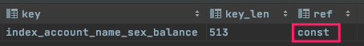
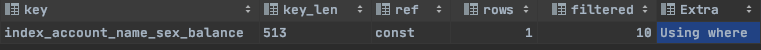

> SQL优化 --  定位         【精通】
>
> SQL优化 --  方案         【精通】
>
> SQL优化 --  分类         【了解】
>
> 应用优化                     【了解】
>
> MySQL 查询缓存         【了解】
>
> MySQL内存管理和优化【掌握】
>
> MySQL并发参数调整    【精通】

# SQL优化 -- 定位

## 查看SQL执行频率

> 通过SQL执行频率可以很好地定位到当前应用对于数据库的使用时偏向于读还是写

### 查看各种类型操作的执行次数

```sql
show [session|global] status like 'Com_______'  #不加默认是session   七个下划线
```


### 查看Innodb 相关的操作次数

```sql
ßshow [session|global] status like 'Innodb_rows_%';
```


### 参数含义

| 参数                 | 含义                                                         |
| -------------------- | ------------------------------------------------------------ |
| Com_select           | 执行 select 操作的次数，一次查询只累加 1。                   |
| Com_insert           | 执行 INSERT 操作的次数，对于批量插入的 INSERT 操作，只累加一次。 |
| Com_update           | 执行 UPDATE 操作的次数。                                     |
| Com_delete           | 执行 DELETE 操作的次数。                                     |
| Innodb_rows_read     | select 查询返回的行数。                                      |
| Innodb_rows_inserted | 执行 INSERT 操作插入的行数。                                 |
| Innodb_rows_updated  | 执行 UPDATE 操作更新的行数。                                 |
| Innodb_rows_deleted  | 执行 DELETE 操作删除的行数。                                 |
| Connections          | 试图连接 MySQL 服务器的次数。                                |
| Uptime               | 服务器工作时间。                                             |
| Slow_queries         | 慢查询的次数。                                               |

> Com_*** : 这些参数对于所有存储引擎的表操作都会进行累计。
>
> Innodb_*** : 这几个参数只是针对InnoDB 存储引擎的，累加的算法也略有不同。


## 定位低效率SQL


### 慢查询日志

> 通过慢查询日志定位那些执行效率较低的 SQL 语句，用--log-slow-queries[=file_name]选项启动时，mysqld 写一个包含所有执行时间超过 long_query_time 秒的 SQL 语句的日志文件。


###  show processlist -- 实时

> **慢查询日志在查询结束以后才纪录**，所以在应用反映执行效率出现问题的时候查询慢查询日志并不能定位问题，可以使用**show processlist命令查看当前**MySQL在进行的线程，包括线程的状态、是否锁表等，可以实时地查看 SQL 的执行情况，同时对一些锁表操作进行优化。


```sql
1） id列，用户登录mysql时，系统分配的"connection_id"，可以使用函数connection_id()查看

2） user列，显示当前用户。如果不是root，这个命令就只显示用户权限范围的sql语句

3） host列，显示这个语句是从哪个ip的哪个端口上发的，可以用来跟踪出现问题语句的用户

4） db列，显示这个进程目前连接的是哪个数据库

5） command列，显示当前连接的执行的命令，一般取值为休眠（sleep），查询（query），连接（connect）等

6） time列，显示这个状态【持续】的时间，单位是秒

7） state列，显示使用当前连接的sql语句的状态，很重要的列。state描述的是语句执行中的某一个状态。一个sql语句，以查询为例，可能需要经过copying to tmp table、sorting result、sending data等状态才可以完成

8） info列，显示这个sql语句，是判断问题语句的一个重要依据
```


## explain分析执行计划

```sql
explain sql语句;
# 例如 ： explain select * from account where sex='男';
```


| 字段          | 含义                                                         |
| ------------- | ------------------------------------------------------------ |
| id            | select查询的序列号，是一组数字，表示的是查询中执行select子句或者是操作表的顺序。 |
| select_type   | 表示 SELECT 的类型，常见的取值有 SIMPLE（简单表，即不使用表连接或者子查询）、PRIMARY（主查询，即外层的查询）、UNION（UNION 中的第二个或者后面的查询语句）、SUBQUERY（子查询中的第一个 SELECT）等 |
| table         | 输出结果集的表                                               |
| type          | 表示表的连接类型，性能由好到差的连接类型为( system ---> const -----> eq_ref ------> ref -------> ref_or_null----> index_merge ---> index_subquery -----> range -----> index ------> all ) |
| possible_keys | 表示查询时，可能使用的索引                                   |
| key           | 表示实际使用的索引                                           |
| key_len       | 索引字段的长度                                               |
| rows          | 扫描行的数量                                                 |
| extra         | 执行情况的说明和描述                                         |


### 1、explain 之 ID

#### ID相同

```sql
explain
select *
from departments
         inner join employees e on departments.department_id = e.department_id
         inner join jobs j on e.job_id = j.job_id;
```


> ID相同，则从上至下执行，即先查询jobs，然后是employees，最后是departments

#### ID不同

```sql
explain select *
from jobs
where job_id = (select job_id from employees where first_name ='Lex' );
```


> ID不同，ID值越大，优先级越高，优先执行，即先执行employees后执行jobs

#### ID相同和不同 同时存在

> ID最高的优先执行，ID相同的从上至下执行


### explain 之 select_type (<font color =ff00aa>性能指标</font>)

表示 SELECT 的类型，常见的取值，如下表所示：

| select_type  | 含义                                                         |
| ------------ | ------------------------------------------------------------ |
| SIMPLE       | 简单的select查询，查询中不包含子查询或者UNION                |
| PRIMARY      | 查询中若包含任何复杂的子查询，最外层查询标记为该标识         |
| SUBQUERY     | 在SELECT 或 WHERE 列表中包含了子查询                         |
| DERIVED      | 在FROM 列表中包含的子查询，被标记为 DERIVED（衍生） MYSQL会递归执行这些子查询，把结果放在临时表中 |
| UNION        | 若第二个SELECT出现在UNION之后，则标记为UNION ； 若UNION包含在FROM子句的子查询中，外层SELECT将被标记为 ： DERIVED |
| UNION RESULT | 从UNION表获取结果的SELECT                                    |

> 从上至下 ，效率越来越慢。因此查询SQL 执行计划时尽量达到上面第一第二个。

#### 举例

* SIMPLE

	```sql
	explain select * from account limit 50,100;
	```

	

* PRIMARY、SUBQUERY

	```sql
	explain select * from account where id = (select id from account where name='测试24')
	```

	

	

	

* UNION 和 UNION RESULT

	```sql
	explain select * from account where id = 135 union select * from account where id =136;
	```

	


### explain 之 type  (<font color =ff00aa>性能指标</font>)

type 显示的是访问类型，是较为重要的一个指标，可取值为：

| type   | 含义                                                         |
| ------ | ------------------------------------------------------------ |
| NULL   | MySQL不访问任何表，索引，直接返回结果 例如：select now(); select ’常量‘ |
| system | 表只有一行记录(等于系统表)，这是const类型的特例，一般不会出现 |
| const  | 表示通过索引一次就找到了，const 用于**primary key 或者 unique 索引。因为只匹配一行数据**，所以很快。如将主键置于where列表中，MySQL 就能将该查询转换为一个常亮。const于将 "主键" 或 "唯一" 索引的所有部分与常量值进行比较 |
| eq_ref | 类似ref，区别在于使用的是**唯一索引**，使用主键的关联查询，关联查询出的记录只有一条。常见于主键或唯一索引扫描 |
| ref    | **非唯一性索引**扫描，返回匹配某个单独值的所有行。本质上也是一种索引访问，返回所有匹配某个单独值的所有行（多个） |
| range  | 只检索给定返回的行，使用一个索引来选择行。 where 之后出现 between ， < , > , in 等操作。 |
| index  | index 与 ALL的区别为 index 类型只是遍历了索引树， 通常比ALL 快， ALL 是遍历数据文件。 |
| all    | 将遍历全表以找到匹配的行                                     |

结果值从最好到最坏依次是：

```
NULL > system > const > eq_ref > ref > fulltext > ref_or_null > index_merge > unique_subquery > index_subquery > range > index > ALL
```

> 一般来说， 我们需要保证查询至少达到 range 级别， 最好达到ref 。


### explain 之 key  (<font color =ff00aa>性能指标 尽量使用索引</font>)

```
possible_keys : 显示可能应用在这张表的索引， 一个或多个。 
key ： 实际使用的索引， 如果为NULL， 则没有使用索引。着重注意：尽量使用索引
key_len : 表示索引中使用的字节数， 该值为索引字段最大可能长度，并非实际使用长度，在不损失精确性的前提下， 长度越短越好 。
```


### explain 之 ref  (<font color =ff00aa>索引使用个数指标</font>)

> 如果SQL中使用了一个索引，则显示一个const（常量），使用了N个则显示N个常量const

```sql
explain select * from account where name='测试83' ;
explain select * from account where name='测试83' and sex ='男';
explain select * from account where name='测试83' and sex ='男' and balance = 100.00000;
```




### explain 之 rows (<font color =ff00aa>性能指标 </font>)

> 执行SQL时 扫描的行数，越少性能越好。命中索引扫描的行数会很少。


### explain 之 extra (<font color =ff00aa>性能指标 </font>)

其他的额外的执行计划信息，在该列展示 。

| extra           | 含义                                                         |
| --------------- | ------------------------------------------------------------ |
| using filesort  | 说明mysql会对数据使用一个外部的索引排序，而不是按照表内的索引顺序进行读取， 称为 “文件排序”, **效率低**。 |
| using temporary | 使用了临时表保存中间结果，MySQL在对查询结果排序时使用临时表。常见于 order by 和 group by； **效率低** |
| using index     | 表示相应的select操作使用了覆盖索引， 避免访问表的数据行， **效率不错。** |

> 如果出现了using filesort、using temporary 则要考虑性能调优了。

## show profile分析SQL -- <font color=ff00aa>最好在cmd或者terminal下链接MySQL食用，datagrip下显示不太行</font>

> explain 更像是一个衡量SQL性能的标准，并不能帮助我们排查SQL慢的原因。Mysql从5.0.37版本开始增加了对 show profiles 和 show profile 语句的支持。show profiles 能够在做SQL优化时**帮助我们了解时间都耗费到哪里去了**。


### 查看当前环境profile设置

```sql
show variables like '%profiling%';
```


> * profiling off表示profile关闭，
> * profiling_history_size 15表示保存最近15条SQL的资源消耗情况。

### 开启profile

```sql
set profiling=1; //开启profiling 开关；
```

> 注意只是开启了当前会话session的开关，并不是全局


### 如何使用profile

```sql
# 查询最近15条SQL执行时间
SQL语句;
show profiles;

# 查询某一条SQL详细执行时间
show profile for query Query_ID;
```


#### 案例

* 查询总耗时

	```sql
	select * from account where sex ='男';
	show profiles;
	```

	

	

* 查询某条SQL详细耗时

	```sql
	show profile block io for query 1;
	```

	

	> 从上图中发现 《sending data》过程比较耗时。
	> 	Sending data 状态表示MySQL线程开始访问数据行并把结果返回给客户端，而不仅仅是返回个客户端。由于在Sending data状态下，MySQL线程往往需要做大量的磁盘读取操作，所以经常是整各查询中耗时最长的状态。

* 查看详细信息并包含物理硬件耗费的性能

	在获取到最消耗时间的线程状态后，MySQL支持进一步选择 `all、cpu、block io 、context switch、page faults`等明细类型类查看MySQL在使用什么资源上耗费了过高的时间。例如，选择查看CPU的耗费时间 ：

	```sql
	show profile cpu,page faults for query 1;
	```

	


| 字段       | 含义                           |
| ---------- | ------------------------------ |
| Status     | sql 语句执行的状态             |
| Duration   | sql 执行过程中每一个步骤的耗时 |
| CPU_user   | 当前用户占有的cpu              |
| CPU_system | 系统占有的cpu                  |

# SQL优化 -- 方案

## 数据准备

> 这里使用的 account 表，共插入300w数据，其表结构如下：

```sql
create table account
(
    id   bigint auto_increment
        primary key,
    name varchar(255)    null,
    sex  enum ('男', '女') null
);
```

```sql
#插入300W 行数据
delimiter $
create procedure pro_account99()
begin
    declare i int default 0;
    while i<3000000 do
        insert into account(name, sex) values (concat('测试',i),if(i%2=0,'男','女'));
        set i:=i+1;
    end while;
end $

call pro_account99;
```


## 索引

> 索引是数据库优化最常用也是最重要的手段之一, 通过索引通常可以帮助用户解决大多数的MySQL的性能优化问题。


### 索引效率验证

#### 1、查看主键索引耗时


> 耗时19.9微妙，几乎忽略不计


#### 2、查看非主键耗时


> 非主键查询耗时0.51s，相差了千倍。


#### 3、将name字段设置为索引，查看耗时

```sql
create index index_account_name on account(name);
show index from account;
```


> 前后两次对比，可见索引效率之高。


### 索引失效

> **索引如果没有正确使用，那么索引是不生效的。使用索引必须匹配如下规则方才生效。**


#### 1、索引全词匹配

> 全值匹配，对索引中所有列都指定具体值。即表中指定了三个列为索引，那么查询时使用这三列字段查询则索引生效。如下：

1. 创建多列索引

	```sql
	create index index_account_name_sex_balance on account(name,sex,balance);
	```

2. 索引全覆盖查询  验证  是否使用了索引

	```sql
	explain select *
	from account where name='测试83' and sex='女' and balance = 100.00000;
	```

	

	> 可以看出使用了索引、只匹配了一行、并且指标都可以。


#### 2、最左前缀法则

> 如果索引了多列，要遵守最左前缀法则。**指的是查询从索引的最左前列开始（查询时包含最左列即可），并且不跳过索引中的列。**
>
> 例如组合索引A/B/C
>
> 相当于创建了
>
> * A索引
> * A/B 组合索引
> * A/B/C组合索引
>
> 使用 create index index_account_name_sex_balance on account(name,sex,balance);  多列索引进行演示

##### 符合最左前缀法则  的  索引使用演示

> **最左列指的是 查询条件中包含索引最左列。即查询顺序并不影响索引使用，例如：where  sex ='女' and balance = 100.00000 and name='测试83'; 也是生效的。**

```sql
explain select * from account where name='测试83' ; # 生效   513 = name作索引的长度
```


```sql
explain select * from account where name='测试83' and sex ='女';# 生效   515 = name、set 作索引的长度
```


```sql
explain select * from account where name='测试83' and sex ='女' and balance = 100.00000; # 生效  524 = name、set、balance 作索引的长度
```


##### 跳过索引列不走索引  演示

```sql
explain select * from account where balance = 100.00000;
explain select * from account where sex ='女' and balance = 100.00000;
```


##### 范围查询右边列不走索引  演示

```sql
explain select * from account where name like '%测试%' and sex ='男' and balance = 100.00000;
```


##### 索引列进行运算操作不走索引  演示

```sql
explain select * from account where substr(name,1,2)='测试' and sex ='男' and balance = 100.00000;
```


##### 字符串不加单引号 不走索引  演示

> 我这里字符串不加单引号报错，可能和我MySQL版本有关。不做演示。


##### 尽量使用覆盖索引，避免 select * (不会造成索引失效，了解即可)

> 何为覆盖索引：即查询的列是索引的列，扯犊子呢么不是，工作中几乎不可能碰到覆盖索引。不过好在，即使不使用覆盖索引也不会造成索引失效。

* using index ：使用`覆盖索引`的时候就会出现
* using where：查找使用了索引，需要回表去查询所需的数据，即`索引表`和`数据表`并不是一个文件，查询时如果为`覆盖索引`，则直**接把索引文件中信息直接返回**即可，如果不是`覆盖索引`，需要**根据索引信息再去`数据表`查询对应的数据后返回**。
* using index condition：查找使用了索引，但是需要回表查询数据
* using index ; using where：查找使用了索引，但是需要的数据都在索引列中能找到，所以不需要回表查询数据

```sql
explain select * from account where name='测试83' and sex ='男' and balance = 100.00000;

explain select * from account where name='测试83' and sex in('男','女') and balance = 100.00000;

explain select * from account where name='测试83' and update_time = '2021-12-20 16:57:10';
```





##### 使用 or 会造成索引失效  演示

```sql
explain select * from account where name='测试83' or update_time = '2021-12-20 16:57:10';
```


##### 模糊匹配%造成索引失效 演示

```sql
explain select * from account where name like '%测试';
explain select * from account where name like '%测试%';
explain select * from account where name like '测试%';
```


> 可通过查询索引列 来解决索引失效问题。如下：

```sql
explain select id,name from account where name like '测试%';
```


##### 如果全表扫描更快的话，就不会走索引  --  和数据有关

> 比如 根据字段进行查询，这个字段中数据99.999%是同一个数据，根据这个数据去索引查询，还不如直接全表扫描来得快。


##### IS NULL | IS NOT NULL 有时索引失效  --  和数据有关

```sql
explain select * from account where name is null;
explain select * from account where name is not null;
```


> 我们发现 is null 走了索引，is not null没走索引。其实不是这样的，这是因为name字段300w数据都是非null的，因此MySQL判定 is not null 就没有必要走索引了。而如果数据都是null的话，那么MySQL就会判定 is not null 走索引，is null 全表扫描。


# SQL优化 -- 分类

## 大批量插入数据优化

### 1、主键ID有序要比无序快很多  --  针对 InnoDB引擎

1. 准备数据 一个有序一个无序

	

	> sql1.log 是ID有序的，sql2.log是ID无序的。

2. 创建两个表

	```sql
	# 有序
	CREATE TABLE `tb_user_1` (
	  `id` int(11) NOT NULL AUTO_INCREMENT,
	  `username` varchar(45) NOT NULL,
	  `password` varchar(96) NOT NULL,
	  `name` varchar(45) NOT NULL,
	  `birthday` datetime DEFAULT NULL,
	  `sex` char(1) DEFAULT NULL,
	  `email` varchar(45) DEFAULT NULL,
	  `phone` varchar(45) DEFAULT NULL,
	  `qq` varchar(32) DEFAULT NULL,
	  `status` varchar(32) NOT NULL COMMENT '用户状态',
	  `create_time` datetime NOT NULL,
	  `update_time` datetime DEFAULT NULL,
	  PRIMARY KEY (`id`),
	  UNIQUE KEY `unique_user_username` (`username`)
	) ENGINE=InnoDB DEFAULT CHARSET=utf8 ;
	
	#无序
	CREATE TABLE `tb_user_2` (
	  `id` int(11) NOT NULL AUTO_INCREMENT,
	  `username` varchar(45) NOT NULL,
	  `password` varchar(96) NOT NULL,
	  `name` varchar(45) NOT NULL,
	  `birthday` datetime DEFAULT NULL,
	  `sex` char(1) DEFAULT NULL,
	  `email` varchar(45) DEFAULT NULL,
	  `phone` varchar(45) DEFAULT NULL,
	  `qq` varchar(32) DEFAULT NULL,
	  `status` varchar(32) NOT NULL COMMENT '用户状态',
	  `create_time` datetime NOT NULL,
	  `update_time` datetime DEFAULT NULL,
	  PRIMARY KEY (`id`),
	  UNIQUE KEY `unique_user_username` (`username`)
	) ENGINE=InnoDB DEFAULT CHARSET=utf8 ;
	```

3. 开启MySQL load data local

	> MySql数据库升级到8以上时,load data local可被利用为高危漏洞，所以8以上mysql默认关闭该功能。用完记得关闭该功能。

	```sql
	show global variables like 'local_infile';
	  set global local_infile='ON';
	```

	

4. sql1.log  主键ID有序  导入

	

5. sql2.log  主键ID无序  导入


> 我这里MySQL8 死活导入提示版本不支持，根据老师5.6MySQL视频结果来看，结果差了几百倍。


### 2、关闭唯一性校验

> load data local infile '/tmp/sql1.log' into table tb_user_1 fields terminated by ',' lines terminated by '\n';
>
> 在导入数据前执行 SET UNIQUE_CHECKS=0，关闭唯一性校验，在导入结束后执行SET UNIQUE_CHECKS=1，恢复唯一性校验，可以提高导入的效率。


### 3、关闭自动commit

> 如果应用使用自动提交的方式，建议在导入前执行 SET AUTOCOMMIT=0，关闭自动提交，导入结束后再执行 SET AUTOCOMMIT=1，打开自动提交，也可以提高导入的效率。


## insert 语句优化

如果应用使用自动提交的方式，建议在导入前执行 SET AUTOCOMMIT=0，关闭自动提交，导入结束后再执行 SET AUTOCOMMIT=1，打开自动提交，也可以提高导入的效率。
如果需要同时对一张表插入很多行数据时，应该尽量使用多个值表的insert语句，这种方式将大大的缩减客户端与数据库之间的连接、关闭等消耗。使得效率比分开执行的单个insert语句快。

示例， 原始方式为：

```sql
insert into tb_test values(1,'Tom');
insert into tb_test values(2,'Cat');
insert into tb_test values(3,'Jerry');
```

`优化后的方案为 ：`

```sql
insert into tb_test values(1,'Tom'),(2,'Cat')，(3,'Jerry');
```

`在事务中进行数据插入。`

```sql
start transaction;
insert into tb_test values(1,'Tom');
insert into tb_test values(2,'Cat');
insert into tb_test values(3,'Jerry');
commit;
#如果数据量过大，可以分段事务，一万一万的事务提交
```

`数据有序插入`

```sql
insert into tb_test values(4,'Tim');
insert into tb_test values(1,'Tom');
insert into tb_test values(3,'Jerry');
insert into tb_test values(5,'Rose');
insert into tb_test values(2,'Cat');
```

优化后

```sql
insert into tb_test values(1,'Tom');
insert into tb_test values(2,'Cat');
insert into tb_test values(3,'Jerry');
insert into tb_test values(4,'Tim');
insert into tb_test values(5,'Rose');
```


## order by 语句优化

```sql
explain select * from account order by sex;
```


> select * 配合order by 会导致索引失效问题。如何解决？和like一样，使用`覆盖索引`。

```sql
explain select id,name,sex from account order by sex;   
```


```sql
#因为联合索引中包含了name sex 因此走了索引，如果查询字段中包含了其他非索引字段，也会导致索引失效问题。如下演示
explain select id,name,sex,update_time from account order by sex; # update_time 不是联合索引
```


## group by 语句优化

1. 对 group by字段建立索引
2. 对查询内容使用覆盖索引


## 嵌套查询 优化

> 尽量少使用多表嵌套查询，建议使用链接查询 join

```sql
explain select * from jobs where job_id in (select job_id from employees where true);

explain select * from jobs inner join employees e on jobs.job_id = e.job_id;
```


> 执行计划由于我这里是MySQL8，几乎差不多，并没有出现中间表。并且执行时间上 连接查询join 甚至超过了嵌套查询。离谱。可能是我这里版本、数据量的原因吧。反正有待商榷。


## OR 语句优化

> OR 是会导致 索引失效的，如何解决这个问题呢？
>
> 对于包含OR的查询子句，如果要利用索引，则OR之间的**每个条件列都必须用到索引 ， 而且不能使用到复合索引**； 如果没有索引，则应该考虑增加索引。简直不可理喻。
>
> **因此还是直接使用 union 来替换  or吧**   有待商榷

```sql
select * from account where sex='男' or sex ='女';
select * from account where sex='男' union select * from account where sex='女'
```


> 为何会出现如此反常现象？使用explain 发现 union 连表查 搞了三次全表扫描。而or只是一次all扫描如下：


## 分页查询  优化

> 一般分页查询时，通过创建覆盖索引能够比较好地提高性能。**一个常见又非常头疼的问题就是 limit 2000000,10 ，此时需要MySQL排序前2000010 记录**，仅仅返回2000000 - 2000010 的记录，其他记录丢弃，查询排序的代价非常大 。如下：

```sql
select * from account limit 10; # 快
```

```sql
select * from account limit 10,10;  # 快
```

```sql
select * from account limit 100,10;  # 快
```


```sql
select * from account limit 2000000,10;  # 老师那里很慢，我这里完全可以接受啊。可能和版本有关。总归相对比而言还是很慢~~~
```


> 如何优化呢？

### 思路一

> 在索引上完成排序分页操作，最后根据主键关联回原表查询所需要的其他列内容。**有待商榷，我这里和上面的差不多**

```sql
select * from account inner join (select id from account order by id limit 3000000,10) t on t.id = account.id ;
```


### 思路二

> 该方案适用于主键自增的表，可以把Limit 查询转换成某个位置的查询 。这个还是很快的，从500ms变为了20ms

```sql
select * from account where id > 2000000 limit 10; 
```


# 应用优化

## 使用数据库连接池


## 使用缓存


## 负载均衡


# MySQL 查询缓存

> 开启Mysql的查询缓存，当**执行完全相同**的SQL语句的时候，服务器就会直接从缓存中读取结果，当数据被修改，之前的缓存会失效，修改比较频繁的表不适合做查询缓存。
>
> MySQL官方从8版本开始取消了《查询缓存》并且不建议5.7版本之前使用《查询缓存》。这里只做了解


## 操作流程


1. 客户端发送一条查询给服务器；
2. 服务器先会检查查询缓存，如果命中了缓存，则立即返回存储在缓存中的结果。否则进入下一阶段；
3. 服务器端进行SQL解析、预处理，再由优化器生成对应的执行计划；
4. MySQL根据优化器生成的执行计划，调用存储引擎的API来执行查询；
5. 将结果返回给客户端。


## MySQL查询缓存配置

> **Mysql8 取消了查询缓存**

* 查询当前MySQL是否支持查询缓存

	```sql
	SHOW VARIABLES LIKE 'have_query_cache';	
	```

* 查看当前MySQL是否开启了查询缓存

	```sql
	SHOW VARIABLES LIKE 'query_cache_type';
	```

* 查看查询缓存的占用大小 ：

	```sql
	SHOW VARIABLES LIKE 'query_cache_size';
	```

* 查看查询缓存的状态变量：

	```sql
	SHOW STATUS LIKE 'Qcache%';
	```

* 开启查询缓存

	MySQL的查询缓存默认是关闭的，需要手动配置参数 query_cache_type ， 来开启查询缓存。query_cache_type 该参数的可取值有三个 ：

	| 值          | 含义                                                         |
	| ----------- | ------------------------------------------------------------ |
	| OFF 或 0    | 查询缓存功能关闭                                             |
	| ON 或 1     | 查询缓存功能打开，SELECT的结果符合缓存条件即会缓存，否则，不予缓存，显式指定 SQL_NO_CACHE，不予缓存 |
	| DEMAND 或 2 | 查询缓存功能按需进行，显式指定 SQL_CACHE 的SELECT语句才会缓存；其它均不予缓存 |

	在 /usr/my.cnf 配置中，增加以下配置 ：

	

	> 配置完毕之后，重启服务既可生效 .


# MySQL内存管理和优化

## 内存优化原则

* 将尽量多的内存分配给MySQL做缓存，但要给操作系统和其他程序预留足够内存。

* MyISAM 存储引擎的数据文件读取依赖于操作系统自身的IO缓存，因此，如果有MyISAM表，就要预留更多的内存给操作系统做IO缓存。

* 排序区、连接区等缓存是分配给每个数据库会话（session）专用的，其默认值的设置要根据最大连接数合理分配，如果设置太大，不但浪费资源，而且在并发连接较高时会导致物理内存耗尽。


## MyISAM 内存优化 -- 了解

> myisam存储引擎使用 key_buffer 缓存索引块，加速myisam索引的读写速度。对于myisam表的数据块，mysql没有特别的缓存机制，完全依赖于操作系统的IO缓存。


### key_buffer_size
key_buffer_size决定MyISAM索引块缓存区的大小，直接影响到MyISAM表的存取效率。可以在MySQL参数文件中设置key_buffer_size的值，对于一般MyISAM数据库，建议至少将1/4可用内存分配给key_buffer_size。

在/usr/my.cnf 中做如下配置：

```bash
key_buffer_size=512M
```

### read_buffer_size

如果需要经常顺序扫描myisam表，可以通过增大read_buffer_size的值来改善性能。但需要注意的是read_buffer_size是每个session独占的，如果默认值设置太大，就会造成内存浪费。


### read_rnd_buffer_size

对于需要做排序的myisam表的查询，如带有order by子句的sql，适当增加 read_rnd_buffer_size 的值，可以改善此类的sql性能。但需要注意的是 read_rnd_buffer_size 是每个session独占的，如果默认值设置太大，就会造成内存浪费。


## InnoDB 内存优化
> innodb用一块内存区做IO缓存池，该缓存池不仅用来缓存innodb的**索引块**，而且也用来缓存innodb的数据块。


### innodb_buffer_pool_size
该变量决定了 innodb 存储引擎表数据和索引数据的最大缓存区大小。在保证操作系统及其他程序有足够内存可用的情况下，innodb_buffer_pool_size 的值越大，缓存命中率越高，访问InnoDB表需要的磁盘I/O 就越少，性能也就越高。

```bash
innodb_buffer_pool_size=512M #默认128M
```


### innodb_log_buffer_size
决定了innodb重做日志缓存的大小，对于可能产生大量更新记录的大事务，增加innodb_log_buffer_size的大小，可以避免innodb在事务提交前就执行不必要的日志写入磁盘操作。

```bash
innodb_log_buffer_size=10M 
```


# MySQL并发参数调整

>
> 从实现上来说，MySQL Server 是多线程结构，包括后台线程和客户服务线程。多线程可以有效利用服务器资源，提高数据库的并发性能。在Mysql中，控制并发连接和线程的主要参数包括 `max_connections`、`back_log`、`thread_cache_size`、`table_open_cahce`。

## max_connections

max_connections 控制允许**连接到MySQL数据库的最大数量**，默认值是 `151`。如果状态变量 `connection_errors_max_connections `不为零，并且一直增长，则说明不断有连接请求因数据库连接数已达到允许最大值而失败，这是可以考虑增大max_connections 的值。

Mysql 最大可支持的连接数，取决于很多因素，包括给定操作系统平台的线程库的质量、内存大小、每个连接的负荷、CPU的处理速度，期望的响应时间等。在Linux 平台下，性能好的服务器，支持 **500-1000** 个连接不是难事，需要根据服务器性能进行评估设定。

## back_log
back_log 参数控制MySQL监听TCP端口时设置的积压请求栈大小。**如果MySql的连接数达到max_connections时，新来的请求将会被存在堆栈中，以等待某一连接释放资源，该堆栈的数量即back_log**，如果等待连接的数量超过back_log，将不被授予连接资源，将会报错。5.6.6 版本之前默认值为 50 ， 之后的版本默认为 50 + （max_connections / 5）， 但最大不超过900。

如果需要数据库在较短的时间内处理大量连接请求， 可以考虑适当增大back_log 的值。

## table_open_cache
该参数用来控制所有SQL语句执行线程可打开表缓存的数量， 而在执行SQL语句时，每一个SQL执行线程至少要打开 1 个表缓存。该参数的值应该根据设置的最大连接数 max_connections 以及每个连接执行关联查询中涉及的表的最大数量来设定 ：

 max_connections x N ；

## thread_cache_size
为了加快连接数据库的速度，MySQL 会缓存一定数量的客户服务线程以备重用，通过参数 thread_cache_size 可控制 MySQL 缓存客户服务线程的数量。

## innodb_lock_wait_timeout
该参数是用来设置InnoDB 事务等待行锁的时间，默认值是50ms ， 可以根据需要进行动态设置。对于需要快速反馈的业务系统来说，可以将行锁的等待时间调小，以避免事务长时间挂起； 对于后台运行的批量处理程序来说， 可以将行锁的等待时间调大， 以避免发生大的回滚操作。