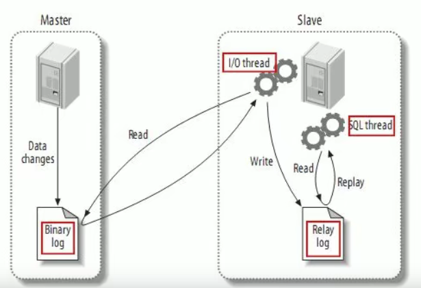
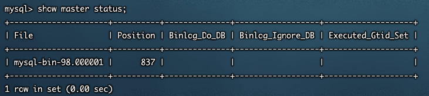
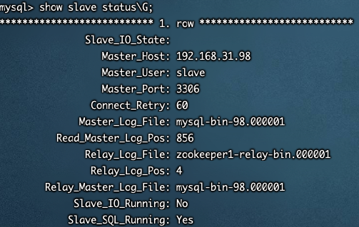
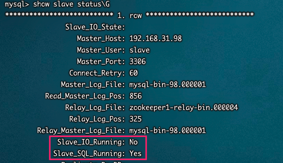
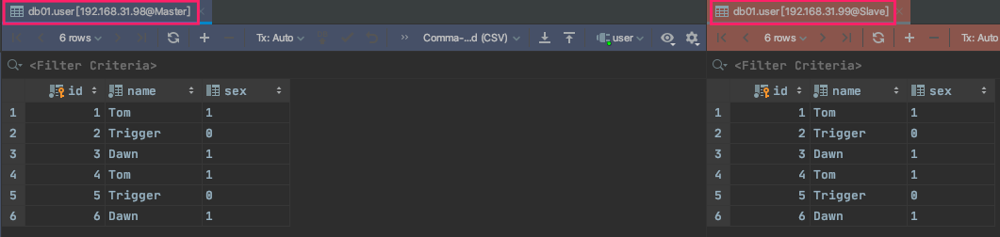
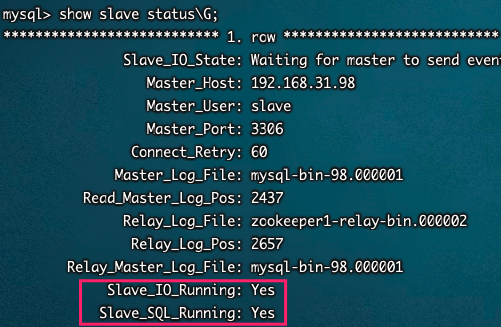

# 主从复制 | 读写分离

## 概述

复制是指将主数据库的DDL 和 DML 操作通过`二进制日志`传到从库服务器中，然后在从库上对这些日志重新执行（也叫重做），从而使得从库和主库的数据保持同步。

MySQL支持一台主库同时向多台从库进行复制， 从库同时也可以作为其他从服务器的主库，实现链状复制。


## 原理




1. Master 主库在事务提交时，会把数据变更作为时间 Events 记录在二进制日志文件 Binlog 中。
2. 主库推送二进制日志文件 Binlog 中的日志事件到从库的中继日志 Relay Log 。
3. slave重做中继日志中的事件，将改变反映它自己的数据。


## 优势

* 主库出现问题，可以快速切换到从库提供服务。
* 可以在从库上执行查询操作，从主库中更新，实现`读写分离`，降低主库的访问压力。
* 可以在从库中执行备份，以避免备份期间影响主库的服务。


## 主从环境搭建

### master

1. 在master 的配置文件（/usr/my.cnf）中，配置如下内容：

```bash
[mysqld]
basedir = /usr/local/mysql8
datadir = /usr/local/mysql8/data
port = 3306

#mysql 服务ID,保证整个集群环境中唯一
server-id=98  

innodb_flush_log_at_trx_commit=2  #(参数的含义如下)
# 0：如果innodb_flush_log_at_trx_commit的值为0,log buffer每秒就会被刷写日志文件到磁盘，提交事务的时候不做任何操作（执行是由mysql的master thread线程来执行的。
# 主线程中每秒会将重做日志缓冲写入磁盘的重做日志文件(REDO LOG)中。不论事务是否已经提交）默认的日志文件是ib_logfile0,ib_logfile1
# 1：当设为默认值1的时候，每次提交事务的时候，都会将log buffer刷写到日志。
# 2：如果设为2,每次提交事务都会写日志，但并不会执行刷的操作。每秒定时会刷到日志文件。要注意的是，并不能保证100%每秒一定都会刷到磁盘，这要取决于进程的调度。
# 每次事务提交的时候将数据写入事务日志，而这里的写入仅是调用了文件系统的写入操作，而文件系统是有 缓存的，所以这个写入并不能保证数据已经写入到物理磁盘
# 默认值1是为了保证完整的ACID。当然，你可以将这个配置项设为1以外的值来换取更高的性能，但是在系统崩溃的时候，你将会丢失1秒的数据。
# 设为0的话，mysqld进程崩溃的时候，就会丢失最后1秒的事务。设为2,只有在操作系统崩溃或者断电的时候才会丢失最后1秒的数据。InnoDB在做恢复的时候会忽略这个值。
# 总结
# 设为1当然是最安全的，但性能页是最差的（相对其他两个参数而言，但不是不能接受）。如果对数据一致性和完整性要求不高，完全可以设为2，如果只最求性能，例如高并发写的日志服务器，设为0来获得更高性能

#开启binlog 日志同步功能  1 代表只读, 0 代表读写
sync_binlog=1 

#binlog 日志文件名
log-bin=mysql-bin-98 

# 这个表示只同步某个库 (如果没有此项，表示同步所有的库)
#binlog-do-db=xxxx

#忽略的数据, 指不需要同步的数据库
binlog-ignore-db=mysql
```

2.  执行完毕之后，需要重启Mysql：

```bash
service mysql restart 
```

3. 创建同步数据的账户，并且进行授权操作：

```bash
# 登录数据库

#在主节点创建一个用户slave，用于从节点连接主节点时使用 《192.168.1.%》为从数据库IP(范围，也可具体制定IP)。
create user 'slave'@'192.168.1.%' identified with mysql_native_password by 'slave';
#给slave用户授权
grant replication slave on *.* to 'slave'@'192.168.31.%';

grant replication slave on *.* to 'slave'@'192.168.31.%' identified by 'slave';	

flush privileges;
```

4.  查看master状态：

```
show master status;
```



字段含义：

```
File : 从哪个日志文件开始推送日志文件 
Position ： 从哪个位置开始推送日志
Binlog_Ignore_DB : 指定不需要同步的数据库
```

### slave

1. 在 slave 端配置文件中，配置如下内容：

```sql
[mysqld]
basedir = /usr/local/mysql8
datadir = /usr/local/mysql8/data
port = 3306

#mysql 服务ID,保证整个集群环境中唯一
server-id=99  

innodb_flush_log_at_trx_commit=2  #(参数的含义如下)
# 0：如果innodb_flush_log_at_trx_commit的值为0,log buffer每秒就会被刷写日志文件到磁盘，提交事务的时候不做任何操作（执行是由mysql的master thread线程来执行的。
# 主线程中每秒会将重做日志缓冲写入磁盘的重做日志文件(REDO LOG)中。不论事务是否已经提交）默认的日志文件是ib_logfile0,ib_logfile1
# 1：当设为默认值1的时候，每次提交事务的时候，都会将log buffer刷写到日志。
# 2：如果设为2,每次提交事务都会写日志，但并不会执行刷的操作。每秒定时会刷到日志文件。要注意的是，并不能保证100%每秒一定都会刷到磁盘，这要取决于进程的调度。
# 每次事务提交的时候将数据写入事务日志，而这里的写入仅是调用了文件系统的写入操作，而文件系统是有 缓存的，所以这个写入并不能保证数据已经写入到物理磁盘
# 默认值1是为了保证完整的ACID。当然，你可以将这个配置项设为1以外的值来换取更高的性能，但是在系统崩溃的时候，你将会丢失1秒的数据。
# 设为0的话，mysqld进程崩溃的时候，就会丢失最后1秒的事务。设为2,只有在操作系统崩溃或者断电的时候才会丢失最后1秒的数据。InnoDB在做恢复的时候会忽略这个值。
# 总结
# 设为1当然是最安全的，但性能页是最差的（相对其他两个参数而言，但不是不能接受）。如果对数据一致性和完整性要求不高，完全可以设为2，如果只最求性能，例如高并发写的日志服务器，设为0来获得更高性能

#开启binlog 日志同步功能  1 代表只读, 0 代表读写
sync_binlog=1 

#binlog 日志文件名
log-bin=mysql-bin-99 

# 这个表示只同步某个库 (如果没有此项，表示同步所有的库)
#binlog-do-db=xxxx

#忽略的数据, 指不需要同步的数据库
binlog-ignore-db=mysql
```

2. 执行完毕之后，需要重启Mysql：

```bash
service mysql restart
```

3. 执行如下指令 ：

```mysql
# 登录MySQL

# 执行如下指令
  CHANGE MASTER TO MASTER_HOST='192.168.31.98',  -- 主服务器IP
  MASTER_USER='slave',                       		  -- 主服务器用户  master新增的用来主从连接访问用户名
  MASTER_PASSWORD='slave',                   		  -- 主服务器用户密码  master新增的用来主从连接访问用户名密码
  MASTER_LOG_FILE='mysql-bin-98.000001',          -- 主服务器 执行show master status;查看到的File
  MASTER_LOG_POS=856;                     			  -- 主服务器 执行show master status;查看到的Position
```

指定当前从库对应的主库的IP地址，用户名，密码，从哪个日志文件开始的那个位置开始同步推送日志。

4. 开启同步操作

```bash
# 登录MySQL
start slave;
# 查看从库状态
show slave status\G;
```



5. 停止同步操作**（如果需要则执行）**

```mysql
# 登录MySQL
stop slave;
```

6. 必须保证 如下两个都是 YES



### 验证同步操作

1. 在主库中创建数据库，创建表，并插入数据 ：

```mysql
create database db01;

use db01;

create table user(
	id int(11) not null auto_increment,
	name varchar(50) not null,
	sex varchar(1),
	primary key (id)
)engine=innodb default charset=utf8;

insert into user(id,name,sex) values(null,'Tom','1');
insert into user(id,name,sex) values(null,'Trigger','0');
insert into user(id,name,sex) values(null,'Dawn','1');

insert into user(id,name,sex) values(null,'Tom','1');
insert into user(id,name,sex) values(null,'Trigger','0');
insert into user(id,name,sex) values(null,'Dawn','1');
```

2. 验证

	


## MySQL8 远程访问问题解决

```mysql
# 登录
use mysql;
select host,user,plugin from user; # user列中root对应的行数据[host]列 必须是% ，这样其他服务器才能够访问。
update user set host='%' where user ='root';
FLUSH PRIVILEGES;
```


## MySQL8 主从不同步问题解决

首先必须保证，如下两个都为YES


### Slave_SQL_Running 为 No

```sql
stop slave;  
SET GLOBAL SQL_SLAVE_SKIP_COUNTER=1;
START SLAVE;
FLUSH PRIVILEGES;
show slave status\G;
```


### Slave_IO_Running 为 No

```sql
# 登录
# 查看主服务器信息 获取到File 和 Position 
show master status\G; 
# 进入从服务器
# 登录
stop slave;
# 根据主数据库中的bin日志文件《mysql-bin-98.000001》的 第0 行开始同步
CHANGE MASTER TO MASTER_LOG_FILE='mysql-bin-98.000001', MASTER_LOG_POS=0;
start slave;
FLUSH PRIVILEGES;
show slave status\G;
```


