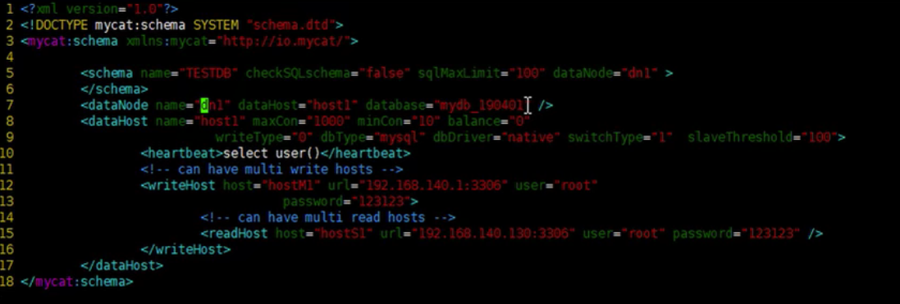

# 优化套路

## 合理使用SQL索引

* 最左前缀法则

* 避免索引失效《SQL优化 -- 方案》-->《索引失效》

* 对于单列索引，尽量要选择对当前query过滤性更好地的索引

* 对于组合索引，query过滤性好的索引放在前面，比如说name、身份证号等。

* 对于范围查询，如果某个字段可能出现范围查询，尽量把这个字段的索引次序放在后面，避免范围查询后的字段索引失效。

* 对于关联查询，保证驱动表的关联字段被索引，避免两个表进行全盘扫描。具体在《十二章-SQL优化》--->《关联查询索引失效》

* 对于关联查询，<type> join 选择小表作为驱动表，放在join前面，减小全盘扫描数据量

* 对于关联查询，子查询尽量不要放在被驱动表，有可能使用不到索引

* 对于关联查询，能够直接使用多表关联查询就关联，不要使用子查询，会多一次查询。

* 对于排序分组查询，一定要使用过滤进行数据处理，比如where 和 limit，并且注意排序顺序。无过滤不索引。

	

## 读写分离 Spring-AOP | MyCat

## 缓存

## MyCat

### 是什么

MyCat是目前最流行的**基于Java语言编写**的**数据库中间件**，是一个实现了MySql协议的服务器，其核心功能是**分库分表**。配合数据库的主从模式还可以实现**读写分离**。是国人开发的

### 原理

拦截转发。即拦截SQL请求，根据不同情况分发到不同服务器。

### 安装

1. 先准备号MySQL主从集群

	可参考 《MD-Book/MQ/kafka/第0章-准备工作.md》---> 《安装 MySQL 8.0》

2. 下载 mycat-server.tar.gz

	http://dl.mycat.org.cn/1.6.7.5/2020-4-10/

	

	

3. 将下载文件拷贝到 MySQL主从服务器中
4. 解压缩即可

### 配置文件介绍

1. schema.xml

	定义逻辑库、表、分片节点等内容。何为逻辑库？MyCat不会直接操作磁盘MySQL文件，而是通过定义逻辑库实现主从复制等功能，

2. rule.xml

	定义分片规则

3. server.xml

	定义用户以及系统相关变量，如端口等。

### 配置

#### 配置 schema.xml

> 将之前内容修改为如上内容

### 读写分离

### 分库分表

### 多数据源整合

> 支持关系型数据库以及非关系型数据库

