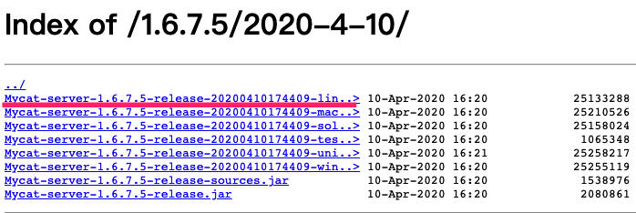

# 优化套路

## 合理使用SQL索引

* 最左前缀法则

* 避免索引失效《SQL优化 -- 方案》-->《索引失效》

* 对于单列索引，尽量要选择对当前query过滤性更好地的索引

* 对于组合索引，query过滤性好的索引放在前面，比如说name、身份证号等。

* 对于范围查询，如果某个字段可能出现范围查询，尽量把这个字段的索引次序放在后面，避免范围查询后的字段索引失效。

* 对于关联查询，保证驱动表的关联字段被索引，避免两个表进行全盘扫描。具体在《十二章-SQL优化》--->《关联查询索引失效》

* 对于关联查询，<type> join 选择小表作为驱动表，放在join前面，减小全盘扫描数据量

* 对于关联查询，子查询尽量不要放在被驱动表，有可能使用不到索引

* 对于关联查询，能够直接使用多表关联查询就关联，不要使用子查询，会多一次查询。

* 对于排序分组查询，一定要使用过滤进行数据处理，比如where 和 limit，并且注意排序顺序。无过滤不索引。

	


## 读写分离 Spring-AOP | MyCat


## 缓存


# MyCat

## 是什么

MyCat是目前最流行的**基于Java语言编写**的**数据库中间件**，是一个实现了MySql协议的服务器，其核心功能是**分库分表**。配合数据库的主从模式还可以实现**读写分离**。是国人开发的


## 能干什么

* 读写分离、主从复制

	

* 分库分片

	

* 多数据源整合

	

	> 支持关系型数据库以及非关系型数据库


### 原理

拦截转发。即拦截SQL请求，它拦截了用户发 送过来的 SQL 语句，首先对 SQL 语句做了一些特定的分析：如分片分析、路由分析、读写分离 分析、缓存分析等，然后将此 SQL 发 往后端的真实数据库，并将返回的结果做适当的处理，最终 再返回给用户。


## 安装并启动

1. 先准备号MySQL主从集群

  可参考 《MD-Book/MQ/kafka/第0章-准备工作.md》---> 《安装 MySQL 8.0》

2. 下载 mycat-server.tar.gz

	http://dl.mycat.org.cn/1.6.7.5/2020-4-10/

	

	

3. 将下载文件拷贝到 MySQL主从服务器中

4. 解压缩即可

5. 配置 server.xml

  

  > 修改为mycat用户，和MySQL默认root用户区分

  * privileges 标签 ：配置逻辑库操作权限
  	* check 是否校验SQL语句
  	* schem 标签 ：配置不同的逻辑库权限
  		* name 逻辑库名称
  		* dml 【inser update select delete】顺序不能反，1代表可操作，0代表不可操作

6. 配置 schema.xml

  ```xml
  <?xml version="1.0"?>
  <!DOCTYPE mycat:schema SYSTEM "schema.dtd">
  <mycat:schema xmlns:mycat="http://io.mycat/">
      <!-->创建一个node节点(即逻辑数据库)，名称为TESTDB<-->
      <schema name="TESTDB" checkSQLschema="false" sqlMaxLimit="100" dataNode="dn1"></schema>
    	<!-->node节点(即逻辑数据库)对应数据库配置 database是物理数据库真实存在的库 host是物理主机<-->
      <dataNode name="dn1" dataHost="host1" database="db01" />
      <!-->配置物理主机<-->
      <dataHost name="host1" maxCon="1000" minCon="10" balance="0" writeType="0" dbType="mysql" dbDriver="native" switchType="1" slaveThreshold="100">
          <!-->心跳检测<-->
          <heartbeat>select user()</heartbeat>
          <!-- 数据库写主机 这里配置 MySQL master节点-->
          <writeHost host="hostM1" url="192.168.31.98:3306" user="root" password="root">
              <!-- 数据库读主机  这里配置 MySQL slove节点-->
              <readHost host="hostS1" url="192.168.31.99:3306" user="root" password="root" />
          </writeHost>
      </dataHost>
  </mycat:schema>
  ```

  > 将之前内容修改为如上内容.

  * schema 标签  ： 定义逻辑库
  	* name 逻辑库对应的节点名称
  	* checkSQLschema 为true 则查询语句会携带上逻辑库名称.表名
  	* sqlMaxLimit 查询携带上最大查询数据上限 select * from table limit 100
  	* dataNode 和dataNode 标签 关联
  * dataNode 标签 ：定义逻辑库和物理库关系
  	* name 逻辑库和物理库关联使用到的名称
  	* dataHost 物理库地址 和 dataHost 标签关联
  	* database 物理库中数据库
  * dataHost 标签 ：定义物理主机库
  	* maxCon 、minCon 最大最小连接数
  	* dbType 数据库类型，pg、mysql、mongodb等
  	* dbDriver
  * writeHost readHost 标签 ：配置读数据库、写数据库。读写分离

7. 验证主从MySQL是否互通

	```mysql
	mysql -u root -proot -h 192.168.31.98 -P 3306
	```

8. 启动MyCat

	```bash
	cd mycat根目录/bin
	#控制台启动
	./mybat console  
	#后台启动
	./mycat start
	```

	 

9. 登录mycat后台管理窗口 9066 

	```bash
	mysql -umycat -p123456 -h 192.168.31.98 -P 9066  #其中mycat 是server.xml配置的用户名。-p后密码为server.xml配置的用户名对应的密码。 -P 9066 是管理窗口的端口
	```

	报错 ：Access denied for user 'mycat', because password is error 【原因是mycat连接MySQL使用的密码加密方式只能支持到5.X版本，因此需要匹配MySQL8的加密方式】

	可以通过指定加密方式进行连接mycat，如下

	```bash
	mysql -umycat -p123456 -h 192.168.31.98 -P 9066 --default-auth=mysql_native_password
	# 使用 show @@help; 查看支持命令
	```

10. 登录mycat 数据访问窗口 8066

	```bash
	mysql -umycat -p123456 -h 192.168.31.98 -P 8066 --default-auth=mysql_native_password
	#和寻常MySQL操作类似
	```

	


### 配置文件介绍

1. schema.xml

  定义逻辑库、表、分片节点等内容。何为逻辑库？MyCat不会直接操作磁盘MySQL文件，而是通过定义逻辑库实现主从复制等功能.

  > 具体标签介绍 在安装过程中有

2. server.xml

  定义用户以及系统相关变量，如端口等。

  > 具体标签介绍 在安装过程中有

3. rule.xml

  定义分片规则

  

  * tableRule 标签
  	* name 无特别含义，不许重复，用以标识不同的分片规则
  	* role 标签 ：分片拆分规则定义
  		* columns 标识 根据哪一列进行拆分表
  		* algcrithm 标签 关联 function 标签
  * function 标签
  	* name 指定 分片算法名称
  	* class 指定 分片算法实现类 全限定类名
  	* property 上面实现类中用到的属性值

### mycat 端口介绍

> mycat启动后会开启两个端口【9066，8066】
>
> 9066端口 ： 数据库管理端口。可以查看节点信息、服务器连接信息、处理情况、缓存、内存状态、重新加载schema.xml等操作。可以使用 show @@help; 进行查看
>
> 8066端口 ： 数据库访问端口。和正常操作MySQL一样。


## 读写分离

> mycat 的读写分离需要依赖MySQL的主从复制，详情见《MD-Book/MQ/kafka/第0章-准备工作.md》---> 《安装 MySQL 8.0》

1. 按照启动步骤配置

	

2. schema.xml 中修改 dataHost标签中balance 为 1

3. 测试逻辑库和物理库是否同步

	逻辑库插入数据，看物理库是否同步

	


## 垂直拆分 -- 分库

> 一个数据库由很多表构成，每个表对应不同的业务，垂直切分是指按照业务将**表进行分类， 分布到不同 的数据库上面**，这样也就将数据或者说压力分担 到不同的库上面


### 分库原则  

不同的**逻辑库**之间表是不可以进行级联操作，因此每个逻辑库存放关系紧密的表。相互没有关联的表可以分到不同的逻辑库


## 水平拆分 -- 分表

> 相对于垂直拆分，水平拆分不是将表做分类，而是**按照某个字段的 某种规则来分散到多个库之中**， 每个表中 包含一部分数据。简单来说，我们可以将数据的水平切 分理解为是按照数据行的切分，就 是将表中的某些行切分 到一个数据库，而另外的某些行又切分到 其他的数据库中.


### 字段选择

> 分表数据如何选取合适的字段进行拆分？以订单表进行举例

* id或者时间

	查询订单数据注重时效，历史数据查询的次数少，如此依据ID和时间进行分片，会造成数据访问不均。

* 客户ID

	根据客户ID 取余 去分，两个节点访问平均，并且一个客户所在的订单都会存储在一个库中，减少访问量。
