# 日志

## 错误日志

```mysql
# 查看错误日志文件位置
show variables like 'log_error%';
```


## 二进制日志(重要)

> 二进制日志（BINLOG）记录了**所有的 DDL（数据定义语言）语句和 DML（数据操纵语言）语句**，但是不包括数据查询语句。此日志对于灾难时的数据恢复起着极其重要的作用，**MySQL的主从复制， 就是通过该binlog实现的**。
>
> 二进制日志文件并不能直接进行查看，需使用**mysqlbinlog** 工具进行查看。使用情况在 《第十三章-MySQL常用工具.md》


### 配置信息

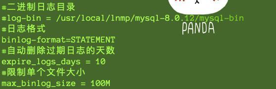

### 查看二进制日志是否开启

```sql
# MySQL8 是默认开启的
show variables like 'log_bin';
```

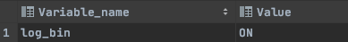


### 查看二进制日志信息

```sql
# 查看所有的日志文件
show master logs;
# 查看当前使用的日志文件 (一般为值最大的文件)
show master status;
```


### 配置二进制文件目录以及格式

```sql
#配置开启binlog日志， 日志的文件前缀为 mysqlbin -----> 生成的文件名如 : mysqlbin.000001,mysqlbin.000002。如果不设置默认为binlog.000001..
log_bin=mysqlbin

#配置二进制日志的格式
binlog_format=STATEMENT
```

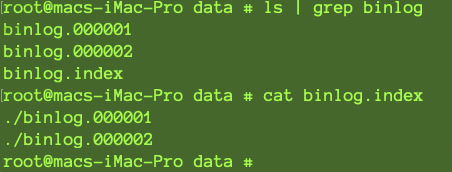


### 二进制日志格式

**STATEMENT**

该日志格式在日志文件中记录的都是`SQL语句（statement）`，每一条对数据进行修改的SQL都会记录在日志文件中，通过Mysql提供的**mysqlbinlog**工具，可以清晰的查看到每条语句的文本。主从复制的时候，从库（slave）会将日志解析为原文本，并在从库重新执行一次。

**ROW**

该日志格式在日志文件中记录的是每一行的数据变更，而不是记录SQL语句。比如，执行SQL语句 ： update tb_book set status='1' , 如果是STATEMENT 日志格式，在日志中会记录一行SQL文件； 如果是ROW，由于是对全表进行更新，也就是每一行记录都会发生变更，ROW 格式的日志中会记录每一行的数据变更。

**MIXED**

这是目前MySQL默认的日志格式，即混合了STATEMENT 和 ROW两种格式。默认情况下采用STATEMENT，但是在一些特殊情况下采用ROW来进行记录。MIXED 格式能尽量利用两种模式的优点，而避开他们的缺点。


### STATEMENT格式演示

1. 插入数据

	```sql
	insert into test_innodb_lock values(9,'900','1');
	insert into test_innodb_lock values(2,'200','0');
	```

2. 查看二进制日志文件是否记录

	```sql
	mysqlbinlog /usr/local/mysql/data/binlog.000002
	```

	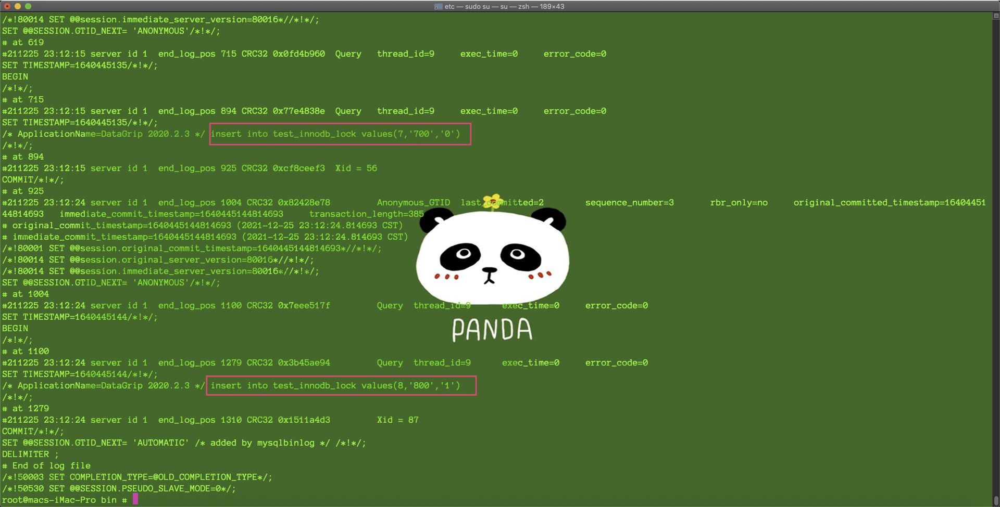


### ROW格式演示

1. 设置格式并重启MySQL服务

	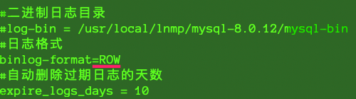

2. 新增数据

	```mysql
	insert into test_innodb_lock values(5,'500','1');
	insert into test_innodb_lock values(6,'600','0');
	```

3. 查看当前使用的日志文件

	```sql
	show master status;
	```

	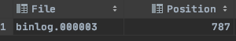

4. mysqlbinlog 查看日志文件

	```sql
	mysqlbinlog -vv /usr/local/mysql/data/binlog.000003 
	```

	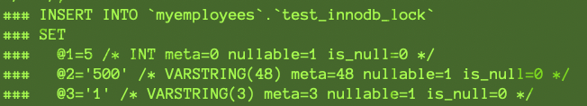

	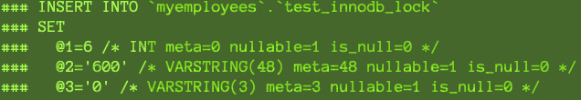


## 查询日志

> 二进制日志文件不包含查询日志，如果想要查看查询日志，怎么办呢？使用查询日志。查询日志中记录了客户端的所有操作语句。


### 开启查询日志


## 查看 查询日志

```bash
cat 日志文件
```

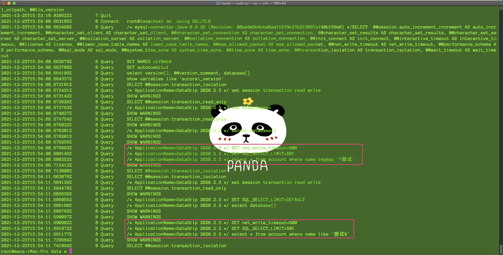


## 慢查询日志(重要)

慢查询日志记录了所有执行时间超过参数 long_query_time 设置值并且扫描记录数不小于 min_examined_row_limit 的所有的SQL语句的日志。

### 开启慢查询日志

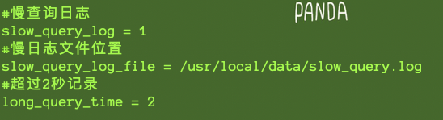


### 查询 long_query_time 时间

```sql
show variables like 'long%';
```


### 演示


1. 查询一条慢查询

	```sql
	select * from account where name regexp '^测试';
	```

2. 查看慢查询日志

	```bash
	cat slow_query.log
	```

	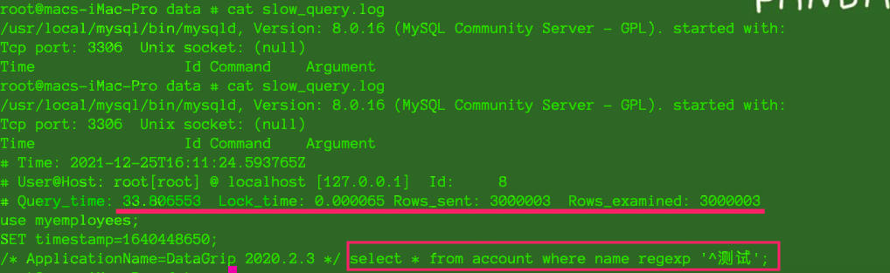

	