## 局域网痛点

* 大多项目开发都是在局域网内团队完成，而项目中用到的依赖包等都需要从外网拷贝，jar包可以直接拷贝目录，npm包费劲得很。

* 每个团队成员都需要维护一个本地仓库。


## Nexus

> 代理服务器(可访问外网)中安装Nexus 作私服，局域网多台电脑从代理服务器中获取所需依赖包，如果代理服务器中没有则从外网下载。


* 是一个强大的Maven仓库管理器，同时yum、pypi、npm、docker、等私有仓库
* 节省带宽
* 统一管理

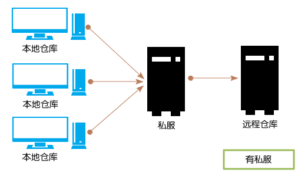


## 安装Nexus

`Mac`

```bash
#链接：https://pan.baidu.com/s/1Cdo4kNpcv__cHmhtD1RMig
#提取码：3pqx
cd /usr/local
sudo mkdir Nexus
tar -zxvf nexus-3.19.1-01-mac.tgz -C /usr/local/Nexus

#启动
cd /usr/local/Nexus/nexus-3.19.1-01/bin
sudo sh nexus start

#浏览器访问  http://127.0.0.1:8081/nexus
#登录 按照提示路径/usr/local/Nexus/sonatype-work/nexus3/admin.password 查看密码
```

`命令`

```bash
root@macs-iMac-Pro bin # sh nexus help
WARNING: ************************************************************
WARNING: Detected execution as "root" user.  This is NOT recommended!
WARNING: ************************************************************
Usage: nexus {start|stop|run|run-redirect|status|restart|force-reload}
```


## 大致介绍

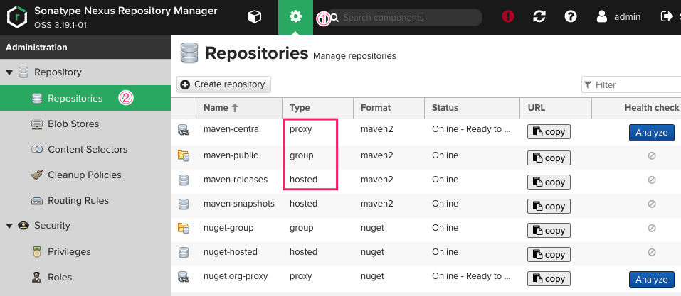


Nexus默认会创建一些仓库，其中包括3类：代理proxy，仓库组group和宿主host。

* 代理仓库

	用来指向远程仓库的，如中央仓库。当在下载组件时，如果代理仓库搜索不到，则会把请求转发到远程仓库从远程仓库下载。从远程仓库下载后会缓存到代理仓库，下次还有该组件的请求则会直接到代理仓库下载，不会再次请求远程仓库。

* 宿主host

	表示为宿主仓库。宿主仓库主要用来部署团队内部使用的内部组件，默认的maven-releases和maven-snapshots分别用来部署团队内部的发布版本组件和快照版本组件。

* 仓库组

	仓库组没有Release和Snapshot的区别，这不同于宿主仓库和代理仓库
	在配置界面中，用户可以非常直观地选择Nexus中的仓库，将其聚合成一个虚拟的仓库组。注意，仓库组所包含的仓库的顺序决定了仓库组遍历其所含仓库的次序，因此最好将常用的仓库放在前面，当用户从仓库组下载构件的时候，就能够尽快地访问到包含构件的仓库。

Nexus3.19 默认用户有两种

* admin

	能配置仓库、查询和上传构件

* anonymous

	只能查构件


## 新建一个Maven私服

1. 创建仓库

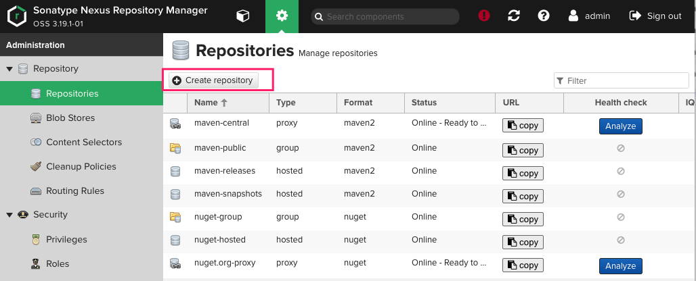


2. 选择Maven代理仓库


3. 配置代理仓库  拉倒最下面点击  Create Repository

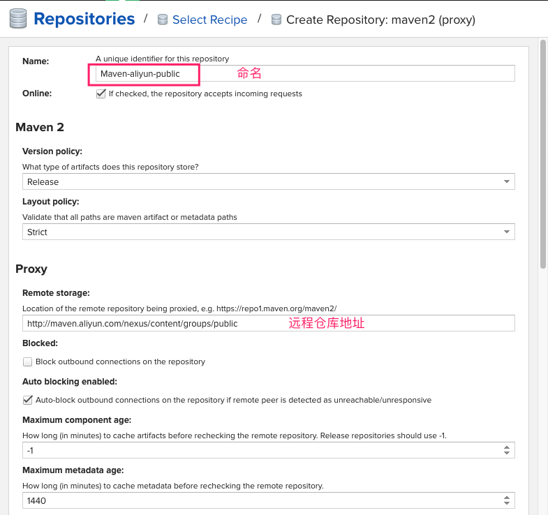


4. 创建宿主仓库  用于上传打出来的包，分为==发布Release==和==快照Snapshot== 。因此创建两个宿主仓库。过程同上

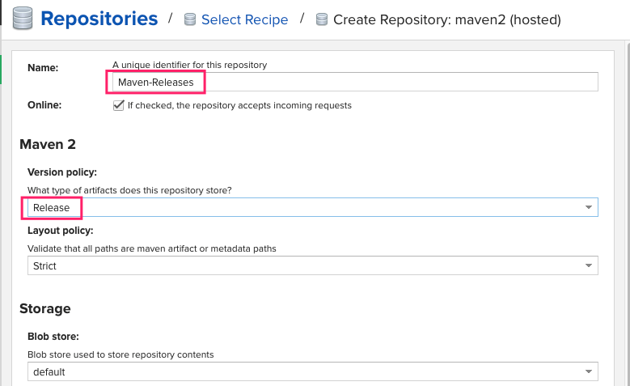

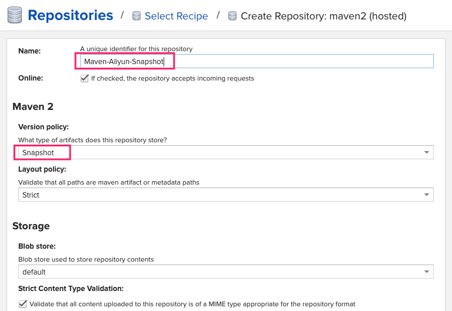


5. 创建仓库组

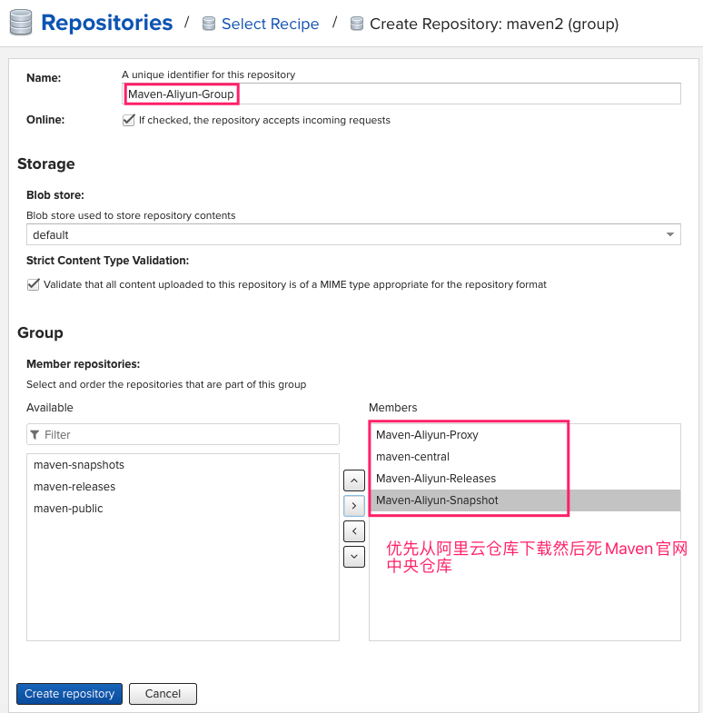


6. 新增deployment角色并赋予构建查询和上传功能。避免混乱

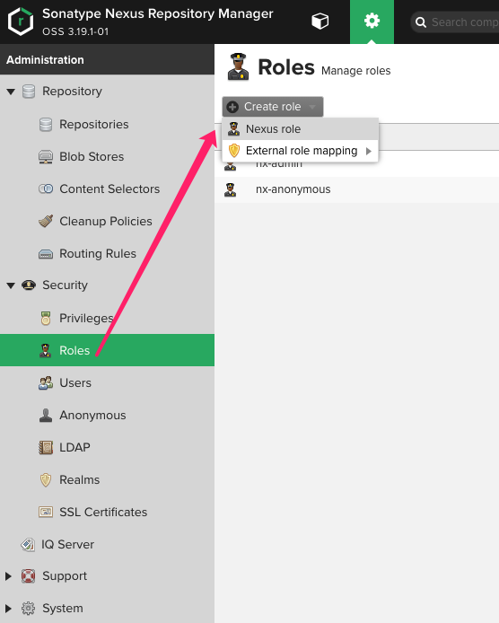

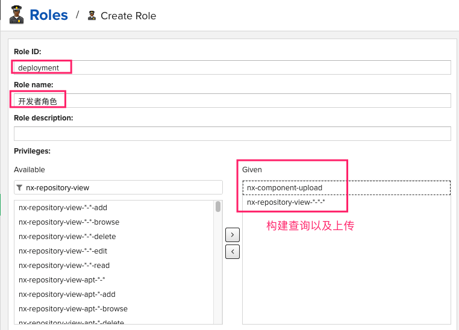

7. 新增deployment用户并赋予deployment角色权利

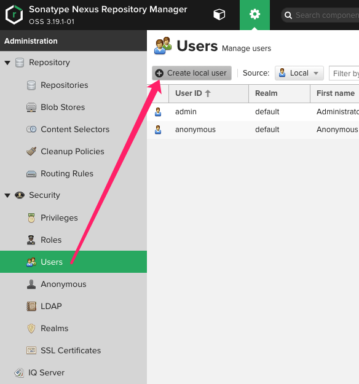

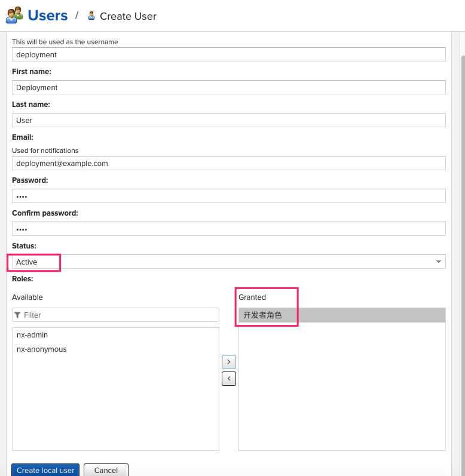

8. 新增Maven配置文件用以配置Maven依赖远程仓库

	* 新建文件setting_nexus.xml

	* 写入内容

		```xml
		<?xml version="1.0" encoding="UTF-8"?>
		<settings xmlns="http://maven.apache.org/SETTINGS/1.0.0"
		          xmlns:xsi="http://www.w3.org/2001/XMLSchema-instance"
		          xsi:schemaLocation="http://maven.apache.org/SETTINGS/1.0.0 http://maven.apache.org/xsd/settings-1.0.0.xsd">
		    <localRepository>/Users/mac/.m2/repository</localRepository>
		
		    <!--  1. 配置私服仓库组  -->
		    <mirrors>
		        <mirror>
		            <id>nexus-aliyun</id>
		            <name>Maven-Aliyun-Group</name>
		            <url>http://localhost:8081/repository/Maven-Aliyun-Group/</url>
		            <mirrorOf>*</mirrorOf>
		        </mirror>
		    </mirrors>
		
		    <!-- 2. 激活配置 -->
		<!--    <activeProfiles>-->
		<!--        <activeProfile>nexus</activeProfile>-->
		<!--    </activeProfiles>-->
		    <profiles>
		        <!-- 3. 配置私服代理仓库 -->
		        <profile>
		            <id>nexus</id>
		            <repositories>
		                <repository>
		                    <id>central</id>
		                    <url>http://localhost:8081/repository/Maven-Aliyun-Proxy/</url>
		                    <releases><enabled>true</enabled></releases>
		                    <snapshots><enabled>true</enabled></snapshots>
		                </repository>
		            </repositories>
		            <pluginRepositories>
		                <pluginRepository>
		                    <id>central</id>
		                    <url>http://localhost:8081/repository/Maven-Aliyun-Proxy/</url>
		                    <releases><enabled>true</enabled></releases>
		                    <snapshots><enabled>true</enabled></snapshots>
		                </pluginRepository>
		            </pluginRepositories>
		        </profile>
		    </profiles>
		
		    <!--  4. 配置用户名密码  -->
		    <servers>
		        <server>
		            <id>nexus</id>
		            <username>deployment</username>
		            <password>1234</password>
		        </server>
		    </servers>
		</settings>
		```

	* 修改项目Maven配置文件

	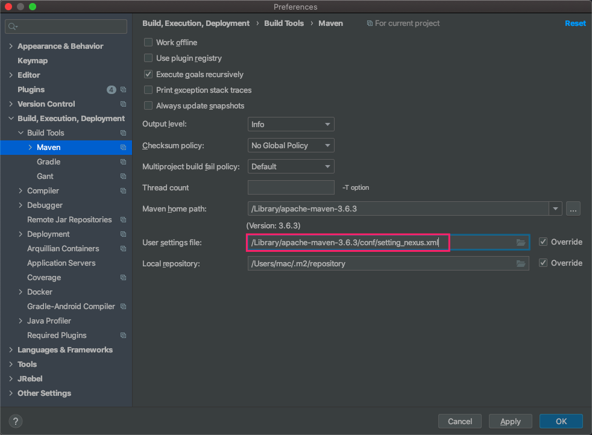

	* Maven-下载

		```bash
		mvn clean
		mvn compile
		```

	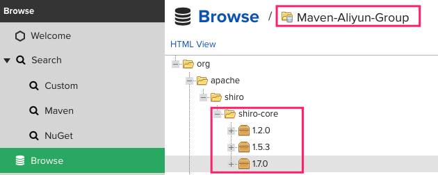

	* Maven-上传

		* 项目pom文件中添加上传配置

			```xml
			<!--下面的配置中 <id> 必须和 Maven配置文件中ID保持一致 -->
			  <distributionManagement>
			    <!--  快照  -->
			    <snapshotRepository>
			      <id>nexus-aliyun</id>
			      <url>http://localhost:8081/repository/Maven-Aliyun-Snapshot/</url>
			    </snapshotRepository>
			    <!--  发布版本  -->
			    <repository>
			      <id>nexus-aliyun</id>
			      <url>http://localhost:8081/repository/Maven-Aliyun-Releases/</url>
			    </repository>
			  </distributionManagement>
			
			<!-- 可以不加，如果想要使用其他的仓库则而不是Maven配置文件中的仓库则添加 -->
			  <repositories>
			    <repository>
			      <id>nexus</id>
			      <name>test</name>
			      <url>http://localhost:8081/repository/Maven-Aliyun-Group/</url>
			    </repository>
			  </repositories>
			```

		* 执行

			```bash
			mvn clean
			mvn compile
			mvn deploy
			```

		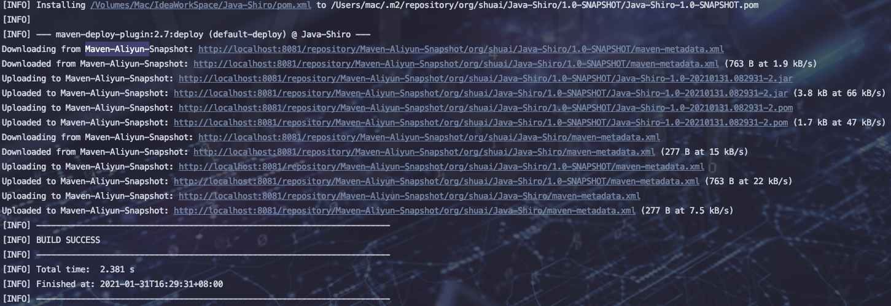

		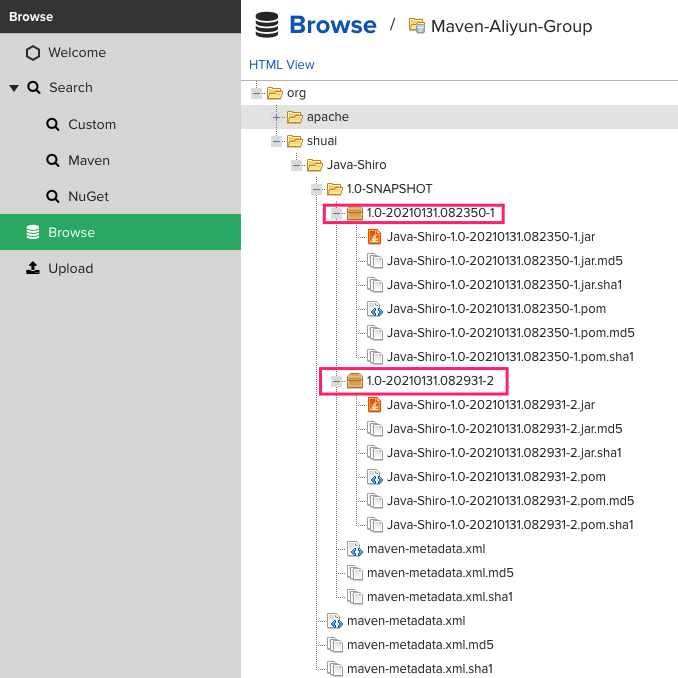


`注意:`

> 上面上传的jar包都上传到了snpshot仓库，如何上传到releases仓库？
>
> 项目pom文件 将 <version>1.0-SNAPSHOT</version> 修改为 <version>1.0-RELEASES</version>

