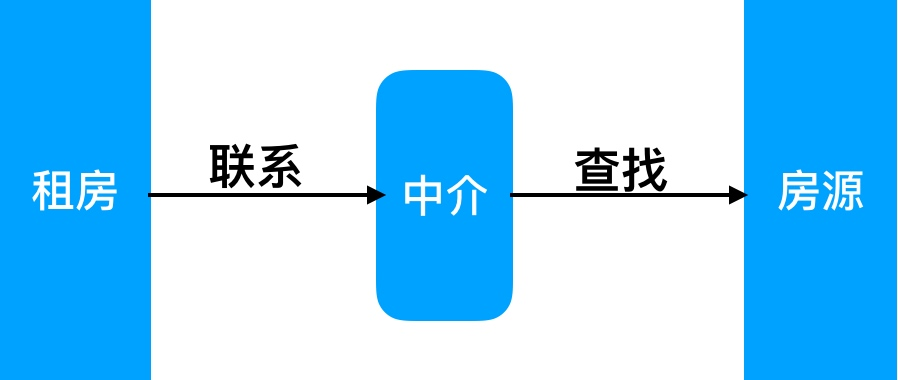
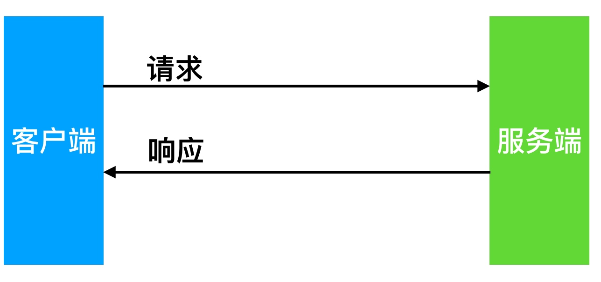
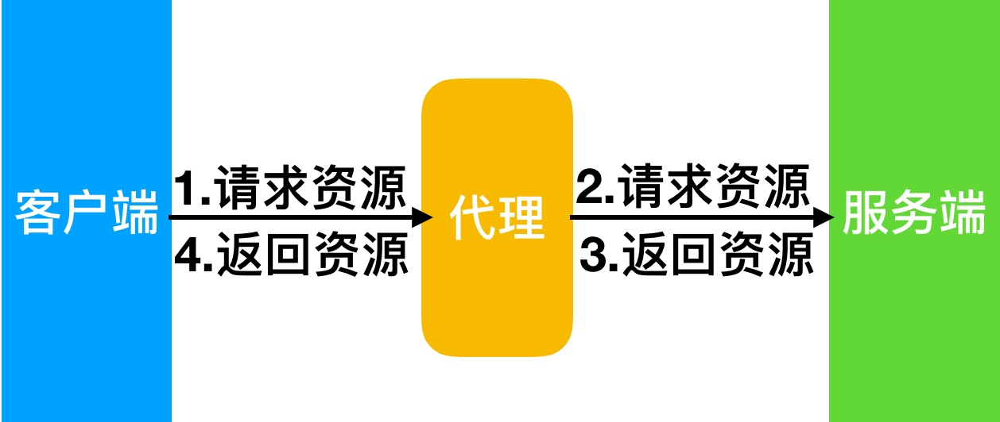
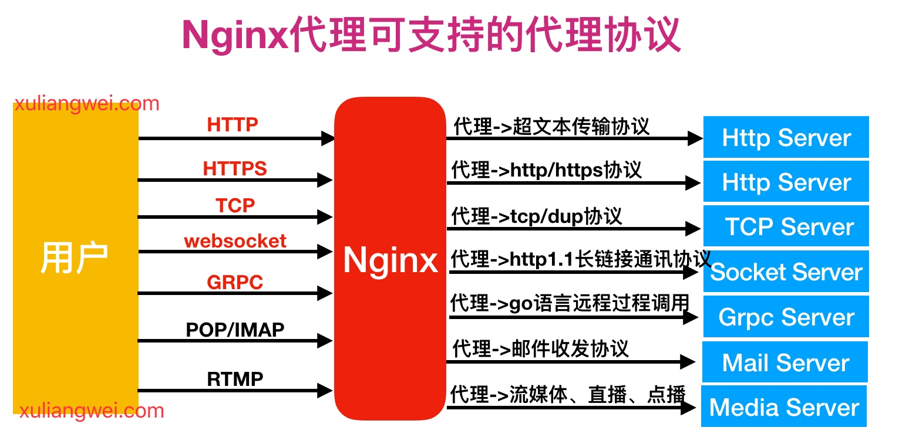
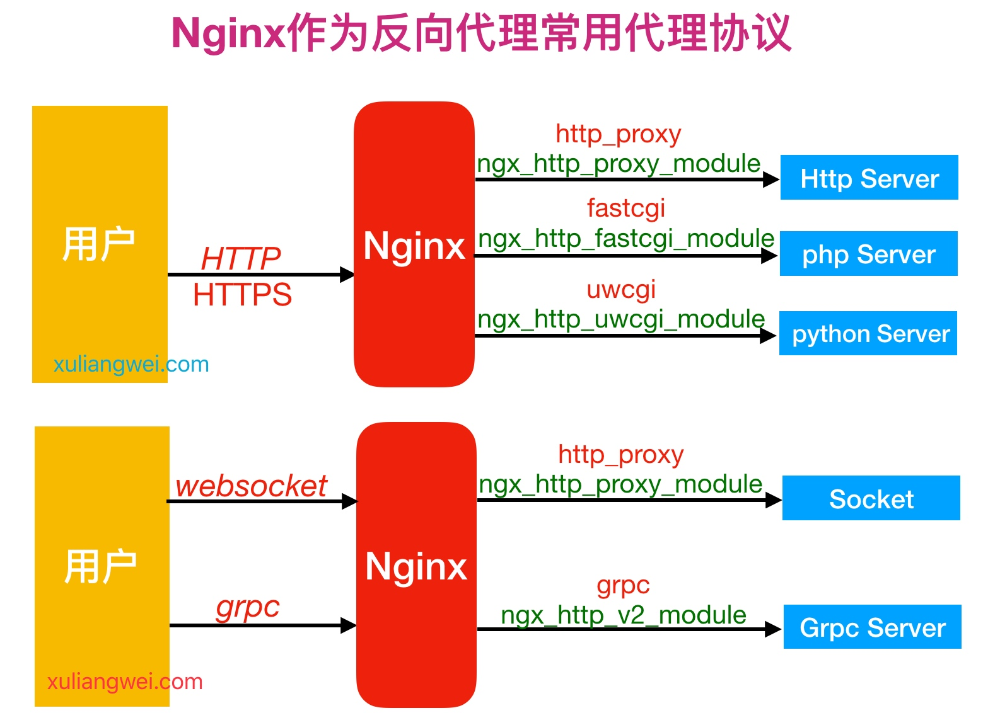

## 代理

代理一词往往并不陌生, 该服务我们常常用到如(代理理财、代理租房、代理收货等等)，如下图所示

 

在没有代理模式的情况下，客户端和Nginx服务端，都是客户端直接请求服务端，服务端直接响应客户端

那么在互联网请求里面, 客户端往往无法直接向服务端发起请求, 那么就需要用到代理服务, 来实现客户端和服务通信，如下图所示

## Nginx代理模式

Nginx作为代理服务, 按照应用场景模式进行总结，代理分为正向代理、反向代理。

* 正向代理

	主要用于内部上网，客户端<-->代理<-->服务端。

	> 现在使用很少了，因为如果想要内部上网挂个路由器或者VPN即可。

* 反向代理

	用于公司集群架构中。客户端-->代理<-->服务端。

* 区别
	1. 服务的对象不一样。正向代理代理的对象的是客户端，为客户端服务。反向代理代理的是服务端，为服务端服务。

## Nginx代理支持协议

* Nginx作为代理服务，可支持的代理协议非常的多，具体如下图

* 如果将Nginx作为反向代理服务，常常会用到如下几种代理协议，如下图所示
	

* 反向代理模式与Nginx代理模块总结如表格所示

| 反向代理模式           | Nginx配置模块           |
| :--------------------- | ----------------------- |
| http、websocket、https | ngx_http_proxy_module   |
| fastcgi                | ngx_http_fastcgi_module |
| uwsgi                  | ngx_http_uwsgi_module   |
| grpc                   | ngx_http_v2_module      |

