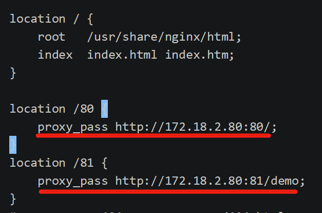
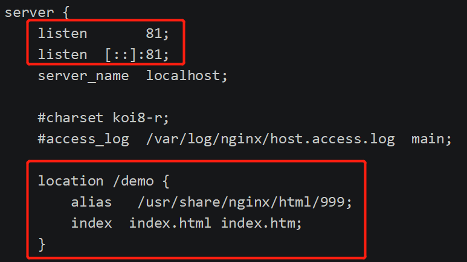
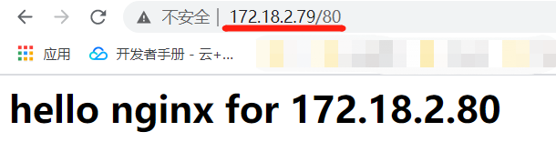

## 反向代理

### Nginx代理Nginx

`效果:`

​	本机访问虚拟机nginx然后跳转到另一台虚拟机nginx


* 环境准备

	* 两台虚拟机centos (192.168.124.6、192.168.124.7)

	* 两台虚拟机配置好docker-nginx:并配置好docker中nginx和虚拟机的映射关系

		

		
	
	* 映射关系如下
	
		````bash
		docker run  --name nginx -d -p 80:80 --privileged=true  -v /root/nginx/html:/usr/share/nginx/html -v /root/nginx/config/nginx.conf:/etc/nginx/nginx.conf nginx
		````
	
* 配置192.168.124.6 nginx

	* 进入nginx容器内部

		````bash
		docker exec -it 容器ID /bin/bash
		````

	* 配置default.conf

		````bash
		vim /etc/nginx/conf.d/default.conf 
		````

	

* 在192.168.124.7 中新增to目录

	

* 结果

	


### Nginx代理Tomcat

`效果:`

本机访问虚拟机nginx然后跳转到另一台虚拟机Tomcat


* 环境准备

	* 两台虚拟机centos (192.168.124.6、192.168.124.7)

	* 两台虚拟机配置好docker-nginx:并配置好docker中nginx和虚拟机的映射关系

		

		

	* 映射关系如下

		````bash
		docker run  --name nginx -d -p 80:80 --privileged=true  -v /root/nginx/html:/usr/share/nginx/html -v /root/nginx/config/nginx.conf:/etc/nginx/nginx.conf nginx
		````

* 配置192.168.124.6 nginx

	* 进入nginx容器内部

		````bash
		docker exec -it 容器ID /bin/bash
		````

	* 配置default.conf

		````bash
		vim /etc/nginx/conf.d/default.conf 
		````

	


* 配置192.168.127.7 Tomcat

	````bash
	docker run --privileged=true -p 8080:8080 -v /root/tomcat/webapps:/usr/local/tomcat/webapps -d --name tomcat tomcat
	````

	> 具体配置可参考我的另外一篇文章：MD-Book/Docker/第十章-Docker安装Tomcat.md


* 结果

	


* 访问真实的项目

	* 放置一个SpringBoot项目到192.168.124.7 webapps内

	* 重启docker - Tomcat

		````bash
		docker restart c314
		````

	* 修改192.168.12.6 Nginx配置文件

	

* 结果

	


### Nginx代理不同端口的服务

`效果2:`

*   访问虚拟机 172.18.2.79 中Docker-Nginx 跳转到 172.18.2.80 中Docker-Nginx
    *   如果路径为 172.18.2.79/80 则访问 172.18.2.80:80/中项目
    *   如果路径为 172.18.2.79/81 则访问 172.18.2.80:81/demo中项目


`步骤:`

*   配置 172.18.2.79 Docker-nginx配置文件

    

*   172.18.2.80 conf.d目录中新增demo.conf

    

*   结果

    

    

`注意:`

*   172.18.2.80 服务器中Docker-Nginx需要开放两个端口，配置命令如下

    ```bash
    docker run  --name nginx -d -p 80:80 --privileged=true  -v /root/nginx/html:/usr/share/nginx/html -v /root/nginx/config/nginx.conf:/etc/nginx/nginx.conf nginx    # 将-p 80:80  修改为 --net host
    ```

    ```bash
    docker run  --name nginx -d --net host --privileged=true  -v /root/nginx/html:/usr/share/nginx/html -v /root/nginx/config/nginx.conf:/etc/nginx/nginx.conf nginx
    ```

>   docker相关内容可参考：MD-Book\Docker\第九章-Docker安装Nginx.md

