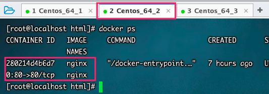
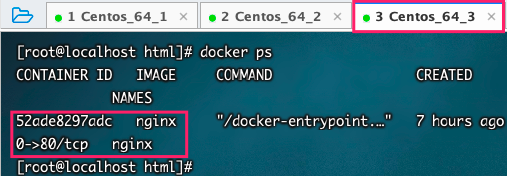
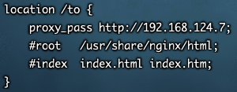
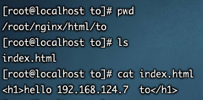
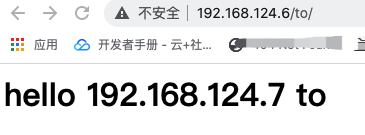
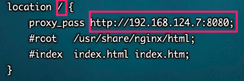
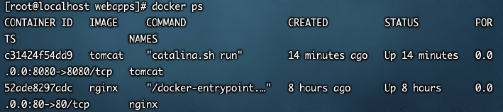
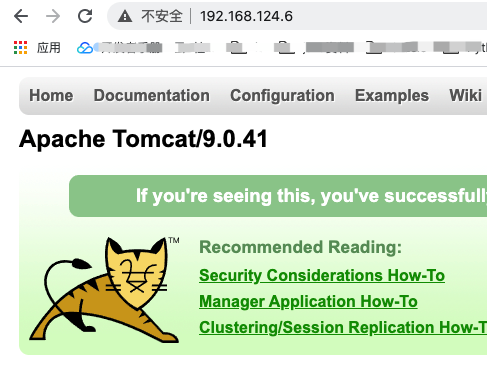
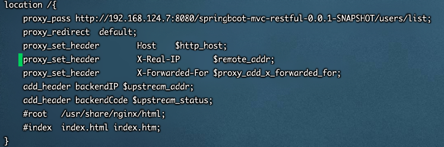
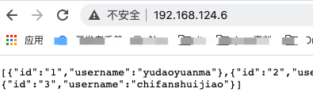

## 反向代理

### Nginx代理Nginx

`效果:`

​	本机访问虚拟机nginx然后跳转到另一台虚拟机nginx


* 环境准备

	* 两台虚拟机centos (192.168.124.6、192.168.124.7)

	* 两台虚拟机配置好docker-nginx:并配置好docker中nginx和虚拟机的映射关系

		

		
	
	* 映射关系如下
	
		````bash
		docker run  --name nginx -d -p 80:80 --privileged=true  -v /root/nginx/html:/usr/share/nginx/html -v /root/nginx/config/nginx.conf:/etc/nginx/nginx.conf nginx
		````
	

* 配置192.168.124.6 nginx

	* 进入nginx容器内部

		````bash
		docker exec -it 容器ID /bin/bash
		````

	* 配置default.conf

		````bash
		vim /etc/nginx/conf.d/default.conf 
		````

	

* 在192.168.124.7 中新增to目录

	

* 结果

	


### Nginx代理Tomcat

`效果:`

本机访问虚拟机nginx然后跳转到另一台虚拟机Tomcat


* 环境准备

	* 两台虚拟机centos (192.168.124.6、192.168.124.7)

	* 两台虚拟机配置好docker-nginx:并配置好docker中nginx和虚拟机的映射关系

		

		

	* 映射关系如下

		````bash
		docker run  --name nginx -d -p 80:80 --privileged=true  -v /root/nginx/html:/usr/share/nginx/html -v /root/nginx/config/nginx.conf:/etc/nginx/nginx.conf nginx
		````

* 配置192.168.124.6 nginx

	* 进入nginx容器内部

		````bash
		docker exec -it 容器ID /bin/bash
		````

	* 配置default.conf

		````bash
		vim /etc/nginx/conf.d/default.conf 
		````

	


* 配置192.168.127.7 Tomcat

	````bash
	docker run --privileged=true -p 8080:8080 -v /root/tomcat/webapps:/usr/local/tomcat/webapps -d --name tomcat tomcat
	````

	> 具体配置可参考我的另外一篇文章：MD-Book/Docker/第十章-Docker安装Tomcat.md




* 结果

	


* 访问真实的项目

	* 放置一个SpringBoot项目到192.168.124.7 webapps内

	* 重启docker - Tomcat

		````bash
		docker restart c314
		````

	* 修改192.168.12.6 Nginx配置文件

	

* 结果

	


`效果1:`

*   本机配置Nginx。使用本机浏览器访问本机域名然后跳转到虚拟机中Tomcat(可以使用Docker部署Tomcat映射到虚拟机)
*   如可以跳转到Tomcat中实际项目，并且虚拟机使用域名进行映射。
*   将访问端口例如8080在防火墙中对外开放。并且查看开放的所有端口 firewall-cmd--add-port=8080/tcp--permancet       firewall-cmd -reload    firewall-cmd --list-all
*   详细配置
*   遗留问题


`步骤:`

*   本机添加域名
*   本机nginx(或者虚拟机nginx)修改配置文件添加域名以及代理配置(两个命令一个是服务器IP（proxy_pass）另外一个是项目名称)


`效果2:`

*   根据访问的路径调到不同的端口中的服务中。
*   nginx默认监听端口9001


nginx是一个高性能的web服务器，应用广泛。下面是两个nginx反向代理的配置例子。

````bash
 location ^~ /nagios/ {
 proxy_pass http://192.168.0.253;
 proxy_set_header X-Real-IP $remote_addr;
 proxy_set_header X-Forwarded-For $proxy_add_x_forwarded_for;
 }
 location ^~ /blog1/ {
 proxy_set_header Host $host;
 proxy_set_header X-Real-IP $remote_addr;
 proxy_set_header X-Forwarded-For $proxy_add_x_forwarded_for;
 proxy_pass http://192.168.0.243/blog/;
 }
````


最重要的是proxy_pass这个配置，是他负责转发请求到其他的服务器。

细心的朋友可能发现第一个proxy_pass后面没有加/，而第二个proxy_pass却加了/ 。简单说没加/时，匹配的目录地址会加给后端web服务器，而加了/就表示绝对路径，不会把匹配的目录传给后端web服务器。例如访问https://zhangnq.com/nagios/，实际访问的是http://192.168.0.253/nagios/。访问https://zhangnq.com/blog1/实际访问的是http://192.168.0.243/blog/。使用绝对路径可以给后端web项目指定不同的子目录名称。


