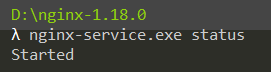
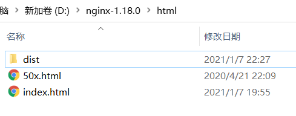

## 安装

`win下安装`

https://blog.csdn.net/zeng092210/article/details/93785099

>   使用cmd安装nginx时注意管理员启动。

```bash
##安装
nginx-service.exe install
##启动
nginx-service.exe start
##状态
nginx-service.exe status
##停止
nginx-service.exe stop
```


`linux下安装(Mac)`

*   源码编译

    自定义配置、安装复杂(依赖繁琐)

*   yum官方安装

    给定通用配置(建议此安装方式)

```bash
brew update  #更新brew
brew search nginx  #搜索nginx
brew install nginx  #安装nginx
nginx -v  #查看版本
brew info nginx  #查看nginx信息
nginx  #启动
nginx -s reload  #重启
ps -ef|grep nginx  #关闭
```


## 配置文件说明

```conf

#--------------------------------------核心模块-----------------------------------------------
#user  nobody;		   #nginx进程运行的用户
worker_processes  1;   #nginx工作的核心进程数量

#error_log  logs/error.log;  	#nginx的错误日志
#error_log  logs/error.log  notice;
#error_log  logs/error.log  info;

#pid        logs/nginx.pid;		#nginx运行后的进程id存放到该文件内

#--------------------------------------事件模块-----------------------------------------------
events {
    worker_connections  1024;  	#一个work进程的最大连接数量(官方给定5万实际测试2~4万)
	#use epool;					#默认网络模型
}


#--------------------------------------http核核心模块(用户请求相关)-----------------------------------------------
http {
    include       mime.types; 		#资源类型文件
	#在资源类型文件中找不到则作为下载页面返回，然后浏览器负责去下载。例如浏览器访问localhost:80/info.php则直接下载php默认格式文件类似于html:5后的文件。
    default_type  application/octet-stream;
	
	#定义一堆日志格式，在使用access_log时才会用到
    #log_format  main  '$remote_addr - $remote_user [$time_local] "$request" '
    #                  '$status $body_bytes_sent "$http_referer" '
    #                  '"$http_user_agent" "$http_x_forwarded_for"';

    #access_log  logs/access.log  main;

    sendfile        on;		#高效文件传输开关
    #tcp_nopush     on;		

    #keepalive_timeout  0;
    keepalive_timeout  65;		#长连接超时时间

    #gzip  on;			#是否开启压缩功能

    server {		#用户定义一个网站
        listen       80;		#监听端口
        server_name  localhost;		#域名

        #charset koi8-r;		#字符集

        #access_log  logs/host.access.log  main;		#日志

        location / {		#域名根路径  对应的文件
            root   html;
            index  index.html index.htm;		#服务端默认返回给用户的文件
        }

        #error_page  404              /404.html;

        # redirect server error pages to the static page /50x.html
        #
        error_page   500 502 503 504  /50x.html;
        location = /50x.html {
            root   html;
        }

        # proxy the PHP scripts to Apache listening on 127.0.0.1:80
        #
        #location ~ \.php$ {
        #    proxy_pass   http://127.0.0.1;
        #}

        # pass the PHP scripts to FastCGI server listening on 127.0.0.1:9000
        #
        #location ~ \.php$ {
        #    root           html;
        #    fastcgi_pass   127.0.0.1:9000;
        #    fastcgi_index  index.php;
        #    fastcgi_param  SCRIPT_FILENAME  /scripts$fastcgi_script_name;
        #    include        fastcgi_params;
        #}

        # deny access to .htaccess files, if Apache's document root
        # concurs with nginx's one
        #
        #location ~ /\.ht {
        #    deny  all;
        #}
    }


    # another virtual host using mix of IP-, name-, and port-based configuration
    #
    #server {
    #    listen       8000;
    #    listen       somename:8080;
    #    server_name  somename  alias  another.alias;

    #    location / {
    #        root   html;
    #        index  index.html index.htm;
    #    }
    #}


    # HTTPS server
    #
    #server {
    #    listen       443 ssl;
    #    server_name  localhost;

    #    ssl_certificate      cert.pem;
    #    ssl_certificate_key  cert.key;

    #    ssl_session_cache    shared:SSL:1m;
    #    ssl_session_timeout  5m;

    #    ssl_ciphers  HIGH:!aNULL:!MD5;
    #    ssl_prefer_server_ciphers  on;

    #    location / {
    #        root   html;
    #        index  index.html index.htm;
    #    }
    #}

}

```


## web服务器搭建

1.  将静态项目放到D:\nginx-1.18.0\html

    

    

2.  修改配置文件

    ```conf
    location / {		
        root   html/dist;  #修改为项目根路径
        index  index.html index.htm;		
    }
    ```

    

3.  重启nginx并浏览器访问localhost即可


>   如果有域名的可以修改配置文件中的server_name


## 小结

*   ant-design-vue-jeecg项目部署（vud-cli3以上版本）

    vue.config.js配置文件使用

    ```javascript
    publicPath:'/',
    ```

    nginx配置文件修改

    ```conf
    location / {		#域名根路径  对应的文件
        root   html/dist;
        index  index.html index.htm;		#服务端默认返回给用户的文件
    }
    ```

    >   如果需要修改为其他项目名，则只需要修改打包后的dist文件夹为 ‘新项目名’ nginx配置文件dist修改为  ‘新项目名’

