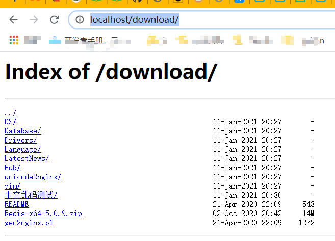

官网：http://nginx.org/en/docs/

 ## Nginx目录索引 

`ngx_http_autoindex_module`模块处理以斜杠字符('/')结尾的请求，并生成目录列表。
当n`gx_http_index_module`模块找不到索引文件时，通常会将请求传递给模块。

>   大概意思就是将静态资源文件以目录树结构进行呈现
>
>   *   浏览器能解析：点击则直接解析执行。
>   *   3浏览器不能解析：点击则直接下载


`使用步骤：`

*   修改配置文件

    ```txt
     location / {		
     	charset utf-8,gbk;#可以将此设置放置全局即server层面
         root html/ngx_http_autoindex_module;
         autoindex on;
         #index  index.html index.htm;	#注释掉，防止访问项目去到index首页。
    }
    ```

*   效果

    

*   显示文件确切大小

    ```javascript
    语法:	autoindex_exact_size on | off;
    默认值:	
    autoindex_exact_size on;
    上下文:	http, server, location
    ```

    ```bash
    location / {		
        root html/ngx_http_autoindex_module;
        autoindex on;
        autoindex_exact_size off; #显示文件确切大小
        #index  index.html index.htm;	#注释掉，防止访问项目去到index首页。
    
    }
    ```

*   列出文件具体时间

    ```javascript
    语法:	autoindex_localtime on | off;  //on表示当地时区 off为默认 为国际时区
    默认值:	
    autoindex_localtime off;
    上下文:	http, server, location
    ```

    ```bash
    location / {		
        root html/ngx_http_autoindex_module;
        autoindex on;
        autoindex_localtime on;
        autoindex_exact_size off; #显示文件确切大小
        #index  index.html index.htm;	#注释掉，防止访问项目去到index首页。
    
    }
    ```

    

*   实现项目访问同时又实现目录索引

    修改配置文件添加多个location

    ```bash
    location / {		
        root html/dist;
        index  index.html index.htm;
    }
    location /download { #如果使用root则访问的是：html/ngx_http_autoindex_module/download。如果使用的是alias则访问的跟目录即：html/ngx_http_autoindex_module	
        alias html/ngx_http_autoindex_module;
        autoindex on;
        autoindex_localtime on;
        autoindex_exact_size off; #显示文件确切大小
        #index  index.html index.htm;	#注释掉，防止访问项目去到index首页。
    }			
    ```


`用途：`

*   资源下载
*   本地仓库

## Nginx状态监控

`ngx_http_stub_status_module`模块提供对基本状态信息的访问。
默认情况下不构建此模块，应使用--with-http_stub_status_module 配置参数启用它 。


`使用步骤：`

*   配置文件中新增location

    ```bash
    location /nginx_status {
        stub_status;
    }
    ```

*   结果

    

*   结果解析

    ```bash
    ### 上图中3 3 5对应上一行的accepts handled requests
    Active connections  # 当前活动客户端连接数，包括Waiting等待连接数。
    accepts             # 已接受总的TCP连接数。
    handled             # 已处理总的TCP连接数。
    requests            # 客户端总的http请求数。
    
    Reading             # 当前nginx读取请求头的连接数。
    Writing             # 当前nginx将响应写回客户端的连接数。
    Waiting             # 当前等待请求的空闲客户端连接数。
    
    # 注意, 一次TCP的连接，可以发起多次http的请求, 如下参数可配置进行验证
    keepalive_timeout  0;   # 类似于关闭长连接
    keepalive_timeout  65;  # 65s没有活动则断开连接
    ```

    


## Nginx访问控制 

 `ngx_http_access_module`模块允许限制对某些客户端地址的访问。

`语法：`

````bash
#允许配置语法
Syntax: allow address | CIDR | unix: | all;
Default:    —
Context:    http, server, location, limit_except

#拒绝配置语法
Syntax: deny address | CIDR | unix: | all;
Default:    —
Context:    http, server, location, limit_except
````

`eg:`

```bash
location /nginx_status { # # 除了网段192.168.1.0中的192.168.1.1和10.1.1.0/16以及2001:0bs8::/32的ip可以进行访问，其余的都不行。匹配规则：过来一个IP(10.1.1.0)先匹配第一个第二个第三个等等，直到匹配上。因此最后添加deny all;很有必要
    stub_status;
    deny 192.168.1.1;
    allow 192.168.1.0/24;
    allow 10.1.1.0/16;
    deny all;
}
```

`实际中配置：`

```bash
location /nginx_status { # 除了本机其余的都不行
    stub_status;
    deny 127.0.0.1;
    deny all;
}
```


## Nginx资源限制

 `ngx_http_auth_basic_module`模块允许使用HTTP基本身份验证，验证用户名和密码来限制对资源的访问。*

>   即：访问需要用户名和密码

`语法：`

````bash
#使用HTTP基本身份验证协议启用用户名和密码验证。
Syntax: auth_basic string| off;
Default: auth_basic off;
Context: http, server, location, limit_except

#指定保存用户名和密码的文件
Syntax: auth_basic_user_file file;
Default: -
Context: http, server, location, limit_except
````

`eg:`

*   指定保存用户名和密码的文件，格式如下：

    1.  用户信息文件生成

        *   linux
    
            ```bash
            #可以使用htpasswd程序或"openssl passwd"命令生成对应的密码;
            name1:passwd1
            name2:passwd2
            
            #例如使用htpaaswd创建新的密码文件, -c创建新文件 -b允许命令行输入密码
            [root@xuliangwei ~]# yum install httpd-tools
        [root@xuliangwei ~]# htpasswd -b -c /etc/nginx/auth_conf xul
            ```
    
        *   win
    
            ```bash
            #win下可以自己新建一个文件然后使用在线htpasswd网站生成密码，将用户名密码写入到文件中
            1. 在D:\nginx-1.18.0下新建auth_conf.txt。
            2. 在线htpasswd网站将密码加密。我这里使用的是win:123.com(加密)。用户名为win密码为:后面的内容
            文件内容如下：
            win:$apr1$kxPTrLP8$r7C9ZC9DMj9GdYRJsaXHO1
            ```
    
            
    
    2.  修改配置文件（在location层加限制）
    
        ```bash
         location /download { #如果使用root则访问的是：html/ngx_http_autoindex_module/download。如果使用的是alias则访问的跟目录即：html/ngx_http_autoindex_module	
             alias html/ngx_http_autoindex_module;
             autoindex on;
             autoindex_localtime on;
             autoindex_exact_size off; #显示文件确切大小
             auth_basic "Please Enter Password";
             auth_basic_user_file ./auth_conf.txt;  #nginx相对路径./auth_conf.txt，先在安装路径下找。
             #index  index.html index.htm;	#注释掉，防止访问项目去到index首页。
        }
        ```
    
    3.  效果
    
        
    
        


## Nginx访问限制

经常会遇到这种情况，服务器流量异常，负载过大等等。对于大流量恶意的攻击访问，会带来带宽的浪费，服务器压力，从而影响业务，针对这种情况我们可以考虑对同一个ip的连接数，请求数、进行限制。

*   `ngx_http_limit_conn_module`模块用于`限制定义key的==连接数==`，特别是来自单个IP地址的连接数。但并非所有连接都被计算在内，仅当连接已经读取了整个请求头时才计算连接。

    >   限制定义key的连接数：同一时间允许连接的请求。
    >
    >   *   当连接数设置为1时。此时有多个公网IP（A、B、C）同时对服务器进行访问，由于网络请求在公网中耗时远远超过局域网请求。并且该模块连接计算是在读取到了请求头时计算，即当B先到达服务器并且服务器已经读取了B的请求头，此时A和C访问过来则均返回503错误，而B连接发起多次请求均正常(一个连接可以有多个请求)。
    >   *   当连接数设置为3时。公网IP（A、B、C）同时对服务器进行访问，则均返回正常。

    `语法:`

    ````bash
    Syntax:  limit_conn_zone key zone=name:size;
    Default: —
    Context: http
    
    Syntax: limit_conn zone number;
    Default: —
    Context: http, server, location
    ````

    

    `eg:`

    ````bash
    # http标签段定义连接限制
    http{
        limit_conn_zone $binary_remote_addr zone=conn_zone:10m;
    }
    server {
        # 同一时刻只允许一个客户端连接
        limit_conn conn_zone 1; 
    
        location / {
            root /code;
            index index.html;
    ````

    

*   `ngx_http_limit_req_module`模块用于`限制定义key==请求==的处理速率`，特别单一的IP地址的请求的处理速率。注意这里是`请求`

    `语法：`

    ````bash
    #模块名ngx_http_limit_req_module
    Syntax:  limit_req_zone key zone=name:size rate=rate;
    Default: —
    Context: http
    
    Syntax: limit_req zone number [burst=number] [nodelay];
    Default: —
    Context: http, server, location
    ````

    `eg:`

    ````bash
    # http标签段定义请求限制, rate限制速率，限制一秒钟最多一个IP请求
    http {
        limit_req_zone $binary_remote_addr zone=req_zone:10m rate=1r/s;# key为IP，针对IP进行限制。名称为conn_zone
    }
    server {
        listen 80;
        server_name module.bgx.com;
        # 1r/s只接收一个请求,其余请求拒绝处理并返回错误码给客户端
        #limit_req zone=req_zone;
        
        # 请求超过1r/s,剩下的将被延迟处理,请求数超过burst定义的数量, 多余的请求直接返回503。比如说有50个请求同时并发，则只能处理1+3个请求，其余直接拒绝，如果不加参数burst=3则只有一个请求成功，其余均失败。
        limit_req zone=req_zone burst=3 nodelay;
        location / {
            root /code;
            index index.html;
            limit_req_status 412;#默认请求错误512修改为412
        	error_page 412 /m/newErrorCode.json;#412错误码跳转到此json文件(也可以是其他静态页面)。这里的json文件会重定向到 服务器地址/code/m/newErrorCode.json。
        }
    }    
    ````

    >   error_page说明：
    >
    >   *   如果定义在server层
    >       *   路径为`error_page 412 m/newErrorCode.json`则会重定向到  服务器地址/m/newErrorCode.json
    >       *   路径为`error_page 412 /m/newErrorCode.json`则会重定向到   服务器地址/code/m/newErrorCode.json
    >   *   如果定义到location则会针对当前请求陆金进行限制，如上面所示。

>   首先HTTP是建立在TCP基础之上, 在完成HTTP请求需要先建立TCP三次握手（称为TCP连接）,在连接的基础上在完成HTTP的请求。
>
>   *所以多个HTTP请求可以建立在一次TCP连接之上, 那么我们对请求的精度限制，当然比对一个连接的限制会更加的有效，因为同一时刻只允许一个TCP连接进入, 但是同一时刻多个HTTP请求可以通过一个TCP连接进入。所以针对HTTP的请求限制才是比较优的解决方案。*

## Nginx Location

 使用Nginx Location可以控制访问网站的路径, 但一个server允许出现多个location配置, 那多个location出现冲突谁的优先级会更高呢

`语法:`

````bash
location [=|^~|~|~*|!~|!~*|/] /uri/ { ...
}
````

`Location语法优先级排列`

| 匹配符 | 匹配规则                     | 优先级 |
| ------ | ---------------------------- | ------ |
| =      | 精确匹配                     | 1      |
| ^~     | 以某个字符串开头             | 2      |
| ~      | 区分大小写的正则匹配         | 3      |
| ~*     | 不区分大小写的正则匹配       | 4      |
| !~     | 区分大小写不匹配的正则       | 5      |
| !~*    | 不区分大小写不匹配的正则     | 6      |
| /      | 通用匹配，任何请求都会匹配到 | 7      |


`eg:`

````bash
# 通用匹配，任何请求都会匹配到
location / {
    ...
}
# \ 都为转义字符
# 严格区分大小写，匹配以.php结尾的都走这个location    
location ~ \.php$ {
    ...
}

# 严格区分大小写，匹配以.jsp结尾的都走这个location 
location ~ \.jsp$ {
    ...
}

# 不区分大小写匹配，只要用户访问.jpg,gif,png,js,css 都走这条location
location ~* .*\.(jpg|gif|png|js|css)$ {
    ...
}

# 不区分大小写匹配
location ~* "\.(sql|bak|tgz|tar.gz|.git)$" {
    ...
}
````

