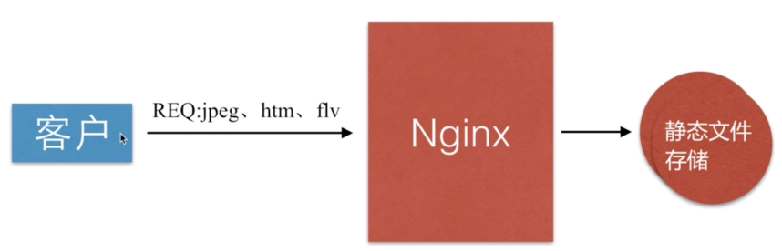
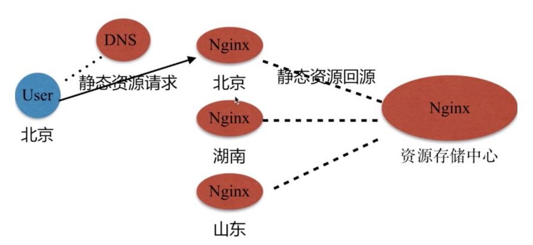
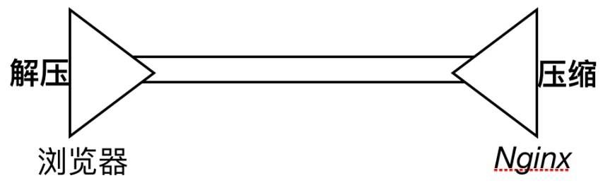
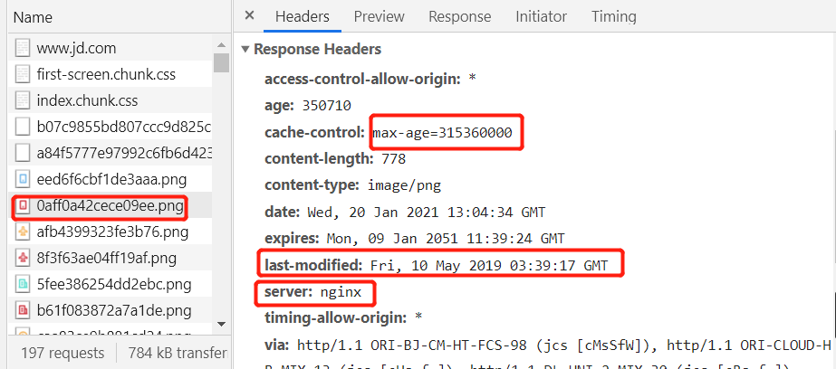
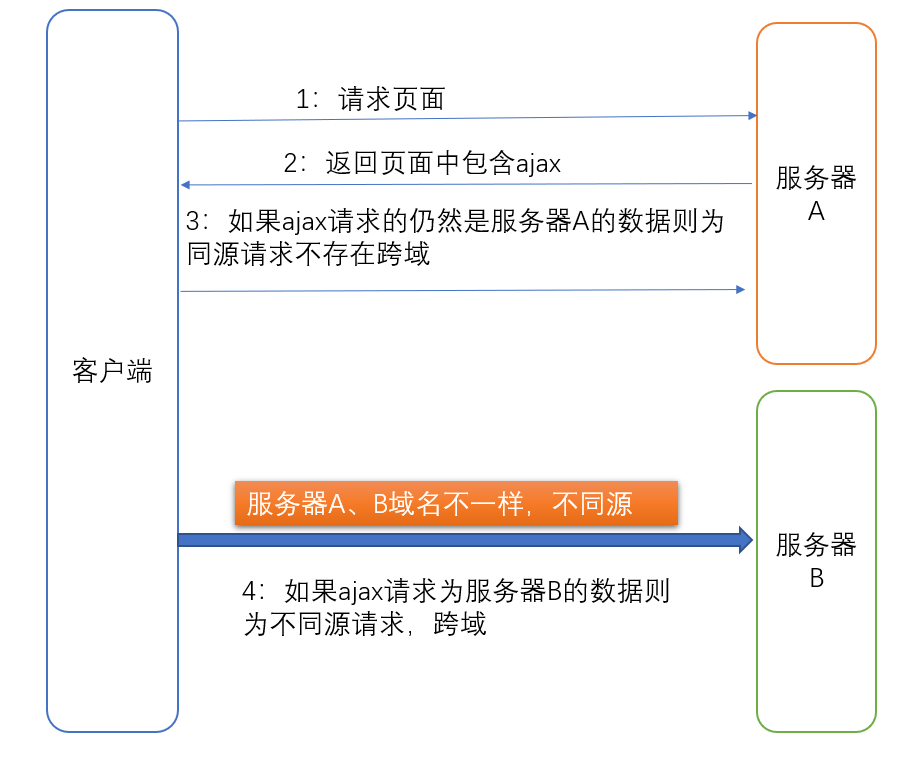
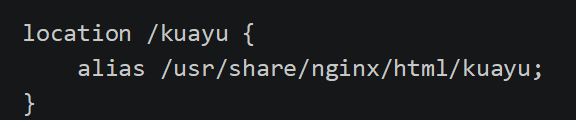
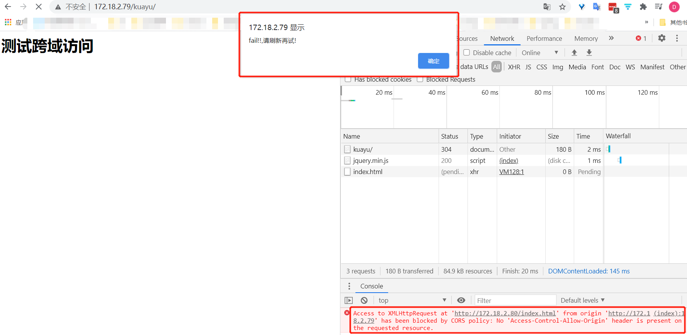
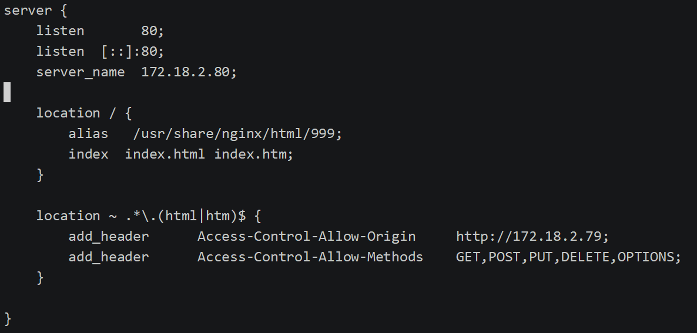

## 静态资源配置

* 静态资源类型

	Nginx作为静态资源 Web 服务器器部署配置, 传输⾮非常的⾼高效, 常常⽤用于静态资源处理理, 请求, 动静
	分离

	

	> 非服务器器动态运⾏行行⽣生成的⽂文件属于静态资源

	| 类型           | 种类                |
	| -------------- | ------------------- |
	| 浏览器器端渲染 | HTML、 CSS、 JS     |
	| 图⽚           | JPEG、 GIF、 PNG    |
	| 视频           | FLV、 Mp4           |
	| ⽂件           | TXT、任意下载⽂文件 |

* 静态资源场景

	> 资源中心使用Nginx部署多地服务器。用户使用DNS就近访问附近的服务器




## 静态资源配置

* 文件读取⾼效 `sendfile`

	````bash
	Syntax:	sendfile	on	|	off;
	Default:	sendfile	off;
	Context:	http,	server,	location,	if in	location
	````

* 提高⽹网络传输效率 `nopush`

	````bash
	Syntax:	tcp_nopush	on	|	off;
	Default:	tcp_nopush	off;
	Context:	http,	server,	location
	作⽤用:	sendfile开启情况下,	提高网络包的'传输效率' 
	````

* 与` tcp_nopush` 之对应的配置 `tcp_nodelay`

	````bash
	Syntax:	tcp_nodelay	on	|	off;
	Default:	tcp_nodelay	on;
	Context:	http,	server,	location
	作⽤用:	在keepalive连接下,提⾼网络的传输'实时性'
	````

	

## 静态资源文件压缩

正常情况下，请求静态文件返回静态文件，如果静态文件过打则会出现浏览器卡死。Nginx压缩是Nginx 将响应报⽂资源发送至客户端之前可以启⽤压缩功能，这能够有效地节约带宽，并提⾼响应⾄客户端的速度。

简单来说，就是响应报文在服务器先压缩(CPU消耗)后发送至客户端，然后客户端解压缩(浏览器是支持解压缩)




* `gzip` 压缩配置语法

	````bash
	Syntax:	gzip	on	|	off;
	Default:	gzip	off;
	Context:	http,	server,	location,	if	in	location
	作用:	传输压缩
	````

* `gzip`压缩比率配置语法

	````bash
	Syntax:	gzip_comp_level	level;
	Default:	gzip_comp_level	1;
	Context:	http,	server,	location
	作⽤用:	压缩本身⽐比较耗费服务端性能
	````

* `gzip `压缩协议版本

	````bash
	Syntax:	gzip_http_version	1.0	|	1.1;
	Default:	gzip_http_version	1.1;
	4.静态资源⽂文件压缩Context:	http,	server,	location
	作⽤用:	压缩使⽤用在http哪个协议,	主流版本1.1
	````

* 扩展压缩模块

	````bash
	Syntax:	gzip_static	on	|	off	|	always;
	Default:	gzip_static	off;
	Context:	http,	server,	location
	作⽤用:	预读gzip功能
	````

* Eg:图片压缩

	````bash
	server	{
	  listen	80;
	  server_name	192.168.56.11;
	  sendfile on;
	  access_log /var/log/nginx/static_access.log main;
	  location	~	.*\.(jpg|gif|png)$	{
	    gzip on;
	    gzip_http_version	1.1;
	    gzip_comp_level	2;
	    gzip_types text/plain	application/json	application/x-javascript	app
	    lication/css	application/xml	application/xml+rss text/javascript	application/x-http
	    d-php	image/jpeg	image/gif	image/png;
	    root /soft/code/images;
		}
	}
	````
	
* Eg:文件压缩

    ```bash
    server	{
        listen	80;
        server_name	192.168.56.11;
        sendfile on;
        access_log /var/log/nginx/static_access.log main;
        location	~	.*\.(txt|xml)$	{
            gzip on;
            gzip_http_version	1.1;
            gzip_comp_level	1;
            gzip_types text/plain	application/json	application/x-javascript	application
            /css	application/xml	application/xml+rss text/javascript	application/x-httpd-php	im
            age/jpeg	image/gif	image/png;
            root /soft/code/doc;
        }   
    }
    ```

    

## 静态资源浏览器缓存

`HTTP协议定义的缓存机制`  如   Expires; Cache-control 等



1.  浏览器无缓存

    >   浏览器器请求->⽆无缓存->请求WEB服务器器->请求响应->呈现

2.  浏览器器有缓存

    >   浏览器器请求->有缓存->校验过期->是否有更更新->呈现
    >
    >   校验是否过期 Expires HTTP1.0, Cache-Control(max-age) HTTP1.1
    >
    >   协议中Etag头信息校验 Etag ()
    >   Last-Modified头信息校验 Last-Modified (具体时间)  

3.  缓存配置语法 expires

    ```bash
    Syntax:	expires	[modified]	time;
    expires	epoch	|	max	|	off;
    Default:	expires	off;
    Context:	http,	server,	location,	if in location
    作⽤用:	添加Cache-Control	Expires头  
    ```

4.  配置静态资源缓存

    ```bash
    location ~	.*\.(js|css|html)$	{
    	root	/soft/code/js;
    	expires 1h;
    }
    location ~	.*\.(jpg|gif|png)$	{
    	root	/soft/code/images;
    	expires 7d;
    }
    ```

5.  开发代码没有正式上线时, 希望静态⽂文件不不被缓存

    ```bash
    //取消js	css	html等静态⽂文件缓存
    location	~	.*\.(css|js|swf|json|mp4|htm|html)$	{
    add_header	Cache-Control	no-store;
    add_header	Pragma	no-cache;
    }  
    ```

>   阿里缓存策略：https://help.aliyun.com/knowledge_detail/40077.html

## 静态资源跨域访问

`同源策略`

浏览器自带的一种安全策略，他是指`协议`、`域名`、 `端口` 三个都相同的才能互相访问，即若协议、域名、端口有一个不相同时，浏览器禁止页面加载或执行与自身不同域的脚本。



* 客户的浏览器和网站(服务器)之间的关系时一对多的。
* 客户的浏览器中保存了多个网站的cookie，每个cookie是用户身份的表示以及登录状态的表示，用以在同一个网站不同页面之间共享。
* 客户的浏览器中页面以及数据都是网站提供的，网站可以通过js来操作 **浏览器** 以及  **资源**
* 同源策略就是 协议、域名、端口号 一致的情况下为   同一个源(网站)   。同一个源(网站)只能访问自己相关以及可操作的资源。即一个网站只能访问自己的资源(cookie序列化后的文件、页面、数据、dom、本地资源)。而不能访问其他网站保存在用户浏览器中的所有资源。
* 简单来讲就是  网站中显示在浏览器中的所有内容(js、html、css等等)只能包含自己网站中的内容。不能有其他网站的内容，当然也不能通过ajax来请求其他网站的资源。

>   讲到底，就一句话，同源策略就是保护三好网站不被非法网站通过用户浏览器来获取其cookie。当然这一切得用户访问非法网站后才能成立。


`为什么 html  可以通过cdn  嵌套 其它网站的js  、 css  以及图片等资源。`

 浏览器只允许显示图片 js 、css等等，而不允许你去获取其他网站内容的数据。例如一个网站中能显示其它网站的静态数据或者请求，但是这个网站你拿不到图片的二进制、js响应的相应数据(只有响应头)


### 跨域资源访问配置

`语法:`

```bash
Syntax:	add_header	name	value	[always];
Default:	—
Context:	http,	server,	location,	if	in	location
Access-Control-Allow-Origin
```

`效果:`

*   访问 172.18.2.79 中index.html (其中包含了172.18.2.80 的 ajax)：服务器IP不同，不同源


`实现步骤:`

0.  环境准备

     *   两台服务器(172.18.2.79  和  172.18.2.80)

     *   服务器互通且配置好docker-nginx环境

     *   Docker-Nginx 和宿主机数据挂载对应如下

         ```bash
         docker run  --name nginx -d -p 80:80 --privileged=true  -v /root/nginx/html:/usr/share/nginx/html -v /root/nginx/config/nginx.conf:/etc/nginx/nginx.conf nginx
         ```

     
>   docker相关内容可参考：MD-Book\Docker\第九章-Docker安装Nginx.md
     
1.  172.18.2.79 docker-nginx新增配置

    

2.  172.18.2.79 宿主机新增 kuayu目录以及index.html

    ```html
    <html lang="en">
    <head>
    <meta charset="UTF-8"   /><title>测试ajax和跨域访问</title>
    <script src="http://libs.baidu.com/jquery/2.1.4/jquery.min.js"></script>
    </head>
    <script type="text/javascript">
    $(document).ready(function(){
            $.ajax({
                    type:   "GET",
                    url:    "http://172.18.2.80/index.html",
                    success:        function(data)  {
                            alert("sucess!!!");
                    },
                    error:  function()      {
                            alert("fail!!,请刷新再试!");
                    }
                    });
            });
    </script>
    <body>
    <h1>测试跨域访问</h1>
    </body>
    </html>
    ```

    

3.  测试

    

4.  172.18.2.80 添加允许 172.18.2.79 服务器跨域访问 设置

    

5.  不太行，改天用公网域名试一下


## 静态资源防盗链

盗链是指在自己的页面上展示不属于自己页面的内容，比如一些盗图网站显示的图片来自百度图库以及其他图片网站。而且我们每次访问盗图网站，其中访问图片的流量消耗来自百度图库以及它盗取的图库网站。


`语法:`

```bash
Syntax:	valid_referers	none	|	blocked	|	server_names	|	string	...;
Default:	—
Context:	server,	location
```

`配置示例:`

```conf
location	~	.*\.(jpg|gif|png)$	{
    valid_referers	none	blocked	www.xuliangwei.com;
    if	($invalid_referer)	{
    	return	403;
    }
    root	/soft/code/images;
}
```

