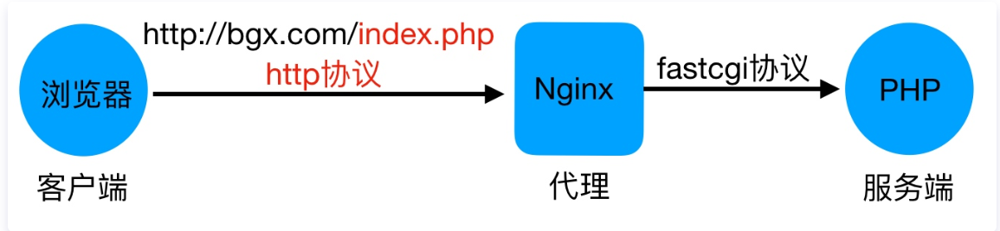
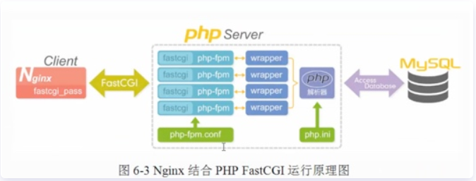

## LNMP架构

### 1、什么是LNMP

LNMP是一套技术的组合，L=Linux、N=Nginx、M~=MySQL、P~=PHP

### 2、LNMP架构是如何工作的

首先Nginx服务是不能处理动态请求，那么当用户发起动态请求时, Nginx又是如何进行处理的。
当用户发起http请求，请求会被Nginx处理，如果是静态资源请求Nginx则直接返回，如果是动态请求Nginx则通过fastcgi协议转交给后端的PHP程序处理，具体如下图所示

### 3、Nginx与Fast-CGI详细工作流程如下图所示

1.  用户通过http协议发起请求，请求会先抵达LNMP架构中的Nginx
2.  Nginx会根据用户的请求进行Location规则匹配
3.  Location如果匹配到请求是静态，则由Nginx读取本地直接返回
4.  Location如果匹配到请求是动态，则由Nginx将请求转发给fastcgi协议
5.  fastgi收到后会将请求交给php-fpm管理进程，php-fpm管理进程接收到后会调用具体的工作进程warrap
6.  warrap进程会调用php程序进行解析，如果只是解析代码，php直接返回
7.  如果有查询数据库操作，则由php连接数据库(用户 密码 IP)发起查询的操作
8.  最终数据由mysql->php->php-fpm->fastcgi->nginx->http->user