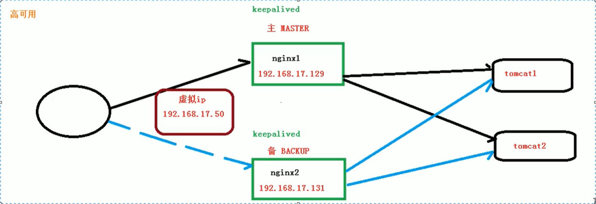

## Nginx高可用

Nginx下挂多个Tomcat服务器实现Tomcat高可用，但是Nginx宕机呢？因此需要实现Nginx高可用：配置多个Nginx。

*   主从模式

    

    keepalived：监测存活nginx，如果宕机则进行切换

    虚拟IP：对外进行暴露的IP，通过虚拟iP分发到主从nginx上。

`准备:`

*   两台nginx服务器
*   keepalived工具
*   虚拟IP

