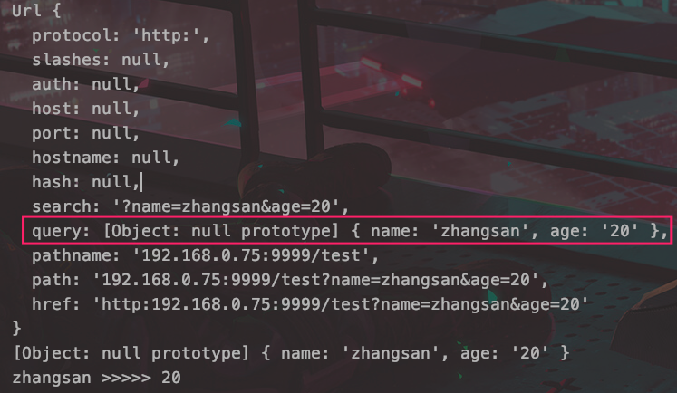
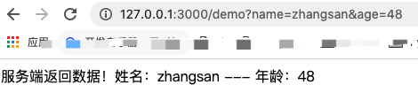

## fs模块

### 1、基本使用

> 常用方法
>
> fs.stat  检测是文件还是目录是否存在
>
> fs.mkdir 创建目录
>
> fs.writeFile  创建写入文件
>
> fs.appendFile  追加文件
>
> fs.readFile  读取文件
>
> fs.readdir  读取目录
>
> fs.rmdir 删除目录
>
> fs.rename  重命名
>
> Fs.unlink  删除文件

```javascript
const fs = require('fs')

fs.mkdir('./file', { recursive: true }, err => {
    if (err) throw err;
    console.log("创建目录成功！");
    fs.writeFile('./file/data.txt', '大家好，我是渣渣辉！！', { 'flag': 'a' }, (err) => {
        if (err) throw err;
        console.log("创建写入文件成功 ！");
        fs.appendFile('./file/data.txt', '追加的数据', (err) => {
            if (err) throw err;
            console.log('数据已被追加到文件');
        });
      //成功
      //    data:文件写入成功
      //    err :null
      //失败
      //    data:文件写入失败
      //    err :错误对象
        fs.readFile('./file/data.txt', { encoding: 'utf-8' }, (err, data) => {
            if (err) throw err;
            console.log(`读取到数据 --- ${data}`);
        });
        fs.rename('./file/data.txt', '新文件.txt', (err) => {
            if (err) throw err;
            console.log('重命名完成');
        });
    })
})
```


> 异步会导致不定的错误，因此如有必要还是使用同步方法吧。原有方法后加`Sync`即可


### 2、以流的形式读写文件

```javascript
//文件很大时建议以流的方式读取
var readStream = fs.createReadStream('./file/data.txt');

var count = 0;
var str = '';

readStream.on('data', (data) => {
    str += data;
    count++;
})
readStream.on('end', () => {
    console.log(`读取完成 count -- ${count}   data  --  ${str}`);
})
readStream.on('error', (err) => {
    console.log(err);
})
//文件很大时建议以流的方式写入
var data = '';
for (var i = 0; i < 100; i++) {
    data += "大家好，我是渣渣辉！！追加的数据";
}

var writeStream = fs.createWriteStream('./file/data.txt');

writeStream.write(data);

//标记写入完成
writeStream.end();

writeStream.on('finish', () => {
    console.log('写入完成！！');
})
```

### 3、管道流

```javascript

// 管道流：通过读取一个文件内容并将内容写入到另一个文件中。适用于大文件拷贝

var readerStream = fs.createReadStream("./file/data.txt");
var writeStream = fs.createWriteStream("./data.txt");

readerStream.pipe(writeStream);
console.log("程序执行完成！！");
```


## http模块

### 1、基本使用

```javascript
//todo web服务器
//1. 导入模块
let http = require('http')

const hostname='127.0.0.1'
const port=3000

//2.创建服务器
let server = http.createServer()

//3.绑定请求事件
server.on('request',function (req,res) {
    console.log("接收到客户端发送过来的请求！请求路径是：",req.url)
    res.writeHead(200,{"Content-type":"text/html;charset='utf-8"})
    //返回的就是一个极简html，因此需要手动设置编码否则中文乱码
    res.write("<head><meta charset=\"UTF-8\"></head>")
    res.write("服务端返回数据！")
    //返回数据
    res.end();
})

//4.绑定端口号、启动服务器
server.listen(port,hostname,()=>{
    console.log(`服务器运行在 http://${hostname}:${port}/`)
})
```

### 2、解析请求参数

```javascript
const url=require('url')

let api='http:192.168.0.75:9999/test?name=zhangsan&age=20'
// 将url中的参数解析为query对象
console.log(url.parse(api,true))
// 获取query对象
console.dir(url.parse(api,true).query)

// 获取query对象属性
console.log(url.parse(api,true).query.name,'>>>>>',url.parse(api,true).query.age)
```




### 3、使用客户端来模拟

```javascript
// todo 和浏览器交互获取URL参数
const http=require('http')

const hostname='127.0.0.1'
const port=3000

const server=http.createServer()
server.on('request',(req,res)=>{
    res.writeHead(200,{"Content-type":"text/html;charset='utf-8"})
    res.write("<head><meta charset=\"UTF-8\"></head>")
    res.write("服务端返回数据！")
    // todo 解析URL参数
    let query=url.parse(req.url,true).query
    if(Object.getOwnPropertyNames(query).length>0) {
        res.write(`姓名：${query.name} --- 年龄：${query.age}`)
    }
    res.end();
}).listen(port,hostname,()=>{
    console.log(`服务器运行在 http://${hostname}:${port}/`)
})
```




