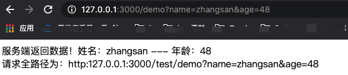
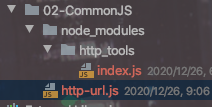
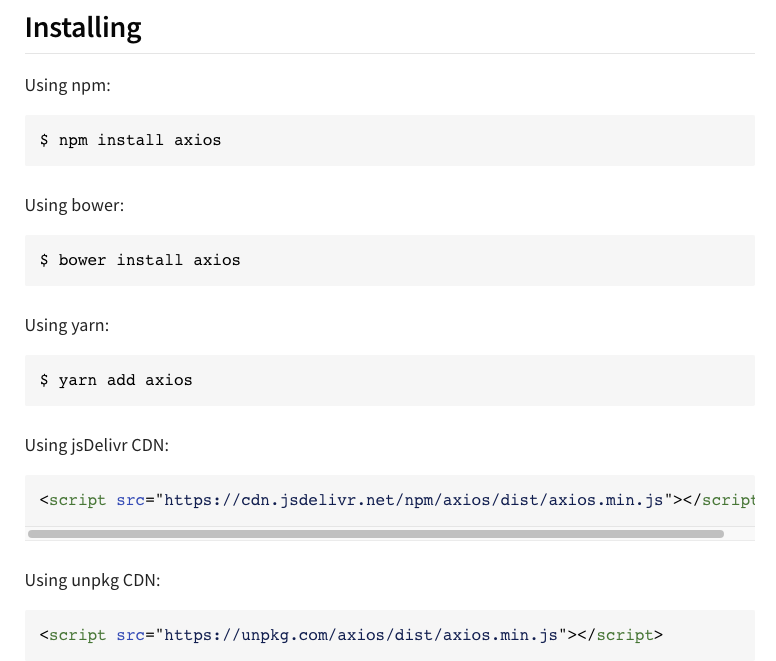
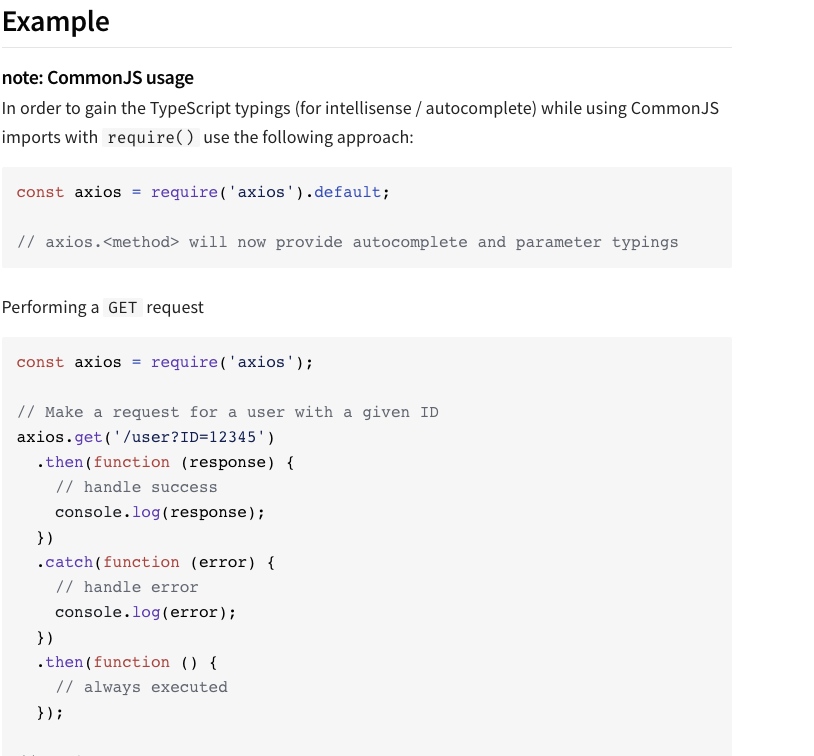

## CommonJS模块化

* httpTools.js

	```javascript
	module.exports = {
	    msg:'Http请求头工具类',
	    formatApi:function (api) {
	        return "http:127.0.0.1:3000/test"+api;
	    }
	}
	```

* Http-url.js

	```javascript
	// todo 和浏览器交互获取URL参数
	const http=require('http')
	const url=require('url')
	// todo 导入tools模块
	const tools=require("./httpTools")
	
	const hostname='127.0.0.1'
	const port=3000
	
	const server=http.createServer()
	server.on('request',(req,res)=>{
	    res.writeHead(200,{"Content-type":"text/html;charset='utf-8"})
	    res.write("<head><meta charset=\"UTF-8\"></head>")
	    res.write("服务端返回数据！")
	    // todo 解析URL参数
	    let query=url.parse(req.url,true).query
	    if(Object.getOwnPropertyNames(query).length>0) {
	        res.write(`姓名：${query.name} --- 年龄：${query.age}`)
	        res.write(`</br> 请求全路径为：${tools.formatApi(req.url)}`)
	    }
	    res.end();
	}).listen(port,hostname,()=>{
	    console.log(`服务器运行在 http://${hostname}:${port}/`)
	})
	```

	


> 如果自定义模块放在node_modules文件夹内，则引入依赖时可以直接写自定义模块上级目录。并且如果模块命名为index.js则可以直接写自定义模块上级文件名来导入。

1. 新建node_modules文件夹

2. 将httpTools.js文件修改index.js并放入到node_modules下

3. 修改导入方式

	```javascript
	// const tools=require("http_tools/httpTools")
	const tools = require('http_tools')//如果包下面是index.js，则直接导入文件名即可
	```

	


### 第三方模块使用

>  官网 ：https://www.npmjs.com/support   例如安装axios

1. 搜索axios

2. 安装

	


3. 使用

	


> 直接在npm官网上搜索需要的包，里面有教程。


### npm命令

1. 安装

	> npm install xxx      #--save   #-g
	>
	> npm install xxx@2.1.0  #安装指定版本包

2. 卸载

	> npm uninstall xxx

3. 查看所有包

	> npm list

4. 查看具体包信息

	> npm info xxx


### package.json介绍

```json
{
  "name": "01-helloworld",
  "version": "1.0.0",
  "description": "",
  "main": "01-HelloWorld.js",
  "dependencies": {
    "_supervisor@0.12.0@supervisor": "^0.12.0",
    "supervisor": "^0.12.0"
  },
  "devDependencies": {},
  "scripts": {
    "test": "echo \"Error: no test specified\" && exit 1"
  },
  "author": "",
  "license": "ISC"
}
```

**name字段**： name就是项目名称

**version字段**：version就是版本，版本命名遵守“大版本.次要版本.小版本”的格式。

**description字段**：description就是项目描述 

**main字段:** 指定项目的入口文件

**scripts字段：**scripts字段指定了要运行环境的脚本

* npm run local:  将运行本地环境，会执行对应的  node  server_local 命令，运行server_local文件；
* npm run dev:   将运行开发环境，指定打包的配置文件来运行，--watch监测，webpack自动打包
* npm run  build:  -p 压缩打包代码

**devDependencies字段 与Dependencies字段：**devDependencies指定了开发环境所依赖的模块，Dependencies指定了生产环境所依赖的模块

* --save-dev 安装的插件被写到了devDependencies对象里
* --save安装的插件被写到了Dependencies对象里