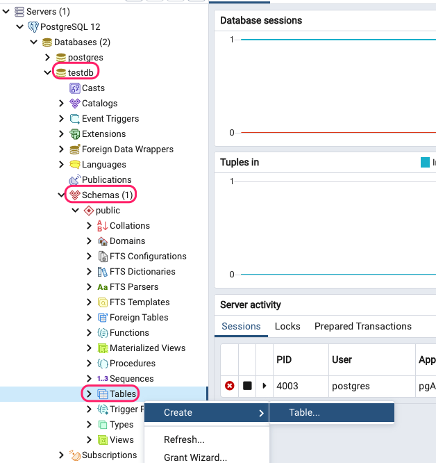
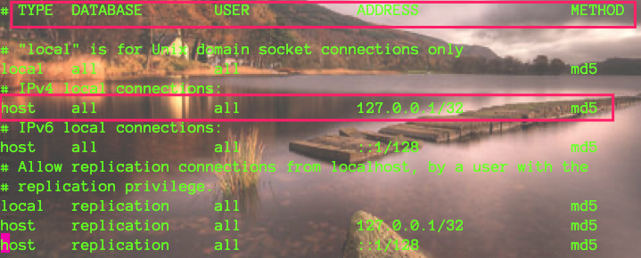
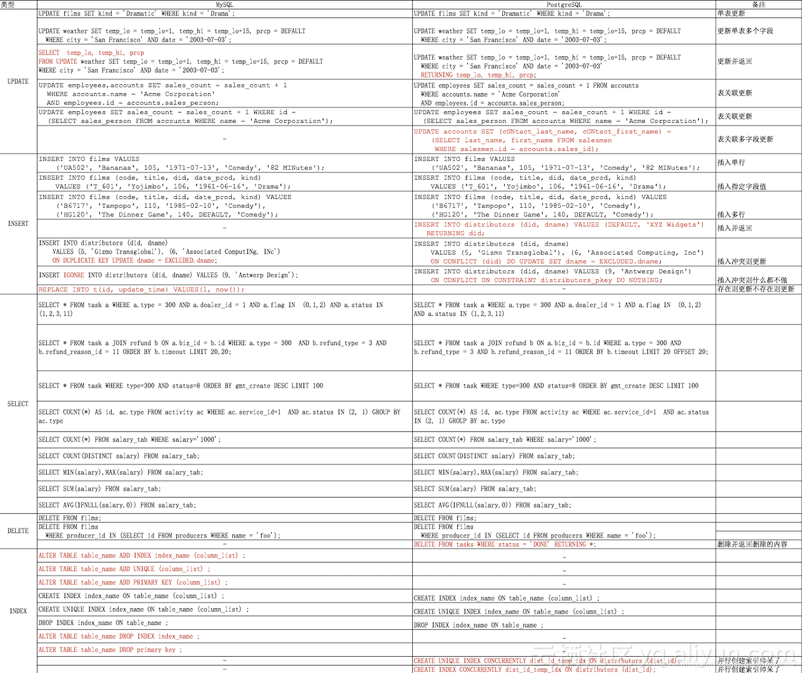

## 是什么

是一款关系型数据库，类比MySQL，当然主流的关系型数据库还有Oracle、DB2、SQL Server等。


## 特点

* 适用于所有的主流操作系统
* 免费速度快丰富的接口
* 支持数据类型很多包括图像、音频、枚举、json、xml等
* 面向对象（继承）
* 安全（数据传输加密）


## 数据类型

### 1、数值数据类型

| 名称             | 描述                                   | 存储大小 | **范围**                                                     |
| ---------------- | -------------------------------------- | -------- | ------------------------------------------------------------ |
| **smallint**     | 存储整数，小范围                       | 2字节    | -32768 至 +32767                                             |
| **integer**      | 存储整数。使用这个类型可存储典型的整数 | 4字节    | -2147483648 至 +2147483647                                   |
| bigint           | 存储整数，大范围。                     | 8字节    | -9223372036854775808 至 9223372036854775807                  |
| decimal          | 用户指定的精度，精确                   | 变量     | 小数点前最多为131072个数字; 小数点后最多为16383个数字。      |
| **numeric**(n,n) | 用户指定的精度，精确                   | 变量     | 小数点前最多为131072个数字; 小数点后最多为16383个数字。使用时要合理定义精度，精度丢失 |
| **real**         | 可变精度，不精确                       | 4字节    | 6位数字精度                                                  |
| **double**       | 可变精度，不精确                       | 8字节    | 15位数字精度                                                 |
| serial           | 自动递增整数                           | 4字节    | 1 至 2147483647                                              |
| bigserial        | 大的自动递增整数                       | 8字节    | 1 至 9223372036854775807                                     |

> :lips:注意：
>
> 1. real 浮点数指的是小数点后精确6位，即156.12345678录入后只能保存为156.123456
> 2. numeric(5,2) 意思是**总长度(不包含小数点)不能超过5**，并且小数点后最多两位，即15.123456==》15.12**（之所以能保存成功因为小数点截取了只剩两位了）如果为1234.123456则不行因为小数点截取后剩余两位加上整数四位大于5保存时报错。**

### 2、字符串数据类型

| 数据类型                                     | 描述                                                         |
| -------------------------------------------- | ------------------------------------------------------------ |
| **char(size) \| character(size)**            | 这里`size`是要存储的字符数。**固定长度字符串**，右边的空格填充到相等大小的字符。 |
| **varchar(size) \| character varying(size)** | 这里`size`是要存储的字符数。 **可变长度字符串**。            |
| **text**                                     | **可变长度字符串，无长度限制**                               |

### 3、日期/时间数据类型

| 名称                              | 描述                   | 存储大小 | 最小值        | 最大值        | 解析度       |
| --------------------------------- | ---------------------- | -------- | ------------- | ------------- | ------------ |
| **timestamp [ (p) ] [不带时区 ]** | 日期和时间(无时区)     | 8字节    | 4713 bc       | 294276 ad     | 1微秒/14位数 |
| timestamp [ (p) ]带时区           | 包括日期和时间，带时区 | 8字节    | 4713 bc       | 294276 ad     |              |
| **date**                          | 日期(没有时间)         | 4字节    | 4713 bc       | 5874897 ad    | 1微秒/14位数 |
| **time [ (p) ] [ 不带时区 ]**     | 时间(无日期)           | 8字节    | 00:00:00      | 24:00:00      | 1微秒/14位数 |
| time [ (p) ] 带时区               | 仅限时间，带时区       | 12字节   | 00:00:00+1459 | 24:00:00-1459 | 1微秒/14位数 |
| interval [ fields ] [ (p) ]       | 时间间隔               | 12字节   | -178000000年  | 178000000年   | 1微秒/14位数 |

### 4、其他数据类型

#### 数组类型

> PostgreSQL 允许将字段定义成变长的多维数组。数组类型可以是任何基本类型或用户定义类型，枚举类型或复合类型。

1. 数组字段类型声明

	```mysql
	CREATE TABLE 表名 (
	    字段        text,
	    字段  			integer[],
	  	字段 				integer ARRAY[4],
	    字段        text[][]
	);
	或者
	alter table 表名 add column 字段 字段类型[数组长度]
	
	#创建financial_report字段用以表名   十二季度财报
	#eg：alter table test add column financial_report smallint[12]
	```

2. 使用 【下标从1开始】

	* 数组插入

		```mysql
		#插入值使用{}并且使用,隔开
		
		#eg：INSERT INTO test(financial_report) VALUES ('{12,45,478,13,465,132,12,45,478,13,465,132}');
		```

	* 数组访问

		```mysql
		# 使用字段和下标方式访问具体元素 : 查询第二季度的财报
		1. 如果使用字段直接访问，返回结果为{12,45,478,13,465,132,12,45,478,13,465,132}
		2. 如果使用字段+下标访问，则返回具体元素 select financial_report[2] from test  ==> 45
		```

	* 数组修改

		```mysql
		update test set financial_report ='{12,12,12,12,12,12,12,45,478,13,465,132}'
		OR
		update test set financial_report[1] =888
		```

	* 数组检索

		```mysql
		SELECT * FROM test WHERE financial_report[1] = 888 OR
		                            financial_report[2] = 12 OR
		                            financial_report[3] = 12 OR
		                            financial_report[4] = 12;
		```

		

#### 布尔类型：

| 名称    | 描述                                    | 存储大小 |
| ------- | --------------------------------------- | -------- |
| boolean | 它指定`true`或`false`以及`null`的状态。 | 1字节    |


#### 货币类型：

| 名称  | 描述     | 存储大小 | 范围                                           |
| ----- | -------- | -------- | ---------------------------------------------- |
| money | 货币金额 | 8字节    | -92233720368547758.08 至 +92233720368547758.07 |


#### 几何类型：

几何数据类型表示二维空间对象。最根本的类型：**点** - 形成所有其他类型的基础。

| 名称    | 存储大小   | 表示                   | 描述                        |
| ------- | ---------- | ---------------------- | --------------------------- |
| point   | 16字节     | 在一个平面上的点       | (x,y)                       |
| line    | 32字节     | 无限线(未完全实现)     | ((x1,y1),(x2,y2))           |
| lseg    | 32字节     | 有限线段               | ((x1,y1),(x2,y2))           |
| box     | 32字节     | 矩形框                 | ((x1,y1),(x2,y2))           |
| path    | 16+16n字节 | 封闭路径(类似于多边形) | ((x1,y1),…)                 |
| polygon | 40+16n字节 | 多边形(类似于封闭路径) | ((x1,y1),…)                 |
| circle  | 24字节     | 圆                     | `<(x，y)，r>`(中心点和半径) |


#### 枚举类型：

1. 创建枚举类型

	```mysql
	create type 枚举名 AS ENUM ('Mon', 'Tue', 'Wed', 'Thu', 'Fri', 'Sat', 'Sun');
	```

2. 在表中使用枚举类型

	```mysql
	alter table 表名 add column 字段 枚举名;
	```

3. 使用

	```mysql
	INSERT INTO 表名 VALUES ('Moe', 'happy');
	```

eg：

```mysql
create type week AS ENUM ('Mon', 'Tue', 'Wed', 'Thu', 'Fri', 'Sat', 'Sun');
alter table test add column weekcol week;
INSERT INTO test(weekcol) VALUES ('Mon');
```

> 注意枚举值区分大小写，如果不在指定枚举字段范围内直接报错


#### 网络地址类型

> PostgreSQL 提供用于存储 IPv4 、IPv6 、MAC 地址的数据类型。
>
> **用这些数据类型存储网络地址比用纯文本类型好， 因为这些类型提供输入错误检查和特殊的操作和功能。**

| 名字    | 存储空间     | 描述                    |
| :------ | :----------- | :---------------------- |
| cidr    | 7 或 19 字节 | IPv4 或 IPv6 网络       |
| inet    | 7 或 19 字节 | IPv4 或 IPv6 主机和网络 |
| macaddr | 6 字节       | MAC 地址                |


#### xml和json

* 使用xml

	> 要使用这个数据类型，编译时必须使用 **configure --with-libxml**。

* 使用json

	> json 数据类型可以用来存储 JSON（JavaScript Object Notation）数据， 这样的数据也可以存储为 text，但是 json 数据类型更有利于检查每个存储的数值是可用的 JSON 值。此外还有相关的函数来处理 json 数据：

	|                   实例                   |      实例结果       |
	| :--------------------------------------: | :-----------------: |
	| array_to_json('{{1,5},{99,100}}'::int[]) |  [[1,5],[99,100]]   |
	|        row_to_json(row(1,'foo'))         | {"f1":1,"f2":"foo"} |


#### 复合类型


#### 范围类型


## 常用命令

* 服务启动和暂停

  ```bash
  ############ mac
  >>>>> 必须进入 postgres用户下操作
  #启动
  su postgres
  cd /Library/PostgreSQL/12/bin/
  ./pg_ctl start -D /Library/PostgreSQL/12/data/ -l /Library/PostgreSQL/12/data/server.log
  #停止
  su postgres
  cd /Library/PostgreSQL/12/bin/
  ./pg_ctl -D /Library/PostgreSQL/12/data/ stop -mf #f对应fast，如果使用immediate则使用-mi，或者-ms
  #重启
  su postgres
  cd /Library/PostgreSQL/12/bin/
  pg_ctl restart -mf
  ```

  

  > 停止时有三个参数：
  >
  > * smart   等待所有连接关闭后再去关闭服务
  > * **fast    自动关闭所有连接并关闭服务，推荐这种方式**
  > * immediate   相当于kill -9

* 库操作

	```mysql
	# 查看数据库
	\l
	#创建数据库
	create database 数据库名;
	#修改数据库
	alter database 旧数据库名  rename to 新数据库名
	#删除数据库
	drop database 数据库名;
	```

* 表操作

	```mysql
	#创建表  -- 默认public Schema
	CREATE TABLE table_name(  
	   column1 datatype,  
	   column2 datatype,  
	   column3 datatype,  
	   .....  
	   columnN datatype,  
	   PRIMARY KEY( one or more columns )  
	);
	#删除表
	drop table if exists 表名;  or  drop table 表名;
	#修改表名称
	alter table 表名 rename to 新表名;
	#修改表字段
	alter table 表名 rename 表字段 to 新表字段;
	#修改表字段类型
	alter table 表名 rename column 字段 type 字段类型;
	#删除表字段
	alter table 表名 drop column 字段;
	#添加表字段类型
	alter table 表名 add column 字段 字段类型;
	```

	

	

* 模式操作

	> PostgreSQL包含了很多个数据库，每个数据库又可以包含很多个Schema，Schema类似于组织，其包含了表、函数、操作符、视图等。多个Schema方便管理以及赋权

	```mysql
	#创建Schema
	CREATE SCHEMA schema_name;
	```


* 其他命令

	```mysql
	\?   # 查看和\相关的命令
	\l   #查看数据库  = show databases;
	\c   #使用数据库  = use databaseName;
	\d   #查看表包括视图
	\dt  #查看表不包括视图
	\d 表名 #查看表结构
	\dt 表名  #详细显示表结构
	\help 命令 #查看命令信息
	\du   #查看用户和权限信息
	\x    #竖表格显示
	```

	

## 远程连接服务器配置

> PostgreSQL默认兵不允许远程连接，如果有需要，则要在服务器中配置即可

1. 服务器中找到安装位置

	> 我这里是 /Library/PostgreSQL/12/data 

2. 打开data目录下pg_hba.conf

	新增IP地址信息即可

	

	> 如果仍然连接不上，查看当前目录下 listen_addresses = '*'     # what IP address(es) to listen on; 是否为\*

## 和MySQL语法差异


