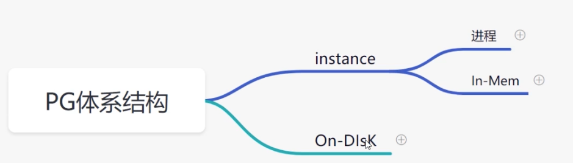
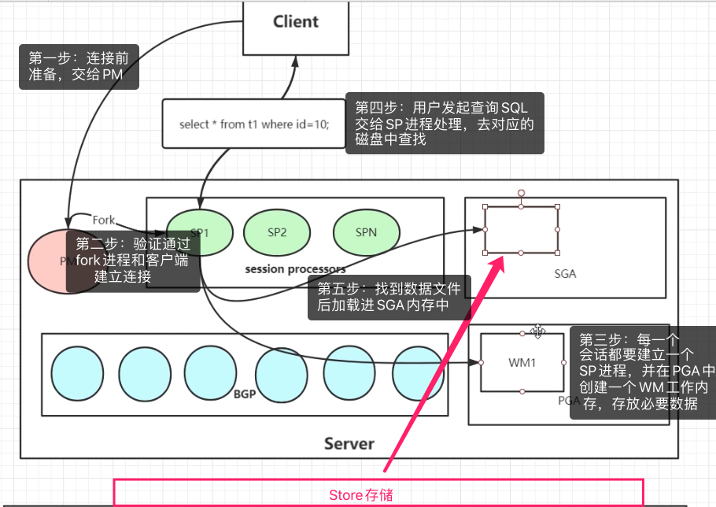

## PG体系结构

> PG体系结构=实例+存储结构

### 1、实例结构

> 每个用户都对应一个SP进程和Cli建立连接并处理简单查询SQL请求

PM进程（postMaster process）：

1. 提供监听(在postgressql.conf)、连接协议、验证(pg_hba.conf)
2. 有socket和Tcpip

SP进程（session process）:

1. 工作进程，会话进程，用户一旦连接成功则会fork一个SP进程
2. 当用户进行SQL**查询**时，则会将SQL执行交由SP进程去执行，如果是其他的SQL操作一般会用到BGP去执行。

PGA：

1. 私有内存，包含很多个WM（work memory）.
2. 每个SP进程创建后都会在PGA中为每个SP进程创建一块私有内存WM，专门给SP进程使用

SGA：

1. 存放查询数据
2. 当cli发起SQL请求，SP进程处理SQL后，去磁盘中进行数据查找，将对应文件放入到SGA内存中。

BGP：

1. 除了查询以外的SQL操作均由BGP去解析执行